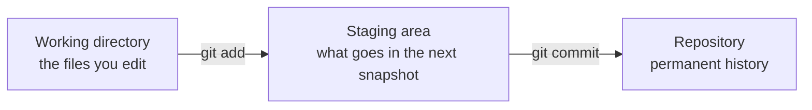
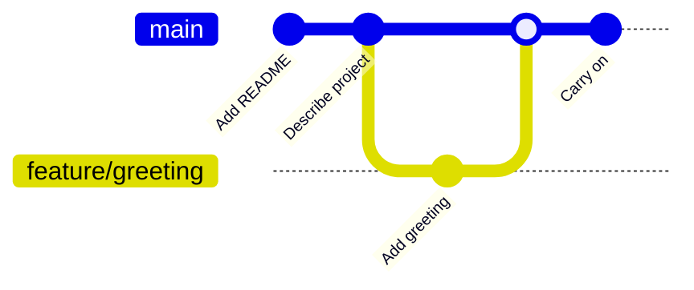
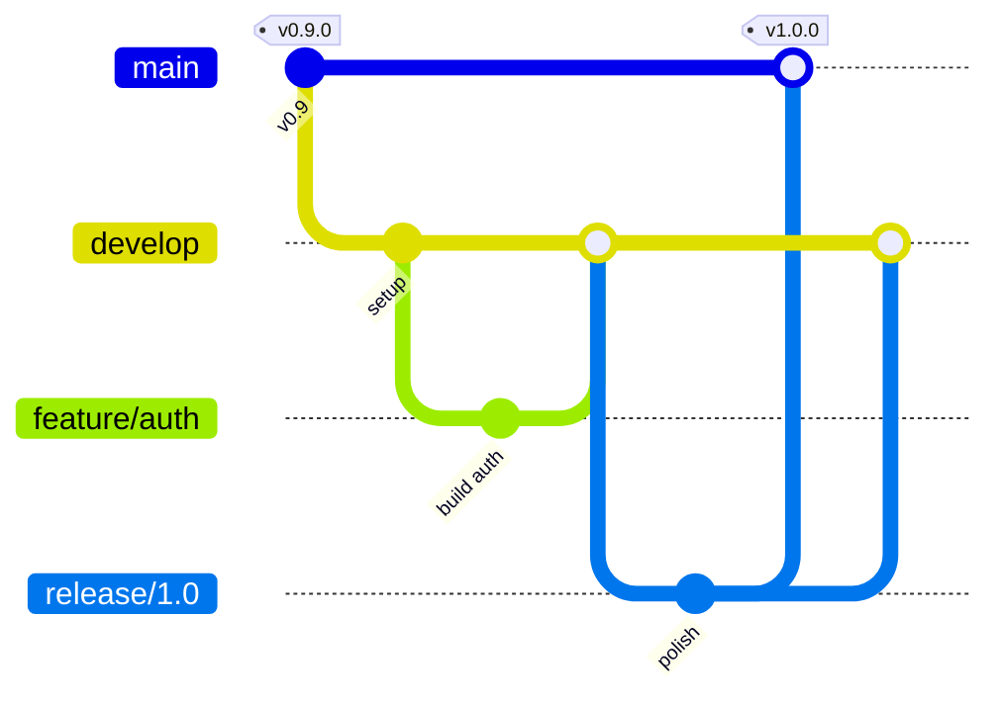
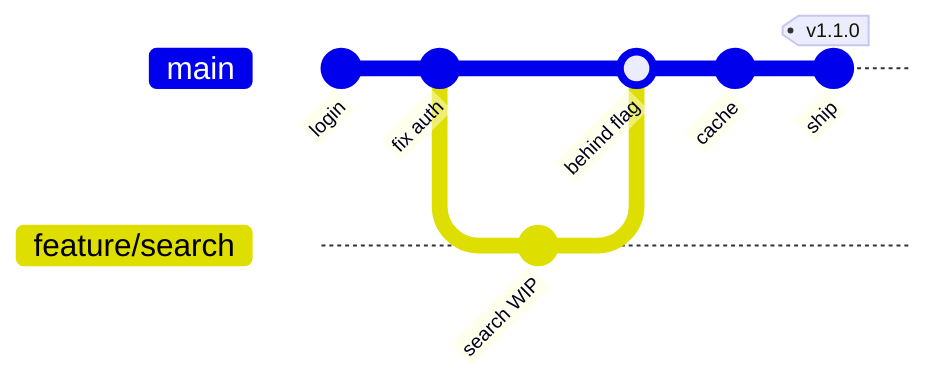
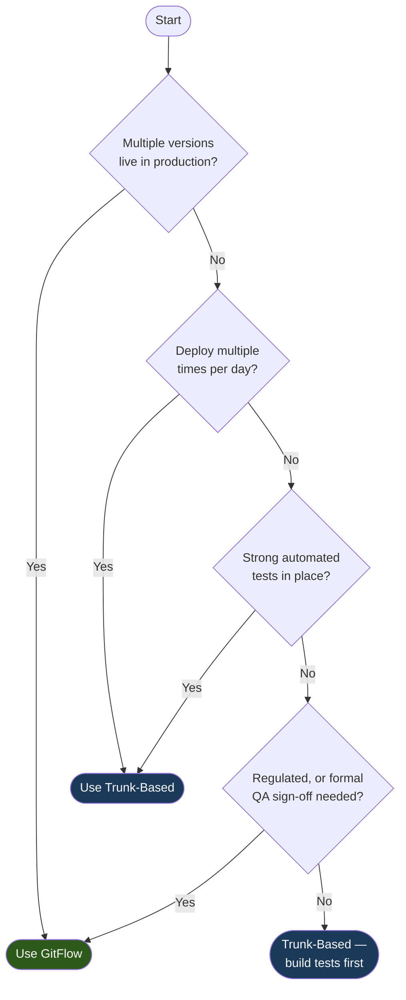

> **30 Days of DevOps** — a series by [@syssignals](https://x.com/syssignals)
> Every article is a working project. Every command is verified. No fluff.

## Start here — you don't need to know anything yet

Welcome to Day 1. This is the very first step of a 30-day journey, so we start at the
real beginning: **you have never used Git, and that's exactly who this is written for.**

By the end of this article you will have installed Git, made your first commit, created
and merged a branch, pushed your work to GitHub, and understood the two ways professional
teams organize their work. No prior experience assumed. Every command is one you can copy,
paste, and run — and we explain what each one does *before* you run it.

> **How to read this article:** do it, don't just read it. Open a terminal and type the
> commands as you go. Git is a skill, like riding a bike — you learn it in your hands, not
> your head. It's fine to go slow.

This is a long page on purpose: it's meant to be the one you come back to. The first four
parts are the core — get through those and you've nailed Day 1. The last part ("Level up")
is optional automation you can come back to later.

---

## What is Git, in plain English?

Imagine you're writing an important document. You might save copies as you go:
`report.docx`, `report-final.docx`, `report-final-v2.docx`, `report-final-ACTUALLY-final.docx`.
It's messy, you can't remember what changed between versions, and if two people edit at
once, someone's work gets overwritten.

**Git is the tool that solves this.** It's a *version control system*: it takes snapshots
of your project over time so you can:

- **See every change** ever made, and who made it.
- **Go back** to any earlier snapshot if something breaks.
- **Work on a new idea** without touching the working version.
- **Combine** your work with other people's, safely.

Think of it like the save points in a video game. Each save (in Git, a **commit**) is a
checkpoint you can always return to. The difference is that Git keeps *every* checkpoint,
labelled with what changed and why.

**Why does DevOps care so much about Git?** Because everything else in this series stands on
it. Your application code, your Docker files, your Kubernetes configs, your automation
pipelines — all of it lives in Git. When you hear "GitOps" later in the series, it literally
means *"Git is the source of truth for what runs in production."* Master Git on Day 1 and the
other 29 days have solid ground to stand on.

---

## What you'll be able to do by the end

- [ ] Install Git and configure it with your name and email
- [ ] Create a repository and understand what one actually is
- [ ] Make commits — and read your project's history
- [ ] Create branches, switch between them, and merge them back
- [ ] Push your work to GitHub and understand "local" vs "remote"
- [ ] Explain the two branching strategies — **GitFlow** and **Trunk-Based Development** — and pick the right one for a team
- [ ] *(Optional)* Add professional automation: commit-message rules, pre-commit checks, and branch protection

**Estimated time:** 45–60 minutes if you do it hands-on.
**Skill level:** Complete beginner.
**Tested on:** Ubuntu 22.04, macOS 14 Sonoma, Windows 11 (Git Bash), Git 2.43.

---

## Prerequisites — and how to install them

The only thing you truly need to start is **Git** and **a terminal**. We'll install other
tools (a GitHub account, the `gh` CLI, Node.js) later in the article, exactly when we need
them — so don't worry about those yet.

### A quick word on "the terminal"

The terminal (also called the *command line* or *shell*) is a text window where you type
commands instead of clicking buttons. You'll use it constantly in DevOps.

- **macOS:** open **Terminal** (press `Cmd + Space`, type "Terminal", hit Enter).
- **Linux:** open your **Terminal** app (often `Ctrl + Alt + T`).
- **Windows:** install Git (below), which includes **Git Bash** — use that, because every
  command in this series is written for a Unix-style shell. (Advanced alternative: WSL.)

Throughout this article, lines starting with `#` are comments (Git ignores them — they're
notes for you). You don't need to type the comments.

### Step 1: Install Git

**macOS** — the easiest way is [Homebrew](https://brew.sh):

```bash
# If you don't have Homebrew yet, install it first from https://brew.sh
brew install git
```

No Homebrew? Run `xcode-select --install` instead — it installs Git along with Apple's
command-line tools.

**Linux (Debian / Ubuntu):**

```bash
sudo apt update
sudo apt install -y git
```

**Linux (Fedora / RHEL):**

```bash
sudo dnf install -y git
```

**Windows:** download the installer from [git-scm.com/download/win](https://git-scm.com/download/win)
and run it. Accept the defaults — they're sensible. When it finishes, open **Git Bash** from
the Start menu and use that for everything in this series.

### Step 2: Check it worked

```bash
git --version
```

Expected output (your exact version may differ — anything 2.30 or newer is fine):

```
git version 2.43.0
```

### Step 3: Tell Git who you are

Every commit you make is stamped with your name and email. This is a **one-time setup** on
your machine. If you skip it, your very first commit will fail with
`Author identity unknown` — so let's do it now:

```bash
git config --global user.name "Your Name"
git config --global user.email "you@example.com"

# Make 'main' the default branch name for new repositories
git config --global init.defaultBranch main
```

Use the same email you'll use for GitHub later. Verify your settings:

```bash
git config --list
```

Expected output (among other lines):

```
user.name=Your Name
user.email=you@example.com
init.defaultbranch=main
```

That's it — Git is installed and knows who you are. Let's make something.

---

## Part 1: Your first repository

### What is a repository?

A **repository** (or "repo") is just a folder that Git is watching. Inside it, Git keeps a
hidden `.git/` directory where it stores every snapshot of your work. Your files look
totally normal — Git tracks them quietly in the background.

Let's create one.

```bash
# Make a project folder and move into it
mkdir my-first-repo
cd my-first-repo

# Turn this folder into a Git repository
git init
```

Expected output:

```
Initialized empty Git repository in /home/you/my-first-repo/.git/
```

That `.git/` folder is the magic. **Delete it and it's no longer a repo; the rest of your
files are untouched.** You never edit anything inside `.git/` by hand.

### The three places your work lives

This is the single most important concept in Git. Before a change becomes a permanent
snapshot, it moves through three areas:



**Reading this diagram:**

Read it left to right — this is the journey every change takes.

- **Working directory** — the actual files in your folder, the ones you create and edit.
- **Staging area** — a holding zone. You use `git add` to choose *exactly which* changes go
  into your next snapshot. This lets you commit some changes now and others later.
- **Repository** — when you run `git commit`, everything in the staging area becomes a
  permanent, labelled snapshot in your project's history.

The takeaway: **`git add` picks what to save, `git commit` saves it.** Two steps, on purpose.

### Make your first commit

Let's create a file and snapshot it.

```bash
# Create a simple file (this command writes one line into README.md)
echo "# My First Repo" > README.md

# Ask Git what it sees
git status
```

Expected output:

```
On branch main

No commits yet

Untracked files:
  (use "git add <file>..." to include in what will be committed)
	README.md

nothing added to commit but untracked files present (use "git add" to track)
```

Git is telling you it noticed `README.md` but isn't tracking it yet (it's "untracked"). Let's
stage it, then commit it:

```bash
# Stage the file (move it to the staging area)
git add README.md

# Take the snapshot, with a message describing it
git commit -m "Add README"
```

Expected output:

```
[main (root-commit) f3a9c21] Add README
 1 file changed, 1 insertion(+)
 create mode 100644 README.md
```

🎉 **That's your first commit.** You just saved a checkpoint. The `-m` flag attaches a
message — always describe *what the change does*, because future-you will be grateful.

### Read your history

```bash
git log --oneline
```

Expected output:

```
f3a9c21 Add README
```

Each commit gets a unique ID (that `f3a9c21` — yours will differ). You can always return to
any commit using its ID. Make one more change to see history grow:

```bash
echo "A project I'm using to learn Git." >> README.md
git add README.md
git commit -m "Describe the project in the README"

git log --oneline
```

Expected output:

```
8b1e0d4 Describe the project in the README
f3a9c21 Add README
```

Two checkpoints, newest on top. **You now understand the core loop of Git:**
*edit → `git add` → `git commit`.* Everything else builds on this.

### One more essential: telling Git what to ignore

Real projects contain files you *don't* want to snapshot — secrets, downloaded
dependencies, build output. You list those in a `.gitignore` file and Git pretends they
don't exist. Here's a solid starter you can drop into any project:

```bash
cat > .gitignore << 'EOF'
# Secrets — never commit these
.env
.env.local
*.pem
*.key

# Dependencies (these get re-downloaded, no need to store them)
node_modules/
.venv/
venv/
__pycache__/

# Build output
dist/
build/
coverage/

# Editor / OS noise
.vscode/
.idea/
.DS_Store
*.swp
EOF

git add .gitignore
git commit -m "Add .gitignore"
```

Now anything matching those patterns is invisible to Git. (We'll lean on this heavily once
we start adding Node.js and Docker in later days.)

---

## Part 2: Branches — working without fear

### What is a branch, really?

Here's the idea that unlocks Git. A **branch** is an independent line of work. It lets you
try something — a new feature, a risky change — *without touching* the working version of
your project. If it works out, you merge it back in. If it doesn't, you throw the branch
away and nothing was harmed.

So far you've been working on a branch called `main` (Git created it for you). Think of
`main` as the trusted, always-working version of your project. Branches are parallel
timelines that split off from it and can later rejoin.



**Reading this diagram:**

Time flows left to right. The bottom line is `main`.

- `main` collects two commits (the ones you just made).
- A new branch, **feature/greeting**, splits off. You do your experimental work *there* —
  one commit, "Add greeting." `main` is completely untouched while you do this.
- When the work is good, you **merge** `feature/greeting` back into `main`. Now `main` has
  the greeting too, and you carry on.

The whole point: **`main` always works, because risky work happens on a branch first.**

### Do it yourself

```bash
# Create a new branch AND switch to it in one command
git switch -c feature/greeting
```

Expected output:

```
Switched to a new branch 'feature/greeting'
```

> `git switch -c` creates and moves to a new branch. (You may see older tutorials use
> `git checkout -b` — it does the same thing. `git switch` is the newer, clearer command.)

Confirm where you are:

```bash
git branch
```

Expected output (the `*` marks your current branch):

```
* feature/greeting
  main
```

Now make a change *on this branch*:

```bash
cat > greeting.txt << 'EOF'
Hello from my first feature branch!
EOF

git add greeting.txt
git commit -m "Add a greeting file"
```

Here's the magic. Switch back to `main` and look at your folder:

```bash
git switch main
ls
```

Expected output:

```
README.md
```

**`greeting.txt` is gone** — because it only exists on the `feature/greeting` branch. `main`
is exactly as you left it. This is what "working without fear" means: your experiment is
fully isolated.

### Merge the branch back

Happy with the feature? Bring it into `main`:

```bash
# Make sure you're on the branch you want to merge INTO
git switch main

# Merge the feature branch's work into main
git merge feature/greeting
```

Expected output:

```
Updating 8b1e0d4..a2f7c90
Fast-forward
 greeting.txt | 1 +
 1 file changed, 1 insertion(+)
 create mode 100644 greeting.txt
```

Now `ls` shows `greeting.txt` on `main`. The experiment succeeded and is now part of your
trusted version. Clean up the branch you no longer need:

```bash
git branch -d feature/greeting
```

That's the full branch lifecycle: **create → work → merge → delete.** You'll repeat this
loop thousands of times in your career.

> **A note on merge conflicts.** If two branches change the *same lines* of the *same file*,
> Git can't decide which to keep and asks you to choose — that's a "merge conflict." It's
> normal and not scary: Git marks the conflicting spots in the file, you edit it to the
> version you want, then `git add` and `git commit`. We'll meet one for real later in the
> series; for now, just know the word.

---

## Part 3: Put your work on GitHub

Everything so far lives only on your computer (that's your **local** repository). To back it
up, share it, and collaborate, you push it to a **remote** — a copy hosted on a server. The
most popular host is **GitHub**.

### Step 1: Create a GitHub account

Go to [github.com](https://github.com) and sign up (it's free). Use the same email you gave
Git earlier. This account is your home for the rest of the series.

### Step 2: Install the GitHub CLI (`gh`)

The `gh` command lets you talk to GitHub from your terminal — including creating repos and
logging in — without clicking around the website.

```bash
# macOS
brew install gh

# Linux (Debian / Ubuntu)
sudo apt install -y gh

# Windows (in PowerShell, or download from https://cli.github.com)
winget install --id GitHub.cli
```

Verify and log in:

```bash
gh --version
gh auth login
```

`gh auth login` asks a few questions — choose **GitHub.com**, **HTTPS**, and
**"Login with a web browser."** It opens your browser, you click "Authorize," and you're
connected. This also sets up your credentials so `git push` just works — no manual tokens to
fiddle with.

### Step 3: Create the remote repo and push

From inside your `my-first-repo` folder:

```bash
# Create a repo on GitHub from your local one, and push everything up
gh repo create my-first-repo --public --source=. --push
```

Expected output (ends with):

```
✓ Created repository your-username/my-first-repo on GitHub
✓ Added remote https://github.com/your-username/my-first-repo.git
✓ Pushed commits to https://github.com/your-username/my-first-repo.git
```

Open the URL it printed — your commits, your README, your history, all on GitHub. 🎉

### The everyday rhythm from now on

Once a repo is connected to GitHub, your daily loop gains one final step:

```bash
# 1. edit files...
git add .                      # stage everything you changed
git commit -m "Describe it"    # snapshot locally
git push                       # send it up to GitHub
```

- **`git add` / `git commit`** save to your *local* history.
- **`git push`** uploads those commits to the *remote* (GitHub).
- **`git pull`** does the reverse — downloads commits other people pushed.

You now have the complete beginner toolkit. **Take a breath — you've achieved everything Day
1 set out to teach.** The next part is the "why it's organized this way" knowledge that
separates someone who *uses* Git from someone who *understands* it.

---

## Part 4: How real teams organize branches

When you work alone, "commit to `main`, push" is enough. But on a team of 5, 50, or 500
people, you need an agreed system for *how* branches are created, merged, and released —
otherwise people overwrite each other and nobody knows what's in production.

There are two dominant systems. Almost every company uses one of them or a blend. **You
don't need to set these up today** — the goal here is to *understand* them, so when you join
a team you recognize what you're looking at.

### Option A: GitFlow

Created by Vincent Driessen in 2010. Built for teams with **scheduled releases** and
sometimes **multiple versions live at once** (think: enterprise software where customers run
v2 while v3 is being prepared).

It uses several long-lived branches, each with a job:

```
main          ← production code only. Tagged at every release.
develop       ← integration branch. All finished features land here first.
feature/*     ← one branch per feature. Branches off develop.
release/*     ← prepping a release. Branches off develop.
hotfix/*      ← emergency production fixes. Branches off main.
```



**Reading this diagram:**

Time flows left to right. There are three branches stacked here: `main` (top), `develop`
(middle), and the short-lived branches that split off them.

- `main` starts at the current production release, tagged `v0.9.0`.
- `develop` branches off `main` and is where *all* day-to-day work accumulates.
- **feature/auth** branches off `develop`, holds one feature's work, then merges back into
  `develop` when finished.
- When it's time to ship, **release/1.0** branches off `develop` for final polishing. When
  it's stable, it merges into `main` (tagged `v1.0.0`, the new production release) **and**
  back into `develop` so develop keeps the fixes.
- (Not shown, to keep it readable: an urgent bug in production is fixed on a `hotfix/*`
  branch off `main`, then merged into both `main` and `develop`.)

The two rules to remember: **features branch off `develop`; hotfixes branch off `main`.**

**GitFlow fits when:** you have scheduled releases, a formal QA/code-freeze period,
regulated sign-off gates (finance, healthcare), or multiple versions in production.

**GitFlow struggles when:** you want to deploy many times a day (the release branches get in
the way), or the team is small (the ceremony costs more than it's worth).

### Option B: Trunk-Based Development (TBD)

The model used by Google, Meta, Netflix, and most teams that deploy continuously. There's
essentially **one branch** — `main`, the "trunk" — and it's always kept deployable.
Developers either commit straight to it or use **tiny, short-lived** branches (hours to a
couple of days, never weeks).

```
main          ← the trunk. Always deployable. CI runs on every change.
feature/*     ← optional, very short-lived. Merged within a day or two.
```



**Reading this diagram:**

Time flows left to right. Notice there's really only one ongoing line: `main`.

- Work happens on `main` or on a branch that lives for *hours*, not weeks.
- **feature/search** splits off, gets a quick commit, and merges back almost immediately.
- That merge is labelled **"behind flag"**: the new code ships to production right away, but
  it's hidden behind a **feature flag** (an on/off switch in the code). Users don't see it
  until you flip the switch. This is the trick that lets TBD merge unfinished work safely.
- `main` is tagged `v1.1.0` directly — every merge is a potential release. There's no
  separate release branch.

The rule to remember: **branches are tiny and short-lived; feature flags hide work that
isn't ready.**

**TBD fits when:** you deploy frequently, have strong automated tests, and the team shares
ownership of keeping `main` healthy.

**TBD struggles when:** test coverage is low (a broken `main` blocks everyone), or you have
no feature-flag system to hide incomplete work.

### Which one should *you* choose?



**Reading this diagram:**

Start at the top and answer each question honestly about your team.

- **Multiple versions live in production at once?** → **GitFlow.** It's the only one of the
  two that cleanly manages parallel release lines.
- **Deploy multiple times per day?** → **Trunk-Based.** GitFlow's release ceremony is too
  slow for that pace.
- **Strong automated tests?** → **Trunk-Based.** You're merging to `main` constantly and
  trusting tests to catch mistakes, so the tests must be real.
- **Regulated, or need a formal QA gate?** → **GitFlow.** The release branch gives a clear,
  auditable window for sign-off before anything reaches production.
- **None of the above?** → **Trunk-Based, but build up your tests first.** Trunk-Based
  without tests is just "merge and hope."

For most modern projects — and for everything we build in this series — **Trunk-Based
Development is the better default.** It's simpler, faster, and matches how cloud-native teams
actually work.

---

## Part 5 (optional): Level up — automate your workflow

> **You can stop here and you've completed Day 1.** This section adds the professional
> automation that real teams rely on: rules that block bad commits *before* they happen.
> It introduces Node.js-based tooling, so it's a bigger step. Skip it now if you're full —
> it'll still be here when you're ready, and nothing in Days 2–3 depends on it.

The idea: instead of *hoping* everyone follows the rules, you make Git enforce them
automatically using **hooks** (scripts Git runs at certain moments, like just before a
commit).

### Install Node.js

The tools below run on Node.js.

```bash
# macOS
brew install node

# Linux (Debian / Ubuntu)
sudo apt install -y nodejs npm

# Windows
winget install OpenJS.NodeJS.LTS
```

Verify (any 18+ is fine):

```bash
node --version
```

### Set up the project's tooling config

Create a `package.json` (this is Node's project file — it lists tools and scripts):

```bash
cat > package.json << 'EOF'
{
  "name": "my-first-repo",
  "version": "1.0.0",
  "private": true,
  "scripts": {
    "prepare": "husky"
  },
  "lint-staged": {
    "*.{js,ts,json,md,yml,yaml}": "prettier --write"
  }
}
EOF
```

### Add Husky + commit-message rules

**Husky** installs Git hooks that travel *with* the repo (normal Git hooks live in `.git/`,
which is never shared). **commitlint** checks that commit messages follow a consistent
format called [Conventional Commits](https://www.conventionalcommits.org/) — e.g.
`feat: add login` or `fix: handle empty input`. That consistent format later powers automatic
changelogs and version numbers.

```bash
# Install the tools as development dependencies
npm install --save-dev husky lint-staged prettier \
  @commitlint/cli @commitlint/config-conventional

# Activate Husky (creates the .husky/ folder)
npx husky init
```

Tell commitlint which commit types to allow:

```bash
cat > commitlint.config.js << 'EOF'
module.exports = {
  extends: ['@commitlint/config-conventional'],
  rules: {
    'type-enum': [
      2,
      'always',
      [
        'feat',     // a new feature
        'fix',      // a bug fix
        'docs',     // documentation only
        'refactor', // code change that is neither a fix nor a feature
        'test',     // adding or fixing tests
        'ci',       // CI/CD configuration
        'chore',    // maintenance / tooling
      ],
    ],
    'subject-full-stop': [2, 'never', '.'],
  },
};
EOF
```

Add a hook that checks the message on every commit:

```bash
cat > .husky/commit-msg << 'EOF'
npx --no -- commitlint --edit "$1"
EOF
```

Now a bad message is rejected automatically:

```bash
git commit --allow-empty -m "did some stuff"
```

Expected output (the commit is blocked):

```
✖   subject may not be empty [subject-empty]
✖   type may not be empty [type-empty]
✖   found 2 problems
```

And a well-formed message passes:

```bash
git commit --allow-empty -m "chore: set up commit linting"
```

### Add a pre-commit auto-formatter

**lint-staged** runs a tool (here, the **Prettier** formatter) only on the files you've
staged — so commits stay fast. Wire it into the pre-commit hook:

```bash
cat > .husky/pre-commit << 'EOF'
npx lint-staged
EOF
```

Now every commit auto-formats your staged files before saving them. No more arguments about
spacing.

### Block accidental direct pushes to main

A simple pre-push hook that stops you from pushing straight to a protected branch — it
forces the team to go through branches and pull requests:

```bash
cat > .husky/pre-push << 'EOF'
#!/bin/sh
branch=$(git symbolic-ref --short HEAD)

if echo "$branch" | grep -qE '^(main|master|develop)$'; then
  echo "⛔ Direct push to '$branch' is blocked."
  echo "   Create a branch and open a pull request instead:"
  echo "   git switch -c feature/your-change"
  exit 1
fi
EOF

chmod +x .husky/pre-push
```

Test it while on `main`:

```bash
git push origin main
```

Expected output:

```
⛔ Direct push to 'main' is blocked.
   Create a branch and open a pull request instead:
   git switch -c feature/your-change
error: failed to push some refs to 'origin'
```

### Add a pull request template

When a teammate opens a pull request on GitHub, this template pre-fills the description so
nothing important is forgotten:

```bash
mkdir -p .github

cat > .github/pull_request_template.md << 'EOF'
## Summary

<!-- What does this change do? One short paragraph. -->

## Type of change

- [ ] feat — new feature
- [ ] fix — bug fix
- [ ] docs — documentation
- [ ] refactor — no behaviour change
- [ ] chore — maintenance

## How to test

1.
2.

## Checklist

- [ ] My commit messages follow the Conventional Commits format
- [ ] I added or updated tests if needed
- [ ] I updated documentation if needed
EOF
```

### Protect `main` on GitHub itself

The pre-push hook protects *your* machine, but a determined person can bypass it locally.
The real guardrail lives on GitHub — **branch protection rules**, which GitHub enforces for
everyone. This one requires a pull request and a passing review before anything merges to
`main`:

```bash
# Replace with your own "username/repo"
REPO="your-username/my-first-repo"

gh api --method PUT \
  -H "Accept: application/vnd.github+json" \
  /repos/${REPO}/branches/main/protection \
  --input - << 'EOF'
{
  "required_status_checks": null,
  "enforce_admins": true,
  "required_pull_request_reviews": {
    "required_approving_review_count": 1,
    "dismiss_stale_reviews": true
  },
  "restrictions": null,
  "allow_force_pushes": false,
  "allow_deletions": false
}
EOF
```

What these settings do:

| Setting | What it enforces |
|---|---|
| `required_pull_request_reviews` | Changes must go through a pull request |
| `required_approving_review_count: 1` | At least one human must approve |
| `dismiss_stale_reviews: true` | New commits cancel old approvals |
| `enforce_admins: true` | Even admins follow the rules — no exceptions |
| `allow_force_pushes: false` | Nobody can rewrite `main`'s history |
| `allow_deletions: false` | Nobody can delete `main` |

Commit your new tooling and you have a repository that *enforces* good habits:

```bash
git switch -c chore/add-tooling
git add .
git commit -m "chore: add husky, commitlint, and pr template"
git push -u origin chore/add-tooling
```

Then open the pull request link GitHub prints, and merge it through the UI — exactly the
workflow branch protection is designed around.

---

## How it works under the hood

A few "why" answers worth keeping, for when you revisit this page:

**Why commits have two steps (`add` then `commit`).** The staging area lets you craft a
clean snapshot. You might have edited five files but only two belong together as one logical
change — `git add` those two, commit them with a clear message, then handle the rest
separately. Good history is *curated*, not dumped.

**Why Husky exists.** Git's own hooks live in `.git/hooks/`, which is never committed or
shared — so a rule you set up wouldn't reach your teammates. Husky stores hooks in a
committed `.husky/` folder and installs them whenever someone runs `npm install`. Now the
whole team gets the same checks automatically.

**Why Conventional Commits matter for DevOps.** They're not just tidy — they're
machine-readable. Tools can read `feat:` and `fix:` prefixes to automatically decide the next
version number and generate a changelog in CI. Adopt the format on Day 1 and those tools
work for free later.

**Why "deployed" and "released" are different in Trunk-Based Development.** A feature flag
lets code be *deployed* (live on the server) but not yet *released* (visible to users).
Separating the two is what makes it safe to merge unfinished work to `main` many times a day.

---

## Common errors and fixes

**`Author identity unknown` when committing**

```
*** Please tell me who you are.
fatal: unable to auto-detect email address
```

You skipped the identity setup. Run:

```bash
git config --global user.name "Your Name"
git config --global user.email "you@example.com"
```

---

**`fatal: not a git repository` for any git command**

You're not inside a repo folder. Either `cd` into your project, or run `git init` to create
one. Check with `ls -a` — a real repo contains a hidden `.git` folder.

---

**`git: 'switch' is not a git command`**

Your Git is older than 2.23. Either update Git, or use the classic equivalents:
`git checkout -b name` (create + switch) and `git checkout name` (switch).

---

**`Permission denied` or auth failure on `git push`**

Your GitHub credentials aren't set up. The easiest fix is the CLI:

```bash
gh auth login
```

Choose GitHub.com → HTTPS → login with a browser. It configures Git's credentials for you.

---

**`husky: command not found` (optional section)**

Husky isn't installed in this clone. Run:

```bash
npm install
```

The `prepare` script reinstalls the hooks automatically.

---

## Git command cheat-sheet

Bookmark this — it's the 90% of Git you'll use daily.

| Command | What it does |
|---|---|
| `git init` | Turn the current folder into a repo |
| `git status` | Show what's changed and what's staged |
| `git add <file>` / `git add .` | Stage a file / stage everything |
| `git commit -m "message"` | Save a snapshot of staged changes |
| `git log --oneline` | Show history, one line per commit |
| `git switch -c <name>` | Create and switch to a new branch |
| `git switch <name>` | Switch to an existing branch |
| `git branch` | List branches (current marked `*`) |
| `git merge <branch>` | Merge another branch into the current one |
| `git branch -d <name>` | Delete a branch you've finished with |
| `git push` | Upload commits to GitHub |
| `git pull` | Download commits from GitHub |
| `git clone <url>` | Copy a remote repo to your machine |

---

## What's next

**Day 2: Dockerize any application the right way — multi-stage builds and best practices.**

Now that your code lives in Git, Day 2 takes a real application and packages it into a
container, shrinking a naive 1.2GB image down to a lean ~45MB production image — with
multi-stage builds, non-root users, and vulnerability scanning. You'll commit it all to a
repo using exactly the workflow you learned today.

---

## Day 1 recap

You went from never having used Git to:

- Installing and configuring Git, and understanding what a repository is
- The core loop: **edit → `git add` → `git commit`**, and reading history with `git log`
- Branches: creating, switching, merging, and deleting — working without fear
- Pushing to GitHub and understanding **local** vs **remote**
- The two branching strategies real teams use, and how to choose between them
- *(Optional)* Professional automation: commit rules, pre-commit checks, and branch protection

That's a real foundation. Every one of the next 29 days lives in a Git repo and uses this
exact workflow — so the muscle memory you started building today pays off every single day
from here.

---

*This is Day 1 of the [30 Days of DevOps](https://x.com/syssignals) series.*
*Follow [@syssignals](https://x.com/syssignals) on X — Day 2 drops tomorrow.*

*Found an error or got stuck? Reply on X and I'll help — and fix the article if something's unclear.*
