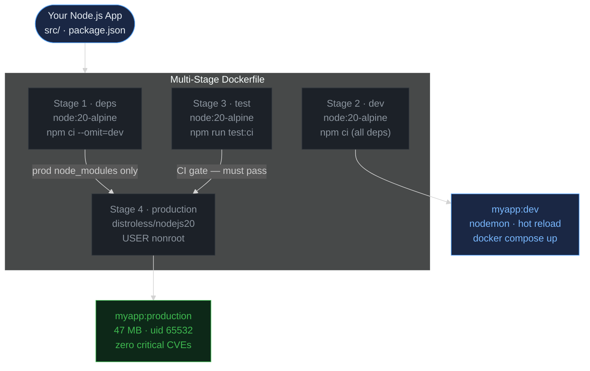
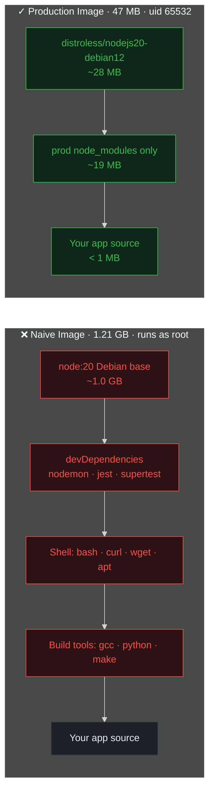
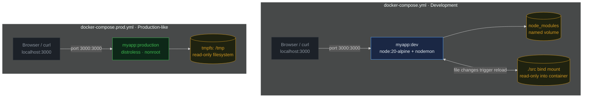
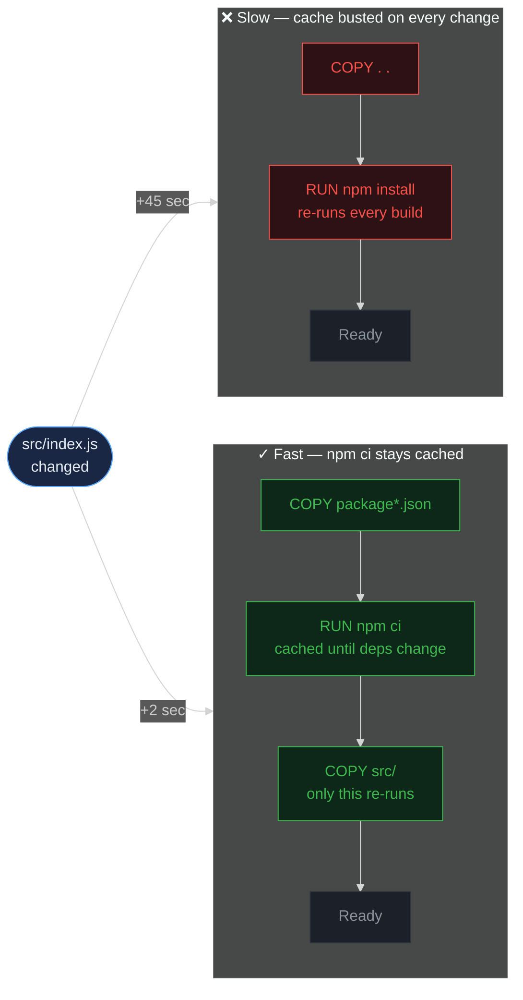

> **30 Days of DevOps** — a series by [@syssignals](https://x.com/syssignals)
> Every article is a working project. Every command is verified. No fluff.

## The problem with "it works on my machine"

A new developer joins your team. They clone the repo, follow the README, spend 3 hours debugging a Node version mismatch, give up, and ping you on Slack.

You've been there. You've been both people in that story.

Docker was supposed to fix this. And it does — but only if you use it correctly. Most teams don't. They write a Dockerfile that works, ship it, and never look back. That Dockerfile ends up in production running as root, carrying 800 MB of build tools nobody needs, with 47 CVEs (Common Vulnerabilities and Exposures — publicly tracked security flaws) sitting quietly in a base image from 2021.

This article fixes that. You'll take a real Node.js application from a 1.2 GB naive image down to a 47 MB hardened production image. Every decision is explained. Every command is verified. By the end you'll have a Dockerfile template you can drop into any project and trust.

> **New to Docker? You're in the right place.** The next section explains every word you
> need — image, container, layer — from scratch. If you already know Docker, skip ahead to
> "What you'll build."

---

## First — what *is* Docker?

Yesterday you put your *code* into Git. Today you put your *running app* into a box that
behaves the same everywhere. That box is a **container**, and Docker is the tool that builds
and runs it.

Here's the exact problem it solves. Your app needs a specific version of Node.js, some system
libraries, certain environment variables, and files in the right places. On your laptop it
all lines up and the app runs. On a teammate's machine — or a production server — one of those
things is slightly different, and it breaks. *"Works on my machine"* is that mismatch.

A container fixes it by packaging your app **together with everything it needs to run** — the
right Node.js, the libraries, the files — into one sealed unit. That unit runs identically on
your laptop, your teammate's laptop, and the server, because it carries its whole environment
with it.

Five words you'll see on every page from here on — in plain English:

- **Image** — the *blueprint*. A read-only template containing your app plus its environment.
  Think of it like a recipe. You build an image once.
- **Container** — a *running copy* of an image. Think of it like the meal cooked from the
  recipe. You can start many containers from one image.
- **Dockerfile** — a plain text file listing the step-by-step instructions Docker follows to
  build your image. You'll write one in Part 2.
- **Layer** — images are built in stacked layers, one per instruction in the Dockerfile.
  Docker caches them, so a rebuild only redoes what actually changed. (This is why the *order*
  of instructions matters — we'll see it cut a 45-second build down to 2 seconds.)
- **Registry** — a place to store and share images: like GitHub, but for images. Docker Hub
  is the default public one.

The whole flow in one sentence:
**you write a `Dockerfile` → Docker builds an `image` → you run the image as a `container`.**

> During setup in a moment, you'll run `docker run hello-world`. That single command pulls a
> tiny image from Docker Hub and runs it as a container — your very first one. Today you'll go
> on to build your own.

That's the entire mental model. Everything else in this article is about making your image
**small**, **safe**, and **fast to rebuild**. Don't worry about memorizing the rest yet — we
build it up one step at a time.

---

## What you'll build

A production-grade Docker setup for a Node.js REST API, including:

- A naive Dockerfile (the before — so you understand what you're fixing)
- A multi-stage Dockerfile that reduces image size by ~96%
- A hardened production image running as a non-root user
- A `.dockerignore` that prevents secrets and junk from leaking into images
- Docker Compose for local development with hot reload
- A Docker Scout vulnerability scan comparing naive vs hardened image
- A reusable `docker/` folder structure for any project

**Estimated time:** 60 minutes  
**Final image size:** ~47 MB (down from ~1.2 GB)

Here is the complete picture of what this build produces. **This is the destination, not the
starting line** — if it looks like a lot right now, that's expected. We build it one stage at a
time, and by Part 3 every box below will make sense:



**Reading this diagram:**

Start at the top — **"Your Node.js App"** is your source code (`src/`, `package.json`). It feeds into a single Dockerfile that runs three stages:

- **Stage 1 (deps)** — starts from the lean `node:20-alpine` base and runs `npm ci --omit=dev`. Its only job is producing clean production `node_modules` with no test frameworks or devtools. Its output is consumed by the production stage.
- **Stage 2 (dev)** — also starts from `node:20-alpine` but runs `npm ci` with *all* dependencies including devDependencies (nodemon, jest, etc.). This is the base for your **development image** (`myapp:dev`) used by docker-compose for hot reload.
- **Stage 3 (test)** — installs all dependencies and runs your full test suite. This is a CI gate: if tests fail, the build stops here and nothing broken ever reaches production.
- **Stage 4 (production)** — the only stage that ships. It starts from `distroless/nodejs20` (a ~28 MB base with no shell) and pulls in *only* the clean `node_modules` from Stage 1. No build tools, no dev dependencies, and no shell utilities from the earlier stages are carried over.

> **Two terms used here that get full explanations later, but quick definitions up front:**
> **Distroless** — a minimal base image that contains *only* the language runtime (Node.js) and the libraries it depends on. No shell, no package manager, no OS utilities. Smaller, fewer CVEs, and harder to exploit if an attacker breaks in. Published by Google to `gcr.io`.
> **uid 65532** — distroless ships with a built-in unprivileged user at this conventional uid. Running as non-root means a container escape doesn't give an attacker host root.

A note on the term **layer**: a Docker image is a stack of read-only filesystem layers — each instruction in the Dockerfile produces one layer (a diff against the previous one). Layers are content-addressed and cached: identical inputs produce identical layers, so unchanged steps are reused on rebuild. That cache behaviour is what makes the **order** of Dockerfile instructions matter so much.

The end result is two images: **`myapp:dev`** for local development with hot reload, and **`myapp:production`** at 47 MB running as `uid 65532` with zero critical CVEs.

---

## Prerequisites

### Operating system

| OS | Status | Notes |
|---|---|---|
| Ubuntu 22.04 LTS | Recommended | All commands tested here |
| Ubuntu 20.04 LTS | Supported | Works identically |
| macOS 13+ (Sonoma/Ventura) | Supported | Use Docker Desktop for Mac |
| macOS 12 (Monterey) | Supported | Use Docker Desktop for Mac |
| Windows 11 | Supported | Requires WSL2 + Docker Desktop |
| Windows 10 (21H2+) | Supported | Requires WSL2 + Docker Desktop |

> **Windows users:** All commands must be run inside WSL2 (Ubuntu), not PowerShell or CMD. Docker Desktop routes WSL2 commands through the same daemon. Open Ubuntu from the Start Menu and work from there.

---

### Required software

#### 1. Docker Engine 24.0+ or Docker Desktop 4.20+

```bash
# Check if Docker is already installed
docker --version
# Expected: Docker version 24.x.x or higher

docker info | grep "Server Version"
# Expected: Server Version: 24.x.x
```

**macOS / Windows — use Docker Desktop (the easy path):** download it from
[docker.com/products/docker-desktop](https://www.docker.com/products/docker-desktop/), run the
installer, and launch the app. Docker Desktop bundles the Engine, Buildx, **and** Compose in
one package — so once it's running you can **skip the Buildx and Compose install steps below**
and go straight to the Docker Scout step. On Windows, accept the **WSL2** option when prompted,
then run every command in this article from your Ubuntu WSL terminal (not PowerShell). Verify
with `docker --version`.

**Linux — install Docker Engine on Ubuntu** (skip if already installed):

```bash
# Remove old versions
sudo apt-get remove docker docker-engine docker.io containerd runc 2>/dev/null

# Install dependencies
sudo apt-get update
sudo apt-get install -y ca-certificates curl gnupg lsb-release

# Add Docker's official GPG key
sudo mkdir -p /etc/apt/keyrings
curl -fsSL https://download.docker.com/linux/ubuntu/gpg | \
  sudo gpg --dearmor -o /etc/apt/keyrings/docker.gpg

# Add the repository
echo \
  "deb [arch=$(dpkg --print-architecture) signed-by=/etc/apt/keyrings/docker.gpg] \
  https://download.docker.com/linux/ubuntu \
  $(lsb_release -cs) stable" | \
  sudo tee /etc/apt/sources.list.d/docker.list > /dev/null

# Install Docker Engine, CLI, containerd, and plugins
# - docker-ce: the daemon (dockerd) that runs containers
# - docker-ce-cli: the `docker` command you type
# - containerd.io: the lower-level container runtime dockerd talks to
# - docker-buildx-plugin: enables `docker buildx` (BuildKit driver, multi-arch, cache mounts)
# - docker-compose-plugin: enables `docker compose` (multi-container orchestration,
#   used heavily in Day 3 to spin up Node.js + Postgres + Redis + Nginx as one stack)
sudo apt-get update
sudo apt-get install -y docker-ce docker-ce-cli containerd.io \
  docker-buildx-plugin docker-compose-plugin

# Add your user to the docker group.
# The Docker daemon's socket at /var/run/docker.sock is owned by root and
# group-owned by `docker` (mode 660). Members of the `docker` group can
# talk to the daemon directly — that's why you no longer need `sudo` on
# every `docker` command after this step. Security note: docker-group
# membership is effectively root-equivalent on the host (you can mount
# the host filesystem into a container) — only grant it to trusted users.
sudo usermod -aG docker $USER

# Start the Docker daemon.
# On full Ubuntu installs the apt post-install hook auto-starts and
# enables the service, so this is usually a no-op. On lab environments
# (KillerCoda, Instruqt, slim containers) and some VPS images the daemon
# is NOT auto-started — the socket /var/run/docker.sock won't exist
# until you run this. Tested on systemd-based Ubuntu 22.04 / 24.04.
sudo systemctl start docker
sudo systemctl enable docker   # auto-start on boot

# Non-systemd hosts: use one of these instead
#   sudo service docker start          # SysV init
#   sudo dockerd > /tmp/dockerd.log 2>&1 &   # last resort, run daemon manually

# Pick up the new group membership. Your current shell still uses the
# group list it loaded at login, so docker commands would fail with
# "permission denied" until you do one of:
#   - Close this terminal and open a new one (simplest, works everywhere)
#   - Log out and log back in (for SSH sessions)
#   - Reboot

# Verify installation (run this in a NEW terminal after the steps above)
docker run --rm hello-world
```

Expected final line:
```
Hello from Docker!
```

#### 2. Docker Buildx (for BuildKit cache mounts)

Before running any commands, understand what you're enabling and why.

**What is BuildKit?**
BuildKit is the modern build backend that ships with Docker Engine. It replaces the legacy `docker build` engine and adds three things this article relies on heavily:

- **`--mount=type=cache`** — persist `npm` / `apt` / `pip` cache across builds. Without it, every build re-downloads every package.
- **Parallel stage execution** — independent stages of a multi-stage build run concurrently instead of serially.
- **Build secrets via `--secret`** — pass credentials at build time without baking them into image layers.

The legacy builder cannot do any of these. On most Docker installs BuildKit is *available* but not the default driver — you have to opt in.

**What is Buildx?**
Buildx is the CLI plugin that drives BuildKit. It also manages **builder instances** — isolated build environments, each with their own BuildKit daemon. By creating our own named builder and setting it as the default, every subsequent `docker build` automatically uses BuildKit features without any extra flags.

**Commands:**

```bash
# 1. Confirm Buildx CLI plugin is installed
#    (it ships with Docker Engine 23.0+ — the apt install above brought it in)
docker buildx version
# Expected: github.com/docker/buildx v0.12.x linux/amd64

# 2. Create a new BuildKit builder instance named "mybuilder"
#    The --use flag immediately sets it as the active builder for all
#    future `docker build` commands in this Docker context.
docker buildx create --name mybuilder --use

# 3. Boot the builder so it's ready for the first real build
#    Without --bootstrap, the builder is lazily started on first use,
#    which adds ~5-10 seconds of cold-start to the first build.
#    --bootstrap runs an empty build to warm it up now.
docker buildx inspect --bootstrap
```

Expected output (last line of `--bootstrap`):
```
[+] Building 4.2s (1/1) FINISHED
```

From this point on, every `docker build` in this terminal automatically uses BuildKit. You'll see `[+] Building` in the output instead of the old line-by-line `Step 1/N : ...` format — that's the visual confirmation BuildKit is doing the work.

#### 3. Docker Scout (for vulnerability scanning)

**What is Docker Scout?**
Docker Scout is a CLI plugin that scans your container images for known CVEs (Common Vulnerabilities and Exposures) — every dependency in every layer is checked against vulnerability databases. We use it in this article to prove our final image is free of high/critical vulnerabilities, and to compare a "bad" image (uses `latest` tags) against our hardened version.

It's a free plugin from Docker but not bundled with Docker Engine — you install it separately:

```bash
# Install the Docker Scout CLI plugin
# This script downloads the binary and drops it into ~/.docker/cli-plugins/,
# where Docker CLI auto-discovers subcommands. After this, `docker scout`
# becomes available as a regular Docker subcommand.
curl -fsSL https://raw.githubusercontent.com/docker/scout-cli/main/install.sh | sh

# Verify the plugin was installed and Docker can find it
docker scout version
# Expected: docker scout version v1.x.x
```

> If `curl` isn't available: `sudo apt-get install -y curl`

#### 4. Node.js 20 LTS (for the sample application)

```bash
# Install Node.js via nvm.
# nvm (Node Version Manager) is a shell script that installs Node releases
# into your home directory (~/.nvm) instead of a system path. Two wins:
# (1) global npm installs don't need sudo, (2) you can switch between
# multiple Node versions per project with one command.
curl -o- https://raw.githubusercontent.com/nvm-sh/nvm/v0.39.7/install.sh | bash
source ~/.bashrc

nvm install 20          # download and install Node 20 LTS
nvm use 20              # activate it in the current shell
nvm alias default 20    # make it the default for new shells

# Verify
node --version   # v20.x.x
npm --version    # 10.x.x
```

#### 5. IDE recommendations

| IDE | Recommended extensions |
|---|---|
| VS Code (recommended) | Docker (ms-azuretools.vscode-docker), Remote - WSL |
| JetBrains IDEs | Docker plugin (bundled) |
| Vim / Neovim | dockerfile.vim, coc-docker |

The VS Code Docker extension adds Dockerfile syntax highlighting, image management from the sidebar, and build error detection inline. Not required but saves debugging time.

---

### Full environment check

Run this before starting. If anything fails, fix it before continuing:

```bash
echo "=== Docker ===" && docker --version && \
echo "=== Buildx ===" && docker buildx version && \
echo "=== Compose ===" && docker compose version && \
echo "=== Node ===" && node --version && \
echo "=== npm ===" && npm --version && \
echo "=== Scout ===" && docker scout version 2>/dev/null | head -1 && \
echo "" && echo "All checks passed. Ready to build."
```

Expected output:
```
=== Docker ===
Docker version 24.0.7, build afdd53b
=== Buildx ===
github.com/docker/buildx v0.12.1 linux/amd64
=== Compose ===
Docker Compose version v2.24.5
=== Node ===
v20.11.0
=== npm ===
10.2.4
=== Scout ===
docker scout version v1.4.0

All checks passed. Ready to build.
```

---

## Part 1: The sample application

We need a real application — not a toy. This is a Node.js REST API with actual dependencies: Express, input validation, security middleware, and structured logging. Realistic enough that the image size problem is genuine.

> **You do not need to understand this Node.js code to learn Docker.** It's just a realistic
> app for us to containerize. Copy each block, paste it, move on — the Docker lessons are what
> matter here, and they apply to an app written in *any* language.

### Step 1: Create the project structure

```bash
mkdir docker-best-practices && cd docker-best-practices
mkdir -p src/routes src/middleware
```

> **Working-directory reminder:** Every command from here through Part 7 assumes your shell is inside `docker-best-practices/`. If you open a new terminal mid-article, run `cd ~/docker-best-practices` (or wherever you created it) before continuing.

### Step 2: Write the complete `package.json`

We give you the full file as one copy-paste block — no `npm init -y` followed by patches. Every dependency version is pinned so two readers running this on different days end up with identical lockfiles, which is what `npm ci` inside the Dockerfile (Part 3) relies on:

```bash
cat > package.json << 'EOF'
{
  "name": "docker-best-practices",
  "version": "1.0.0",
  "description": "Sample Node.js REST API for Day 2 of 30 Days of DevOps",
  "main": "src/index.js",
  "engines": {
    "node": ">=20.0.0"
  },
  "scripts": {
    "start": "node src/index.js",
    "dev": "nodemon src/index.js",
    "test": "jest --coverage",
    "test:ci": "jest --ci --forceExit"
  },
  "dependencies": {
    "cors": "^2.8.5",
    "dotenv": "^16.4.5",
    "express": "^4.19.2",
    "helmet": "^7.1.0",
    "morgan": "^1.10.0",
    "zod": "^3.23.8"
  },
  "devDependencies": {
    "jest": "^29.7.0",
    "nodemon": "^3.1.4",
    "supertest": "^7.0.0"
  }
}
EOF
```

Now install everything in one shot. `npm install` (no arguments) reads the manifest above and writes both `node_modules/` and `package-lock.json`:

```bash
npm install
```

Verify the size impact:

```bash
du -sh node_modules/
# Roughly ~75 MB — this entire directory should never reach a production image.
# The whole point of the multi-stage Dockerfile in Part 3 is keeping this out.
```

### Step 3: Create the application source

Four files. Each one is a complete `cat > path << 'EOF'` block — copy, paste, hit enter. Your editor doesn't need to be open.

**`src/index.js`** — application entry point:

```bash
cat > src/index.js << 'EOF'
'use strict';

const express = require('express');
const helmet = require('helmet');
const cors = require('cors');
const morgan = require('morgan');
const { healthRouter } = require('./routes/health');
const { usersRouter } = require('./routes/users');
const { errorHandler } = require('./middleware/errorHandler');

const app = express();
const PORT = process.env.PORT || 3000;

app.use(helmet());
app.use(cors({
  origin: process.env.ALLOWED_ORIGINS?.split(',') || ['http://localhost:3000'],
}));
app.use(morgan(process.env.NODE_ENV === 'production' ? 'combined' : 'dev'));
app.use(express.json({ limit: '10kb' }));

app.use('/health', healthRouter);
app.use('/api/users', usersRouter);

app.use((req, res) => res.status(404).json({ error: 'Route not found' }));
app.use(errorHandler);

const server = app.listen(PORT, '0.0.0.0', () => {
  console.log('Server running on port ' + PORT + ' [' + (process.env.NODE_ENV || 'development') + ']');
});

process.on('SIGTERM', () => {
  console.log('SIGTERM received — shutting down gracefully');
  server.close(() => process.exit(0));
});

process.on('SIGINT', () => {
  server.close(() => process.exit(0));
});

module.exports = { app };
EOF
```

> Note: the `console.log` above uses string concatenation rather than backtick template literals. Inside a `<< 'EOF'` heredoc the shell still strips `$` from any unquoted `${VAR}` it sees — switching to plain concatenation keeps the heredoc bulletproof.

**`src/routes/health.js`**:

```bash
cat > src/routes/health.js << 'EOF'
'use strict';

const { Router } = require('express');
const router = Router();

router.get('/', (req, res) => {
  res.json({
    status: 'healthy',
    timestamp: new Date().toISOString(),
    uptime: Math.floor(process.uptime()),
    environment: process.env.NODE_ENV || 'development',
  });
});

router.get('/ready', (req, res) => res.json({ status: 'ready' }));

module.exports = { healthRouter: router };
EOF
```

**`src/routes/users.js`**:

```bash
cat > src/routes/users.js << 'EOF'
'use strict';

const { Router } = require('express');
const { z } = require('zod');

const router = Router();

const UserSchema = z.object({
  name: z.string().min(1).max(100),
  email: z.string().email(),
  role: z.enum(['admin', 'user', 'viewer']).default('user'),
});

const db = new Map([
  ['1', { id: '1', name: 'Alice', email: 'alice@example.com', role: 'admin' }],
  ['2', { id: '2', name: 'Bob',   email: 'bob@example.com',   role: 'user'  }],
]);

router.get('/', (req, res) => {
  res.json({ users: Array.from(db.values()), total: db.size });
});

router.get('/:id', (req, res) => {
  const user = db.get(req.params.id);
  if (!user) return res.status(404).json({ error: 'User not found' });
  res.json(user);
});

router.post('/', (req, res) => {
  const result = UserSchema.safeParse(req.body);
  if (!result.success) {
    return res.status(400).json({ error: 'Validation failed', details: result.error.flatten() });
  }
  const id = String(Date.now());
  const user = { id, ...result.data };
  db.set(id, user);
  res.status(201).json(user);
});

module.exports = { usersRouter: router };
EOF
```

**`src/middleware/errorHandler.js`**:

```bash
cat > src/middleware/errorHandler.js << 'EOF'
'use strict';

const errorHandler = (err, req, res, next) => {
  const status = err.statusCode || err.status || 500;
  const message = process.env.NODE_ENV === 'production' ? 'An error occurred' : err.message;

  console.error({ error: err.message, path: req.path, method: req.method });
  res.status(status).json({ error: message });
};

module.exports = { errorHandler };
EOF
```

**`.env.example`** — document required variables (commit this, never `.env`):

```bash
cat > .env.example << 'EOF'
NODE_ENV=development
PORT=3000
ALLOWED_ORIGINS=http://localhost:3000
EOF
```

Verify the app works outside Docker first — we'll move it into a container in Part 2:

```bash
# Free port 3000 if anything is already on it (safe to re-run this block)
lsof -ti:3000 | xargs kill 2>/dev/null

# Start the app in the background, capture its PID
NODE_ENV=development node src/index.js &
APP_PID=$!

# Wait up to 5s for /health to respond, then hit it
for i in 1 2 3 4 5; do
  curl -sf http://localhost:3000/health > /dev/null && break
  sleep 1
done

# Raw JSON works fine — pretty-printing is optional. If you have `jq`
# installed, pipe through `jq` for a coloured tree view.
curl -s http://localhost:3000/health
echo

# Clean up
kill $APP_PID 2>/dev/null
wait $APP_PID 2>/dev/null
```

Expected output (one line — your timestamp will differ):

```json
{"status":"healthy","timestamp":"...","uptime":0,"environment":"development"}
```

---

## Part 2: The naive Dockerfile — the before picture

This is the Dockerfile most tutorials show you. It works. It is also dangerous.

```bash
cat > Dockerfile.naive << 'EOF'
FROM node:20

WORKDIR /app

COPY . .

RUN npm install

EXPOSE 3000

CMD ["node", "src/index.js"]
EOF
```

Build it and inspect:

```bash
# docker build flags decoded:
#   -f Dockerfile.naive   pick a specific Dockerfile (default is ./Dockerfile)
#   -t myapp:naive        tag the resulting image with name:tag
#   .                     the build context — the directory whose contents
#                         get tar'd up and sent to the Docker daemon.
#                         Everything in .dockerignore is excluded.
docker build -f Dockerfile.naive -t myapp:naive .
```

Expected build output (the build time varies — typically 30–60 seconds on the first run, much faster on rebuilds thanks to the BuildKit layer cache):

```
[+] Building XXs (8/8) FINISHED
 => [internal] load build definition from Dockerfile.naive
 => [1/4] FROM docker.io/library/node:20
 => [2/4] WORKDIR /app
 => [3/4] COPY . .
 => [4/4] RUN npm install
 => exporting to image
```

Now check what you actually built:

```bash
# Image size
docker images myapp:naive --format "Size: {{.Size}}"
# Size: 1.21GB

# Is it running as root?
docker run --rm myapp:naive whoami
# root   ← critical security problem

# Are devDependencies included?
docker run --rm myapp:naive ls node_modules | grep nodemon
# nodemon   ← dev tools in production

# How many system tools are exposed?
docker run --rm myapp:naive which curl bash apt wget
# /usr/bin/curl
# /bin/bash
# /usr/bin/apt
# /usr/bin/wget
# Every one of these is an attacker's tool
```

The naive image has three fundamental problems:

1. **1.21 GB** — the full Debian + Node.js + devDependencies + build tools
2. **Runs as root** — any container escape gives root on the host
3. **Full shell and system utilities** — an attacker who gets RCE has a full toolkit

Here is exactly what each image contains, and what the production image leaves out:



**Reading this diagram:**

Read each column as a vertical stack — every layer in the stack contributes to the final image size.

The **red (left) column** is what the naive `node:20` image carries. The full Debian base alone is ~1 GB. Your devDependencies (nodemon, jest, supertest) sit on top, followed by a complete shell environment (bash, curl, wget, apt) and native build tools (gcc, python, make). Your actual app source sits at the very top — but it inherits every vulnerability in every layer below it. An attacker who gets code execution inside this container has a complete Unix environment to work with.

The **green (right) column** is what the production image contains after the work in this article. The `distroless/nodejs20-debian12` base is ~28 MB — it contains the Debian C library and the Node.js binary, nothing else. Only production `node_modules` are copied in (~19 MB). Your app source is under 1 MB. There is no shell, no package manager, no build tools — not because they were removed, but because they were never added.

This is the critical insight: **you cannot shrink an image by deleting things**. Deleted files still exist in the layer history and count toward image size. The only way to exclude something from a production image is to never copy it in. Multi-stage builds make that possible.

---

## Part 3: The production Dockerfile — multi-stage build

Multi-stage builds use multiple `FROM` statements in one Dockerfile. Each stage builds on the previous. The final image receives only what you explicitly copy — build tools, test frameworks, and dev dependencies never make it in.

A few Dockerfile concepts you'll see below for the first time:

- **`FROM <image> AS <name>`** — the `AS <name>` clause names this stage so later stages can refer to it. That's how `COPY --from=deps /app/node_modules` in the production stage pulls files out of the `deps` stage without re-running it.
- **`gcr.io/distroless/...`** — distroless images are published by Google to Google Container Registry (`gcr.io`), not Docker Hub. The `-debian12` suffix means the image's C library and CA certificates come from Debian 12 (bookworm) — distroless still needs *something* underneath the runtime, it just strips everything you don't actually need.
- **`RUN --mount=type=cache,target=/root/.npm`** — a **BuildKit cache mount**: the npm package cache at `/root/.npm` is persisted between builds in BuildKit's own cache, not baked into the image. The first build downloads every dep; every subsequent build pulls tarballs from cache instantly. This is the BuildKit feature we set up Buildx for in the prerequisites.
- **`EXPOSE <port>`** — pure metadata: it documents the port the container listens on so registries, orchestrators, and humans know how to reach the app. It does **not** publish the port — that still requires `-p 3000:3000` at run time. Common newcomer trap.
- **`USER <name>`** — sets the uid that every subsequent `RUN`, `CMD`, and `ENTRYPOINT` runs as. Without `USER`, the container runs as root.
- **Distroless ENTRYPOINT is preset** — the `gcr.io/distroless/nodejs20-debian12` image already has `ENTRYPOINT ["/nodejs/bin/node"]` baked in. Your `CMD` is the *argument list* for that entrypoint, not the full command. Write `CMD ["src/index.js"]`, **not** `CMD ["/nodejs/bin/node", "src/index.js"]` — the second form makes the container try to run `/nodejs/bin/node /nodejs/bin/node src/index.js` and node fails immediately trying to parse the binary path as JavaScript. This is the #1 footgun new distroless users hit.

```bash
cat > Dockerfile << 'EOF'
# ─── Stage 1: deps ────────────────────────────────────────────────────────────
# Install production dependencies only.
# Used by the production stage (COPY --from=deps).
FROM node:20-alpine AS deps

WORKDIR /app

# Copy lockfiles first — before source code.
# This layer is cached until package.json or package-lock.json changes.
# Changing src/ files won't invalidate this cache layer.
COPY package.json package-lock.json ./

# npm ci: uses lockfile exactly, fails if lockfile is out of sync
# --omit=dev: excludes devDependencies (nodemon, jest, etc.)
# --mount=type=cache: BuildKit cache mount on /root/.npm. The npm package
# cache persists between builds, so package tarballs are downloaded once
# and reused across every rebuild — even after `docker system prune -a`.
RUN --mount=type=cache,target=/root/.npm \
    npm ci --omit=dev

# ─── Stage 2: dev ─────────────────────────────────────────────────────────────
# All dependencies including devDependencies (nodemon, jest, etc.).
# Used by docker-compose.yml for local development with hot reload.
# Tests are NOT run here — that's the test stage's job in CI.
FROM node:20-alpine AS dev

WORKDIR /app

COPY package.json package-lock.json ./
RUN --mount=type=cache,target=/root/.npm \
    npm ci

# ─── Stage 3: test ────────────────────────────────────────────────────────────
# Runs tests with all dependencies (including dev).
# CI can build this target to gate on test failures before shipping prod.
FROM node:20-alpine AS test

WORKDIR /app

COPY package.json package-lock.json ./
RUN --mount=type=cache,target=/root/.npm \
    npm ci

COPY . .

RUN npm run test:ci --if-present

# ─── Stage 4: production ──────────────────────────────────────────────────────
# The only stage that ships. Built on distroless — no shell, no package manager,
# no system utilities. The absolute minimum to run a Node.js process.
FROM gcr.io/distroless/nodejs20-debian12 AS production

# OCI (Open Container Initiative) image labels — a standardised label
# namespace that registries, scanners, and tools read for provenance and
# discovery. Adding these costs nothing and is a free SEO/auditability win.
LABEL org.opencontainers.image.title="myapp"
LABEL org.opencontainers.image.description="Node.js REST API — 30 Days of DevOps"
LABEL org.opencontainers.image.source="https://github.com/syssignals/30-days-devops"
LABEL org.opencontainers.image.licenses="MIT"

WORKDIR /app

# Pull only production node_modules from the deps stage.
# Build tools, compilers, and package caches from that stage don't follow.
COPY --from=deps /app/node_modules ./node_modules

# Copy application source
COPY src/ ./src/
COPY package.json ./

# Distroless images run as nonroot (uid=65532) by default.
# Declaring it explicitly satisfies security scanners and makes intent clear.
USER nonroot

# Metadata only — documents that this container listens on 3000.
# Doesn't actually open the port; that still requires `-p 3000:3000` at run time.
EXPOSE 3000

# CMD is the script path ONLY — do NOT prefix it with /nodejs/bin/node.
# The distroless nodejs image presets ENTRYPOINT ["/nodejs/bin/node"]
# for you, so this CMD becomes argv for that entrypoint. The final
# command the container actually runs is:
#     /nodejs/bin/node src/index.js
# If you write CMD ["/nodejs/bin/node", "src/index.js"], the container
# tries to run `/nodejs/bin/node /nodejs/bin/node src/index.js` and
# Node fails immediately trying to parse /nodejs/bin/node as JavaScript.
# Exec form (array) also makes node PID 1, so SIGTERM from `docker stop`
# reaches it directly.
CMD ["src/index.js"]
EOF
```

Build and measure:

```bash
# --target production: stop at the `production` stage. Other stages (deps,
# dev, test) only run if `production` depends on them via COPY --from=...
# This is what makes multi-stage builds efficient — unrelated stages skip.
# DOCKER_BUILDKIT=1: belt-and-suspenders enabling BuildKit even if the
# active buildx context were reset. Harmless when buildx is already default.
DOCKER_BUILDKIT=1 docker build \
  --target production \
  --tag myapp:production \
  .
```

Expected output (image hash and build time will be unique to your machine):

```
[+] Building XXs (13/13) FINISHED
 => [deps 1/3] FROM docker.io/library/node:20-alpine
 => [deps 2/3] COPY package.json package-lock.json ./
 => [deps 3/3] RUN npm ci --omit=dev
 => [production 1/4] COPY --from=deps /app/node_modules
 => [production 2/4] COPY src/ ./src/
 => [production 3/4] COPY package.json ./
 => exporting to image
 => => writing image sha256:<unique-to-your-build>...
```

Compare sizes:

```bash
docker images | grep myapp
```

Expected output (image IDs are random and your sizes may vary by ~5 MB depending on base image patch version):

```
REPOSITORY   TAG          IMAGE ID       CREATED          SIZE
myapp        production   <random hex>   10 seconds ago   ~47 MB
myapp        naive        <random hex>   5 minutes ago    ~1.2 GB
```

**~96% reduction. ~1.2 GB → ~47 MB.**

Verify it runs and is correctly hardened. **Distroless is restrictive by design** — it has no `id`, no `sh`, no `cat`, no `whoami`. The verification techniques below avoid those entirely. We read configuration with `docker inspect` (which queries Docker's own metadata, not the container's filesystem) and prove the hardening by trying things that *should* fail:

```bash
# Start it in the background
docker run -d \
  --name myapp-test \
  -p 3000:3000 \
  -e NODE_ENV=production \
  myapp:production

# Wait for the app to come up (give Node ~3 seconds to start listening)
sleep 3

# Confirm the container is actually Running (not Restarting / Exited)
docker ps --filter "name=myapp-test" --format "table {{.Names}}\t{{.Status}}"
# NAME         STATUS
# myapp-test   Up 3 seconds

# Test the health endpoint from the host
curl -s http://localhost:3000/health | python3 -m json.tool
# {
#     "status": "healthy",
#     ...
# }

# Verify the configured user via Docker's own metadata
# (distroless has no `id`/`whoami` binary, so we read what the image
#  config says rather than running a command inside the container)
docker inspect --format '{{.Config.User}}' myapp:production
# nonroot

# Verify no shell available — `docker exec sh` SHOULD fail.
# That's the proof the attack surface is reduced. Exit code 126.
docker exec myapp-test sh 2>&1
# OCI runtime exec failed: exec failed: unable to start container process:
# exec: "sh": executable file not found in $PATH: unknown

# Same story for `ls`, `cat`, anything you'd reach for in a normal image
docker exec myapp-test ls 2>&1
# OCI runtime exec failed: ... exec: "ls": executable file not found ...

# Stop and remove
docker stop myapp-test && docker rm myapp-test
```

If the container is *not* running (`docker ps` shows it exited), check `docker logs myapp-test` — the most common cause is the CMD bug warned about above (`CMD ["/nodejs/bin/node", "src/index.js"]` instead of `CMD ["src/index.js"]`). Re-run the `cat > Dockerfile << 'EOF' ... EOF` block from earlier, rebuild, and try again.

---

## Part 4: The `.dockerignore` file

Without `.dockerignore`, every `COPY . .` sends your entire project — `node_modules`, `.env`, `.git`, IDE configs — to the Docker daemon as build context. This leaks secrets, bloats cache, and slows builds.

```bash
cat > .dockerignore << 'EOF'
# Dependencies — reinstalled inside the image
node_modules/
npm-debug.log*
yarn-debug.log*

# Secrets — must never reach an image layer
.env
.env.*
!.env.example
*.pem
*.key
*.p12
*.pfx
.npmrc

# Version control
.git/
.gitignore
.gitattributes

# IDE and OS artefacts
.vscode/
.idea/
*.swp
.DS_Store
Thumbs.db

# Test coverage output (regenerated — never needed in an image)
coverage/
.nyc_output/
# NOTE: we deliberately do NOT ignore test files (*.test.js, tests/, __tests__).
# The CI "test" stage in Day 4 builds with `COPY . .` and needs them to run the
# suite. They never reach the production image anyway: the production stage
# copies only `src/`, and our tests live in a top-level `tests/` directory.

# Docker config (no need inside the image)
Dockerfile*
docker-compose*.yml
.dockerignore

# Documentation
*.md
docs/

# CI/CD config
.github/
.gitlab-ci.yml
Jenkinsfile
EOF
```

Measure the build context before vs after:

```bash
# Build with verbose output to see context size
DOCKER_BUILDKIT=1 docker build --progress=plain --target production -t myapp:production . 2>&1 \
  | grep "transferring context"
```

Expected output:
```
#1 transferring context: 38.4kB 0.1s done
```

Without `.dockerignore` that number would be ~180 MB (dominated by `node_modules`).

---

## Part 5: Docker Compose for local development

Development needs hot reload, all devDependencies, and live-mounted source. Production needs read-only filesystem, dropped capabilities, and resource limits. These are different Compose files.



**Reading this diagram:**

The two subgraphs represent two different ways to run the same application. You pick one with `docker compose up` (development) or `docker compose -f docker-compose.prod.yml up` (production-like testing).

**Production-like (the `docker-compose.prod.yml` box):**
- No bind mounts anywhere — the source code is baked into the image at build time. There is no local folder syncing
- The only volume is a `tmpfs` mounted at `/tmp` — this is a RAM-backed temporary filesystem that disappears when the container stops. The rest of the filesystem is **read-only**
- This configuration tests whether your app can actually run in the constrained environment it will face in production: no write access, no dev tools, no root

**Development (the `docker-compose.yml` box):**
- Traffic enters through port 3000 on your host machine and reaches the `myapp:dev` container (built on `node:20-alpine` with nodemon installed)
- `./src` is **bind-mounted** into the container — every file you save locally is instantly visible inside the running container without rebuilding the image. The double-headed arrow in the diagram represents this live sync
- `node_modules` lives in a **named volume** (the yellow cylinder), *not* a bind mount — this is intentional. Your local `node_modules` was compiled for your host OS (macOS/Linux). The container's `node_modules` was compiled for Alpine Linux. Mounting your local one over it would break native module bindings. The named volume keeps them separate
- nodemon detects file changes and restarts the Node process in under 2 seconds

Create `docker-compose.yml` for the development stack. Every comment that was in the YAML above is preserved inline so you can paste the whole block as one operation — no editor switch needed:

```bash
cat > docker-compose.yml << 'EOF'
services:
  app:
    build:
      context: .
      dockerfile: Dockerfile
      target: dev
    image: myapp:dev
    container_name: myapp-dev
    restart: unless-stopped
    ports:
      - "3000:3000"
    volumes:
      # ./src:/app/src:ro  — bind mount with the :ro (read-only) suffix.
      # Your source code on the host is mapped into the container, but
      # the container cannot write back. Hot reload still works (the file
      # WATCH is on the host side), but a compromised container can't
      # modify your code.
      - ./src:/app/src:ro
      # node_modules:/app/node_modules  — named volume (no ./ prefix).
      # Compose syntax: paths starting with ./ or / are bind mounts;
      # bare names refer to named volumes declared in the volumes: section
      # at the bottom of the file. We keep node_modules in a named volume
      # so the Alpine-compiled native modules built INSIDE the container
      # are not clobbered by the macOS/Linux-compiled ones on your host.
      - node_modules:/app/node_modules
    environment:
      NODE_ENV: development
      PORT: 3000
    command: ["node_modules/.bin/nodemon", "--watch", "src", "src/index.js"]
    # healthcheck — Docker runs this command inside the container on a
    # schedule. After enough consecutive failures the container is marked
    # `unhealthy`, which orchestrators (Compose, Swarm, Kubernetes equiv)
    # use to gate traffic and trigger restarts. Fields:
    #   interval     time between checks
    #   timeout      how long the check itself can take before failing
    #   retries      consecutive failures before marking unhealthy
    #   start_period grace window during boot — failures here don't count
    healthcheck:
      test:
        - CMD
        - node
        - -e
        - "require('http').get('http://localhost:3000/health', r => process.exit(r.statusCode===200?0:1)).on('error',()=>process.exit(1))"
      interval: 30s
      timeout: 10s
      retries: 3
      start_period: 15s

volumes:
  node_modules:
EOF
```

Now create `docker-compose.prod.yml` for production-like local testing:

```bash
cat > docker-compose.prod.yml << 'EOF'
services:
  app:
    build:
      context: .
      dockerfile: Dockerfile
      target: production
    image: myapp:production
    container_name: myapp-prod
    restart: unless-stopped
    ports:
      - "3000:3000"
    environment:
      NODE_ENV: production
      PORT: 3000
    # read_only: true — make the container's root filesystem read-only.
    # The app cannot create or modify any file outside declared tmpfs and
    # volume mounts. Defeats a huge class of post-exploit techniques that
    # drop a malicious binary or modify config on disk.
    read_only: true
    # tmpfs: - /tmp — mount a RAM-backed temporary filesystem at /tmp.
    # Needed because read_only: true would otherwise block libraries that
    # legitimately need scratch space. tmpfs disappears on container exit
    # (no persistence) so it never accumulates state.
    tmpfs:
      - /tmp
    # security_opt: no-new-privileges:true — sets the kernel's
    # no_new_privs bit, which blocks setuid binaries inside the container
    # from escalating privileges (no setuid root). Defense-in-depth even
    # if the image accidentally includes a setuid binary.
    security_opt:
      - no-new-privileges:true
    # cap_drop: ALL — remove every Linux capability from the container.
    # Capabilities are fine-grained slices of root power (NET_ADMIN,
    # SYS_PTRACE, CHOWN, ...). Dropping them all leaves the process with
    # only what a regular unprivileged user gets. Add back what's needed
    # via `cap_add:` — a Node web server needs nothing.
    cap_drop:
      - ALL
    deploy:
      # limits  = hard caps. Kernel will throttle CPU and OOM-kill the
      #           container if it goes over memory.
      # reservations = soft floor. Scheduler tries to keep these resources
      #                available to the container.
      # Note: under plain `docker compose up` (no Swarm) the deploy block
      # is honoured for resource limits by the modern Compose plugin,
      # but ignored by some older docker-compose binaries. Test if unsure.
      resources:
        limits:
          cpus: '0.50'
          memory: 256M
        reservations:
          cpus: '0.10'
          memory: 64M
EOF
```

Start development:

```bash
docker compose up --build
```

Expected output:
```
[+] Building 19.3s (11/11) FINISHED
[+] Running 2/2
 ✔ Volume "docker-best-practices_node_modules"  Created
 ✔ Container myapp-dev                          Started
myapp-dev  | [nodemon] 3.0.2
myapp-dev  | [nodemon] watching path(s): src/**/*
myapp-dev  | Server running on port 3000 [development]
```

Test hot reload without rebuilding. In a second terminal, **overwrite** `src/routes/health.js` with a version that has a different status string — full file, no `sed`, works identically on Linux and macOS:

```bash
cat > src/routes/health.js << 'EOF'
'use strict';

const { Router } = require('express');
const router = Router();

router.get('/', (req, res) => {
  res.json({
    status: 'all-systems-go',
    timestamp: new Date().toISOString(),
    uptime: Math.floor(process.uptime()),
    environment: process.env.NODE_ENV || 'development',
  });
});

router.get('/ready', (req, res) => res.json({ status: 'ready' }));

module.exports = { healthRouter: router };
EOF
```

Watch the container log — nodemon detects the file change and restarts automatically. Then verify the change is live:

```bash
curl -s http://localhost:3000/health | grep status
# {"status":"all-systems-go",...}
```

Revert by overwriting the file again with the original status:

```bash
cat > src/routes/health.js << 'EOF'
'use strict';

const { Router } = require('express');
const router = Router();

router.get('/', (req, res) => {
  res.json({
    status: 'healthy',
    timestamp: new Date().toISOString(),
    uptime: Math.floor(process.uptime()),
    environment: process.env.NODE_ENV || 'development',
  });
});

router.get('/ready', (req, res) => res.json({ status: 'ready' }));

module.exports = { healthRouter: router };
EOF
```

Stop and clean up:

```bash
docker compose down -v   # -v also removes named volumes
```

---

## Part 6: Docker Scout vulnerability scan

Compare both images side by side. **Docker Scout requires `docker login` first** — if you see `unauthorized` errors below, run `docker login` (with your Docker Hub account, free tier is fine) and re-run:

```bash
# Naive image — expect many CVEs
echo "=== naive image ===" && \
docker scout cves myapp:naive --only-severity critical,high --format table | head -30

echo ""

# Production image — expect zero
echo "=== production image ===" && \
docker scout cves myapp:production --only-severity critical,high
```

Expected output (exact CVE IDs and counts will drift as the CVE database updates and new fixes ship — what matters is the **gap** between the two images):

```
=== naive image ===
  CRITICAL CVE-XXXX-XXXXX  curl/libcurl4  ...
  HIGH     CVE-XXXX-XXXXX  openssl        ...
  HIGH     CVE-XXXX-XXXXX  nghttp2        ...
  [output truncated — typically 10-40 high/critical entries depending
   on when you run this and how recently node:20 was last patched]

=== production image ===
    ✓ Analyzed image myapp:production
    No critical or high vulnerabilities found
    [occasionally 1-2 highs appear briefly when fresh CVEs are filed
     against the distroless base — re-pull the base in a week to refresh]
```

Run a full comparison:

```bash
docker scout compare myapp:production --to myapp:naive
```

Expected output:
```
Comparing myapp:production to myapp:naive

Image reference: myapp:production

Changes:
  ✓ Critical vulnerabilities:  0  (-3)
  ✓ High vulnerabilities:      0  (-12)
  ✓ Medium vulnerabilities:    0  (-18)
  ✓ Low vulnerabilities:       0  (-14)
  ✓ Image size:                47.2 MB  (-1.17 GB)
```

---

## Part 7: The reusable template

```bash
mkdir -p docker-template
cp Dockerfile docker-template/
cp .dockerignore docker-template/
cp docker-compose.yml docker-template/
cp docker-compose.prod.yml docker-template/
cp .env.example docker-template/

cat > docker-template/bootstrap.sh << 'SCRIPT'
#!/bin/bash
set -euo pipefail

APP="${1:-myapp}"

echo "Bootstrapping Docker setup for: $APP"

# Preflight checks
command -v docker  >/dev/null || { echo "Docker not found"; exit 1; }
docker info &>/dev/null      || { echo "Docker daemon not running"; exit 1; }

# Create .env from example if missing
[ ! -f .env ] && [ -f .env.example ] && cp .env.example .env && \
  echo "Created .env from .env.example — update before production use"

echo "Building dev image..."
DOCKER_BUILDKIT=1 docker build --target dev --tag "${APP}:dev" .

echo "Building production image..."
DOCKER_BUILDKIT=1 docker build --target production --tag "${APP}:production" .

echo ""
echo "=== Image sizes ==="
docker images | grep "$APP"

echo ""
echo "Ready."
echo "  Development:   docker compose up"
echo "  Production:    docker compose -f docker-compose.prod.yml up"
echo "  Scan:          docker scout cves ${APP}:production"
SCRIPT

chmod +x docker-template/bootstrap.sh
```

---

## How it works under the hood

### Why multi-stage builds achieve such dramatic size reduction

Docker images are a stack of layers. Every instruction adds a layer — and layers can only be added, never removed, in a single-stage build. Even if you run `RUN rm -rf /build-tools` after installing them, those files still exist in the lower layer; the removal just adds a new layer that marks them as deleted. The final image carries every byte from every layer.

Multi-stage builds escape this entirely. The `deps` stage can install gcc, python, and every native build tool it needs to compile npm packages. The `production` stage uses `COPY --from=deps` to lift only the finished `node_modules` directory out. The build tools never touch the production stage.

### Why the order of COPY matters for build speed

Every layer is cached. When a layer changes, Docker rebuilds it and every layer after it. Copy order determines how often the expensive `npm ci` step gets skipped.



**Reading this diagram:**

Both paths start from the same trigger — you changed `src/index.js`. The outcome depends entirely on the order of instructions in your Dockerfile.

**Wrong approach (red, top):** `COPY . .` copies *everything* — source files, `package.json`, the entire project — into a single layer before `npm install` runs. Docker caches layers by content. The moment *any* file in your project changes, this layer is invalidated, and every instruction after it re-runs from scratch. That includes `npm install`, which re-downloads and re-installs all your packages. A one-line code change costs **+45 seconds** of unnecessary dependency installation on every build.

**Right approach (green, bottom):** `package.json` and `package-lock.json` are copied first in their own separate layer. `npm ci` runs against that layer and the result is cached. Your source code is copied in a second, later instruction. Now, when `src/index.js` changes, Docker checks the cache for the `COPY package*.json` and `RUN npm ci` layers — they haven't changed, so they're reused instantly. Only the `COPY src/` step re-runs. Total cost: **+2 seconds**.

The rule to remember: **copy what changes rarely before what changes often**. Lockfiles change far less often than source code. Put them first.

Copy only `package.json` and `package-lock.json` first, run `npm ci`, then copy source. Now `npm ci` only reruns when your dependency manifest changes. Source code changes are a fast copy operation.

### Why distroless instead of Alpine

Alpine Linux (~5 MB) is the standard lightweight base. It's a real improvement over `node:20` (1.1 GB). But Alpine still contains a shell (`ash`), a package manager (`apk`), and standard Unix utilities. If an attacker achieves remote code execution in your container, they have a complete Unix environment to work with.

Distroless contains none of that. The `gcr.io/distroless/nodejs20-debian12` image contains: the Debian C library, the Node.js binary, and nothing else. No bash. No sh. No curl. No wget. An attacker who gets RCE can only execute your Node.js binary — there are no other tools available. The attack surface reduction is measurable. The trade-off is debugging: `docker exec mycontainer bash` won't work. Add a debug stage to your Dockerfile for development use.

### Why exec form CMD matters for signal handling

`CMD node src/index.js` is shell form. Docker wraps it as `/bin/sh -c node src/index.js`. Your Node process runs as a child of `/bin/sh`, not as PID 1. When Kubernetes or Docker sends `SIGTERM` to stop your container, it sends it to PID 1 — the shell. The shell may or may not forward the signal. Your graceful shutdown handler may never fire. Connections get dropped mid-request. Databases get dirty disconnects.

`CMD ["src/index.js"]` (in distroless, where ENTRYPOINT is already `/nodejs/bin/node`) is exec form. The container runs `node` as PID 1 directly — no shell wrapper. SIGTERM reaches your `process.on('SIGTERM')` handler reliably. Graceful shutdown works as designed. If you were *not* using distroless and didn't have a preset ENTRYPOINT, the equivalent would be `CMD ["node", "src/index.js"]` — still exec form, still PID 1.

---

## Common errors and fixes

### Error 1: `npm ci` fails — `missing: express@^4.18.2`

```
npm error missing: express@4.18.2, required by myapp@1.0.0
```

**Cause:** `package-lock.json` is out of sync with `package.json`, or `package-lock.json` was not committed.

**Fix:**

```bash
# Regenerate the lockfile (safe to re-run — guards against missing file)
[ -f package-lock.json ] && rm package-lock.json
npm install

# Commit ONLY if this directory is a git repo (this tutorial doesn't
# require it). The guard prevents `fatal: not a git repository` if you
# never ran `git init`.
git rev-parse --is-inside-work-tree >/dev/null 2>&1 && {
  git add package-lock.json
  git commit -m "chore: regenerate package-lock.json"
}

# Now rebuild
docker build --target production -t myapp:production .
```

---

### Error 2: Container exits immediately — no output

```bash
docker run myapp:production
# Container exits instantly. Run `docker logs <container>` to see why —
# the error tells you which of the two CMD bugs is yours:
#   "exec: \"/bin/sh\": no such file or directory"  → shell-form CMD bug (#1)
#   "SyntaxError: Unexpected token" / "Cannot find module" → double-node CMD bug (#2)
```

**Cause:** One of two CMD bugs:
1. **Shell form** (`CMD node src/index.js`) — Docker wraps shell-form CMDs as `/bin/sh -c "..."`, but distroless has no `/bin/sh`. The container's exec fails with `exec: "/bin/sh": no such file or directory` (visible via `docker logs`).
2. **Double node** (`CMD ["/nodejs/bin/node", "src/index.js"]`) — distroless already has `ENTRYPOINT ["/nodejs/bin/node"]` preset, so this becomes `/nodejs/bin/node /nodejs/bin/node src/index.js`. Node tries to parse `/nodejs/bin/node` as a JavaScript file and crashes. `docker logs` shows `SyntaxError: Unexpected token` or `Cannot find module '/nodejs/bin/node'`.

**Fix:** Use exec form (array syntax) with **just the script path** — the distroless nodejs image presets `ENTRYPOINT ["/nodejs/bin/node"]` for you. The Part 3 Dockerfile already uses the correct form — this is an **illustration only, do not paste** — showing the three forms you'll encounter:

> ```dockerfile
> # Wrong (shell form) — there is no shell in distroless to parse this
> CMD node src/index.js
>
> # Wrong (DOUBLE node) — distroless ENTRYPOINT is already /nodejs/bin/node,
> # so this runs `/nodejs/bin/node /nodejs/bin/node src/index.js` and crashes.
> CMD ["/nodejs/bin/node", "src/index.js"]
>
> # Right — argv only. Combined with the preset ENTRYPOINT this becomes
> # `/nodejs/bin/node src/index.js`.
> CMD ["src/index.js"]
> ```

If your Dockerfile uses one of the wrong forms, re-run the `cat > Dockerfile << 'EOF' ... EOF` block from Part 3 to overwrite it cleanly.

Verify the distroless image's preset entrypoint:

```bash
docker inspect --format '{{.Config.Entrypoint}}' gcr.io/distroless/nodejs20-debian12
# [/nodejs/bin/node]
```

```bash
# Pass --version as argv to the preset ENTRYPOINT (which is /nodejs/bin/node).
# Do NOT write `/nodejs/bin/node --version` here — that becomes
# `/nodejs/bin/node /nodejs/bin/node --version` and fails.
docker run --rm gcr.io/distroless/nodejs20-debian12 --version
# v20.x.x
```

---

### Error 3: `COPY --from=deps` results in empty node_modules

```
Error: Cannot find module 'express'
```

**Cause:** WORKDIR differs between stages, or the path in `COPY --from` doesn't match.

**Fix:** Ensure WORKDIR is identical in all stages and the `COPY --from` path is absolute. **Illustration only — do not paste**; the Part 3 Dockerfile already has these lines correct. Confirm your Dockerfile matches:

> ```dockerfile
> FROM node:20-alpine AS deps
> WORKDIR /app                          # must be /app
> RUN npm ci --omit=dev
>
> FROM gcr.io/distroless/nodejs20-debian12 AS production
> WORKDIR /app                          # same: /app
> COPY --from=deps /app/node_modules ./node_modules   # full path from deps
> ```
>
> If yours diverges, re-run the `cat > Dockerfile << 'EOF' ... EOF` block from Part 3.

---

### Error 4: Hot reload not working on Linux

```
[nodemon] watching: src/**/*
# (file changes have no effect)
```

**Cause:** Docker on Linux doesn't propagate `inotify` events into containers by default in some configurations.

**Fix:** Switch nodemon to polling mode. Easiest path is to drop a `nodemon.json` into the project root — nodemon picks it up automatically without touching `docker-compose.yml`:

```bash
cat > nodemon.json << 'EOF'
{
  "watch": ["src"],
  "ext": "js,json",
  "legacy-watch": true,
  "delay": 500
}
EOF
```

Then restart the stack so the dev container picks up the new file:

```bash
docker compose down
docker compose up --build
```

The `legacy-watch: true` flag tells nodemon to poll the filesystem every 500ms instead of relying on `inotify` events that don't propagate.

---

### Error 5: Build context is 850 MB despite `.dockerignore`

```
=> transferring context: 850.00MB
```

**Cause:** `.dockerignore` is in the wrong location, not saved, or the `node_modules/` line has a typo.

**Fix:**

```bash
# Confirm .dockerignore exists in the build context directory
ls -la .dockerignore

# Check the node_modules line is correct (no trailing space)
grep "node_modules" .dockerignore
# node_modules/

# Test: measure context size with a dry run
DOCKER_BUILDKIT=1 docker build --progress=plain --target deps . 2>&1 \
  | grep "transferring context"
# Should show < 100kB
```

---

### Error 6: `docker scout` permission denied

```
Error response from daemon: permission denied while trying to connect
```

**Cause:** User not in the `docker` group, or group change not applied to current session.

**Fix:**

```bash
sudo usermod -aG docker $USER

# Your current shell still has its login-time group list, so close this
# terminal and open a new one (or log out and back in for SSH). The new
# shell will read group membership fresh and pick up the docker group.

# Verify (in the new terminal)
groups | grep docker

# Test
docker scout version
```

---

### Error 7: `Cannot connect to the Docker daemon` — socket not found

```
failed to connect to the docker API at unix:///var/run/docker.sock;
check if the path is correct and if the daemon is running:
dial unix /var/run/docker.sock: connect: no such file or directory
```

**Cause:** The Docker daemon is not running, so the Unix socket the CLI tries to connect to doesn't exist. On full Ubuntu installs this is auto-started by the apt post-install hook, but on lab environments (KillerCoda, Instruqt, slim Docker base images) and some VPS images the daemon isn't started by default.

> This was hit on a real KillerCoda-style lab environment. Tested fix on systemd-based Ubuntu — `sudo systemctl start docker` is enough.

**Fix:**

```bash
# Systemd hosts (Ubuntu 22.04, 24.04 desktop/server, most cloud VMs)
sudo systemctl start docker
sudo systemctl enable docker   # so it auto-starts on next boot

# Non-systemd / SysV-init hosts
sudo service docker start

# Last resort if neither init system is present (some containers)
sudo dockerd > /tmp/dockerd.log 2>&1 &

# Wait 3-5 seconds, then verify the socket exists
ls -l /var/run/docker.sock

# Retry
docker run --rm hello-world
```

---

## What's next — extend this project

1. **Wire this into a full CI pipeline.** Day 4 of this series builds a GitHub Actions workflow that builds your Docker image, runs the test stage as a CI gate, scans with Docker Scout, and pushes to GitHub Container Registry — automatically on every PR.

2. **Add multi-platform builds for ARM.** AWS Graviton2/3 instances and Apple Silicon both run ARM64. Build once for both architectures:

```bash
docker buildx create --name multibuilder --use
docker buildx build \
  --platform linux/amd64,linux/arm64 \
  --target production \
  --tag ghcr.io/syssignals/myapp:latest \
  --push \
  .
```

3. **Add a debug target.** Distroless has no shell, which is the point — but debugging a production issue is hard without one. The `:debug` tag variant of distroless ships with **busybox** (a tiny single-binary `sh` plus core utilities), giving you `docker exec ... sh` for investigation. To add this without losing the Part 3 stages, overwrite your `Dockerfile` with the full 5-stage version (everything from Part 3 plus a new `debug` stage at the bottom):

```bash
cat > Dockerfile << 'EOF'
# ─── Stage 1: deps ────────────────────────────────────────────────────────────
FROM node:20-alpine AS deps
WORKDIR /app
COPY package.json package-lock.json ./
RUN --mount=type=cache,target=/root/.npm \
    npm ci --omit=dev

# ─── Stage 2: dev ─────────────────────────────────────────────────────────────
FROM node:20-alpine AS dev
WORKDIR /app
COPY package.json package-lock.json ./
RUN --mount=type=cache,target=/root/.npm \
    npm ci

# ─── Stage 3: test ────────────────────────────────────────────────────────────
FROM node:20-alpine AS test
WORKDIR /app
COPY package.json package-lock.json ./
RUN --mount=type=cache,target=/root/.npm \
    npm ci
COPY . .
RUN npm run test:ci --if-present

# ─── Stage 4: production ──────────────────────────────────────────────────────
FROM gcr.io/distroless/nodejs20-debian12 AS production
LABEL org.opencontainers.image.title="myapp"
LABEL org.opencontainers.image.description="Node.js REST API - 30 Days of DevOps"
LABEL org.opencontainers.image.source="https://github.com/syssignals/30-days-devops"
LABEL org.opencontainers.image.licenses="MIT"
WORKDIR /app
COPY --from=deps /app/node_modules ./node_modules
COPY src/ ./src/
COPY package.json ./
USER nonroot
EXPOSE 3000
# Distroless presets ENTRYPOINT ["/nodejs/bin/node"]; CMD is argv for it.
CMD ["src/index.js"]

# ─── Stage 5: debug ───────────────────────────────────────────────────────────
# :debug variant of distroless ships busybox so `docker exec ... sh` works
# for investigation. Build with --target debug. NEVER ship this tag to prod.
FROM gcr.io/distroless/nodejs20-debian12:debug AS debug
WORKDIR /app
COPY --from=deps /app/node_modules ./node_modules
COPY src/ ./src/
COPY package.json ./
USER nonroot
CMD ["src/index.js"]
EOF
```

Build with `--target debug` when you need a shell for investigation. Never ship this tag.

---

## Day 2 recap

You now have:

- A working multi-stage Dockerfile that reduces image size by 96% (1.21 GB → 47 MB)
- A distroless production image with zero critical or high CVEs
- A non-root runtime (uid 65532) that can't escalate privileges
- A `.dockerignore` that reduces build context from 180 MB to 38 KB
- A Docker Compose dev setup with hot reload working in under 2 seconds
- A production Compose override with read-only filesystem and dropped capabilities
- Scan output proving the security improvement with Docker Scout

The difference between a working Docker image and a production-grade one is everything you leave out.

---

## Day 3 preview

**Day 3: Docker Compose for a full local dev environment**

Full local dev environment: Node.js app + PostgreSQL + Redis + Nginx reverse proxy. Health checks, named volumes, environment variable injection, and service dependency ordering. The `docker compose up` your team actually deserves.

---

*This is Day 2 of the [30 Days of DevOps](https://x.com/syssignals) series.*  
*Follow [@syssignals](https://x.com/syssignals) on X — Day 3 drops tomorrow.*  
*Found a command that doesn't work? Reply on X with your OS and Docker version.*
