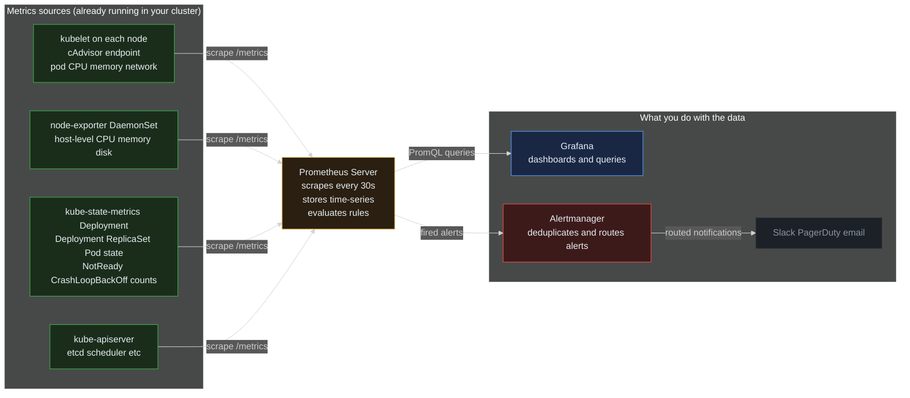
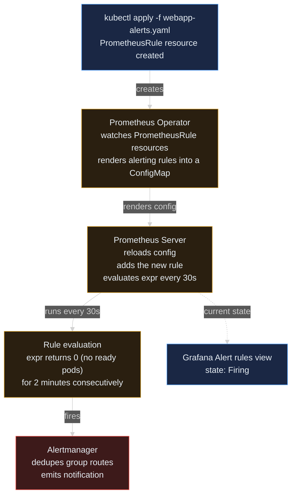

> **30 Days of DevOps** — Day 8 of 30. [← Day 7: Ingress and TLS](/articles/2026/05/18/day-07-ingress-tls/)

In [Day 7](/articles/2026/05/18/day-07-ingress-tls/) you got the webapp running over HTTPS at `https://webapp.local`. Pods are healthy, the Ingress is routing, and traffic flows end-to-end. But you have **no idea** what's happening inside the cluster:

- Are your pods using their full memory limit, or are they coasting at 5%?
- Is the cluster's `kube-apiserver` falling behind on requests?
- When a pod crashes at 3 AM, what does the timeline of CPU + memory just before the crash look like?
- If all your webapp pods go `NotReady` simultaneously, does anyone find out?

Observability is the answer. In production, you don't just want a cluster — you want to **see** the cluster: metrics, dashboards, alerts. Today you install the whole observability stack in one Helm command, expose Grafana through the Ingress controller from Day 7, find your webapp pods in pre-built dashboards, and wire your first alert rule.

## What you will build

By the end of this article you will have:

- The complete **kube-prometheus-stack** running in the cluster (Prometheus + Grafana + Alertmanager + node-exporter + kube-state-metrics + the Prometheus Operator), installed via a single Helm command
- **Grafana exposed at `https://grafana.local`** with a TLS certificate auto-issued by the cert-manager + ClusterIssuer pipeline from Day 7
- Your **Day 7 webapp Pods** visible in Grafana's built-in dashboards, with live CPU and memory graphs
- A **custom dashboard** showing pod CPU, memory, and network traffic for the webapp release
- A **PrometheusRule** that alerts when zero webapp pods are Ready

---

## Prerequisites

This article continues directly from Day 7. Your kind cluster, the NGINX Ingress Controller, cert-manager, the self-signed ClusterIssuer, and the webapp Helm release must all be running.

If you finished Day 7 cleanly, run this sanity check before continuing:

```bash
kubectl get pods -A | grep -E "ingress-nginx|cert-manager|webapp"
```

Expected output (truncated):

```text
cert-manager    cert-manager-5d8b9f7c4-aa1xy             1/1   Running   0   1h
cert-manager    cert-manager-cainjector-7b9d4f8c6-bb2zw  1/1   Running   0   1h
cert-manager    cert-manager-webhook-8c4d5f7b9-cc3yt     1/1   Running   0   1h
default         webapp-webapp-6c9d8f7b5-x7k2p             1/1   Running   0   1h
default         webapp-webapp-6c9d8f7b5-q4m9r             1/1   Running   0   1h
ingress-nginx   ingress-nginx-controller-7d4c5f6b9-xk2vp  1/1   Running   0   1h
```

If any of those are missing, jump back to Day 7 and rerun those install steps.

| Tool | Minimum version | Check |
|---|---|---|
| Docker | 24.x | `docker --version` |
| kubectl | 1.29 | `kubectl version --client` |
| Helm | 3.14 | `helm version --short` |

No new CLIs needed today — everything we install runs inside the cluster.

---

## The observability pipeline

Before installing anything, understand the data path. The kube-prometheus-stack is not one component — it's **six**, all wired together. Here is what data flows where:



**Reading this diagram:**

Read left to right. The whole observability story is a **pull-based pipeline** — Prometheus pulls metrics; nothing pushes to it.

The **"Metrics sources"** block on the left (green boxes) is the set of components that already exist in your cluster and expose Prometheus-format metrics on an HTTP `/metrics` endpoint. The **kubelet** on each node has a built-in `cAdvisor` endpoint that exposes per-pod CPU, memory, and network counters — this is how Prometheus learns about your Day 7 webapp pods without you instrumenting them. **node-exporter** runs as a DaemonSet (one pod per node) and exposes host-level metrics (disk usage, system load, file-descriptor counts). **kube-state-metrics** is a single Deployment that watches the Kubernetes API and exposes Kubernetes object state as metrics (how many Pods are NotReady? how many Deployments have unavailable replicas?). The **kube-apiserver** itself exposes its internal metrics so you can monitor the control plane.

The **Prometheus Server** (amber) is the center of the universe. It holds a list of scrape targets (populated automatically by the Prometheus Operator from `ServiceMonitor` resources you will see later), polls each target every 30 seconds by default, parses the metrics, and writes them to a time-series database on disk. It also evaluates alerting rules continuously — every `PrometheusRule` resource becomes a recurring PromQL expression.

The **"Consumers"** block on the right is what you, the human, interact with. **Grafana** (blue) queries Prometheus with PromQL and renders dashboards. **Alertmanager** (red) receives fired alerts from Prometheus, deduplicates them (10 nodes firing the same `HighCPU` alert become one notification), and routes them to **destinations** (grey) like Slack, PagerDuty, email, or webhooks.

The key insight: every component on the left exposes data the same way (`/metrics` over HTTP). The whole architecture scales because adding a new monitored service just means giving it a `/metrics` endpoint and a `ServiceMonitor` — Prometheus picks it up automatically.

---

## Part 1 — Install kube-prometheus-stack

Six components, one Helm install. The chart that ties them together is **kube-prometheus-stack**, published by the prometheus-community Helm repository.

**What is kube-prometheus-stack?**
A *meta-chart* — it's a Helm chart that packages and pre-wires six independent components (Prometheus Operator, Prometheus, Alertmanager, Grafana, node-exporter, kube-state-metrics) plus dozens of pre-built `ServiceMonitor`, `PrometheusRule`, and `Dashboard` resources that cover the standard Kubernetes monitoring story. Without this chart, getting the same setup would mean installing each component individually and writing the integration glue yourself — hours of work, and easy to misconfigure.

**Why the meta-chart over installing components individually?**
Three reasons that matter:
1. **Pre-wiring** — Grafana ships pre-configured with Prometheus as a datasource, so you don't have to wire it manually
2. **Pre-built dashboards** — 30+ dashboards covering cluster overview, node detail, pod detail, deployment health, etc. — all imported automatically
3. **Pre-built alerts** — a comprehensive set of `PrometheusRule` resources covering common failure modes (kube-apiserver down, node disk pressure, pod crash loop) — turned on by default

Add the repo and update:

```bash
# Add the prometheus-community Helm repository (the upstream source of the chart)
helm repo add prometheus-community https://prometheus-community.github.io/helm-charts

# Pull the latest chart metadata into your local Helm cache
helm repo update
```

Expected output:

```text
"prometheus-community" has been added to your repositories
Hang tight while we grab the latest from your chart repositories...
...Successfully got an update from the "prometheus-community" chart repository
Update Complete. ⎈Happy Helming!⎈
```

Now install the stack. We use a short release name (`kps`) because every Service the chart creates is prefixed with the release name — shorter is easier to type later:

```bash
# Install kube-prometheus-stack into a dedicated 'monitoring' namespace.
# - release name: kps (every Service/Deployment is prefixed with this)
# - --version pins to a specific chart revision so the article is reproducible
# - grafana.adminPassword: sets the initial admin password (defaults to random)
# - grafana.service.type=ClusterIP: don't expose Grafana via NodePort; we'll
#   use Ingress instead in Part 3 (same pattern as Day 7)
# - prometheus.prometheusSpec.serviceMonitorSelectorNilUsesHelmValues=false:
#   makes Prometheus pick up *every* ServiceMonitor in any namespace (default
#   would only pick up ones with a matching Helm label — too restrictive for
#   a tutorial cluster)
helm install kps prometheus-community/kube-prometheus-stack \
  --namespace monitoring --create-namespace \
  --version 65.5.0 \
  --set grafana.adminPassword='admin' \
  --set grafana.service.type=ClusterIP \
  --set prometheus.prometheusSpec.serviceMonitorSelectorNilUsesHelmValues=false
```

Expected output:

```text
NAME: kps
LAST DEPLOYED: Tue May 19 09:00:42 2026
NAMESPACE: monitoring
STATUS: deployed
REVISION: 1
NOTES:
kube-prometheus-stack has been installed. Check its status by running:
  kubectl --namespace monitoring get pods -l "release=kps"

Visit https://github.com/prometheus-operator/kube-prometheus for instructions
on how to create & configure Alertmanager and Prometheus instances using the Operator.
```

This install pulls ~15 container images and creates ~50 Kubernetes resources. It takes about 2–4 minutes on a fresh kind cluster. Watch the pods come up:

```bash
kubectl get pods -n monitoring -w
```

Expected output (after ~3 minutes, when everything is settled):

```text
NAME                                                     READY   STATUS    RESTARTS   AGE
alertmanager-kps-kube-prometheus-stack-alertmanager-0    2/2     Running   0          2m
kps-grafana-7f6c4d8b5-zh4xp                              3/3     Running   0          2m
kps-kube-prometheus-stack-operator-6c5f8d9b4-tt8nq       1/1     Running   0          2m
kps-kube-state-metrics-7d9c5b4f8-mm3jp                   1/1     Running   0          2m
kps-prometheus-node-exporter-aa11x                       1/1     Running   0          2m
kps-prometheus-node-exporter-bb22y                       1/1     Running   0          2m
kps-prometheus-node-exporter-cc33z                       1/1     Running   0          2m
prometheus-kps-kube-prometheus-stack-prometheus-0        2/2     Running   0          2m
```

Press `Ctrl+C` to stop watching. Note the `2/2` and `3/3` containers — Prometheus, Alertmanager, and Grafana run with sidecar containers (config-reloaders, plugin loaders), which is normal.

---

## Part 2 — Tour what got installed

Before we expose Grafana, take a moment to understand what arrived in your cluster. Each component is a real Kubernetes object that you can poke at with `kubectl`.

```bash
# List every Deployment, StatefulSet, and DaemonSet kps created
kubectl get deploy,sts,ds -n monitoring
```

Expected output:

```text
NAME                                                READY   UP-TO-DATE   AVAILABLE   AGE
deployment.apps/kps-grafana                         1/1     1            1           5m
deployment.apps/kps-kube-prometheus-stack-operator  1/1     1            1           5m
deployment.apps/kps-kube-state-metrics              1/1     1            1           5m

NAME                                                                    READY   AGE
statefulset.apps/alertmanager-kps-kube-prometheus-stack-alertmanager    1/1     5m
statefulset.apps/prometheus-kps-kube-prometheus-stack-prometheus        1/1     5m

NAME                                          DESIRED   CURRENT   READY   AGE
daemonset.apps/kps-prometheus-node-exporter   3         3         3       5m
```

A quick decode of what's running:

- **`kps-grafana` (Deployment)** — the Grafana web UI, the dashboards engine, and a "sidecar" pod that reloads dashboards/datasources when ConfigMaps change.
- **`kps-kube-prometheus-stack-operator` (Deployment)** — the **Prometheus Operator**. This is a controller that watches `Prometheus`, `Alertmanager`, `ServiceMonitor`, `PodMonitor`, and `PrometheusRule` Custom Resources and reconciles them into the actual scrape configs / alert configs that Prometheus and Alertmanager read. You almost never edit Prometheus's `prometheus.yml` directly — you create CRDs and the Operator updates the config.
- **`kps-kube-state-metrics` (Deployment)** — a single pod whose only job is to list every Kubernetes object via the API and expose object-state as Prometheus metrics (number of Deployments by status, number of Pods by phase, etc.).
- **`prometheus-...-0` (StatefulSet)** — Prometheus itself. StatefulSet because Prometheus has a persistent on-disk time-series database that needs stable identity across restarts.
- **`alertmanager-...-0` (StatefulSet)** — Alertmanager. Same reason for StatefulSet.
- **`kps-prometheus-node-exporter` (DaemonSet)** — one pod per node, exposing host-level metrics from `/proc` and `/sys`. With our 3-node kind cluster, there are 3 pods.

The Operator pattern is the most important thing to internalise here. From now on, you configure monitoring by writing YAML for Custom Resources rather than editing Prometheus config files directly. (Advanced cases like `additionalScrapeConfigs` still let you inject raw config via a Secret, but they're the exception.)

---

## Part 3 — Expose Grafana via Ingress

We use the exact same Ingress + cert-manager pipeline from Day 7 — just a different hostname and different backend Service. The webapp is now joined by Grafana on the cluster's HTTPS surface.

Find the Grafana Service name and port:

```bash
kubectl get svc -n monitoring kps-grafana
```

Expected output:

```text
NAME          TYPE        CLUSTER-IP      EXTERNAL-IP   PORT(S)   AGE
kps-grafana   ClusterIP   10.96.182.55    <none>        80/TCP    8m
```

`ClusterIP` because we set `grafana.service.type=ClusterIP` at install time. Port 80 is Grafana's HTTP port (Grafana terminates plain HTTP internally; the Ingress controller handles TLS termination at the edge — same pattern as the webapp in Day 7).

Create the Ingress:

```bash
mkdir -p ~/30-days-devops/day-08 && cd ~/30-days-devops/day-08

cat > grafana-ingress.yaml << 'EOF'
apiVersion: networking.k8s.io/v1
kind: Ingress
metadata:
  name: grafana-ingress
  namespace: monitoring
  annotations:
    # Reuse the self-signed ClusterIssuer from Day 7. cert-manager will see
    # this annotation, create a Certificate resource for grafana.local, and
    # populate the Secret named in tls.secretName below.
    cert-manager.io/cluster-issuer: selfsigned-issuer
spec:
  ingressClassName: nginx
  tls:
    - hosts:
        - grafana.local
      secretName: grafana-tls
  rules:
    - host: grafana.local
      http:
        paths:
          - path: /
            pathType: Prefix
            backend:
              service:
                name: kps-grafana
                port:
                  number: 80
EOF

kubectl apply -f grafana-ingress.yaml
```

Expected output:

```text
ingress.networking.k8s.io/grafana-ingress created
```

Wait a few seconds, then confirm cert-manager has issued the TLS Secret:

```bash
kubectl get certificate -n monitoring
```

Expected output:

```text
NAME           READY   SECRET         AGE
grafana-tls    True    grafana-tls    15s
```

`READY: True` means the cert was issued by `selfsigned-issuer` and stored in the `grafana-tls` Secret. The NGINX controller is already watching this Secret and now serves HTTPS for `grafana.local`.

Test it:

```bash
curl --resolve grafana.local:443:127.0.0.1 -k -s -o /dev/null -w "%{http_code}\n" https://grafana.local/
```

Expected output:

```text
302
```

`302` because Grafana redirects an unauthenticated request to its login page. That's the signal it's all wired up.

---

## Part 4 — Log into Grafana and tour the dashboards

Open the URL in a real browser. You will need to add a temporary host file entry so the browser knows where to send `grafana.local`:

**On macOS / Linux:**
```bash
# Add a /etc/hosts entry mapping grafana.local to 127.0.0.1
echo "127.0.0.1 grafana.local" | sudo tee -a /etc/hosts
```

**On Windows (PowerShell as Admin):**
```powershell
Add-Content C:\Windows\System32\drivers\etc\hosts "`n127.0.0.1 grafana.local"
```

Now open `https://grafana.local/` in a browser. You will see the self-signed cert warning — click through (same as Day 7's webapp.local).

Login:
- **Username:** `admin`
- **Password:** `admin` (the value we set at install time)

Once you're in, find the pre-built dashboards. Click the four-square **Dashboards** icon in the left sidebar. You will see a folder structure like:

```
General/
  Alertmanager / Overview
  Kubernetes / API Server
  Kubernetes / Compute Resources / Cluster
  Kubernetes / Compute Resources / Namespace (Pods)
  Kubernetes / Compute Resources / Pod
  Kubernetes / Kubelet
  Kubernetes / Networking / Cluster
  Kubernetes / Persistent Volumes
  Kubernetes / Proxy
  Kubernetes / Scheduler
  Node Exporter / Nodes
  Node Exporter / USE Method / Cluster
  Prometheus / Overview
  ...
```

Every one of these is pre-wired to use Prometheus as a datasource and shows real data from your cluster — you didn't import or configure any of them. This is what the meta-chart bought you.

Open **Kubernetes / Compute Resources / Pod**. At the top, pick `Namespace: default` and `Pod: webapp-webapp-...` from the dropdowns. You will see live CPU and memory graphs for your Day 7 webapp pods — without having modified a single line of the webapp itself.

The data path is exactly what the diagram in the intro showed:
1. The kubelet on each node has the cAdvisor endpoint running by default
2. The Prometheus Operator created a `ServiceMonitor` for the kubelets when kps was installed
3. Prometheus is scraping every kubelet every 30 seconds
4. Grafana queries Prometheus with PromQL like `container_cpu_usage_seconds_total{namespace="default",pod=~"webapp-webapp-.*"}`
5. The graph renders

---

## Part 5 — Build a custom dashboard for the webapp

The built-in dashboards are exhaustive, but for the webapp release you want one compact dashboard showing the four metrics that actually matter: pod CPU, pod memory, network traffic, and pod-restart count. Build it.

In Grafana: click the **+** in the top toolbar → **New dashboard** → **+ Add visualization**. Select **Prometheus** as the datasource when prompted.

In the query box, paste this **PromQL** (Prometheus Query Language) expression:

```promql
sum by (pod) (rate(container_cpu_usage_seconds_total{namespace="default",pod=~"webapp-webapp-.*",container!=""}[5m]))
```

What this query says, decoded right-to-left:
- `container_cpu_usage_seconds_total` — a counter of total CPU seconds used by each container
- `{namespace="default",pod=~"webapp-webapp-.*",container!=""}` — filter to our webapp pods only (and skip the synthetic "pod-level" series where container is empty)
- `[5m]` — over a 5-minute window
- `rate(...)` — compute the per-second rate of increase (so this becomes CPU cores per second)
- `sum by (pod)` — sum the containers inside each pod (one series per pod)

You should see two or three lines on the graph — one per running webapp pod. Set the panel title to `webapp · CPU cores`, then click **Apply**.

Add three more panels in the same way:

| Panel title | PromQL |
|---|---|
| `webapp · Memory (MiB)` | `sum by (pod) (container_memory_working_set_bytes{namespace="default",pod=~"webapp-webapp-.*",container!=""}) / 1024 / 1024` |
| `webapp · Network RX (bytes/s)` | `sum by (pod) (rate(container_network_receive_bytes_total{namespace="default",pod=~"webapp-webapp-.*"}[5m]))` |
| `webapp · Restarts (last 1h)` | `sum by (pod) (increase(kube_pod_container_status_restarts_total{namespace="default",pod=~"webapp-webapp-.*"}[1h]))` |

Save the dashboard (top-right **Save** button) with the name `webapp`. You now have a one-pane view of every pod in the webapp release.

---

## Part 6 — Wire your first alert rule

Dashboards are great for incident response. **Alerts** are what wakes you up when something is broken at 3 AM. Today we add the simplest useful alert: fire when **zero** webapp pods are Ready.

The standard way to do this in kube-prometheus-stack is to create a **`PrometheusRule`** Custom Resource. The Prometheus Operator watches all `PrometheusRule` resources and renders them into Prometheus's alerting config automatically.

```bash
cat > webapp-alerts.yaml << 'EOF'
apiVersion: monitoring.coreos.com/v1
kind: PrometheusRule
metadata:
  name: webapp-alerts
  namespace: monitoring
  labels:
    # kube-prometheus-stack's Prometheus is configured to pick up rules
    # that have this label. Without it, the rule would be ignored.
    release: kps
spec:
  groups:
    - name: webapp.rules
      interval: 30s
      rules:
        - alert: WebappNoReadyPods
          # PromQL: how many ready (available) replicas does the webapp
          # Deployment currently report? If this stays at 0 for 2 minutes,
          # the alert fires.
          #
          # IMPORTANT: we query a Deployment-level metric, not a pod-level
          # one. If we used `sum(kube_pod_status_ready{pod=~...})` instead,
          # `kubectl scale --replicas=0` would delete every pod, the series
          # would disappear from Prometheus entirely, and `sum(<empty>) == 0`
          # would evaluate to empty — the alert would NEVER fire. The
          # Deployment-level metric stays present at value 0 even when
          # every pod is gone, which is exactly what we want.
          expr: |
            kube_deployment_status_replicas_available{
              namespace="default",
              deployment="webapp-webapp"
            } == 0
          for: 2m
          labels:
            severity: critical
            team: platform
          annotations:
            summary: "All webapp pods are NotReady"
            description: |
              No pods in the default/webapp release are passing their
              readiness probe. The Ingress controller has no healthy
              backends, so https://webapp.local is returning 503s.
EOF

kubectl apply -f webapp-alerts.yaml
```

Expected output:

```text
prometheusrule.monitoring.coreos.com/webapp-alerts created
```

Verify the rule is being evaluated. In Grafana, open the left sidebar → **Alerting** → **Alert rules**. You should see `WebappNoReadyPods` in the list with state `Normal` (because all pods are healthy right now).

**Trigger the alert** to prove it works. Scale the webapp down to zero replicas:

```bash
kubectl scale deployment webapp-webapp --replicas=0
```

Expected output:

```text
deployment.apps/webapp-webapp scaled
```

Wait 2 minutes (the `for: 2m` duration must elapse before the alert fires). Back in Grafana's Alert rules, the state will transition `Normal → Pending → Firing`.

Restore the pods:

```bash
kubectl scale deployment webapp-webapp --replicas=2
```

Expected output:

```text
deployment.apps/webapp-webapp scaled
```

Within 30 seconds the alert goes back to `Normal`.

### How an alert evaluation flows



**Reading this diagram:**

Read top to bottom. The flow has three colour groups: **blue** for components you (or your CI) interact with directly — the `kubectl apply` at the top and the Grafana UI at the bottom — **amber** for the Operator-managed automation pipeline in the middle (Prometheus Operator → Prometheus Server → rule evaluation loop), and **red** for the notification side (Alertmanager).

At the top, you run `kubectl apply` (blue) and a `PrometheusRule` resource appears in the cluster. The **Prometheus Operator** (amber) is watching for these — it sees the new resource, reads its `spec.groups[].rules[]`, and renders the rule into a ConfigMap that Prometheus mounts.

**Prometheus Server** (amber) reloads its config (it does this automatically when the mounted ConfigMap changes — no restart needed) and adds the new alerting rule to its in-memory rule engine. From then on, every 30 seconds (the rule's `interval`), Prometheus runs the `expr` PromQL query.

**Rule evaluation** (amber) returns a value. If the value is empty (the condition isn't met), the alert stays in `Normal` state. If it returns a series (the condition IS met), the alert moves to `Pending`. After the `for:` duration elapses with continuous `Pending`, the alert transitions to `Firing` and Prometheus sends it to Alertmanager.

**Alertmanager** (red) is the notification gateway. It dedupes (10 nodes firing the same rule become one notification), groups related alerts together (all-from-cluster-A), throttles repeats, and routes the final notification to whichever receiver you configure — Slack, PagerDuty, email, a webhook.

Meanwhile, **Grafana's Alert rules view** (blue) is reading state from Prometheus directly (the dotted arrow) — so you can see Pending and Firing states in the UI even before Alertmanager has sent anything.

The key insight: the Operator + Prometheus + Alertmanager separation gives you three reload-without-restart boundaries. Adding a rule never restarts Prometheus. Changing routing never restarts Prometheus. Adding a receiver never restarts Alertmanager. Each layer has its own config-reload mechanism, and the Operator orchestrates them.

---

## Cleanup

Uninstall in reverse install order to avoid leaving orphaned Custom Resources:

```bash
kubectl delete -f webapp-alerts.yaml
kubectl delete -f grafana-ingress.yaml
helm uninstall kps -n monitoring
kubectl delete namespace monitoring
```

Expected output:

```text
prometheusrule.monitoring.coreos.com "webapp-alerts" deleted
ingress.networking.k8s.io "grafana-ingress" deleted
release "kps" uninstalled
namespace "monitoring" deleted
```

The Helm uninstall removes ~50 resources but leaves the CRDs in place (by Helm convention). If you also want to remove the CRDs:

> **Warning:** the command below deletes every `monitoring.coreos.com` CRD **cluster-wide**, not just the ones kps used. If you have any other Prometheus Operator installation in the same cluster, this will rip its CRDs out too — and Custom Resources tied to those CRDs will be cascaded-deleted. Only run this if you're sure no other monitoring stack is sharing the cluster.

```bash
kubectl get crd | grep monitoring.coreos.com | awk '{print $1}' | xargs kubectl delete crd
```

Or just delete the whole cluster:

```bash
kind delete cluster --name devops-cluster
```

Remove the `/etc/hosts` entry you added for `grafana.local`:

```bash
# Edit /etc/hosts and remove the line: 127.0.0.1 grafana.local
sudo sed -i.bak '/grafana.local/d' /etc/hosts
```

---

## Common errors

### Error 1 — Helm install hangs or pods stuck Pending

```text
helm install kps prometheus-community/kube-prometheus-stack ...
# (10 minutes later, still running)

kubectl get pods -n monitoring
NAME                          READY   STATUS    RESTARTS   AGE
prometheus-kps-...-0          0/2     Pending   0          5m
```

**Cause:** Prometheus and Grafana request more memory than your kind cluster has available. The Prometheus Pod requests ~400Mi by default; combined with Grafana, node-exporter, and the operator, the install needs ~1.5 GiB across all nodes.

**Fix:**

```bash
# Check why pods are pending
kubectl describe pod -n monitoring prometheus-kps-kube-prometheus-stack-prometheus-0 \
  | grep -A 3 "Events:"

# Common output: "0/3 nodes are available: Insufficient memory"
# Fix: increase Docker Desktop memory to 6GB+, then recreate the cluster
# Docker Desktop -> Settings -> Resources -> Memory -> 6GB
```

---

### Error 2 — Grafana login fails

```text
Invalid username or password
```

**Cause:** The default chart's admin password is `prom-operator`, not `admin`. We overrode it to `admin` via `--set grafana.adminPassword='admin'`, but if you missed that flag at install time, the password is something else.

**Fix:**

```bash
# Read the actual admin password from the Grafana Secret created by the chart
kubectl get secret kps-grafana -n monitoring \
  -o jsonpath='{.data.admin-password}' | base64 -d && echo

# Or reset it via helm upgrade
helm upgrade kps prometheus-community/kube-prometheus-stack \
  --namespace monitoring \
  --reuse-values \
  --set grafana.adminPassword='your-new-password'
```

---

### Error 3 — Grafana Ingress returns 404

```text
default backend - 404
```

**Cause:** Either the Ingress is in a different namespace from the Service it targets (Ingress and Service must live in the same namespace — NGINX won't route across), or the `backend.service.name` doesn't exactly match the Grafana Service name. The chart names the Service `<release-name>-grafana`; with our release `kps` that's `kps-grafana`.

**Fix:**

```bash
# Confirm both Ingress and the target Service are in `monitoring`
kubectl get ingress,svc -n monitoring | grep -E "grafana"

# Common mistakes:
#   - backend.service.name: grafana    (WRONG — must be kps-grafana)
#   - metadata.namespace omitted       (WRONG — defaults to `default`,
#                                       but Service is in `monitoring`)

# After fixing the YAML, reapply
kubectl apply -f grafana-ingress.yaml
```

---

### Error 4 — PrometheusRule not picked up

```text
kubectl apply -f webapp-alerts.yaml
prometheusrule.monitoring.coreos.com/webapp-alerts created
# But the rule never appears in Prometheus or Grafana's alert UI
```

**Cause:** The `PrometheusRule` resource is missing the `release: kps` label (or whatever label `prometheus.prometheusSpec.ruleSelector` is configured to match). The default kube-prometheus-stack only picks up rules with the matching label.

**Fix:**

```bash
# Inspect what label the Prometheus instance is looking for
kubectl get prometheus -n monitoring kps-kube-prometheus-stack-prometheus \
  -o jsonpath='{.spec.ruleSelector}{"\n"}'

# Typically: {"matchLabels":{"release":"kps"}}

# Add the label to your PrometheusRule and re-apply:
#   metadata:
#     labels:
#       release: kps
```

---

### Error 5 — Self-signed cert warning in browser

```text
Your connection is not private
NET::ERR_CERT_AUTHORITY_INVALID
```

**Cause:** Same as Day 7 — the `selfsigned-issuer` ClusterIssuer generates a fresh self-signed CA per certificate, which nothing in the world trusts. This is expected for local development.

**Fix:** Click "Advanced" → "Proceed to grafana.local (unsafe)" in your browser. For a real publicly-trusted cert, swap the ClusterIssuer for a Let's Encrypt ACME issuer (covered in Day 7's Error 6).

---

### Error 6 — `kubectl scale` doesn't change the running pod count

```text
kubectl scale deployment webapp-webapp --replicas=0
deployment.apps/webapp-webapp scaled
# But pods are still running
```

**Cause:** Helm released `webapp-webapp` as a Deployment owned by the Helm release. Manually scaling it works, but the next time `helm upgrade` runs, it will reset replicas to the chart's value. For the alert-test exercise in Part 6 this is fine — just remember to scale back up after.

**Fix:**

```bash
# Confirm the manual scale took effect
kubectl get deployment webapp-webapp

# Scale back up to the chart's default replica count
kubectl scale deployment webapp-webapp --replicas=2

# For permanent changes: edit values-ingress.yaml from Day 7 (replicaCount)
# and run `helm upgrade webapp ~/30-days-devops/day-06/webapp -f values-ingress.yaml`
```

---

## What you built

In this article you:

- Installed the entire **kube-prometheus-stack** (Prometheus, Grafana, Alertmanager, node-exporter, kube-state-metrics, Prometheus Operator) into a dedicated `monitoring` namespace with a single Helm command
- Decoded what each of the six components does and why they ship together as a meta-chart
- Exposed **Grafana over HTTPS** at `https://grafana.local` by reusing the Day 7 Ingress + cert-manager pipeline — proving the value of a stable cluster ingress: every new service is a new hostname rule, no per-service setup
- Found your **Day 7 webapp pods** in Grafana's built-in *Kubernetes / Compute Resources / Pod* dashboard with zero changes to the application — proof that **infrastructure-level metrics (CPU/memory/network)** flow automatically via the kubelet's cAdvisor endpoint
- Built a **custom Grafana dashboard** with four PromQL panels covering CPU, memory, network, and restart count for the webapp release
- Created your first **PrometheusRule** to alert when zero webapp pods are Ready, watched it transition `Normal → Pending → Firing` when you scaled the Deployment to zero, and back to `Normal` when you scaled up again

Your local cluster now has the same observability surface a real production cluster has — same components, same CRDs, same dashboards.

```text
~/30-days-devops/day-08/
├── grafana-ingress.yaml    # Ingress for grafana.local + cert-manager annotation
└── webapp-alerts.yaml      # PrometheusRule with the WebappNoReadyPods alert
```

---

## Day 9 — Centralised logging with Loki and Promtail

Metrics tell you **what** is wrong. Logs tell you **why**. Today you can see that webapp pod CPU spiked at 14:32, but you have no idea what the application was doing. In Day 9 we close that loop:

- Install **Loki** — Grafana's log aggregation backend, sometimes called "Prometheus for logs"
- Install **Promtail** as a DaemonSet — it tails every container log file on every node and ships it to Loki
- Wire **Loki as a second datasource** in the Grafana you already have
- Use **LogQL** (Loki's query language — Prometheus-style label selectors over logs) to find errors across all webapp pods in one query
- Pivot from a CPU-spike point on a metrics dashboard directly to the logs for that pod, in the same Grafana panel

[Day 9 coming soon →]
