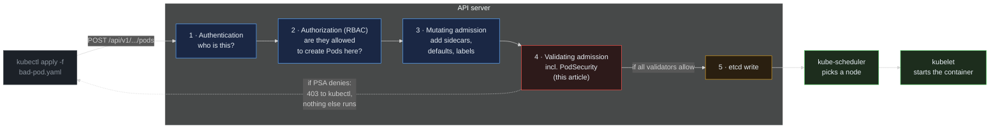

> **30 Days of DevOps** — Day 14 of 30. [← Day 13: RBAC](/articles/2026/05/19/day-13-rbac/)

Day 13 closed the API-credential leak: every webapp Pod now runs under a ServiceAccount with no mounted token, and the only Pod permitted to call the API server (`webapp-readonly`) has a Role that grants exactly five read verbs and nothing else. That story protects the **API** from a compromised Pod.

Day 14 protects the **node** from a compromised Pod. A container that asks for `securityContext.privileged: true`, or `hostNetwork: true`, or `hostPID: true`, or mounts `/var/run/docker.sock` — gets effective root on the underlying host. RBAC does not stop any of this; RBAC governs what the *Pod* can do, not what the *Pod manifest* is allowed to declare. The control that does stop it is an admission controller.

The Kubernetes-built-in admission controller for this is **Pod Security Admission (PSA)**, which implements the three-level **Pod Security Standards (PSS)** profile. PSA is enabled by default in every Kubernetes cluster from 1.25 onwards (when PodSecurityPolicy was finally removed). It is dormant by default — no namespace enforces anything — and switches on with **one label per namespace**:

```text
pod-security.kubernetes.io/enforce: restricted
```

That one label tells the API server: refuse any Pod admission into this namespace that does not satisfy the `restricted` profile. The check runs *before* the Pod is written to etcd; the kubelet never sees a forbidden Pod, the scheduler never tries to place one.

## What you will build

By the end of this article you will have:

- A clear mental model of where **Pod Security Admission** sits in the API-server admission chain, and how the three PSS levels (**privileged**, **baseline**, **restricted**) compose
- The `default` namespace labelled with `pod-security.kubernetes.io/warn` and `audit` in restricted mode — non-blocking observation of what would fail under enforcement
- The webapp Helm chart **hardened to satisfy the restricted profile**:
  - Image switched from `nginx:1.27-alpine` (root-owned) to `nginxinc/nginx-unprivileged:1.27-alpine` (runs as UID 101 on port 8080)
  - Pod-level `securityContext` with `runAsNonRoot`, `runAsUser: 101`, `seccompProfile: RuntimeDefault`
  - Container-level `securityContext` with `allowPrivilegeEscalation: false`, `readOnlyRootFilesystem: true`, `capabilities.drop: [ALL]`
  - An `emptyDir` mount on `/tmp` to keep nginx happy with the read-only root filesystem
  - `service.targetPort` updated from 80 to 8080 (the unprivileged image listens there)
- The `default` namespace **promoted to `enforce: restricted`** once the webapp Pods are clean
- A live demo: `kubectl apply` of a Pod with `securityContext.privileged: true` — **rejected by the API server in milliseconds**, before scheduler sees it

---

## How Pod Security Admission works

PSA is one of several admission controllers built into the API server. To understand what it does, follow the path an `apply` takes from your laptop to etcd.



**Reading this diagram:**

Read left to right, following the five numbered stages. Every Pod creation in every namespace travels this exact path; PSA is stage 4 — the one box highlighted red because it is where this article's policy lives.

**Stages 1 and 2** (blue, inside the API server) are familiar from Day 13. **Authentication** asks *who is this request from* — the kubelet's TLS cert, your laptop's kubeconfig token, a ServiceAccount JWT — and resolves it to a subject. **Authorization** then runs the RBAC check from Day 13: is that subject allowed to `create` a `pod` in this namespace? If RBAC says no, the request is rejected here — PSA never runs.

**Stage 3, Mutating admission**, can rewrite the Pod manifest. Sidecar injectors (Istio, Linkerd), default labellers, and resource-limit defaulters all run here. PSA does *not* mutate — it leaves your manifest exactly as you wrote it.

**Stage 4, Validating admission** (red), is where Pod Security Admission lives alongside other validating webhooks. Validators get the post-mutation manifest and answer one question each: "is this Pod acceptable to me?" PSA checks the manifest against the level the namespace is labelled with. If any validator says no, **the request is rejected with a 403 and the response includes which validator complained and why**.

**Stage 5** is the etcd write. Only if every validator allowed the manifest does it get persisted. The dotted red arrow loops back to the user — when PSA denies, the kubectl client sees the rejection immediately, and nothing downstream (scheduler, kubelet, no Pod created) runs at all.

The key insight: **admission is synchronous and pre-storage**. A Pod that fails admission was never a Pod. There is no half-state to clean up, no failed-creation event to chase, no node to evict from. The cluster's audit trail simply records the rejected API call. This makes PSA the most efficient possible enforcement point — cheaper than runtime detection, cheaper than scanning, with zero false positives because the rules are deterministic and run on every single Pod.

---

## The three Pod Security Standards levels

PSS defines three named profiles, ordered from least to most restrictive. Each level **contains** the previous one's rules — promoting `baseline` → `restricted` only adds checks; it never removes them.

| Level | What it allows | What it blocks |
|---|---|---|
| **privileged** | Anything. The default if no label is set. | (Nothing.) |
| **baseline** | Workloads that follow basic safety practices. | `securityContext.privileged: true`, `hostNetwork`, `hostPID`, `hostIPC`, `hostPath` volumes, dangerous capabilities, dangerous AppArmor/SELinux profiles, mutating sysctls. |
| **restricted** | Workloads following current Pod hardening best practices. | Everything `baseline` blocks, **plus**: must set `runAsNonRoot: true`, must drop all capabilities (and may only add `NET_BIND_SERVICE`), must set `allowPrivilegeEscalation: false`, must set a `seccompProfile`, must not use any volume type other than the safe list (`configMap`, `secret`, `emptyDir`, `projected`, `downwardAPI`, `persistentVolumeClaim`, etc.). |

Each PSS label has three modes:

- **`enforce`** — reject non-compliant Pods at admission. Hard failure for the API client.
- **`audit`** — allow the Pod, but write an `audit-violations` annotation to the cluster audit log. Used for measurement.
- **`warn`** — allow the Pod, but return a warning to the kubectl client. Used to surface violations to humans during apply.

The three modes are independent — you can `enforce: baseline` while running `audit: restricted`, which means "block the obviously bad stuff today, but log everything I would also block if I tightened the profile tomorrow."

---

## Prerequisites

This article continues directly from Day 13. Required state:

- The `devops-cluster` kind cluster running, with Argo CD managing the `gitops-webapp` repo
- The webapp Deployment running under the `webapp-runtime` ServiceAccount from Day 13
- Local clone of `gitops-webapp` from previous days

Pre-flight check:

```bash
# Confirm the Argo CD webapp Application is Synced & Healthy.
kubectl get application -n argocd webapp

# Confirm the namespace has no Pod Security label yet — this is the
# default state. If your cluster is hardened by your platform team,
# you may see a label here already; the rest of the article assumes
# the default-namespace label set is empty.
kubectl get ns default \
  -o jsonpath='{.metadata.labels}{"\n"}'
```

Expected output:

```text
NAME     SYNC STATUS   HEALTH STATUS
webapp   Synced        Healthy

{"kubernetes.io/metadata.name":"default"}
```

| Tool | Minimum version | Check |
|---|---|---|
| kubectl | 1.29 | `kubectl version --client` |
| Helm | 3.14 | `helm version --short` |
| gh CLI | 2.x | `gh --version` |
| Kubernetes (server) | **1.25+** for PSA built-in | `kubectl version` → server version |

PSA was promoted to stable in Kubernetes 1.25; any cluster `kind` creates today is well past that.

---

## Part 1 — Audit current state with `warn` and `audit` modes

Setting `enforce: restricted` directly would block any subsequent rollout of the *current* webapp Pods, because they were never written to pass the profile. The safe sequence is to enable **non-blocking modes first** (warn + audit), observe what would be flagged, fix the chart, then promote to `enforce`.

Label the `default` namespace with both warn and audit at `restricted`:

```bash
# kubectl label applies these as ordinary labels — PSA's controller
# picks them up on every admission decision, no restart needed.
kubectl label namespace default \
  pod-security.kubernetes.io/warn=restricted \
  pod-security.kubernetes.io/audit=restricted
```

Expected output:

```text
namespace/default labeled
```

The labels do not affect running Pods — PSA only runs at admission. To see the warnings, trigger a Pod admission. The cheapest trigger is a rollout-restart of the webapp Deployment, which makes the Deployment controller submit fresh Pod specs to the API server:

```bash
# Rollout-restart re-creates Pods one at a time (rolling update).
# Each new Pod's manifest is submitted to admission, where PSA's
# warn check runs and the warning is attached to the kubectl response.
kubectl rollout restart deployment/webapp-webapp -n default
```

Expected output:

```text
Warning: would violate PodSecurity "restricted:latest": allowPrivilegeEscalation != false (container "webapp" must set securityContext.allowPrivilegeEscalation=false), unrestricted capabilities (container "webapp" must set securityContext.capabilities.drop=["ALL"]), runAsNonRoot != true (pod or container "webapp" must set securityContext.runAsNonRoot=true), seccompProfile (pod or container "webapp" must set securityContext.seccompProfile.type to "RuntimeDefault" or "Localhost")
deployment.apps/webapp-webapp restarted
```

The warning is dense but tells you exactly what `restricted` is unhappy about — four separate violations, each pointing at the field PSA expects. Note that **the rollout still succeeded** — `warn` does not block. The `audit` annotation also went into the API server's audit log, queryable from your cloud provider's audit pipeline if you have one configured.

---

## Part 2 — The hardening checklist

PSA's four warnings translate directly into a five-step checklist for the chart. We will fix all of them in one commit.

| Violation | Fix |
|---|---|
| `runAsNonRoot != true` | Switch to `nginxinc/nginx-unprivileged` (runs as UID 101); set `securityContext.runAsNonRoot: true` |
| `allowPrivilegeEscalation != false` | Container `securityContext.allowPrivilegeEscalation: false` |
| `unrestricted capabilities` | Container `securityContext.capabilities.drop: ["ALL"]` |
| `seccompProfile not set` | Pod `securityContext.seccompProfile.type: RuntimeDefault` |
| (Implied — needed because the unprivileged image rebases on port 8080) | `service.targetPort: 8080` in values-dev.yaml |

The fifth row is not a PSA violation, but a consequence of the first. The `nginxinc/nginx-unprivileged` image runs as a non-root user that cannot bind to ports under 1024, so it listens on **port 8080** by default. Updating `service.targetPort` propagates the new port through the Deployment's `containerPort` and the Service's backend mapping — the ingress's external port stays 80, and webapp.local continues to work unchanged.

One additional change is required by `readOnlyRootFilesystem: true` (which we add for defence in depth even though `restricted` does not require it): nginx needs a writable directory for its temp files and PID file. The unprivileged image is pre-configured to put both in `/tmp`, so we mount an `emptyDir` there.

---

## Part 3 — Patch the chart

Four files change. Three in `webapp/templates/`, one in `webapp/`.

Open the chart directory:

```bash
cd ~/30-days-devops/day-12/gitops-webapp   # or wherever your clone lives
```

### 3.1 — `webapp/values-dev.yaml`: switch image and port

Add or update the `image` block, and change `service.targetPort`:

```yaml
# webapp/values-dev.yaml additions
image:
  repository: nginxinc/nginx-unprivileged   # was: nginx
  tag: "1.27-alpine"                        # unchanged
  pullPolicy: IfNotPresent

service:
  type: ClusterIP
  port: 80                                  # external Service port unchanged
  targetPort: 8080                          # was: 80 — the unprivileged image listens here
```

The Service still publishes port 80 to the ingress and any other internal client; only the backend port (where the Service forwards to the container) moves to 8080. Existing routes do not break.

### 3.2 — `webapp/templates/deployment.yaml`: securityContexts + emptyDir

This is the largest change. Open the file and make three additions to the Pod template:

**Addition A — Pod-level `securityContext`**, immediately after `automountServiceAccountToken: false` (which Day 13 placed under the Pod `spec:`):

```yaml
    spec:
      serviceAccountName: webapp-runtime
      automountServiceAccountToken: false
      # Pod-level security context — applies to every container in the Pod.
      # These fields satisfy the Pod Security Standard "restricted" profile.
      securityContext:
        runAsNonRoot: true
        runAsUser: 101                       # nginx user in the unprivileged image
        runAsGroup: 101
        fsGroup: 101
        seccompProfile:
          type: RuntimeDefault
      containers:
        - name: {{ .Chart.Name }}
```

**Addition B — Container-level `securityContext` and `volumeMounts`**, inside the `containers[0]` block, after the `resources:` field that Day 6 set and before the `envFrom:` block that Day 11 added:

```yaml
          resources:
            {{- toYaml .Values.resources | nindent 12 }}
          # Container-level security context — strictest layer.
          # allowPrivilegeEscalation and capabilities can only be set here.
          securityContext:
            allowPrivilegeEscalation: false
            readOnlyRootFilesystem: true
            capabilities:
              drop:
                - ALL
          volumeMounts:
            # nginx-unprivileged writes its PID file and temp paths to /tmp.
            # Mounting an emptyDir keeps that writable when the rest of the
            # root filesystem is read-only.
            - name: tmp
              mountPath: /tmp
          envFrom:
            - secretRef:
                name: webapp-secret
```

**Addition C — `volumes:`**, immediately after the `containers:` list closes:

```yaml
      volumes:
        - name: tmp
          emptyDir: {}
```

The full post-edit `template.spec` (the Pod template's spec, not the Deployment spec) should now look like:

```yaml
    spec:
      serviceAccountName: webapp-runtime
      automountServiceAccountToken: false
      securityContext:
        runAsNonRoot: true
        runAsUser: 101
        runAsGroup: 101
        fsGroup: 101
        seccompProfile:
          type: RuntimeDefault
      containers:
        - name: {{ .Chart.Name }}
          image: "{{ .Values.image.repository }}:{{ .Values.image.tag }}"
          # ... ports / probes / resources (unchanged from earlier days) ...
          securityContext:
            allowPrivilegeEscalation: false
            readOnlyRootFilesystem: true
            capabilities:
              drop:
                - ALL
          volumeMounts:
            - name: tmp
              mountPath: /tmp
          envFrom:
            - secretRef:
                name: webapp-secret
      volumes:
        - name: tmp
          emptyDir: {}
```

### 3.3 — Sanity-render before committing

Helm can render the chart locally so you can see the final YAML the cluster will receive — useful for catching indentation mistakes that PSA would later reject:

```bash
helm template webapp ./webapp \
  -f webapp/values.yaml \
  -f webapp/values-dev.yaml \
  | grep -A 30 '^kind: Deployment'
```

Expected output (abbreviated — just confirm the new blocks are present):

```yaml
kind: Deployment
...
    spec:
      serviceAccountName: webapp-runtime
      automountServiceAccountToken: false
      securityContext:
        runAsNonRoot: true
        runAsUser: 101
        ...
        seccompProfile:
          type: RuntimeDefault
      containers:
        - name: webapp
          image: "nginxinc/nginx-unprivileged:1.27-alpine"
          ports:
          - name: http
            containerPort: 8080
          ...
          securityContext:
            allowPrivilegeEscalation: false
            readOnlyRootFilesystem: true
            capabilities:
              drop: [ALL]
```

`containerPort: 8080` and the two `securityContext` blocks confirm the chart renders the way PSA expects.

---

## Part 4 — Commit, sync, verify clean rollout

Argo CD applies the changes through the GitOps loop from Day 10:

```bash
git add webapp/values-dev.yaml webapp/templates/deployment.yaml
git commit -m "feat(security): harden webapp Pod for PSS restricted profile"
git push origin main

argocd app sync webapp --server argocd.local --insecure
```

Expected output (abbreviated):

```text
TIMESTAMP                  GROUP   KIND        NAMESPACE  NAME            STATUS     HEALTH       MESSAGE
2026-05-19T10:00:01+05:30          Deployment  default    webapp-webapp   OutOfSync  Healthy
2026-05-19T10:00:02+05:30          Deployment  default    webapp-webapp   Synced     Progressing  deployment.apps/webapp-webapp configured

SyncStatus:   Synced
HealthStatus: Healthy
```

Watch the rollout finish — this is the critical moment. New Pods are admitted now under `warn: restricted`; if PSA still has anything to say, you will see it on stderr:

```bash
kubectl rollout status deployment/webapp-webapp -n default
```

Expected output (no PSA warnings — silence here means the chart is clean):

```text
Waiting for deployment "webapp-webapp" to finish: 1 of 2 updated replicas are available...
deployment "webapp-webapp" successfully rolled out
```

Confirm Pods are listening on 8080 with the new image and security context:

```bash
POD=$(kubectl get pod -n default -l app.kubernetes.io/instance=webapp \
  -o jsonpath='{.items[0].metadata.name}')

# Image confirmation
kubectl get pod -n default "$POD" \
  -o jsonpath='{.spec.containers[0].image}{"\n"}'

# Security context confirmation — the API server normalises these into
# .status, so reading them back is the source of truth for what was admitted.
kubectl get pod -n default "$POD" \
  -o jsonpath='{.spec.securityContext}{"\n"}'

# The webapp still serves traffic — through the ingress, on port 80
curl -ksI https://webapp.local | head -1
```

Expected output:

```text
nginxinc/nginx-unprivileged:1.27-alpine
{"fsGroup":101,"runAsGroup":101,"runAsNonRoot":true,"runAsUser":101,"seccompProfile":{"type":"RuntimeDefault"}}
HTTP/2 200
```

Unprivileged image, security context in place, ingress still returning 200 — the hardening is transparent to the user.

---

## Part 5 — Promote to `enforce` and reject a privileged Pod

The chart is clean, the running Pods pass `restricted`. Now move the label from `warn` to `enforce`:

```bash
kubectl label namespace default \
  pod-security.kubernetes.io/enforce=restricted \
  --overwrite
```

Expected output:

```text
namespace/default labeled
```

The webapp Deployment continues running because PSA does not re-evaluate existing Pods. From this moment on, **any new Pod admission in `default` must pass `restricted`** — including ones created by the HPA scaling up, by a rollout, or by you manually applying a `kubectl apply`.

Prove it by trying to apply a deliberately-bad Pod:

```bash
cat > /tmp/bad-pod.yaml << 'EOF'
apiVersion: v1
kind: Pod
metadata:
  name: rooted
  namespace: default
spec:
  containers:
    - name: shell
      image: busybox:1.36
      command: ["sh", "-c", "sleep 3600"]
      securityContext:
        privileged: true        # banned by baseline and restricted
EOF

kubectl apply -f /tmp/bad-pod.yaml
```

Expected output:

```text
Error from server (Forbidden): error when creating "/tmp/bad-pod.yaml": pods "rooted" is forbidden: violates PodSecurity "restricted:latest": privileged (container "shell" must not set securityContext.privileged=true), allowPrivilegeEscalation != false (container "shell" must set securityContext.allowPrivilegeEscalation=false), unrestricted capabilities (container "shell" must set securityContext.capabilities.drop=["ALL"]), runAsNonRoot != true (pod or container "shell" must set securityContext.runAsNonRoot=true), seccompProfile (pod or container "shell" must set securityContext.seccompProfile.type to "RuntimeDefault" or "Localhost")
```

**The Pod was never created.** Not in etcd, not on a node, not in the scheduler queue. The API server rejected the request synchronously and the response carries the exact list of violations.

Confirm there is no `rooted` Pod anywhere:

```bash
kubectl get pod -n default rooted 2>&1 || echo "(rejected at admission)"
```

Expected output:

```text
Error from server (NotFound): pods "rooted" not found
(rejected at admission)
```

Clean up the file — the API server already cleaned up everything else:

```bash
rm /tmp/bad-pod.yaml
```

---

## Common Errors

**1. After labelling `enforce: restricted`, the existing Deployment's HPA tries to scale up and new Pods stay `Pending` with no events**

Symptom: `kubectl get hpa` shows `REPLICAS: 4`, but `kubectl get pods` still shows only the two old Pods. No `FailedScheduling` event on the missing replicas.

Cause: PSA rejected the new Pod manifests; the ReplicaSet sees the rejection on its `create` call and emits a `FailedCreate` event on the ReplicaSet, not on the (never-created) Pod. People look at Pod events and see nothing.

Fix: look at the ReplicaSet's events:

```bash
RS=$(kubectl get rs -n default -l app.kubernetes.io/instance=webapp \
  -o jsonpath='{.items[?(@.spec.replicas>0)].metadata.name}')
kubectl describe rs -n default "$RS" | tail -20
```

You will see `Error creating: pods "webapp-webapp-..." is forbidden: violates PodSecurity ...` — the chart was not actually clean before you flipped the namespace to enforce.

**2. nginx-unprivileged Pod crash-looping with `mkdir /var/cache/nginx: read-only file system`**

Symptom: pod CrashLoopBackoff, `kubectl logs` shows nginx trying to create a directory in a read-only path.

Cause: a stray `proxy_cache_path` or third-party include in the nginx config writes outside `/tmp`.

Fix: either add an additional `emptyDir` mount at the path nginx wants, or remove the offending config block. The unprivileged image's default config writes only to `/tmp`; the issue is in a custom config that overrides it.

**3. The webapp comes up but `kubectl exec ... id` reports `uid=0(root)`**

Symptom: you expected UID 101 but the container is running as root.

Cause: the image you specified is still `nginx` (root by default), not `nginxinc/nginx-unprivileged`. Easy to miss when the chart's `image.repository` lives in one values file and `image.tag` lives in another.

Fix:

```bash
kubectl get pod -n default <pod> \
  -o jsonpath='{.spec.containers[0].image}{"\n"}'
# Must print: nginxinc/nginx-unprivileged:1.27-alpine
```

If the repository is wrong, check both `webapp/values.yaml` and `webapp/values-dev.yaml` — the second overrides the first at install time, but only for keys it explicitly sets.

**4. The Ingress returns 502 Bad Gateway after the rollout**

Symptom: `curl https://webapp.local` returns 502.

Cause: `service.targetPort` was changed to 8080 in the Deployment but not in the Service, or vice versa. The Service is still trying to forward to port 80 on the Pod, where nothing is listening.

Fix:

```bash
# These two numbers MUST match the container's listening port:
kubectl get svc -n default webapp-webapp \
  -o jsonpath='{.spec.ports[0].targetPort}{"\n"}'        # expect: http (named) or 8080
kubectl get pod -n default "$POD" \
  -o jsonpath='{.spec.containers[0].ports[0].containerPort}{"\n"}'  # expect: 8080
```

Both should print `8080` (or `http` for the service, if you used the named-port reference). If they disagree, re-render the chart with `helm template` and look for the mismatch.

**5. PSA warns about `seccompProfile` even though it is set on the Pod**

Symptom: `Warning: ... seccompProfile (pod or container "webapp" must set securityContext.seccompProfile.type ...)` — but you set it.

Cause: indentation mistake. `seccompProfile` must be a child of `securityContext`, not a top-level Pod-spec field. A common typo:

```yaml
    spec:
      securityContext:
        runAsNonRoot: true
      seccompProfile:               # wrong — outside securityContext
        type: RuntimeDefault
```

Fix: nest it under `securityContext`:

```yaml
    spec:
      securityContext:
        runAsNonRoot: true
        seccompProfile:
          type: RuntimeDefault
```

Always re-render with `helm template` after editing — the warning message tells you exactly which field is missing, but only `helm template` shows you where it actually landed in the rendered YAML.

**6. A privileged Pod *succeeds* — even after labelling `enforce: restricted`**

Symptom: you applied the bad Pod and it was admitted.

Cause: you applied to a namespace other than `default`. The PSA label is per-namespace; if `kube-system` or some custom namespace has no enforce label, anything goes there.

Fix:

```bash
# What namespaces have any PSA label at all?
kubectl get ns -L pod-security.kubernetes.io/enforce
```

You want every namespace that runs application workloads to carry an `enforce` label. Cluster-wide enforcement (a default for unlabelled namespaces) requires API-server-flag changes — out of scope for this article, but worth knowing as the next step.

---

## Recap

In this article you:

- Mapped where **Pod Security Admission** sits in the API-server admission chain — stage 4 of 5, between mutating admission and the etcd write
- Learned the three PSS levels (**privileged → baseline → restricted**) and the three label modes (**enforce / audit / warn**) — six knobs in total, all controllable per-namespace via plain labels with no API server flags or restarts
- Labelled the `default` namespace with **`warn: restricted`** and **`audit: restricted`** first, then used `kubectl rollout restart` to surface every PSA violation in the current webapp Deployment **without blocking anything**
- Patched the webapp Helm chart through a single commit:
  - Image swapped to `nginxinc/nginx-unprivileged:1.27-alpine` (UID 101, port 8080)
  - `service.targetPort: 80 → 8080`
  - Pod `securityContext` with `runAsNonRoot`, `runAsUser/Group: 101`, `fsGroup: 101`, `seccompProfile: RuntimeDefault`
  - Container `securityContext` with `allowPrivilegeEscalation: false`, `readOnlyRootFilesystem: true`, `capabilities.drop: [ALL]`
  - `emptyDir` mount on `/tmp` to keep nginx working under the read-only root filesystem
- Pushed the change through the Day 10 GitOps loop, watched Argo CD roll Pods cleanly, and verified the ingress still returns `HTTP/2 200` from `webapp.local`
- Promoted the namespace label from `warn` to **`enforce: restricted`** and demonstrated a deliberately-privileged Pod being **rejected at admission** with a 403 — the Pod never reached etcd, the scheduler, or any node

Combined with Day 13, the workload security story is now: identity (no auto-mounted tokens, dedicated SA with a narrow Role) plus posture (non-root, no privilege escalation, no capabilities, read-only rootfs, locked seccomp profile, validated at every admission).

---

## What's next

[Day 15: ResourceQuotas and LimitRanges — Cap Aggregate Use, Default Per-Pod Limits →](/articles/2026/05/19/day-15-resource-quotas-limit-ranges/)

On Day 15 you will move from per-Pod hardening to per-namespace governance. You will apply a **`ResourceQuota`** to the `default` namespace that caps total CPU, memory, Pod count, and PVC count — and watch the API server reject the next Pod over the line, with the same admission-time hardness you just saw with PSA. You will then add a **`LimitRange`** that defaults `resources.requests` and `resources.limits` on every container, so any Pod that forgets to declare them inherits sane values instead of running unbounded. Two more admission controllers, one more layer of "the cluster cannot be misused by accident."
