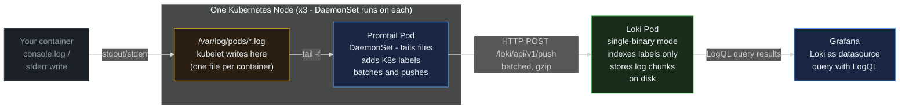
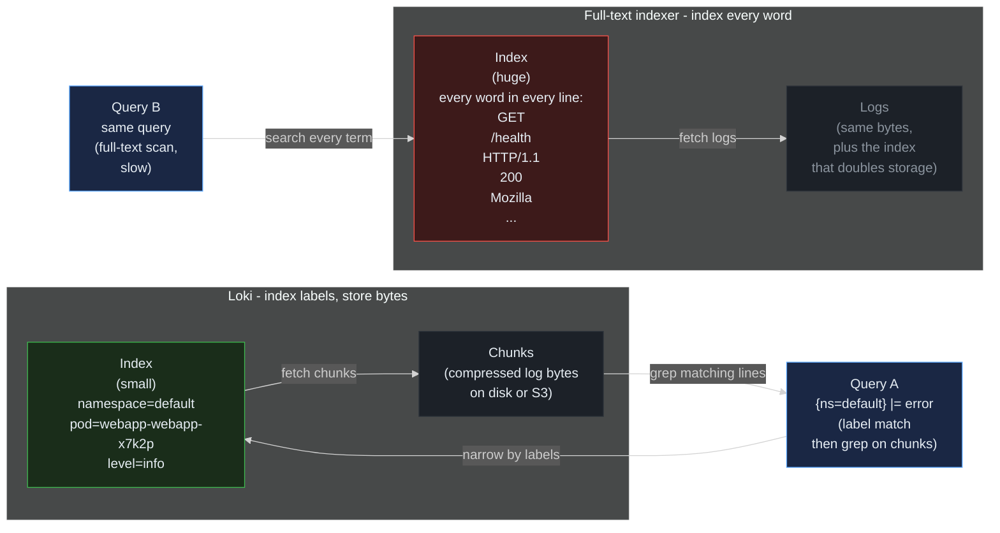
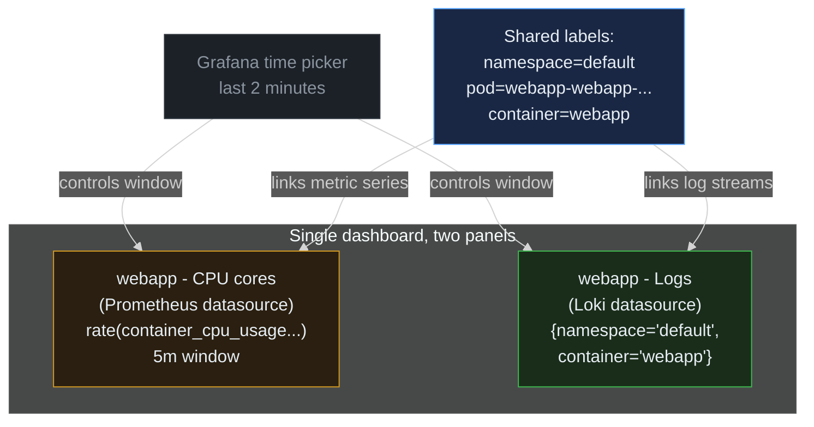

> **30 Days of DevOps** — Day 9 of 30. [← Day 8: Prometheus and Grafana](/articles/2026/05/19/day-08-prometheus-grafana/)

In [Day 8](/articles/2026/05/19/day-08-prometheus-grafana/) you watched a webapp pod's CPU spike at 14:32. That's a useful signal — but metrics alone tell you only *what* changed. To find out *why*, you need to read the log lines from those pods at that moment. Today's pod logs are also long gone if the pod restarted, because `kubectl logs` only reads from the still-running container.

The fix is **centralised logging**: ship every container's stdout/stderr off the nodes into a long-lived store, then query that store the same way you query Prometheus — by label, over a time range. We use the **Loki + Promtail** stack from Grafana Labs, because it integrates seamlessly with the Grafana you already have from Day 8.

## What you will build

By the end of this article you will have:

- **Loki** running in single-binary mode in a dedicated `loki` namespace — your cluster's log database
- **Promtail** running as a **DaemonSet** (one Pod per node) — tailing every container log file on every node and shipping the entries to Loki with Kubernetes labels attached
- **Loki added as a second Grafana datasource** alongside Prometheus from Day 8, via a labeled ConfigMap that Grafana's sidecar picks up automatically
- **LogQL queries** that filter logs by namespace and pod labels, then refine inside the matched lines (`|= "error"`, `!~ "GET /health"`)
- A **side-by-side Grafana dashboard** — the metric (Day 8's webapp CPU) on top, the matching logs from Loki on the bottom — time-aligned, so a spike in the metric points you straight at the log lines that caused it

---

## Prerequisites

This article continues from Day 8. Everything from Days 5–8 must be running: the 3-node kind cluster, the NGINX Ingress Controller, cert-manager, the webapp release, **and** the kube-prometheus-stack (Prometheus + Grafana + Alertmanager + node-exporter + kube-state-metrics) installed yesterday in the `monitoring` namespace.

Sanity check before continuing:

```bash
# -A   all namespaces
# -E   extended regex so | means "or"
kubectl get pods -A | grep -E "ingress-nginx|cert-manager|monitoring|webapp"
```

Expected output (truncated; eight kps pods + the webapp pods + ingress + cert-manager):

```text
cert-manager    cert-manager-5d8b9f7c4-aa1xy                              1/1   Running   0   1d
cert-manager    cert-manager-cainjector-7b9d4f8c6-bb2zw                   1/1   Running   0   1d
cert-manager    cert-manager-webhook-8c4d5f7b9-cc3yt                      1/1   Running   0   1d
default         webapp-webapp-6c9d8f7b5-x7k2p                             1/1   Running   0   1d
default         webapp-webapp-6c9d8f7b5-q4m9r                             1/1   Running   0   1d
ingress-nginx   ingress-nginx-controller-7d4c5f6b9-xk2vp                  1/1   Running   0   1d
monitoring      alertmanager-kps-kube-prometheus-stack-alertmanager-0     2/2   Running   0   1d
monitoring      kps-grafana-7f6c4d8b5-zh4xp                               3/3   Running   0   1d
monitoring      kps-kube-prometheus-stack-operator-6c5f8d9b4-tt8nq        1/1   Running   0   1d
monitoring      kps-kube-state-metrics-7d9c5b4f8-mm3jp                    1/1   Running   0   1d
monitoring      kps-prometheus-node-exporter-aa11x                        1/1   Running   0   1d
monitoring      kps-prometheus-node-exporter-bb22y                        1/1   Running   0   1d
monitoring      kps-prometheus-node-exporter-cc33z                        1/1   Running   0   1d
monitoring      prometheus-kps-kube-prometheus-stack-prometheus-0         2/2   Running   0   1d
```

If anything is missing, jump back to the relevant Day and rerun those install steps.

| Tool | Minimum version | Check |
|---|---|---|
| Docker | 24.x | `docker --version` |
| kubectl | 1.29 | `kubectl version --client` |
| Helm | 3.14 | `helm version --short` |
| Docker Desktop / VM RAM | **6 GiB** (8 GiB recommended) | `docker info \| grep "Total Memory"` |

The RAM precondition from Day 8 still stands — Loki adds only ~200 MiB on top of the kube-prometheus-stack footprint, so 6 GiB is still the floor.

---

## The logging pipeline

Before installing anything, understand the path a single log line takes from your container's `console.log("hello")` to a Grafana panel:



**Reading this diagram:**

Read left to right. A log line starts at the **container** (grey) — your app writes to stdout or stderr. The kubelet on the node catches both streams and writes them to **log files on disk** (amber): `/var/log/pods/<namespace>_<pod>_<uid>/<container>/0.log` — one file per container, rotated when it gets large. This is the same data `kubectl logs` reads, but written to a real filesystem so other processes can read it too. **Both the log files and Promtail live inside the per-node `NODE` box in the diagram — they're co-located on every Kubernetes worker, with Promtail reading from its host's local `/var/log/pods/`.**

**Promtail** (blue, inside the NODE subgraph) is a single-binary log shipper that runs as a **DaemonSet** — one Pod per node, no exceptions. On startup, each Promtail Pod queries the Kubernetes API to learn which containers run on its node, then tails the corresponding log files. As lines stream out of the files, Promtail attaches Kubernetes labels (`namespace`, `pod`, `container`, plus any custom labels you configure) and sends them to Loki in batched, gzipped HTTP POST requests.

**Loki** (green) is the centralised store. In single-binary mode (what we'll install today), one Pod runs every Loki component: distributor (receives pushes), ingester (writes to disk), querier (reads from disk), query frontend (splits big queries). Loki's storage design is the key trick — it **indexes the labels only**, not the log content. The actual log lines are stored as compressed chunks on a filesystem (or S3 in production). Querying by label is fast (small index) and filtering inside matched lines is "just grep". The result is a log store with a tiny operational footprint compared to full-text systems like Elasticsearch.

**Grafana** (blue) is the front end. After you add Loki as a datasource (Part 4), the same Grafana UI from Day 8 can run **LogQL** queries — Prometheus-style label selectors over logs. Same Grafana, same labels you already learned, same time picker.

The key insight: every Promtail Pod only handles its own node's logs. There's no central "log collector" that needs to scale with cluster size — adding more nodes adds more Promtail Pods automatically (because it's a DaemonSet). Loki is the only thing that scales with **total log volume**, and only with the **labels** you cardinality-bomb it with — not with raw bytes. That's why "be careful with high-cardinality labels" is the entire performance story for Loki.

---

## Part 1 — Install Loki in single-binary mode

Loki ships with multiple deployment modes — **monolithic** (single binary, ~200 MiB RAM), **simple-scalable** (three workloads: read, write, backend), and **distributed** (every component as its own Deployment, production-grade). For a learning cluster, single-binary is the right pick — it's one Pod, one StatefulSet, one persistent volume.

**What is the loki Helm chart?**
The `grafana/loki` chart from the official Grafana Helm repo. It supports all three deployment modes via the `deploymentMode` value. By default it enables the simple-scalable mode plus a memcached chunk cache plus a results cache — for a kind cluster we want none of that complexity.

Add the Grafana Helm repo:

```bash
# Register Grafana's Helm repository under the local alias 'grafana'
helm repo add grafana https://grafana.github.io/helm-charts

# Refresh the local chart index cache so 'grafana/loki' resolves
helm repo update
```

Expected output:

```text
"grafana" has been added to your repositories
Hang tight while we grab the latest from your chart repositories...
...Successfully got an update from the "grafana" chart repository
Update Complete. ⎈Happy Helming!⎈
```

Create a project directory and the Loki values file. We override the chart's defaults to switch to single-binary mode and disable every optional cache/scaling Pod the chart would otherwise create:

```bash
mkdir -p ~/30-days-devops/day-09 && cd ~/30-days-devops/day-09

cat > values-loki.yaml << 'EOF'
# Deployment mode — single Pod runs every Loki component.
# Use 'SimpleScalable' or 'Distributed' for real production.
deploymentMode: SingleBinary

loki:
  # Disable Loki's built-in multi-tenant auth. For a real cluster you'd
  # put Loki behind an auth proxy or enable its tenant header. For local
  # dev, single-tenant mode keeps the demo simple.
  auth_enabled: false

  commonConfig:
    # SingleBinary mode has one ingester replica, so replication is 1.
    replication_factor: 1

  # 'filesystem' stores chunks on the Pod's PV. In production this would
  # be S3, GCS, or Azure Blob — Loki is built around object storage.
  storage:
    type: filesystem

  # Schema config — Loki splits its index across time periods. We declare
  # a single period starting from a fixed past date so the schema covers
  # today's writes. Use 'tsdb' (the modern index format) and 'v13'
  # (the current schema version).
  schemaConfig:
    configs:
      - from: "2024-04-01"
        store: tsdb
        object_store: filesystem
        schema: v13
        index:
          prefix: loki_index_
          period: 24h

  limits_config:
    allow_structured_metadata: true
    volume_enabled: true

  pattern_ingester:
    enabled: true

# Single-binary settings: one Pod, no persistent volume for the demo
# (a real cluster would set persistence.enabled=true with a sized PVC).
singleBinary:
  replicas: 1
  persistence:
    enabled: false

# Disable every other deployment-mode workload — we're in single-binary mode.
# The chart creates these by default for SimpleScalable mode, so we turn them off.
read:
  replicas: 0
write:
  replicas: 0
backend:
  replicas: 0
chunksCache:
  enabled: false
resultsCache:
  enabled: false

# Disable the gateway (a small nginx in front of Loki for SimpleScalable mode).
# In SingleBinary mode the loki Pod is reachable directly.
gateway:
  enabled: false

# Disable canary (Loki's self-test workload — not useful for a tutorial)
lokiCanary:
  enabled: false

# Disable test pods (one-shot smoke tests the chart runs as Helm test hooks)
test:
  enabled: false
EOF
```

Now install Loki using these values:

```bash
# Install the Loki chart into a dedicated 'loki' namespace.
# --version pins the chart revision so this article stays reproducible.
# -f values-loki.yaml supplies the overrides we just wrote.
helm install loki grafana/loki \
  --namespace loki --create-namespace \
  --version 6.18.0 \
  -f values-loki.yaml
```

Expected output (truncated):

```text
NAME: loki
LAST DEPLOYED: Wed May 20 09:00:42 2026
NAMESPACE: loki
STATUS: deployed
REVISION: 1
NOTES:
***********************************************************************
 Welcome to Grafana Loki
 Chart version: 6.18.0
 Chart Name: loki
 Loki version: 3.2.0
***********************************************************************
```

Wait for the Pod to become Ready (about 60 seconds):

```bash
# -l app.kubernetes.io/name=loki   filter Pods by the standard Helm app label
# --for=condition=ready             wait for the Pod's Ready condition to be True
# --timeout=120s                    bail out after 2 minutes if not ready
kubectl wait --namespace loki \
  --for=condition=ready pod \
  -l app.kubernetes.io/name=loki \
  --timeout=120s
```

Expected output:

```text
pod/loki-0 condition met
```

Confirm the Service exists at the well-known Loki port (3100) — Promtail will push to this address in Part 2:

```bash
kubectl get svc -n loki loki
```

Expected output:

```text
NAME   TYPE        CLUSTER-IP      EXTERNAL-IP   PORT(S)              AGE
loki   ClusterIP   10.96.142.215   <none>        3100/TCP,9095/TCP    90s
```

Port `3100/TCP` is Loki's HTTP API (where Promtail pushes and Grafana queries). Port `9095/TCP` is Loki's internal gRPC port used by distributed-mode components — unused in single-binary mode but exposed by default.

---

## Part 2 — Install Promtail as a DaemonSet

Loki is now running but has no logs in it. Promtail is the missing piece: it runs on every node, tails the log files the kubelet writes, attaches labels, and ships everything to Loki.

**What is Promtail?**
A single-binary log shipper, sibling to Prometheus and Loki, written by Grafana Labs. It's deliberately simple — no buffering plugins, no complex routing — just "discover files via Kubernetes API → tail → relabel → push". This makes it tiny (~50 MiB RAM per Pod) and reliable.

> **Note for forward-looking readers:** Grafana Labs is positioning **Grafana Alloy** as the long-term replacement for Promtail (it ships not just logs but metrics and traces too). Promtail is in long-term support but still the simplest path for log-only setups. The LogQL queries you'll learn today are identical regardless of which shipper feeds Loki.

Promtail's defaults are already aware of Kubernetes — it auto-discovers Pods, reads `/var/log/pods/*.log` on each node, and pushes to a Loki Service. We only need to tell it where Loki lives.

Write the values file:

```bash
cat > values-promtail.yaml << 'EOF'
# Promtail config — minimal overrides. Defaults handle Kubernetes
# discovery and the /var/log/pods filesystem scrape automatically.
config:
  # The push URL — DNS name of the Loki Service in the loki namespace.
  # Kubernetes resolves loki-0.loki.loki.svc.cluster.local automatically
  # via the 'loki' Service. We use the simpler short form.
  clients:
    - url: http://loki.loki.svc.cluster.local:3100/loki/api/v1/push

# Run on every node — DaemonSet behavior. The chart already installs
# Promtail as a DaemonSet by default; this comment is just emphasis.
daemonset:
  enabled: true

# Promtail needs the kubelet's pod-log directory mounted. The chart's
# default volumeMount already does this — no override needed.
EOF
```

Install:

```bash
helm install promtail grafana/promtail \
  --namespace loki \
  --version 6.16.6 \
  -f values-promtail.yaml
```

Expected output:

```text
NAME: promtail
LAST DEPLOYED: Wed May 20 09:05:11 2026
NAMESPACE: loki
STATUS: deployed
REVISION: 1
NOTES:
***********************************************************************
 Welcome to Grafana Promtail
 Chart version: 6.16.6
 Promtail version: 3.0.0
***********************************************************************
Verify the application is working by running these commands:
  kubectl --namespace loki port-forward daemonset/promtail 3101
  curl http://127.0.0.1:3101/metrics
```

Confirm one Promtail Pod is running per node. The 3-node kind cluster from Day 5 means 3 Promtail Pods:

```bash
kubectl get pods -n loki -l app.kubernetes.io/name=promtail -o wide
```

Expected output:

```text
NAME             READY   STATUS    RESTARTS   AGE   IP           NODE
promtail-aa11x   1/1     Running   0          30s   10.244.1.4   devops-cluster-worker
promtail-bb22y   1/1     Running   0          30s   10.244.2.5   devops-cluster-worker2
promtail-cc33z   1/1     Running   0          30s   10.244.0.6   devops-cluster-control-plane
```

One Pod per node, each on its own node IP, each running on its host's filesystem mount of `/var/log/pods`. This is what "DaemonSet" buys you — fan-out without configuration.

Verify Promtail is actually pushing to Loki. Loki exposes a metric of how many bytes it's received; we curl it directly from inside the cluster:

```bash
# Run a one-off curl from inside the cluster to query Loki's metrics endpoint.
# 'kubectl run --rm -it' creates a temporary Pod that deletes itself on exit.
# 'curlimages/curl' is a minimal, official curl-only image.
kubectl run --rm -it tmp-curl --image=curlimages/curl --restart=Never -- \
  curl -s http://loki.loki.svc.cluster.local:3100/metrics | grep loki_distributor_bytes_received_total
```

Expected output (any non-zero number means Promtail is shipping logs):

```text
loki_distributor_bytes_received_total{tenant="fake"} 145823
```

`tenant="fake"` is Loki's single-tenant placeholder label when `auth_enabled: false` — every log line goes into this notional tenant. The number will keep growing as your cluster produces logs.

---

## Part 3 — Add Loki as a Grafana datasource

Grafana from Day 8 is running with **Prometheus** as its primary datasource. We add Loki as a second datasource so the same dashboards can query both.

There are three ways to add a datasource to Grafana:
1. **Via the UI** — Settings → Connections → Data sources → Add. Quick but manual.
2. **Via Helm values** — re-run `helm upgrade kps ...` with extra `--set` overrides. Persistent but couples logging config into the metrics chart.
3. **Via a labeled ConfigMap** — Grafana's sidecar container (`grafana-sc-datasources`, the one we saw in Day 8's `3/3 Running`) watches the cluster for ConfigMaps with a specific label and dynamically loads any datasource definitions it finds.

We use option 3 — it's the cloud-native way, keeps logging config out of the metrics chart, and doesn't require any Grafana restart.

Inspect what label the sidecar watches for:

```bash
kubectl get deployment kps-grafana -n monitoring -o jsonpath='{.spec.template.spec.containers[?(@.name=="grafana-sc-datasources")].env[?(@.name=="LABEL")].value}{"\n"}'
```

Expected output:

```text
grafana_datasource
```

Any ConfigMap in any namespace with the label `grafana_datasource=1` (the value is checked separately, defaulting to `1`) will be picked up. Create one for Loki:

```bash
cat > loki-datasource.yaml << 'EOF'
apiVersion: v1
kind: ConfigMap
metadata:
  name: loki-datasource
  # Created in the monitoring namespace so it lives alongside the Grafana
  # it configures. The sidecar watches all namespaces but namespace-local
  # placement is the convention.
  namespace: monitoring
  labels:
    # This is the label that triggers the sidecar to pick up the file.
    grafana_datasource: "1"
data:
  # The file's *contents* are a Grafana datasource definition — exactly
  # the same YAML you'd find in Grafana's provisioning/datasources/ dir.
  # Filename can be anything; convention is <name>.yaml.
  loki-datasource.yaml: |
    apiVersion: 1
    datasources:
      - name: Loki
        type: loki
        access: proxy
        # URL is the cluster-DNS path to the Loki Service. The :3100 port
        # is Loki's HTTP API endpoint (the same one Promtail pushes to).
        url: http://loki.loki.svc.cluster.local:3100
        isDefault: false
        # editable=true means an admin can tweak this in the Grafana UI
        # later (handy for adjusting timeouts without redeploying)
        editable: true
EOF

kubectl apply -f loki-datasource.yaml
```

Expected output:

```text
configmap/loki-datasource created
```

The sidecar polls every ~10 seconds. Wait a moment, then open Grafana in your browser (`https://grafana.local/` — the Ingress from Day 8). Log in (`admin` / `admin`).

Navigate **Connections → Data sources**. You should now see two entries: `Prometheus` (Day 8's, marked default) and `Loki`. Click into `Loki`, scroll to the bottom, and click **Save & test**. You should see:

```text
✓ Data source successfully connected.
```

If you get an error, see Common Errors #3 — usually a DNS typo in the URL or Loki still booting.

---

## Part 4 — Your first LogQL query

In Grafana's left sidebar, click **Explore** (compass icon). At the top-left, switch the datasource picker from **Prometheus** to **Loki**.

The query bar accepts **LogQL** — a Prometheus-inspired query language where the front part is a label selector (mandatory, same shape as PromQL) and the optional back part is a chain of filters over matched log lines.

Type this and run it:

```logql
{namespace="loki"}
```

You should see a stream of log lines from Loki and Promtail Pods themselves — they log every push, scrape configuration reload, etc. This single-selector query is the equivalent of `kubectl logs -n loki --all-containers --tail=-1`, but you also get the time range picker, label tooltips, and the ability to share the URL.

Try a few more selectors. Each uses Kubernetes labels Promtail attached automatically:

```logql
# All logs from the default namespace (your webapp pods)
{namespace="default"}

# Just webapp container logs (in case the namespace has other Pods)
{namespace="default", container="webapp"}

# Specific Pod by name (use exact match)
{namespace="default", pod="webapp-webapp-6c9d8f7b5-x7k2p"}

# All Pods in the monitoring namespace (Day 8's stack)
{namespace="monitoring"}
```

If you see no results from the webapp Pods, generate some traffic so nginx writes access lines:

```bash
# Hit the webapp a few times from your laptop
for i in 1 2 3 4 5; do
  curl --resolve webapp.local:443:127.0.0.1 -k -s -o /dev/null \
       -w "%{http_code}\n" https://webapp.local/
done
```

Expected output:

```text
200
200
200
200
200
```

Within a few seconds those access lines will appear in the `{namespace="default"}` Loki Explore view.

---

## Part 5 — LogQL pipeline filters: finding errors

The label selector narrows down to a set of log streams. Once selected, you can **pipe** lines through filters and parsers — this is where LogQL's power shows.

The four most useful pipeline operators:

| Operator | Meaning | Example |
|---|---|---|
| `|=` | line **contains** literal string | `\|= "error"` |
| `!=` | line **does not contain** literal | `!= "GET /health"` |
| `|~` | line **matches** regex | `\|~ "(?i)error\|fail"` |
| `!~` | line does **not** match regex | `!~ "GET /(health\|metrics)"` |

Useful real queries (try them all in Explore):

```logql
# Find error lines from any webapp pod
{namespace="default", container="webapp"} |= "error"

# Find error lines, case-insensitive
{namespace="default", container="webapp"} |~ "(?i)error|fail|panic"

# Exclude health-check noise (nginx logs /health every readiness probe)
{namespace="default", container="webapp"} != "GET /health"

# Stack the filters — errors, but not the boring TLS handshake ones
{namespace="default", container="webapp"}
  |= "error"
  != "SSL_do_handshake() failed"

# Find specific HTTP status codes (nginx access log)
{namespace="default", container="webapp"} |~ "\" 5\\d{2} "

# Rate of errors per minute, grouped by pod (this is LogQL "aggregations")
sum by (pod) (rate({namespace="default", container="webapp"} |= "error" [1m]))
```

That last one is special — it converts a stream of log lines into a Prometheus-style numeric metric. **LogQL aggregations** are how you build dashboard panels from log data: same Y-axis, same time picker, same panel types Grafana uses for metrics. The unit is "lines per second matching the filter".

Click the **Time picker** in the top right and zoom in on the last 5 minutes to see only recent results. Bookmark the URL — Grafana encodes the query, datasource, and time range into the link.

### Why Loki is fast even on bare-text searches



**Reading this diagram:**

Read left to right. Two log stores, the **same input data**, very different architectures.

The **Loki** side (green index, dark chunks) indexes labels only — a small, fast index that points to large chunks of compressed log bytes sitting on disk. When you run a query like `{namespace="default"} |= "error"` (blue query A), Loki first uses the label selector to narrow down to a tiny subset of chunks (maybe 50 MB out of a 500 GB store), pulls those chunks into memory, and `grep`s for "error" inside them. Two steps. The index never sees the word "error" at all.

The **full-text** side (red index, faded chunks) is what Elasticsearch and similar systems do. The index contains every word from every log line — every `GET`, every `/health`, every `Mozilla` user-agent string. Indexing is expensive (CPU on ingest), the index is bigger than the raw data, and queries are fast for arbitrary term searches because the index can answer them directly. The same query (blue query B) hits the index, finds matching log IDs, and pulls them up.

The tradeoff is in the corner case. Full-text wins when you need to find an arbitrary string across years of data — "show me every log line containing this UUID, no other filter". Loki wins for everything else, especially in modern Kubernetes setups where the labels (namespace, pod, container) are exactly the dimensions you want to query by. The index is small enough to keep in memory; chunks stay cheap to store. That's why Loki's RAM and disk footprint are typically 10-20× smaller than Elasticsearch for the same log volume.

The key insight: Loki's design assumes you almost always **start a log query with a label filter**. If you find yourself wanting "show me every log line containing X across every namespace", Loki will technically work but will be slow. Add a namespace or container filter first — same way you would in PromQL.

---

## Part 6 — Correlate metrics and logs in one dashboard

The whole point of having both Prometheus and Loki in the same Grafana is **time-aligned correlation**. Click a CPU spike in a metric panel → see the log lines from that exact pod, at that exact second. Today you build that dashboard.

Click **+ → New dashboard → + Add visualization**. Pick **Prometheus** as the datasource and paste this PromQL (it's the CPU panel from Day 8 Part 5):

```promql
sum by (pod) (rate(container_cpu_usage_seconds_total{namespace="default",pod=~"webapp-webapp-.*",container!=""}[5m]))
```

Title the panel **webapp · CPU cores**. Click **Apply**.

Click **+ Add visualization** again. This time pick **Loki** as the datasource. In the visualisation type picker on the right, change from **Time series** to **Logs**. Paste this LogQL:

```logql
{namespace="default", container="webapp"}
```

Title the panel **webapp · Logs**. Click **Apply**.

You should now see two panels on the same dashboard:
- Top: a graph of CPU usage per webapp pod over time
- Bottom: a stream of log lines from the same pods

Both panels share Grafana's global time picker. Zoom into a 1-minute window — both panels narrow to that window. Click any point on the CPU graph — Grafana highlights the corresponding moment on the log panel. This is the workflow: see a spike, scroll to the matching logs, debug.

### A realistic debugging workflow

Generate a small storm of errors:

```bash
# Hit a path the webapp doesn't have to produce 404s
for i in $(seq 1 50); do
  curl --resolve webapp.local:443:127.0.0.1 -k -s -o /dev/null \
       https://webapp.local/this-path-does-not-exist
done
```

In Grafana, on your two-panel dashboard, zoom into the last 2 minutes. The CPU panel shows a small bump. Underneath, the log panel shows the matching `GET /this-path-does-not-exist HTTP/1.1" 404` lines. Refine the LogQL to isolate just 404s:

```logql
{namespace="default", container="webapp"} |~ " 404 "
```

The log panel now shows only the 404 lines. Same window, same pods, traffic correlated to load.



**Reading this diagram:**

Read top to bottom. The top tier has two driver nodes: the **time picker** (grey) and the **shared labels** node (blue). Both sit above the dashboard subgraph and feed downward into the panels. Mermaid's TB layout places them on the same level — neither is "above" the other, they're peers feeding into the same children.

Inside the dashboard subgraph, the two panels are wired to different datasources but ask about the same things. The **CPU panel** (amber, declared first so it renders on top) queries Prometheus with PromQL filtered by `namespace="default", pod=~"webapp-webapp-.*"`. The **Logs panel** (green, below) queries Loki with LogQL filtered by `{namespace="default", container="webapp"}`. The query languages differ; the label vocabulary doesn't.

The two driver nodes do different jobs. The **time picker** controls the *when* — pick a 2-minute window once and both panels narrow to it. The **shared labels** node is the conceptual glue for the *what*: both Prometheus (via the kubelet's cAdvisor scrape on Day 8) and Loki (via Promtail's relabel config from Part 2) tag everything with the same Kubernetes labels — `namespace`, `pod`, `container`. That's why a `pod=webapp-webapp-x7k2p` series in the CPU graph maps cleanly to a `pod=webapp-webapp-x7k2p` log stream — same string, both stores.

The key insight: this is the *whole* observability story in one diagram. Metrics tell you a number went up. Logs tell you what was happening when it did. Labels are how you connect them. Spend your label-design effort wisely — once you've named your pods, containers, and namespaces well, every observability tool downstream just works.

---

## Cleanup

Today we added Loki and Promtail (a `loki` namespace) and a single ConfigMap in `monitoring`. Day 8 (Prometheus + Grafana + Alertmanager + kps stack) and Day 7 (Ingress + cert-manager + webapp) stay running for Day 10.

```bash
# Delete the Loki datasource ConfigMap (Grafana's sidecar will drop the datasource within ~10s)
kubectl delete -f loki-datasource.yaml

# Uninstall Promtail and Loki in reverse install order
helm uninstall promtail -n loki
helm uninstall loki -n loki

# Drop the dedicated namespace
kubectl delete namespace loki
```

Expected output:

```text
configmap "loki-datasource" deleted
release "promtail" uninstalled
release "loki" uninstalled
namespace "loki" deleted
```

Or, to drop the entire cluster (everything from Days 5–9):

```bash
kind delete cluster --name devops-cluster
```

---

## Common errors

### Error 1 — Loki Pod stuck `Pending` with `unbound PersistentVolumeClaim`

```text
NAME     READY   STATUS    RESTARTS   AGE
loki-0   0/1     Pending   0          3m
```

```text
kubectl describe pod loki-0 -n loki
# Events:
#   Warning  FailedScheduling  default-scheduler  0/3 nodes are available:
#   pod has unbound immediate PersistentVolumeClaim
```

**Cause:** Your `values-loki.yaml` has `singleBinary.persistence.enabled: false` — but the indentation under `singleBinary:` is wrong, so Helm reads the default (`true`) and the chart creates a PVC. The PVC then has no StorageClass to bind to (or kind's `local-path-provisioner` isn't installed in your cluster) and the Pod can never schedule.

**Fix:**

```bash
# 1. Verify YOUR cluster has a default StorageClass — kind ships local-path
#    by default but custom kind configs sometimes omit it
kubectl get storageclass
# Expected: at least one entry, ideally marked (default)

# 2. If no default StorageClass exists, install local-path-provisioner
kubectl apply -f https://raw.githubusercontent.com/rancher/local-path-provisioner/v0.0.27/deploy/local-path-storage.yaml
kubectl patch storageclass local-path -p '{"metadata":{"annotations":{"storageclass.kubernetes.io/is-default-class":"true"}}}'

# 3. OR if you genuinely want no persistence, double-check the indentation
#    in values-loki.yaml. `persistence:` must be nested UNDER `singleBinary:`
#    at exactly 2 spaces — YAML is whitespace-sensitive.
# Then re-apply:
helm upgrade loki grafana/loki -n loki -f values-loki.yaml --version 6.18.0
```

---

### Error 2 — Promtail Pods stuck `CrashLoopBackOff` immediately after install

```text
NAME             READY   STATUS             RESTARTS   AGE
promtail-aa11x   0/1     CrashLoopBackOff   3          2m
```

```text
kubectl logs -n loki promtail-aa11x --previous
# level=error msg="error creating positions file" file=/run/promtail/positions.yaml
# error="open /run/promtail/positions.yaml: permission denied"
```

**Cause:** Promtail writes a "positions" file that tracks where it last read each log file. The default mount path can have permission mismatches on some kind versions where the kubelet's `/var/log` mount is read-only.

**Fix:**

```bash
# Check the Promtail Pod's volume mounts
kubectl get pod -n loki -l app.kubernetes.io/name=promtail -o yaml \
  | grep -A 5 volumeMounts

# Most reliable fix: re-install with the chart's defaults
# (the defaults handle kind/Minikube/EKS path differences automatically)
helm uninstall promtail -n loki
helm install promtail grafana/promtail -n loki \
  --version 6.16.6 \
  --set "config.clients[0].url=http://loki.loki.svc.cluster.local:3100/loki/api/v1/push"
```

---

### Error 3 — Grafana shows `Loki` datasource but `Save & test` fails

```text
HTTP Error Not Found
```

**Cause:** Either the URL in the ConfigMap is wrong (typo in the FQDN), or Loki's Service isn't reachable from Grafana's namespace (network policy blocking), or Loki is still starting up and not yet listening on port 3100.

**Fix:**

```bash
# Confirm Loki is reachable from inside the cluster
kubectl run --rm -it tmp-curl --image=curlimages/curl --restart=Never -- \
  curl -s -o /dev/null -w "%{http_code}\n" \
  http://loki.loki.svc.cluster.local:3100/ready

# Expected: 200
# If 503: Loki is starting up — wait 30s and retry
# If timeout: Service is wrong namespace or name; check `kubectl get svc -n loki`

# Inspect the datasource URL Grafana actually sees
kubectl get cm -n monitoring loki-datasource -o yaml | grep url
```

---

### Error 4 — LogQL query returns no data, but you know logs exist

```text
"No logs found"
```

**Cause:** Most commonly one of three things — (a) the time range in the picker is wrong (look in the future or before logs started), (b) the label selector has a typo, (c) Promtail is running but not yet caught up on backlog.

**Fix:**

```bash
# Check Promtail metrics — has it actually sent any bytes?
kubectl port-forward -n loki ds/promtail 3101:3101 &
curl -s http://localhost:3101/metrics | grep promtail_sent_bytes_total
# Should be > 0 and growing

# Check Loki has any data
kubectl run --rm -it tmp-curl --image=curlimages/curl --restart=Never -- \
  curl -s "http://loki.loki.svc.cluster.local:3100/loki/api/v1/label/namespace/values"
# Should return a JSON array of namespaces seen — at minimum
# {"status":"success","data":["loki"]}

# In Grafana Explore, click the "Labels" button (the </> next to the query
# bar) to see the label values Loki actually has. If your label is missing,
# the selector is wrong.
```

---

### Error 5 — `parse error: unexpected $end` in LogQL

```text
parse error at line 1, col 28: unexpected $end, expecting } or ,
```

**Cause:** LogQL's label selector must always be enclosed in `{}`. The most common typo is opening with `{` and forgetting to close, e.g. `{namespace="default"` instead of `{namespace="default"}`.

**Fix:** Re-read the selector. Every `{` needs a matching `}`. Every `=` needs `"`-quoted values. Three syntactically correct shapes:

```logql
{namespace="default"}
{namespace="default", container="webapp"}
{namespace="default"} |= "error"
```

---

### Error 6 — Too many active streams: cardinality explosion

```text
Maximum active stream limit exceeded, reduce the number of active streams
(reduce labels or increase the limit)
```

**Cause:** A "stream" in Loki is a unique combination of label values. If you accidentally use a high-cardinality field as a label (e.g. labelling each log line with a request ID), every line becomes its own stream — and Loki refuses to scale that way.

**Fix:**

```bash
# Inspect what labels Promtail is attaching. The Promtail config lives
# inside the ConfigMap's data as a single YAML string under the key
# "promtail.yaml" — extract that key explicitly rather than greping the
# whole ConfigMap YAML, which would also match the outer envelope.
kubectl get cm -n loki promtail \
  -o jsonpath='{.data.promtail\.yaml}' | grep -A 30 scrape_configs

# Common offender: a relabel_config that promotes a per-request field
# to a label. Promote it to a "structured metadata" field instead
# (Loki 3.0+ supports this — fields that travel WITH the line but
# don't index it).
```

The "low-cardinality labels, high-cardinality content" rule is the most important Loki guideline. Keep `namespace`, `pod`, `container`, `level` as labels; keep `request_id`, `user_id`, `trace_id` inside the log line as JSON fields you `| json` extract at query time.

---

## What you built

In this article you:

- Installed **Loki in single-binary mode** into a dedicated `loki` namespace via the official `grafana/loki` Helm chart, with a minimal values file disabling every Pod that isn't needed for SingleBinary mode
- Installed **Promtail as a DaemonSet** (3 Pods, one per node) that auto-discovers every container log via the Kubernetes API and ships to Loki with full label enrichment
- Wired Loki into the existing Grafana from Day 8 by writing a **labeled ConfigMap** that Grafana's sidecar picked up automatically — no Grafana restart, no chart re-install
- Wrote **LogQL queries** from the simplest selector (`{namespace="default"}`) up through pipeline filters (`|=`, `!=`, `|~`, `!~`) and ended on an aggregation that converts log lines into a numeric metric
- Built a **two-panel Grafana dashboard** that pairs a Prometheus CPU metric with the matching Loki log stream — the workflow every cluster operator needs

You also met three new concepts that come up in every production cluster:
- **DaemonSet semantics** — one Pod per node, scaling with the cluster
- **Labels vs structured metadata** in Loki — and the "low-cardinality labels, high-cardinality content" rule
- **Sidecar-driven config** — the `grafana_datasource: "1"` ConfigMap pattern as a way to dynamically extend Grafana without redeploys

```text
~/30-days-devops/day-09/
├── values-loki.yaml          # SingleBinary mode, filesystem storage, no caches
├── values-promtail.yaml      # Points at the in-cluster Loki Service
└── loki-datasource.yaml      # Labeled ConfigMap for the Grafana sidecar
```

---

## Day 10 — GitOps with Argo CD: deployments straight from Git

You've now built (Days 1–7) and observed (Days 8–9) a real cluster. The next layer is **automation**: making the running cluster reconcile itself against a Git repository instead of `kubectl apply`-by-hand.

In Day 10 you will:

- Install **Argo CD** in its own namespace via the official Helm chart
- Expose Argo CD's UI through the Ingress + cert-manager pipeline at `argocd.local`
- Take the **Day 6 Helm chart** (still on your laptop, never committed anywhere) and push it to a real Git repo
- Wire an Argo CD **Application** resource pointing at that repo + chart
- Watch Argo CD detect drift when you `kubectl scale` and **auto-heal** the cluster back to Git's declared state
- Promote a change from dev to prod by editing a values file in Git — no `helm upgrade` needed, ever again

[Day 10 coming soon →]
