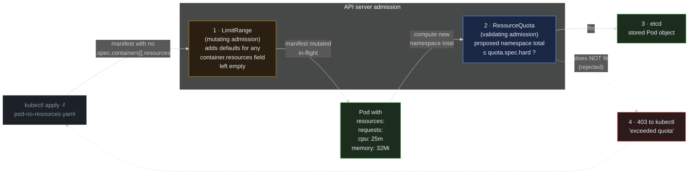

> **30 Days of DevOps** — Day 15 of 30. [← Day 14: Pod Security Standards](/articles/2026/05/19/day-14-pod-security-standards/)

A namespace without resource governance is a runaway tenant waiting to happen. A misconfigured `replicaCount`, an HPA tuned too aggressively, a developer who forgets to set `resources.limits` and ships a workload with a memory leak — any of these can starve every other workload sharing the node. Day 12 added per-Pod CPU requests so the HPA could scale; nothing yet stops the namespace's *aggregate* footprint from growing without limit.

Two built-in admission controllers solve this together:

- **`ResourceQuota`** caps the namespace's total consumption. Total CPU requests across all Pods. Total memory limits. Total Pod count. Total Service count. Total Secret count. Once the cap is hit, the next Pod admission is rejected at the API server — same hardness as Pod Security Admission from Day 14, same 403 to the client, never reaches etcd.
- **`LimitRange`** sets defaults and bounds for individual container resource fields. A Pod submitted with no `resources.requests` block gets the LimitRange's defaults injected during admission. A Pod that asks for more than the LimitRange's max value is rejected. The two objects compose: LimitRange fills in the Pod's request, ResourceQuota then decides whether the namespace can afford it.

Together they convert a shared cluster from "whoever ships first wins" into a budgeted environment where every workload declares its size and the total is held under a cap.

## What you will build

By the end of this article you will have:

- A `LimitRange` resource in the `default` namespace that **defaults every container to `cpu: 25m / memory: 32Mi` requests** and **`cpu: 100m / memory: 128Mi` limits** — so any future Pod that forgets `resources:` still gets sane numbers
- A `ResourceQuota` resource in the same namespace that caps **total `requests.cpu: 500m`, `requests.memory: 1Gi`, `limits.cpu: 1000m`, `limits.memory: 2Gi`, 10 Pods, and 5 Services**
- A clear mental model of **where each one sits in the admission chain**: LimitRange in mutating admission (fills defaults), ResourceQuota in validating admission (checks totals)
- A live demo of **a Pod with no `resources:` block** being admitted with the LimitRange defaults injected
- A live demo of **a Pod whose requests exceed the LimitRange max** being rejected at admission
- A live demo of **a Pod whose requests would push the namespace total over the ResourceQuota** being rejected at admission with the exact field and overage in the error message
- A walkthrough of **how the HPA from Day 12 interacts with the quota** — and the failure mode where a quota that is too tight silently caps autoscaling below `maxReplicas`

---

## How LimitRange and ResourceQuota compose

Two admission stages, one Pod, one decision.



**Reading this diagram:**

Read left to right. Every Pod submitted to a namespace that has a `LimitRange` and a `ResourceQuota` travels this path, exactly once, in the same admission request that `kubectl apply` initiated.

**Step 1, LimitRange (amber).** Mutating admission. The LimitRange controller looks at every container in the incoming Pod and, for any `resources.requests` or `resources.limits` field that is empty, fills in the LimitRange's `default` or `defaultRequest` values. The mutation happens *in-flight* — the Pod manifest the API server now sees has fully populated resource fields, even though the file on disk did not. The user does not know this happened unless they `kubectl get pod -o yaml` after the fact.

**Step 2, ResourceQuota (blue).** Validating admission. The ResourceQuota controller computes the **proposed new namespace total** — the current sum of all Pods' requests plus the requests of the Pod being admitted. It compares each tracked resource against `spec.hard` in the matching ResourceQuota. If every value fits, the answer is "admit"; if any single field overshoots, the answer is "reject."

The diagram shows the mutation arrow going *through* the green Pod node — that is intentional. The Pod object is the same object before and after mutation; only the resources fields changed.

**Step 3, etcd write (green).** Reached only if both controllers said yes. The Pod becomes a persisted object, the scheduler picks it up, the kubelet starts the container, and (importantly) the ResourceQuota's *used* counters tick up to reflect the new total. Querying `kubectl describe quota` from this moment forward shows the new usage.

**Step 4, the rejection path (dotted red, back to the user).** If ResourceQuota refuses, the request returns 403 with a body that names which field went over and by how much. The Pod was never created. The LimitRange mutation is discarded along with the rest of the request — there is no "partially applied" state.

The key insight: **LimitRange and ResourceQuota are not redundant**. They occupy different stages. LimitRange exists to make the next step possible — a Pod with no requests cannot be checked against a `requests.cpu` quota because there is no number to compare. Without LimitRange, every Pod in the namespace would have to explicitly declare its requests, or the quota check on it would silently treat the request as zero (early Kubernetes behaviour, deprecated). With LimitRange, the default is enforced before validation runs, so the contract is: every Pod has a number, every number is bounded.

---

## Prerequisites

This article continues directly from Day 14. Required state:

- The `devops-cluster` kind cluster running with Argo CD managing the `gitops-webapp` repo
- The webapp Deployment from Day 14 running under the unprivileged image, satisfying the `restricted` Pod Security profile
- The `default` namespace labelled with `pod-security.kubernetes.io/enforce: restricted` (Day 14)
- The HPA from Day 12 (2–6 replicas, CPU target 60 %)

Pre-flight check:

```bash
# Confirm webapp is healthy and the PSS label from Day 14 is still in place
kubectl get application -n argocd webapp
kubectl get ns default -L pod-security.kubernetes.io/enforce

# Confirm there is no existing LimitRange or ResourceQuota in default
kubectl get limitrange,resourcequota -n default
```

Expected output:

```text
NAME     SYNC STATUS   HEALTH STATUS
webapp   Synced        Healthy

NAME      STATUS   AGE   ENFORCE
default   Active   5h    restricted

No resources found in default namespace.
```

The third command's "No resources found" line is the starting point — Day 15 fills it in.

| Tool | Minimum version | Check |
|---|---|---|
| kubectl | 1.29 | `kubectl version --client` |
| Helm | 3.14 | `helm version --short` |
| gh CLI | 2.x | `gh --version` |

---

## Part 1 — Audit current resource usage

Before capping anything, see what the namespace is actually consuming. Two views matter: the per-Pod runtime view (CPU/memory the Pods are using right now, via metrics-server from Day 12) and the *declared* view (the sum of `resources.requests` across all Pods, which is what ResourceQuota cares about).

```bash
# Live runtime usage — what metrics-server is reporting RIGHT NOW
kubectl top pods -n default

# Declared usage — what every Pod ASKED for in its manifest
# This is the number ResourceQuota will track.
kubectl get pods -n default \
  -o jsonpath='{range .items[*]}{.metadata.name}{"  cpu="}{.spec.containers[0].resources.requests.cpu}{"  mem="}{.spec.containers[0].resources.requests.memory}{"\n"}{end}'
```

Expected output:

```text
NAME                            CPU(cores)   MEMORY(bytes)
webapp-webapp-6c9d8f7b5-x7k2p   1m           5Mi
webapp-webapp-6c9d8f7b5-q4m9r   1m           5Mi

webapp-webapp-6c9d8f7b5-x7k2p  cpu=25m  mem=32Mi
webapp-webapp-6c9d8f7b5-q4m9r  cpu=25m  mem=32Mi
```

Two webapp Pods declaring 25m / 32Mi each — 50m / 64Mi total declared, with actual runtime usage at 1m / 5Mi per Pod. The HPA from Day 12 can scale this to 6 Pods, so the upper bound of declared usage is 150m / 192Mi. Our ResourceQuota cap of 500m / 1Gi leaves ample headroom — by design, so the article's HPA-vs-quota demo can hit the cap deliberately rather than accidentally.

---

## Part 2 — Apply a `LimitRange`

LimitRange goes first because the ResourceQuota in Part 3 will track `requests.cpu` and `requests.memory` — every Pod admitted into the namespace from that moment must have those fields, or the quota check has nothing to evaluate.

Create the manifest:

```bash
mkdir -p ~/30-days-devops/day-15 && cd ~/30-days-devops/day-15

cat > limit-range.yaml << 'EOF'
apiVersion: v1
kind: LimitRange
metadata:
  name: default-container-limits
  namespace: default
spec:
  limits:
    # type: Container means these defaults/bounds apply per container.
    # (LimitRange also supports type: Pod, type: PersistentVolumeClaim.)
    - type: Container
      # If a container declares no requests, fill these in.
      defaultRequest:
        cpu: 25m
        memory: 32Mi
      # If a container declares no limits, fill these in.
      default:
        cpu: 100m
        memory: 128Mi
      # The container's requests/limits, after any defaulting, must
      # be ≤ these values, or admission is refused.
      max:
        cpu: 500m
        memory: 512Mi
      # And ≥ these values. Keeps a tenant from declaring 0.
      min:
        cpu: 5m
        memory: 8Mi
EOF

kubectl apply -f limit-range.yaml
```

Expected output:

```text
limitrange/default-container-limits created
```

Verify by inspecting the LimitRange's effect on a brand-new Pod that ships with **no `resources:` block at all**. The Pod still needs the `restricted` PSS context from Day 14 — that is unchanged — but it deliberately omits resources:

```bash
cat > pod-no-resources.yaml << 'EOF'
apiVersion: v1
kind: Pod
metadata:
  name: defaulted
  namespace: default
spec:
  # PSS restricted is enforced on default since Day 14; these fields are required.
  securityContext:
    runAsNonRoot: true
    runAsUser: 1000
    seccompProfile:
      type: RuntimeDefault
  containers:
    - name: app
      image: busybox:1.36
      command: ["sleep", "3600"]
      securityContext:
        allowPrivilegeEscalation: false
        readOnlyRootFilesystem: true
        capabilities:
          drop: [ALL]
      # Deliberately no resources block — LimitRange will fill it in.
EOF

kubectl apply -f pod-no-resources.yaml
```

Expected output:

```text
pod/defaulted created
```

Now inspect what the API server actually stored — the file we wrote had no resources block, the live Pod object does:

```bash
kubectl get pod defaulted -n default \
  -o jsonpath='{.spec.containers[0].resources}{"\n"}'
```

Expected output:

```json
{"limits":{"cpu":"100m","memory":"128Mi"},"requests":{"cpu":"25m","memory":"32Mi"}}
```

The defaults are present even though they were never in the file. The LimitRange's mutating admission stamped them in before the Pod was persisted.

Confirm the bounds are enforced in the other direction — a Pod with explicit requests larger than `max` is rejected:

```bash
cat > pod-too-big.yaml << 'EOF'
apiVersion: v1
kind: Pod
metadata:
  name: too-big
  namespace: default
spec:
  securityContext:
    runAsNonRoot: true
    runAsUser: 1000
    seccompProfile:
      type: RuntimeDefault
  containers:
    - name: app
      image: busybox:1.36
      command: ["sleep", "3600"]
      securityContext:
        allowPrivilegeEscalation: false
        readOnlyRootFilesystem: true
        capabilities:
          drop: [ALL]
      resources:
        requests:
          cpu: 700m     # exceeds LimitRange max of 500m
          memory: 32Mi
EOF

kubectl apply -f pod-too-big.yaml
```

Expected output:

```text
Error from server (Forbidden): error when creating "pod-too-big.yaml": pods "too-big" is forbidden: [maximum cpu usage per Container is 500m, but request is 700m]
```

A 403 at admission, the exact field and overage spelled out, no Pod ever created. Clean up the test Pods before moving on:

```bash
kubectl delete pod defaulted too-big -n default --ignore-not-found
```

---

## Part 3 — Apply a `ResourceQuota`

With LimitRange ensuring every container declares numbers, the ResourceQuota can safely cap totals.

```bash
cat > resource-quota.yaml << 'EOF'
apiVersion: v1
kind: ResourceQuota
metadata:
  name: default-namespace-quota
  namespace: default
spec:
  hard:
    # Aggregate requests across all Pods in the namespace.
    # webapp at maxReplicas: 6 declares 6 × 25m = 150m — well below 500m.
    requests.cpu: "500m"
    requests.memory: "1Gi"
    # Aggregate limits — the upper bound the kubelet will let usage burst to.
    limits.cpu: "1000m"
    limits.memory: "2Gi"
    # Object-count caps. webapp + HPA + Argo CD's drift-detection probe Pods
    # all show up here. 10 leaves comfortable headroom.
    pods: "10"
    services: "5"
    # Storage / config object caps — uncomment if relevant to your setup.
    # persistentvolumeclaims: "0"
    # secrets: "10"
    # configmaps: "10"
EOF

kubectl apply -f resource-quota.yaml
```

Expected output:

```text
resourcequota/default-namespace-quota created
```

`kubectl describe quota` shows current usage vs the hard cap in real time:

```bash
kubectl describe quota default-namespace-quota -n default
```

Expected output:

```text
Name:            default-namespace-quota
Namespace:       default
Resource         Used   Hard
--------         ----   ----
limits.cpu       100m   1
limits.memory    128Mi  2Gi
pods             2      10
requests.cpu     50m    500m
requests.memory  64Mi   1Gi
services         1      5
```

Two webapp Pods consuming 50m / 64Mi of requests, with the chart's 50m / 64Mi per-Pod *limits* doubling those rows to 100m / 128Mi. The numbers update on every admission — there is no polling lag.

---

## Part 4 — Demonstrate enforcement

Two failure modes worth seeing directly: an over-budget Pod, and the more subtle "I declared a giant Pod that LimitRange cannot save."

**Demo 1: a single Pod that would push namespace total over the cap.**

Try to apply a Pod with `requests.cpu: 600m` — by itself, that is 100m over the namespace cap of 500m even before adding to the existing 50m:

```bash
cat > pod-greedy.yaml << 'EOF'
apiVersion: v1
kind: Pod
metadata:
  name: greedy
  namespace: default
spec:
  securityContext:
    runAsNonRoot: true
    runAsUser: 1000
    seccompProfile:
      type: RuntimeDefault
  containers:
    - name: app
      image: busybox:1.36
      command: ["sleep", "3600"]
      securityContext:
        allowPrivilegeEscalation: false
        readOnlyRootFilesystem: true
        capabilities:
          drop: [ALL]
      resources:
        requests:
          cpu: 600m         # alone, exceeds the namespace quota of 500m
          memory: 32Mi
        limits:
          cpu: 600m
          memory: 64Mi
EOF

kubectl apply -f pod-greedy.yaml
```

Expected output:

```text
Error from server (Forbidden): error when creating "pod-greedy.yaml": pods "greedy" is forbidden: exceeded quota: default-namespace-quota, requested: requests.cpu=600m, used: requests.cpu=50m, limited: requests.cpu=500m
```

The error names the exact quota object (`default-namespace-quota`), the field (`requests.cpu`), what the request added (`600m`), what was already used (`50m`), and what the cap is (`500m`). Combined: `50m + 600m = 650m` — over `500m` — rejected.

**Demo 2: a fleet of small Pods that aggregates over the cap.**

The previous demo failed on a single-Pod overshoot. The other classic failure is many small Pods adding up. Apply six 100m Pods one after another — the namespace was at 50m, so the seventh (or maybe sixth, depending on rounding) gets refused:

```bash
for i in 1 2 3 4 5 6; do
  cat <<EOF | kubectl apply -f - 2>&1 | tail -1
apiVersion: v1
kind: Pod
metadata:
  name: filler-$i
  namespace: default
spec:
  securityContext:
    runAsNonRoot: true
    runAsUser: 1000
    seccompProfile:
      type: RuntimeDefault
  containers:
    - name: app
      image: busybox:1.36
      command: ["sleep", "3600"]
      securityContext:
        allowPrivilegeEscalation: false
        readOnlyRootFilesystem: true
        capabilities:
          drop: [ALL]
      resources:
        requests:
          cpu: 100m
          memory: 32Mi
        limits:
          cpu: 100m
          memory: 64Mi
EOF
done
```

Expected output (truncated to the last line of each apply):

```text
pod/filler-1 created
pod/filler-2 created
pod/filler-3 created
pod/filler-4 created
pod/filler-5 created
Error from server (Forbidden): error when creating "STDIN": pods "filler-6" is forbidden: exceeded quota: default-namespace-quota, requested: requests.cpu=100m, used: requests.cpu=550m, limited: requests.cpu=500m
```

Five of six created, the sixth refused. Inspect the live quota state:

```bash
kubectl describe quota default-namespace-quota -n default
```

Expected output:

```text
Name:            default-namespace-quota
Namespace:       default
Resource         Used   Hard
--------         ----   ----
limits.cpu       600m   1
limits.memory    448Mi  2Gi
pods             7      10
requests.cpu     550m   500m
requests.memory  224Mi  1Gi
services         1      5
```

`requests.cpu: 550m` is **over** the hard cap of `500m`. ResourceQuota does not retroactively kill Pods to bring usage back under the cap — it only blocks *future* admissions. The over-cap state is a result of historical admissions plus an externally introduced change (someone tightened the cap). It is informational, not fatal, and it signals "deny any further admission" until enough Pods are removed.

Clean up the filler Pods (explicit names — safer than `-l` against the default namespace, which also holds the webapp workload):

```bash
kubectl delete pod -n default \
  filler-1 filler-2 filler-3 filler-4 filler-5 \
  --ignore-not-found
```

Confirm the quota usage drops:

```bash
kubectl describe quota default-namespace-quota -n default | grep -E 'requests.cpu|pods'
```

Expected output:

```text
pods             2      10
requests.cpu     50m    500m
```

Back to baseline. The 550m → 50m change is immediate; ResourceQuota recomputes on every Pod admission and deletion.

---

## Part 5 — HPA × ResourceQuota: the silent autoscaling cap

This is the most important interaction to understand because the failure is **invisible by default**. The HPA from Day 12 thinks it can scale the webapp Deployment to 6 replicas. If the ResourceQuota leaves headroom for fewer than 6 (because other workloads are using the namespace too, or because the cap is simply too tight), the HPA's request to scale to 6 is *partially* succeeded: the ReplicaSet's attempts at creating the extra Pods are rejected by the quota, but the HPA's `spec.maxReplicas` and the Deployment's `spec.replicas` show the *intended* count, not the *achieved* one.

Reproduce this on purpose. Tighten the quota temporarily:

```bash
# Patch the quota to 100m requests.cpu. The math:
#   2 baseline webapp Pods × 25m  = 50m
#   1 k6 Pod (LimitRange default) × 25m = 25m
#   ⇒ 75m used before HPA fires. 25m of headroom = exactly one more
#     webapp Pod (3 total). HPA wants 6 — the 4th, 5th, 6th get rejected.
kubectl patch resourcequota default-namespace-quota -n default --type=merge \
  -p '{"spec":{"hard":{"requests.cpu":"100m"}}}'
```

Expected output:

```text
resourcequota/default-namespace-quota patched
```

Apply the k6 load Job from Day 12 (it consumes 100m on its own when running). Its Pod is already
hardened for the `restricted` profile, so it admits cleanly into the locked-down namespace from
Day 14, and the LimitRange stamps a `25m` request onto it:

```bash
kubectl apply -f ~/30-days-devops/day-12/k6-load.yaml
```

Expected output:

```text
configmap/k6-script unchanged
job.batch/k6-load created
```

Wait ~60 seconds for the HPA to react, then watch:

```bash
kubectl get hpa,pod -n default -l app.kubernetes.io/instance=webapp
kubectl describe quota default-namespace-quota -n default
```

Expected output:

```text
NAME                                                REFERENCE                  TARGETS         MINPODS   MAXPODS   REPLICAS   AGE
horizontalpodautoscaler.autoscaling/webapp-webapp   Deployment/webapp-webapp   cpu: 152%/60%   2         6         6          3d

NAME                                READY   STATUS    RESTARTS   AGE
pod/webapp-webapp-6c9d8f7b5-x7k2p   1/1     Running   0          1d
pod/webapp-webapp-6c9d8f7b5-q4m9r   1/1     Running   0          1d
pod/webapp-webapp-6c9d8f7b5-aa1tt   1/1     Running   0          90s

# (3 of the intended 6 replicas — but the HPA reports REPLICAS: 6)

Name:            default-namespace-quota
Resource         Used   Hard
--------         ----   ----
requests.cpu     100m   100m
```

The HPA claims `REPLICAS: 6`. The Deployment's status agrees. The webapp Pod count is **3** (75m), plus the k6 Pod (25m) — quota is **exactly at the cap** (100m of 100m). The 4th, 5th, and 6th webapp Pods the HPA asked for were rejected by the quota controller at admission.

Find the missing Pods in the ReplicaSet events:

```bash
RS=$(kubectl get rs -n default -l app.kubernetes.io/instance=webapp \
  -o jsonpath='{.items[?(@.spec.replicas>0)].metadata.name}')
kubectl describe rs -n default "$RS" | tail -15
```

Expected output:

```text
Events:
  Type     Reason         Age   From                   Message
  ----     ------         ----  ----                   -------
  Warning  FailedCreate   30s   replicaset-controller  Error creating: pods "webapp-webapp-..." is forbidden: exceeded quota: default-namespace-quota, requested: requests.cpu=25m, used: requests.cpu=100m, limited: requests.cpu=100m
  Warning  FailedCreate   15s   replicaset-controller  Error creating: pods "webapp-webapp-..." is forbidden: exceeded quota: ...
```

The ReplicaSet controller is the one taking the rejection, not kubectl — which is why nothing surfaces in `kubectl get pods` and why Day 14's Common Errors #1 explicitly told you to check `kubectl describe rs` when scale-up "fails silently." Same failure mode, different cause: PSA on Day 14, ResourceQuota today.

Restore the original quota and clean up the k6 Job:

```bash
kubectl patch resourcequota default-namespace-quota -n default --type=merge \
  -p '{"spec":{"hard":{"requests.cpu":"500m"}}}'
kubectl delete job k6-load -n default
```

Expected output:

```text
resourcequota/default-namespace-quota patched
job.batch "k6-load" deleted
```

Within ~30 seconds the HPA observes the load drop and scales the Deployment back toward `minReplicas: 2`, and the namespace settles.

---

## Common Errors

**1. `must specify cpu` on Pod creation, even though the chart's Pod template has `resources:` set**

```text
Error from server (Forbidden): pods "test" is forbidden: failed quota: default-namespace-quota: must specify cpu, memory
```

Cause: the ResourceQuota is tracking `requests.cpu` / `requests.memory`, but the Pod was submitted with **no `resources.requests` block at all** AND there is **no LimitRange** in the namespace (or the LimitRange covers a different `type:` — for example, only `type: Pod` when the namespace has containers without resources set).

Fix:

```bash
# Make sure a Container-scoped LimitRange exists for this namespace
kubectl get limitrange -n default -o jsonpath='{.items[*].spec.limits[*].type}{"\n"}'
# Must include "Container"
```

If missing, apply the LimitRange from Part 2.

**2. The webapp Deployment's HPA shows `REPLICAS: 6` but only 3 Pods are running**

Symptom: HPA dashboards look healthy, Service has fewer endpoints than expected, traffic is unevenly served.

Cause: ResourceQuota cap reached. The ReplicaSet keeps trying to create the missing Pods; each attempt is refused by the quota controller. The HPA's status is computed from the Deployment's *desired* replica count, not from Pod count.

Fix: see Part 5. `kubectl describe rs <rs-name>` shows the `FailedCreate` events with the quota overage spelled out. Either loosen the quota or lower the HPA's `maxReplicas` to fit.

**3. `kubectl describe quota` shows `Used` greater than `Hard`**

Symptom: a `Used` value exceeds the `Hard` cap, but the cluster does not appear unhealthy.

Cause: this is expected when the quota was tightened *after* the namespace already exceeded the new limit. ResourceQuota does not retroactively delete Pods — it only refuses *future* admissions until usage drops back below.

Fix: either delete enough Pods to bring `Used` under `Hard`, or restore the previous (larger) quota with `kubectl patch`.

**4. LimitRange defaults are not applied, even though the LimitRange exists**

Symptom: a Pod submitted with no `resources:` block has no defaults populated; `kubectl get pod -o yaml` shows an empty resources field.

Cause: the LimitRange's `spec.limits[].type` does not match. The most common mistake is using `type: Pod` when defaults should be `type: Container`. The `Pod` type sums all containers' requests; the `Container` type sets defaults *per container*. They are not interchangeable.

Fix:

```bash
kubectl get limitrange <name> -n default -o yaml | grep type
# Must include `type: Container` for per-container defaults
```

**5. `must not exceed kube-apiserver max-mutating-requests-inflight` on a sudden burst of Pod creations**

Symptom: many Pods being created in parallel, some return 429 Too Many Requests instead of 403 Forbidden.

Cause: not a ResourceQuota error — this is the API server's flow-control rate-limiting kicking in. ResourceQuota uses optimistic locking on the quota object (every admission RMWs it), so a burst of parallel admissions can hit lock contention.

Fix: add a small delay between bulk creations, or use a single bulk-apply (`kubectl apply -f pods.yaml` containing all manifests) instead of a tight loop of separate `kubectl apply` invocations.

**6. The `requests.storage` / PVC quotas don't seem to do anything**

Symptom: applying a PVC after setting `persistentvolumeclaims: "0"` in the quota — the PVC is admitted anyway.

Cause: PVC quota counts only PVCs in the namespace. If the PVC was created *before* the quota was applied (or in a different namespace), it does not count. Also: many StorageClasses bind dynamically, so the quota tracks the *claim* not the underlying PV.

Fix: confirm timing with `kubectl get pvc -n default` and check the storage class matters for storage-quota scoping:

```bash
# Per-StorageClass quota:
kubectl describe quota default-namespace-quota -n default | grep storageclass
```

---

## Recap

In this article you:

- Walked through how **`LimitRange`** (mutating admission) and **`ResourceQuota`** (validating admission) compose to turn a namespace from "unbounded" into "budgeted" — both built-in controllers, no add-ons required
- Applied a `LimitRange` to the `default` namespace setting **per-container defaults** (`cpu: 25m / memory: 32Mi` requests, `100m / 128Mi` limits) and **per-container max** (`500m / 512Mi`)
- Applied a `ResourceQuota` capping the namespace at **`requests.cpu: 500m`, `requests.memory: 1Gi`, `limits.cpu: 1000m`, `limits.memory: 2Gi`, 10 Pods, 5 Services** — with `kubectl describe quota` showing live usage against caps
- Demonstrated three distinct enforcement paths:
  - A Pod with **no resources block** admitted with defaults injected by LimitRange
  - A Pod whose explicit request **exceeds the LimitRange max** rejected at admission
  - A Pod whose request **fits LimitRange but pushes the namespace over the ResourceQuota** rejected at admission
- Reproduced the **HPA × Quota silent-cap interaction**: tightened the quota, ran k6 load, watched the HPA report `REPLICAS: 6` while only 3 Pods were running, and found the missing Pods' rejection events on the ReplicaSet (the same place Day 14 told you to look when PSA blocks scale-up)
- Learned six common failure modes — including the "Used > Hard" diagnostic, missing-LimitRange-type bugs, and API-server flow-control 429s under bulk admission

The cluster's `default` namespace is now a **bounded multi-tenant unit**: every Pod has declared its size, and the total cannot grow past the cap.

---

## What's next

[Day 16: PodDisruptionBudgets — Keep at Least N Pods Running Across Drains and Rollouts →](/articles/2026/05/27/day-16-pod-disruption-budgets/)

On Day 16 you will turn from *capping* the namespace to *protecting* the workload. A `PodDisruptionBudget` tells the cluster: "at any moment, at least N webapp Pods must be Ready — refuse voluntary disruptions (node drains, eviction API calls, cluster-autoscaler scale-downs) that would drop below that floor." You will add a PDB to the webapp Helm chart with `minAvailable: 50%`, then run `kubectl drain` on one of the kind nodes and watch the eviction API back off cleanly when the PDB would be violated — turning rolling-node maintenance from a coordination headache into a one-command operation that respects the SLO.
