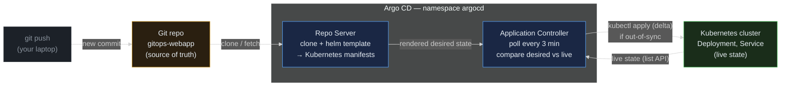
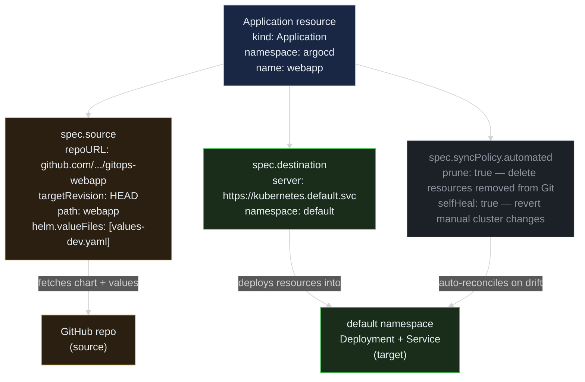
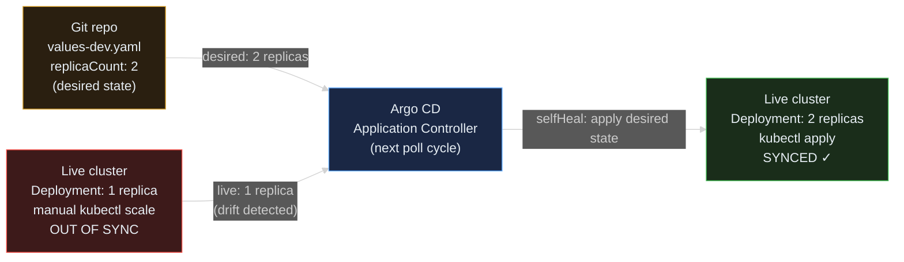

> **30 Days of DevOps** — Day 10 of 30. [← Day 9: Centralised Logging](/articles/2026/05/20/day-09-loki-logging/)

Every deploy in this series so far was manual: `helm install`, `helm upgrade`, `kubectl apply` — run from your laptop against the cluster. That model works fine for one app and one engineer. It breaks when you have a team, multiple environments, a shared cluster, and a deployment that went wrong at midnight with no clear trail of who ran what.

**GitOps** flips the model. Instead of imperative commands, you declare the desired state in Git. Argo CD, running inside the cluster, watches that Git repository and continuously reconciles the cluster toward it. Push a commit to bump a replica count — Argo CD applies the change. Manually `kubectl scale` a deployment to zero — Argo CD detects the drift and heals it back. Need to roll back? `git revert` and push. The cluster is always a mirror of Git — and Git is the audit log, the change history, and the access control layer.

## What you will build

By the end of this article you will have:

- **Argo CD** installed in its own `argocd` namespace via the official Helm chart
- **Argo CD UI** exposed at `https://argocd.local` via NGINX Ingress + cert-manager — the same pipeline as Day 7 and Day 8
- A **GitHub repo** (`gitops-webapp`) containing the Day 6 webapp Helm chart with environment-specific values files checked in
- An Argo CD **Application** resource that watches your Git repo, renders the Helm chart, and keeps the cluster in sync automatically
- A live demo of **drift detection**: `kubectl scale` the deployment by hand — Argo CD detects the divergence and heals it within minutes
- A live demo of **promotion via Git**: bump `replicaCount` in a values file, `git push` — the cluster updates without a single `helm upgrade`

---

## The GitOps control loop

Before installing anything, understand the reconciliation model Argo CD implements.



**Reading this diagram:**

Read left to right. The loop starts with a **git push from your laptop** (grey, muted — the only manual step in the whole chain). Everything to the right of it is automated.

The **Git repository** (amber) holds the complete declaration of what should run: the Helm chart source, the values files, the template logic. It is the single source of truth. Every change to the cluster must go through a commit here first.

Inside the **Argo CD** subgraph are two blue components. The **Repo Server** clones the repository, runs `helm template` with the configured values file, and produces plain Kubernetes YAML — the same manifests `helm install` would apply, but never applied by hand. The **Application Controller** is the reconciliation engine. It polls on a configurable interval (default: 3 minutes), compares the Repo Server's desired manifests against what the Kubernetes API reports as live, and calls `kubectl apply` on the delta if the two diverge.

Two arrows leave the Argo CD subgraph: one drives the **Kubernetes cluster** (green) to the desired state; the other reads back the cluster's live state. The controller sits in this feedback loop continuously. If a human runs `kubectl scale` between polls, the controller detects the mismatch on the next poll, classifies the application as **OutOfSync**, and — when `selfHeal: true` is configured — applies the correction automatically.

The key insight: Git is not just the deployment trigger. It is the audit log, the rollback mechanism, and the access control boundary. Whoever can merge to `main` controls what runs in the cluster — no `kubectl` access needed for routine deployments.

---

## Prerequisites

This article continues from Days 5–9. Everything from those days must be running: the 3-node kind cluster, NGINX Ingress Controller, cert-manager, the webapp Helm release, and the kube-prometheus-stack in the `monitoring` namespace.

```bash
# Verify running state before starting
kubectl get pods -A | grep -E "ingress-nginx|cert-manager|monitoring|^default"
```

Expected output (truncated — confirm Running status across all namespaces):

```text
cert-manager    cert-manager-5d8b9f7c4-aa1xy              1/1   Running   0   2d
cert-manager    cert-manager-cainjector-7b9d4f8c6-bb2zw   1/1   Running   0   2d
cert-manager    cert-manager-webhook-8c4d5f7b9-cc3yt      1/1   Running   0   2d
default         webapp-webapp-6c9d8f7b5-x7k2p             1/1   Running   0   2d
default         webapp-webapp-6c9d8f7b5-q4m9r             1/1   Running   0   2d
ingress-nginx   ingress-nginx-controller-7d4c5f6b9-xk2vp  1/1   Running   0   2d
monitoring      kps-grafana-7f6c4d8b5-zh4xp               3/3   Running   0   1d
monitoring      prometheus-kps-kube-prometheus-stack-prometheus-0  2/2   Running   0   1d
```

You also need:
- A **GitHub account** and the **GitHub CLI** (`gh`) configured — run `gh auth status` to confirm
- The GitHub repo you will create in Part 3 must be **public** — Argo CD will clone it over HTTPS with no credentials for this tutorial

| Tool | Minimum version | Check |
|---|---|---|
| Docker | 24.x | `docker --version` |
| kubectl | 1.29 | `kubectl version --client` |
| Helm | 3.14 | `helm version --short` |
| gh CLI | 2.x | `gh --version` |
| Docker Desktop RAM | **8 GiB recommended** | `docker info \| grep "Total Memory"` |

RAM note: Argo CD's four core components (server, repo-server, application-controller, redis) add ~600 MiB on top of Day 9's footprint. 8 GiB is comfortable; 6 GiB risks OOMKill events during the initial rollout (see Common Errors #1).

---

## Part 1 — Install Argo CD

Argo CD ships with an official Helm chart from the `argoproj/argo-helm` repository. The chart installs four core components:

- **argocd-server** — the API server and web UI. We configure it in `--insecure` mode (plain HTTP) so the NGINX Ingress controller terminates TLS, exactly as Grafana did on Day 8
- **argocd-repo-server** — clones Git repositories, runs `helm template`, and caches the rendered manifests for the Application Controller to consume
- **argocd-application-controller** — the reconciliation loop; it continuously compares desired state (from Git) against live state (from Kubernetes) and applies the delta
- **argocd-redis** — an in-cluster Redis used as a shared cache between the three components above

Two optional components we disable to save RAM on a learning cluster:

- **Dex** — an embedded OIDC/SSO provider for GitHub, Google, or LDAP login. Not needed for local admin access
- **ApplicationSet controller** — generates many Applications from a single template; out of scope today
- **Notifications controller** — sends Slack/email webhooks on sync events; out of scope today

Add the Argo Helm repository:

```bash
helm repo add argo https://argoproj.github.io/argo-helm
helm repo update
```

Expected output:

```text
"argo" has been added to your repositories
Hang tight while we grab the latest from your chart repositories...
...Successfully got an update from the "argo" chart repository
Update Complete. ⎈Happy Helming!⎈
```

Create the working directory and write the values file:

```bash
mkdir -p ~/30-days-devops/day-10 && cd ~/30-days-devops/day-10

cat > values-argocd.yaml << 'EOF'
global:
  # Domain used in generated URLs and some internal redirects.
  domain: argocd.local

configs:
  params:
    # Run argocd-server in plain HTTP mode so NGINX Ingress can terminate TLS.
    # Without this, argocd-server redirects every HTTP→HTTPS itself, which
    # fights the Ingress controller and produces redirect loops.
    server.insecure: "true"

# Disable Dex (embedded OIDC / SSO provider). We log in with the built-in
# local admin account. Removing Dex saves ~150 MiB RAM on a kind cluster.
dex:
  enabled: false

# Disable the ApplicationSet controller (multi-Application templating).
# We will create one Application by hand today — no templating needed.
applicationSet:
  enabled: false

# Disable the Notifications controller (Slack / email / webhook alerts).
notifications:
  enabled: false
EOF
```

Install Argo CD into a dedicated namespace:

```bash
# --version pins the chart so this article stays reproducible.
# Check 'helm search repo argo/argo-cd' to see the latest available version.
helm install argocd argo/argo-cd \
  --namespace argocd --create-namespace \
  --version 7.7.8 \
  -f values-argocd.yaml
```

Expected output:

```text
NAME: argocd
LAST DEPLOYED: Thu May 21 09:00:00 2026
NAMESPACE: argocd
STATUS: deployed
REVISION: 1
TEST SUITE: None
NOTES:
In order to access the server UI you have the following options:

1. kubectl port-forward service/argocd-server -n argocd 8080:443
   and then open the browser on http://localhost:8080 and accept the certificate

After reaching the UI the first time you can login with username: admin and the
random password generated during the installation. You can find it by running:

  kubectl -n argocd get secret argocd-initial-admin-secret \
    -o jsonpath="{.data.password}" | base64 -d
```

Wait for all Argo CD Pods to reach `Running` (takes 90–120 seconds):

```bash
# -l app.kubernetes.io/instance=argocd selects all Pods from this Helm release
kubectl wait --namespace argocd \
  --for=condition=ready pod \
  -l app.kubernetes.io/instance=argocd \
  --timeout=180s
```

Expected output (one line per Pod):

```text
pod/argocd-application-controller-0 condition met
pod/argocd-redis-7f9c8b6d5-kk1tp condition met
pod/argocd-repo-server-6c8d5f7b4-ll2uq condition met
pod/argocd-server-5d7c4f8b9-mm3vr condition met
```

Confirm the argocd-server Service is up:

```bash
kubectl get svc -n argocd argocd-server
```

Expected output:

```text
NAME            TYPE        CLUSTER-IP      EXTERNAL-IP   PORT(S)          AGE
argocd-server   ClusterIP   10.96.174.33    <none>        80/TCP,443/TCP   2m
```

Port `80/TCP` is the plain HTTP endpoint we will route through the NGINX Ingress. Port `443/TCP` is still exposed by the Service but unused in `--insecure` mode — the server no longer handles its own TLS.

---

## Part 2 — Expose Argo CD at argocd.local

We add an Ingress resource using the exact same pattern as Day 7 (`webapp.local`) and Day 8 (`grafana.local`): hostname-based routing through NGINX, TLS auto-issued by cert-manager's `selfsigned-issuer`.

```bash
cat > argocd-ingress.yaml << 'EOF'
apiVersion: networking.k8s.io/v1
kind: Ingress
metadata:
  name: argocd-ingress
  namespace: argocd
  annotations:
    # cert-manager watches for this annotation and auto-creates a Certificate
    # resource backed by the selfsigned-issuer from Day 7.
    cert-manager.io/cluster-issuer: selfsigned-issuer
spec:
  ingressClassName: nginx
  tls:
    - hosts:
        - argocd.local
      secretName: argocd-tls
  rules:
    - host: argocd.local
      http:
        paths:
          - path: /
            pathType: Prefix
            backend:
              service:
                name: argocd-server
                # Port 80 on the argocd-server Service maps to container port 8080
                # (plain HTTP), which works because server.insecure=true was set
                # in Part 1. NGINX talks plain HTTP to the backend and handles
                # HTTPS on the client-facing side.
                port:
                  number: 80
EOF

kubectl apply -f argocd-ingress.yaml
```

Expected output:

```text
ingress.networking.k8s.io/argocd-ingress created
```

Verify the Ingress has an address and the certificate was issued:

```bash
# Ingress should show ADDRESS: localhost within 30s (NGINX accepts the rule)
kubectl get ingress -n argocd argocd-ingress

# Certificate should be READY within 60s (cert-manager issues from selfsigned-issuer)
kubectl get certificate -n argocd argocd-tls
```

Expected output:

```text
NAME             CLASS   HOSTS          ADDRESS     PORTS     AGE
argocd-ingress   nginx   argocd.local   localhost   80, 443   45s

NAME         READY   SECRET       AGE
argocd-tls   True    argocd-tls   60s
```

Add the `/etc/hosts` entry so your browser and the argocd CLI can resolve `argocd.local`:

```bash
# macOS / Linux
echo "127.0.0.1 argocd.local" | sudo tee -a /etc/hosts

# Windows (PowerShell — run as Administrator)
Add-Content C:\Windows\System32\drivers\etc\hosts "`n127.0.0.1 argocd.local"
```

Retrieve the randomly generated initial admin password:

```bash
# The Secret's data.password is base64-encoded. Pipe through base64 -d to decode.
kubectl -n argocd get secret argocd-initial-admin-secret \
  -o jsonpath='{.data.password}' | base64 -d && echo
```

Expected output (your value will differ):

```text
tX7Kp9mRqY2nBvZw
```

Copy the password. Open `https://argocd.local/` in a browser. Accept the self-signed certificate warning (same as Day 7 and Day 8). Log in with username `admin` and the password above.

You should land on the **Applications** page — empty, with a large **+ NEW APP** button. Keep this tab open; you will watch it update live in Part 4.

### Optional: install the argocd CLI

The web UI is fine for exploration. The `argocd` CLI is faster for immediate syncs, diff previews, and scripting.

```bash
# macOS
brew install argocd

# Linux — fetch the binary matching the server version
ARGOCD_VERSION=$(curl -s \
  https://api.github.com/repos/argoproj/argo-cd/releases/latest \
  | grep '"tag_name"' | cut -d'"' -f4)
curl -sSL -o /usr/local/bin/argocd \
  "https://github.com/argoproj/argo-cd/releases/download/${ARGOCD_VERSION}/argocd-linux-amd64"
chmod +x /usr/local/bin/argocd
```

Log the CLI into your local Argo CD server:

```bash
# --insecure skips TLS verification for the self-signed certificate.
# --grpc-web avoids gRPC-over-HTTP/2 incompatibilities behind NGINX.
argocd login argocd.local \
  --insecure \
  --grpc-web \
  --username admin \
  --password $(kubectl -n argocd get secret argocd-initial-admin-secret \
               -o jsonpath='{.data.password}' | base64 -d)
```

Expected output:

```text
'admin:login' logged in successfully
Context 'argocd.local' updated
```

---

## Part 3 — Push the Day 6 chart to GitHub

Argo CD needs to read the chart from a Git repository. The chart source is the `webapp/` directory you built in Day 6 (`~/30-days-devops/day-06/webapp/`). We create a new GitHub repo, copy the chart in, add the environment values files, uninstall the old Helm-managed webapp, then push.

### 3.1 Create the GitHub repository

```bash
# Creates a public repo under your authenticated GitHub account.
# Public repos are accessible to Argo CD over HTTPS with no credentials.
gh repo create gitops-webapp \
  --public \
  --description "Webapp Helm chart — 30 Days of DevOps Day 10"
```

Expected output:

```text
✓ Created repository <YOUR_USERNAME>/gitops-webapp on GitHub
  https://github.com/<YOUR_USERNAME>/gitops-webapp
```

Note your GitHub username from the URL — you will need it in Part 4.

### 3.2 Set up the local repo

```bash
mkdir -p ~/30-days-devops/day-10/gitops-webapp
cd ~/30-days-devops/day-10/gitops-webapp

git init
git branch -M main

# Replace <YOUR_USERNAME> with your actual GitHub username
git remote add origin https://github.com/<YOUR_USERNAME>/gitops-webapp.git
```

### 3.3 Copy the Day 6 chart

Place the Helm chart in a `webapp/` subdirectory. This path will become `spec.source.path` in the Argo CD Application — Argo CD will tell the Repo Server to look here for the chart.

```bash
cp -r ~/30-days-devops/day-06/webapp ./webapp
```

Confirm the chart landed correctly:

```bash
ls webapp/ && ls webapp/templates/
```

Expected output:

```text
Chart.yaml    charts    templates    values.yaml

_helpers.tpl    deployment.yaml    service.yaml
```

Three templates — Deployment, Service, and the helpers partial from `helm create`. No Ingress, ServiceAccount, or HPA. ✓

### 3.4 Add environment values files inside the chart

Argo CD's `spec.source.helm.valueFiles` paths are **relative to the chart directory** (`webapp/`). Place both values files there so Argo CD can find them without any path prefixes:

```bash
cat > webapp/values-dev.yaml << 'EOF'
# Dev environment overrides — merged over webapp/values.yaml at sync time.
# Only include keys that differ from the chart defaults.

replicaCount: 2

image:
  tag: "1.27-alpine"

# ClusterIP so traffic enters through the NGINX Ingress, not a NodePort.
# This matches the values-ingress.yaml pattern established in Day 7.
service:
  type: ClusterIP
  port: 80
  targetPort: 80

resources:
  requests:
    cpu: 25m
    memory: 32Mi
  limits:
    cpu: 50m
    memory: 64Mi
EOF
```

```bash
cat > webapp/values-prod.yaml << 'EOF'
# Prod environment overrides — same chart, larger footprint.

replicaCount: 4

image:
  tag: "1.27-alpine"

service:
  type: ClusterIP
  port: 80
  targetPort: 80

resources:
  requests:
    cpu: 100m
    memory: 128Mi
  limits:
    cpu: 200m
    memory: 256Mi
EOF
```

### 3.5 Uninstall the existing webapp Helm release

The webapp was deployed by `helm install webapp ...` in Day 7. Argo CD will re-deploy it from Git. Two managers owning the same Kubernetes resources — Helm's ownership labels and Argo CD's tracking annotations — fight each other. Remove the Helm-managed release first:

```bash
helm uninstall webapp -n default
```

Expected output:

```text
release "webapp" uninstalled
```

The Deployment and Service are gone, but the Ingress (`webapp-ingress`) and TLS Secret (`webapp-tls`) from Day 7 remain — they were created with `kubectl apply`, not as part of the Helm release, so `helm uninstall` leaves them untouched. Argo CD will re-create the Deployment and Service, and the existing Ingress will route to them automatically once they reappear.

### 3.6 Commit and push

```bash
git add .
git commit -m "Add webapp Helm chart with dev and prod values"
git push -u origin main
```

Expected output:

```text
[main (root-commit) a1b2c3d] Add webapp Helm chart with dev and prod values
 8 files changed, 142 insertions(+)
 create mode 100644 webapp/.helmignore
 create mode 100644 webapp/Chart.yaml
 create mode 100644 webapp/templates/_helpers.tpl
 create mode 100644 webapp/templates/deployment.yaml
 create mode 100644 webapp/templates/service.yaml
 create mode 100644 webapp/values-dev.yaml
 create mode 100644 webapp/values-prod.yaml
 create mode 100644 webapp/values.yaml
Enumerating objects: 10, done.
Writing objects: 100% (10/10), 3.2 KiB | 3.20 MiB/s, done.
To https://github.com/<YOUR_USERNAME>/gitops-webapp.git
 * [new branch]      main -> main
branch 'main' set up to track 'remote/origin/main'.
```

---

## Part 4 — Create an Argo CD Application

An **Application** is an Argo CD custom resource (`kind: Application`) that ties together three things:

- A **source** — the Git repo URL, the target revision (branch, tag, or commit), the path within the repo, and Helm-specific options such as which values files to merge
- A **destination** — which Kubernetes cluster and namespace to deploy into
- A **sync policy** — whether syncing is manual (click "Sync" in the UI) or automatic (Argo CD applies changes as soon as it detects drift from Git)



**Reading this diagram:**

Read top to bottom. The **Application resource** (blue) is the central object — a single Kubernetes custom resource living in the `argocd` namespace that controls everything below it. Three field groups hang off it.

**`spec.source`** (amber) defines where the chart lives: the GitHub repo URL, `HEAD` to track the latest commit on `main`, the `webapp/` subdirectory, and `values-dev.yaml` to merge over the chart's defaults. This is equivalent to what `helm install --repo <url> -f values-dev.yaml` would do — except Argo CD re-renders it on every sync and compares the result to the live cluster before applying.

**`spec.destination`** (green) defines where to deploy: `https://kubernetes.default.svc` is the in-cluster Kubernetes API server (Argo CD talks directly to the same cluster it runs on), and `default` is the namespace. The two outward arrows represent the two actions Argo CD takes: read from Git and write to the cluster.

**`spec.syncPolicy.automated`** (grey) is what separates GitOps from "Argo CD as a manual deploy tool". With `prune: true`, resources deleted from Git are also deleted from the cluster. With `selfHeal: true`, any manual cluster change — `kubectl scale`, `kubectl edit`, even patching a label — is overwritten on the next sync cycle. Without this block, Argo CD only reports drift. It does not act unless you click "Sync".

The key insight: the Application resource is itself declarative. You can commit `webapp-app.yaml` to Git and apply it via another Argo CD Application (the "App of Apps" pattern). That is how large organisations bootstrap entire fleets of clusters from a single repo — but that is a Day 15 topic.

Create the Application manifest:

```bash
cat > webapp-app.yaml << 'EOF'
apiVersion: argoproj.io/v1alpha1
kind: Application
metadata:
  name: webapp
  namespace: argocd
  # This finalizer tells Argo CD to delete all managed cluster resources
  # (the Deployment, Service, etc.) when this Application resource is deleted.
  # Without it, deleting the Application leaves orphaned resources behind.
  finalizers:
    - resources-finalizer.argocd.argoproj.io
spec:
  project: default

  source:
    # Replace <YOUR_USERNAME> with your actual GitHub username.
    repoURL: https://github.com/<YOUR_USERNAME>/gitops-webapp
    # HEAD always tracks the latest commit on the default branch (main).
    # In production, pin to a tag (e.g. v1.2.3) for immutable releases.
    targetRevision: HEAD
    # The subdirectory within the repo that contains the Helm chart.
    path: webapp
    helm:
      # Path to the values file, relative to the chart directory (webapp/).
      # Argo CD resolves this to webapp/values-dev.yaml in the repo.
      # Equivalent to: helm install -f values-dev.yaml
      valueFiles:
        - values-dev.yaml

  destination:
    # In-cluster Kubernetes API server. Argo CD supports remote clusters too —
    # each cluster is registered by its kubeconfig server address.
    server: https://kubernetes.default.svc
    namespace: default

  syncPolicy:
    automated:
      # prune: remove cluster resources that no longer exist in Git.
      # Without this, deleting a template file leaves the resource running.
      prune: true
      # selfHeal: revert any manual change to a managed resource.
      # This is the core GitOps guarantee: the cluster always matches Git.
      selfHeal: true
    syncOptions:
      # Create the destination namespace if it doesn't exist yet.
      # 'default' always exists, but the pattern is essential for other envs.
      - CreateNamespace=true
EOF
```

**Before applying**, replace `<YOUR_USERNAME>` in `repoURL` with your actual GitHub username and verify it:

```bash
grep repoURL webapp-app.yaml
```

Expected output (your username should appear, not the placeholder):

```text
    repoURL: https://github.com/your-actual-username/gitops-webapp
```

Apply the Application:

```bash
kubectl apply -f webapp-app.yaml
```

Expected output:

```text
application.argoproj.io/webapp created
```

Argo CD detects the new Application within seconds, immediately clones the repo, renders the Helm chart with `values-dev.yaml`, and applies the manifests to the `default` namespace. Watch the webapp Pods come back:

```bash
kubectl get pods -n default -l app.kubernetes.io/instance=webapp -w
```

Expected output (Pods transition from `ContainerCreating` to `Running`):

```text
NAME                             READY   STATUS              RESTARTS   AGE
webapp-webapp-6c9d8f7b5-nn4qs   0/1     ContainerCreating   0          3s
webapp-webapp-6c9d8f7b5-pp5rt   0/1     ContainerCreating   0          3s
webapp-webapp-6c9d8f7b5-nn4qs   1/1     Running             0          8s
webapp-webapp-6c9d8f7b5-pp5rt   1/1     Running             0          9s
```

Press `Ctrl+C` once both Pods are Running.

In the Argo CD UI (`https://argocd.local/`), the `webapp` Application card should now show a green **Healthy** badge and a green **Synced** label. Click the card to open the resource tree — you will see the Deployment, its ReplicaSet, the two Pods, and the Service, all with health indicators on each node.

Confirm the webapp is still reachable at `https://webapp.local/`:

```bash
curl --resolve webapp.local:443:127.0.0.1 -k -s \
     -o /dev/null -w "%{http_code}\n" \
     https://webapp.local/
```

Expected output:

```text
200
```

The existing Ingress and TLS Secret from Day 7 automatically started routing to the re-deployed Service — same Service name (`webapp-webapp`), same port, same namespace. ✓

---

## Part 5 — Drift detection and self-healing

The `selfHeal: true` flag is the most operationally important feature of Argo CD. Let's trigger it deliberately.

Manually scale the webapp Deployment to 1 replica — the kind of emergency intervention that happens during an incident when someone scales down to reduce load:

```bash
kubectl scale deployment webapp-webapp -n default --replicas=1
```

Expected output:

```text
deployment.apps/webapp-webapp scaled
```

Check the Pod count — it drops to 1:

```bash
kubectl get pods -n default -l app.kubernetes.io/instance=webapp
```

Expected output:

```text
NAME                             READY   STATUS    RESTARTS   AGE
webapp-webapp-6c9d8f7b5-nn4qs   1/1     Running   0          5m
```



**Reading this diagram:**

Read left to right. The **Git repo** (amber) holds the desired state: `replicaCount: 2`. A manual `kubectl scale` reduced the Deployment to 1 replica — the **live cluster** node (red) is now diverged from Git. This divergence is what Argo CD calls **OutOfSync**.

On its next poll cycle (within 3 minutes), the **Application Controller** (blue) reads Git (desired: 2 replicas) and reads the Kubernetes API (live: 1 replica), detects the mismatch, and — because `selfHeal: true` is set — immediately calls `kubectl apply` to drive the Deployment back to 2 replicas. The live cluster node turns green: **Synced**.

The red node represents the **OutOfSync** state; the green represents **Synced**. These are the exact badge labels you will see in the Argo CD UI while watching this happen. When the heal fires, the Application card transitions from a red `OutOfSync` badge to a green `Synced` badge in real time.

Argo CD's default poll interval is 3 minutes. To trigger the heal immediately without waiting:

```bash
# If you installed the argocd CLI in Part 2:
argocd app sync webapp

# Or in the UI: click the webapp card → SYNC → SYNCHRONIZE
```

Expected CLI output:

```text
TIMESTAMP                  GROUP  KIND        NAMESPACE  NAME           STATUS   HEALTH   HOOK  MESSAGE
2026-05-21T09:15:00+00:00  apps   Deployment  default    webapp-webapp  Synced   Healthy        deployment.apps/webapp-webapp configured
```

Watch the second Pod come back:

```bash
kubectl get pods -n default -l app.kubernetes.io/instance=webapp
```

Expected output:

```text
NAME                             READY   STATUS    RESTARTS   AGE
webapp-webapp-6c9d8f7b5-nn4qs   1/1     Running   0          8m
webapp-webapp-6c9d8f7b5-qq6st   1/1     Running   0          15s
```

Two Pods. The cluster matches Git. This is self-healing in action — and why Git is the only place changes should be made in a GitOps system.

---

## Part 6 — Promote a change via Git

The second key GitOps workflow is **promotion**: upgrading an environment by editing a values file in Git and pushing. No `helm upgrade`, no `kubectl apply`, no access to the cluster needed.

Navigate back to the gitops-webapp repo and update `values-dev.yaml` to scale to 3 replicas:

```bash
cd ~/30-days-devops/day-10/gitops-webapp

cat > webapp/values-dev.yaml << 'EOF'
# Dev environment overrides — merged over webapp/values.yaml at sync time.

replicaCount: 3

image:
  tag: "1.27-alpine"

service:
  type: ClusterIP
  port: 80
  targetPort: 80

resources:
  requests:
    cpu: 25m
    memory: 32Mi
  limits:
    cpu: 50m
    memory: 64Mi
EOF
```

Confirm the change:

```bash
grep replicaCount webapp/values-dev.yaml
```

Expected output:

```text
replicaCount: 3
```

Commit and push:

```bash
git add webapp/values-dev.yaml
git commit -m "scale dev to 3 replicas"
git push
```

Expected output:

```text
[main b2c3d4e] scale dev to 3 replicas
 1 file changed, 1 insertion(+), 1 deletion(-)
Enumerating objects: 5, done.
Writing objects: 100% (3/3), 293 bytes | 293.00 KiB/s, done.
To https://github.com/<YOUR_USERNAME>/gitops-webapp.git
   a1b2c3d..b2c3d4e  main -> main
```

Argo CD detects the new commit on its next poll cycle. Trigger it immediately if you don't want to wait:

```bash
argocd app sync webapp
```

Watch the third Pod appear:

```bash
kubectl get pods -n default -l app.kubernetes.io/instance=webapp -w
```

Expected output:

```text
NAME                             READY   STATUS              RESTARTS   AGE
webapp-webapp-6c9d8f7b5-nn4qs   1/1     Running             0          12m
webapp-webapp-6c9d8f7b5-qq6st   1/1     Running             0          4m
webapp-webapp-6c9d8f7b5-rr7uv   0/1     ContainerCreating   0          2s
webapp-webapp-6c9d8f7b5-rr7uv   1/1     Running             0          7s
```

Three Pods running. Zero `helm upgrade`. Zero `kubectl apply`. The entire change is in Git — reviewable as a PR, revertable with `git revert`, and auditable forever.

---

## Cleanup

Today added Argo CD in the `argocd` namespace. Days 7–8 (NGINX Ingress, cert-manager, and the kube-prometheus-stack) stay running for Day 11.

```bash
# 1. Delete the Application — the finalizer deletes the managed Deployment and Service
kubectl delete -f webapp-app.yaml

# 2. Uninstall Argo CD
helm uninstall argocd -n argocd

# 3. Remove the Argo CD Ingress
kubectl delete -f argocd-ingress.yaml

# 4. Drop the argocd namespace (removes all remaining Argo CD resources)
kubectl delete namespace argocd
```

Expected output:

```text
application.argoproj.io "webapp" deleted
release "argocd" uninstalled
ingress.networking.k8s.io "argocd-ingress" deleted
namespace "argocd" deleted
```

Remove the `/etc/hosts` entry:

```bash
# macOS / Linux
sudo sed -i.bak '/argocd.local/d' /etc/hosts

# Windows (PowerShell — run as Administrator)
(Get-Content C:\Windows\System32\drivers\etc\hosts) |
  Where-Object { $_ -notmatch "argocd.local" } |
  Set-Content C:\Windows\System32\drivers\etc\hosts
```

Confirm the webapp Pods are gone (the Application finalizer deleted them):

```bash
kubectl get pods -n default -l app.kubernetes.io/instance=webapp
# Expected: No resources found in default namespace.
```

To tear down the entire cluster (Days 5–10):

```bash
kind delete cluster --name devops-cluster
```

---

## Common errors

### Error 1 — Argo CD Pods OOMKilled immediately after install

```text
NAME                                  READY   STATUS      RESTARTS   AGE
argocd-application-controller-0      0/1     OOMKilled   2          3m
argocd-repo-server-6c8d5f7b4-ll2uq   0/1     OOMKilled   1          3m
```

**Cause:** Docker Desktop's VM doesn't have enough RAM. Argo CD (with Dex and ApplicationSet disabled as configured) still needs ~600 MiB on top of Days 8–9's footprint. A 6 GiB Docker VM with kube-prometheus-stack running leaves almost nothing for Argo CD.

**Fix:**

```bash
# Check how much RAM Docker has available
docker info | grep "Total Memory"

# Check what's using the most memory right now
kubectl top nodes

# If RAM is tight: open Docker Desktop → Settings → Resources → Memory,
# increase to 8 GiB, then click "Apply & Restart".
# After Docker restarts, recreate the cluster:
# kind create cluster --name devops-cluster \
#   --config ~/30-days-devops/day-05/kind-cluster.yaml
# Then re-run Days 7-9 setup and retry Part 1.
```

---

### Error 2 — Helm/Argo CD ownership conflict (forgot to helm uninstall first)

```text
kubectl get events -n default --sort-by='.lastTimestamp' | tail -5
# Warning  Conflict  deployment/webapp-webapp
# apply failed: field manager conflict for field 'spec.replicas':
# another manager 'helm' owns this field
```

**Cause:** You applied the Argo CD Application without running `helm uninstall webapp` first. Helm stored ownership metadata on the Deployment and Service. Argo CD's server-side apply conflicts with Helm's managed-by labels.

**Fix:**

```bash
# 1. Suspend automated sync so Argo CD stops fighting Helm while you fix it
kubectl patch app webapp -n argocd \
  --type merge \
  -p '{"spec":{"syncPolicy":{"automated":null}}}'

# 2. Uninstall the Helm release to clear its ownership metadata
helm uninstall webapp -n default

# 3. Re-enable automated sync
kubectl patch app webapp -n argocd \
  --type merge \
  -p '{"spec":{"syncPolicy":{"automated":{"prune":true,"selfHeal":true}}}}'

# 4. Trigger an immediate sync to let Argo CD re-create the resources cleanly
argocd app sync webapp
# Or click SYNC in the UI
```

---

### Error 3 — Application stuck in `Unknown` with "repository not accessible"

```text
ComparisonError: rpc error: code = Unknown desc =
  Get "https://github.com/...": i/o timeout
```

**Cause:** The GitHub repository is private, or the `repoURL` has a typo.

**Fix:**

```bash
# Confirm the repoURL in the Application spec
kubectl get app webapp -n argocd \
  -o jsonpath='{.spec.source.repoURL}' && echo

# Test connectivity from inside the cluster
kubectl run --rm -it tmp-curl --image=curlimages/curl --restart=Never -- \
  curl -s -o /dev/null -w "%{http_code}\n" \
  https://api.github.com/repos/<YOUR_USERNAME>/gitops-webapp
# Expected: 200 (public repo). If 404: repo name is wrong or the repo is private.

# To register HTTPS credentials for a private repo:
argocd repo add https://github.com/<YOUR_USERNAME>/gitops-webapp \
  --username <YOUR_USERNAME> \
  --password <YOUR_GITHUB_PAT>
```

---

### Error 4 — Application shows OutOfSync but never auto-syncs

```text
argocd app get webapp
# Status:    OutOfSync
# (nothing is happening)
```

**Cause:** The `syncPolicy.automated` block is missing or has an indentation error in the YAML. Without it, Argo CD only detects drift — it does not act on it.

**Fix:**

```bash
# Inspect the current syncPolicy
kubectl get app webapp -n argocd \
  -o jsonpath='{.spec.syncPolicy}' | python3 -m json.tool

# Expected:
# {"automated": {"prune": true, "selfHeal": true}, "syncOptions": ["CreateNamespace=true"]}
# If automated is null or missing, patch it back in:
kubectl patch app webapp -n argocd \
  --type merge \
  -p '{"spec":{"syncPolicy":{"automated":{"prune":true,"selfHeal":true}}}}'
```

---

### Error 5 — `argocd-initial-admin-secret` not found

```bash
kubectl -n argocd get secret argocd-initial-admin-secret
# Error from server (NotFound): secrets "argocd-initial-admin-secret" not found
```

**Cause A:** Argo CD hasn't finished initializing. The Secret is created by argocd-server on its first startup, which takes 60–90 seconds.

**Cause B:** You (or a previous tutorial run) already changed the admin password. Argo CD deletes this Secret after a password change.

**Fix for Cause A:**

```bash
# Wait for argocd-server to be fully Running, then retry
kubectl wait --namespace argocd \
  --for=condition=ready pod \
  -l app.kubernetes.io/name=argocd-server \
  --timeout=120s
kubectl -n argocd get secret argocd-initial-admin-secret \
  -o jsonpath='{.data.password}' | base64 -d && echo
```

**Fix for Cause B** (simplest for a learning cluster — reinstall to get a fresh password):

```bash
helm uninstall argocd -n argocd
kubectl delete namespace argocd
helm install argocd argo/argo-cd \
  --namespace argocd --create-namespace \
  --version 7.7.8 \
  -f ~/30-days-devops/day-10/values-argocd.yaml
kubectl wait --namespace argocd \
  --for=condition=ready pod \
  -l app.kubernetes.io/instance=argocd --timeout=180s
kubectl -n argocd get secret argocd-initial-admin-secret \
  -o jsonpath='{.data.password}' | base64 -d && echo
```

---

### Error 6 — Ingress shows no ADDRESS for argocd.local

```text
NAME             CLASS   HOSTS          ADDRESS   PORTS     AGE
argocd-ingress   nginx   argocd.local             80, 443   5m
```

**Cause:** Either the NGINX Ingress Controller is not running, or the cert-manager Certificate is stuck `Pending` and the NGINX controller is not accepting TLS Ingresses whose Secrets don't exist yet.

**Fix:**

```bash
# Step 1: confirm NGINX is running
kubectl get pods -n ingress-nginx

# Step 2: check the Certificate
kubectl get certificate -n argocd argocd-tls
kubectl describe certificate -n argocd argocd-tls | tail -20

# Step 3: if cert-manager is the problem, check the CertificateRequest
kubectl get certificaterequest -n argocd
kubectl describe certificaterequest -n argocd <name-from-above> | tail -15

# Step 4: most common root cause — selfsigned-issuer was deleted or never created
kubectl get clusterissuer selfsigned-issuer
# Expected: READY=True
# If missing, re-apply Day 7's issuer:
kubectl apply -f ~/30-days-devops/day-07/cluster-issuer.yaml
```

---

## What you built

In this article you:

- Installed **Argo CD** into a dedicated `argocd` namespace using the official `argo/argo-cd` Helm chart with a values file that disables Dex, ApplicationSet, and Notifications — keeping RAM usage manageable on a kind cluster
- Exposed the **Argo CD UI at `https://argocd.local`** via a cert-manager-annotated Ingress, following the exact same pattern as `webapp.local` (Day 7) and `grafana.local` (Day 8)
- Created a **GitHub repo** (`gitops-webapp`) holding the Day 6 webapp chart with `values-dev.yaml` and `values-prod.yaml` inside the chart directory — where Argo CD's `helm.valueFiles` resolver expects them
- Defined an Argo CD **Application resource** wiring `spec.source`, `spec.destination`, and `spec.syncPolicy.automated` (`prune: true`, `selfHeal: true`) — the three-part declaration that makes GitOps operational
- Proved **drift detection and self-healing**: `kubectl scale` reduced the Deployment to 1 replica; Argo CD detected the divergence, classified the Application as OutOfSync, and healed it back to 2 replicas from Git without any human action
- Proved **promotion via Git**: bumping `replicaCount` in `values-dev.yaml` and pushing a commit brought the cluster to 3 replicas — no `helm upgrade`, no `kubectl apply`, no direct cluster access needed

You also met three new concepts:
- **The reconcile loop** — Argo CD's Application Controller polling Git and the Kubernetes API on a fixed interval, comparing desired vs live state, and applying only the delta
- **Sync policy vs sync action** — without `automated`, Argo CD only reports drift; `selfHeal: true` is what makes it act rather than just observe
- **The finalizer pattern** — `resources-finalizer.argocd.argoproj.io` ensures that deleting the Application resource also deletes the cluster resources it manages, leaving no orphans

```text
~/30-days-devops/day-10/
├── values-argocd.yaml       # Argo CD Helm values: insecure mode, no Dex/ApplicationSet
├── argocd-ingress.yaml      # NGINX Ingress + cert-manager TLS for argocd.local
├── webapp-app.yaml          # Argo CD Application resource — the GitOps wiring
└── gitops-webapp/           # The Git repo (also pushed to GitHub)
    └── webapp/
        ├── Chart.yaml
        ├── values.yaml          # Chart defaults
        ├── values-dev.yaml      # Dev: 2→3 replicas, ClusterIP
        ├── values-prod.yaml     # Prod: 4 replicas, more resources
        └── templates/
            ├── _helpers.tpl
            ├── deployment.yaml
            └── service.yaml
```

---

## Day 11 — Sealed Secrets: committing secrets safely to Git

You can now deploy everything from Git — except secrets. Putting a raw Kubernetes Secret into a public repository exposes credentials to everyone. **Sealed Secrets** (Bitnami) solves this: a controller running in your cluster holds a private key; the `kubeseal` CLI encrypts any Secret with the matching public key. The ciphertext (a `SealedSecret` resource) is safe to commit. Only your cluster can decrypt it.

In Day 11 you will:

- Install the **Sealed Secrets controller** into the cluster via Helm
- Use the **`kubeseal` CLI** to encrypt a Kubernetes Secret into a `SealedSecret`
- Commit the `SealedSecret` to the `gitops-webapp` repo
- Watch Argo CD sync it — and watch the controller silently decrypt and materialise the real Secret inside the cluster
- Understand **scope** (namespace-wide vs cluster-wide seals) and **rotation** (what happens when the controller key expires)

[Day 11 coming soon →]
