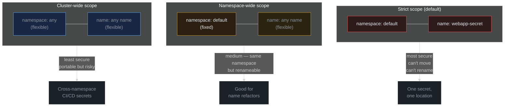

> **30 Days of DevOps** — Day 11 of 30. [← Day 10: GitOps with Argo CD](/articles/2026/05/21/day-10-argocd-gitops/)

On Day 10 you pushed a Helm chart to GitHub and let Argo CD keep the cluster in sync automatically. There is one obvious gap in that model: what about Secrets? A Kubernetes `Secret` is base64-encoded, not encrypted. Anyone with read access to your Git repo — and eventually everyone on GitHub if it is public — can decode every credential you committed. You cannot store raw Secrets in Git, but Argo CD cannot sync what is not in Git.

**Sealed Secrets** solves this cleanly. The Bitnami controller runs inside your cluster and holds an RSA private key that never leaves the cluster. You use the companion CLI tool, `kubeseal`, to fetch the matching public key and encrypt a Secret before committing. The encrypted blob — a `SealedSecret` resource — is stored in Git. When Argo CD syncs it, the controller intercepts it, decrypts it with the private key, and creates a real Kubernetes `Secret` in the same namespace. From the application's point of view nothing changes: it still reads from a regular `Secret`. The only difference is that Git now holds something that is safe to be public.

## What you will build

By the end of this article you will have:

- The **Sealed Secrets controller** installed in `kube-system` via Helm
- **kubeseal** CLI installed locally to encrypt secrets before committing
- A `SealedSecret` resource containing `API_KEY` and `DB_PASSWORD` credentials for the webapp
- The `SealedSecret` committed to the `gitops-webapp` repo alongside the Helm chart, so Argo CD syncs and decrypts it automatically
- The **webapp Deployment** updated to inject those credentials as environment variables via `envFrom`
- A live verification that the decrypted values appear inside the running Pod
- A working understanding of the three **scope levels** (strict, namespace-wide, cluster-wide) and when to use each
- A walkthrough of **key rotation** — how the controller rotates keys and how to re-seal after rotation

---

## How Sealed Secrets works

The encryption model is asymmetric. The controller owns the private half; you only ever touch the public half.

```mermaid
%%{init: {'theme': 'dark'}}%%
flowchart LR
    DEV["Your laptop\nkubeseal CLI"]:::user

    subgraph GIT ["Git repo — gitops-webapp"]
        SEALED["SealedSecret\n(encrypted blob\nsafe to commit)"]:::sealed
    end

    subgraph CLUSTER ["Kubernetes cluster — namespace kube-system"]
        CTRL["Sealed Secrets\ncontroller\n(holds RSA private key)"]:::ctrl
        SECRET["Secret webapp-secret\n(real, decrypted\nAPI_KEY + DB_PASSWORD)"]:::secret
    end

    APP["webapp Pod\nreads env vars\nfrom Secret"]:::app

    DEV -->|"1 · kubeseal fetches public key\n   encrypts Secret manifest\n   writes SealedSecret YAML"| SEALED
    SEALED -->|"2 · git push · Argo CD syncs\n   kubectl apply SealedSecret"| CTRL
    CTRL -->|"3 · decrypt with private key\n   create Secret in namespace default"| SECRET
    SECRET -->|"4 · envFrom: secretRef"| APP

    classDef user fill:#1c2128,stroke:#30363d,color:#8b949e
    classDef sealed fill:#2a1f10,stroke:#d29922,color:#e6edf3
    classDef ctrl fill:#1a2744,stroke:#58a6ff,color:#e6edf3
    classDef secret fill:#1d2d1d,stroke:#3fb950,color:#e6edf3
    classDef app fill:#1c2128,stroke:#30363d,color:#8b949e
```



**Reading this diagram:**

Read left to right, following the numbered arrows — they show the four steps of the full lifecycle.

**Step 1** starts on your laptop (grey). You run `kubeseal`, which contacts the controller to fetch the RSA public key, uses it to encrypt a plain `kubectl create secret --dry-run` output, and writes the result as a `SealedSecret` YAML file. The public key is safe to distribute; it can only encrypt, not decrypt.

The **Git repository** (amber) stores the `SealedSecret` blob. Because the blob is RSA-encrypted with the controller's public key, only the controller holding the matching private key can reverse it. Committing this file to a public GitHub repo is safe.

**Step 2** shows Argo CD picking up the `SealedSecret` from Git on its next sync cycle and running `kubectl apply` on it — exactly like any other Kubernetes resource in the chart.

The **Sealed Secrets controller** (blue, inside the cluster) watches for `SealedSecret` resources via a Kubernetes informer. When it sees one, it performs step 3: decrypts the `encryptedData` field with the RSA private key (which lives only in a cluster-side Secret in `kube-system`) and creates a standard Kubernetes `Secret` (green — the only decrypted, ready-to-use resource in the chain) in the target namespace.

**Step 4** shows the webapp Pod (grey, peripheral like the laptop — it does not participate in the encryption machinery) consuming the decrypted `Secret` via `envFrom: - secretRef:`. From the application's perspective, it just reads environment variables from a Secret — it has no knowledge of the Sealed Secrets machinery above it.

The key insight: the private key never leaves the cluster and never touches Git. Every other piece — the SealedSecret, the Helm chart, the Application resource — can be fully public.

---

## Prerequisites

This article continues directly from Day 10. The following must be in place:

- The `devops-cluster` kind cluster running with NGINX Ingress Controller and cert-manager
- Argo CD installed in namespace `argocd`, managing the `gitops-webapp` repository
- The `gitops-webapp` GitHub repo exists and contains the webapp Helm chart at path `webapp/`
- The webapp Application in Argo CD is synced and healthy

Run the pre-flight check:

```bash
# Confirm Argo CD and the webapp Application are healthy
kubectl get pods -n argocd
kubectl get application -n argocd webapp
```

Expected output:

```text
NAME                                READY   STATUS    RESTARTS   AGE
argocd-application-controller-0    1/1     Running   0          1d
argocd-redis-7f9c8b6d5-kk1tp       1/1     Running   0          1d
argocd-repo-server-6c8d5f7b4-ll2uq 1/1     Running   0          1d
argocd-server-5d7c4f8b9-mm3vr      1/1     Running   0          1d

NAME     SYNC STATUS   HEALTH STATUS
webapp   Synced        Healthy
```

| Tool | Minimum version | Check |
|---|---|---|
| kubectl | 1.29 | `kubectl version --client` |
| Helm | 3.14 | `helm version --short` |
| gh CLI | 2.x | `gh --version` |

---

## Part 1 — Install the Sealed Secrets controller

The Sealed Secrets controller is maintained by Bitnami Labs and ships as a Helm chart. It installs a single-replica Deployment into `kube-system` and registers the `SealedSecret` Custom Resource Definition (CRD). When a `SealedSecret` is created in any namespace, the controller's informer fires, the controller fetches the resource, decrypts the `encryptedData` field, and creates a matching `Secret` in the same namespace.

The controller also manages the RSA key pair it uses for encryption and decryption:

- On first startup it generates a 4096-bit RSA key pair and stores it as a `Secret` named `sealed-secrets-key` in `kube-system`
- It generates a **new key pair every 30 days** and rotates to it — old keys are retained so existing SealedSecrets continue to decrypt
- The public key is exposed via a cluster-internal endpoint that `kubeseal` fetches automatically

Add the Bitnami Labs Helm repository:

```bash
helm repo add sealed-secrets https://bitnami-labs.github.io/sealed-secrets
helm repo update
```

Expected output:

```text
"sealed-secrets" has been added to your repositories
Hang tight while we grab the latest from your chart repositories...
...Successfully got an update from the "sealed-secrets" chart repository
Update Complete. ⎈Happy Helming!⎈
```

Create the Day 11 working directory and install the controller:

```bash
mkdir -p ~/30-days-devops/day-11 && cd ~/30-days-devops/day-11

# Install into kube-system. The controller MUST live in the same namespace
# as the 'sealed-secrets-key' Secret it creates, which is always kube-system.
# --version pins the chart so this article stays reproducible.
helm install sealed-secrets sealed-secrets/sealed-secrets \
  --namespace kube-system \
  --version 2.16.1
```

Expected output:

```text
NAME: sealed-secrets
LAST DEPLOYED: Fri May 22 09:00:00 2026
NAMESPACE: kube-system
STATUS: deployed
REVISION: 1
TEST SUITE: None
NOTES:
** Please be patient while the chart is being deployed **

You should now be able to create sealed secrets.

1. Install the client-side tool (kubeseal) as explained in the docs below:

   https://github.com/bitnami-labs/sealed-secrets#installation-from-source

2. Create a sealed secret file running the command below:

   kubectl create secret generic SECRET_NAME --dry-run=client --from-literal=key1=supersecret -o yaml | \
   kubeseal \
     --controller-name=sealed-secrets \
     --controller-namespace=kube-system \
     --format yaml > mysealedsecret.yaml
```

Wait for the controller Pod to be ready:

```bash
# The controller Pod is labelled app.kubernetes.io/name=sealed-secrets
kubectl wait --namespace kube-system \
  --for=condition=ready pod \
  -l app.kubernetes.io/name=sealed-secrets \
  --timeout=120s
```

Expected output:

```text
pod/sealed-secrets-68d9b8b9c-vp4rk condition met
```

Verify the CRD was registered:

```bash
kubectl get crd sealedsecrets.bitnami.com
```

Expected output:

```text
NAME                        CREATED AT
sealedsecrets.bitnami.com   2026-05-22T09:00:12Z
```

The controller is running and the `SealedSecret` resource type is available cluster-wide.

---

## Part 2 — Install kubeseal CLI

`kubeseal` is the client-side companion to the controller. It does one thing: takes a plain Kubernetes `Secret` manifest on stdin, fetches the public key from the controller running in the cluster, encrypts each value, and writes a `SealedSecret` manifest to stdout. The original plaintext secret is never written to disk or committed — only the encrypted output is.

**macOS (Homebrew):**

```bash
brew install kubeseal
```

Expected output:

```text
==> Downloading https://ghcr.io/v2/homebrew/core/kubeseal/manifests/...
==> Pouring kubeseal--0.27.1.arm64_sequoia.bottle.tar.gz
🍺  /opt/homebrew/Cellar/kubeseal/0.27.1: 6 files, 15.3MB
```

**Linux (binary install):**

```bash
# Fetch the latest release tag from GitHub and install the pre-built binary.
KUBESEAL_VERSION=$(curl -s https://api.github.com/repos/bitnami-labs/sealed-secrets/releases/latest \
  | grep '"tag_name"' | sed 's/.*"v\([^"]*\)".*/\1/')

curl -OL "https://github.com/bitnami-labs/sealed-secrets/releases/download/v${KUBESEAL_VERSION}/kubeseal-${KUBESEAL_VERSION}-linux-amd64.tar.gz"
tar xfz "kubeseal-${KUBESEAL_VERSION}-linux-amd64.tar.gz" kubeseal
sudo install -m 755 kubeseal /usr/local/bin/kubeseal
rm kubeseal "kubeseal-${KUBESEAL_VERSION}-linux-amd64.tar.gz"
```

**Windows (Scoop):**

```powershell
scoop install kubeseal
```

Confirm the install and verify kubeseal can reach the controller:

```bash
kubeseal --version

# Fetch and display the controller's current public certificate.
# This also confirms kubeseal can connect to the controller.
kubeseal --fetch-cert \
  --controller-name=sealed-secrets \
  --controller-namespace=kube-system
```

Expected output:

```text
kubeseal version: 0.27.1

-----BEGIN CERTIFICATE-----
MIIErDCCApSgAwIBAgIQBx4JHFwx...
...
-----END CERTIFICATE-----
```

If `--fetch-cert` succeeds, kubeseal has a working connection to the controller through `kubectl` proxy. You are ready to seal secrets.

---

## Part 3 — Seal your first Secret

You will create a Secret named `webapp-secret` containing two credentials: `API_KEY` and `DB_PASSWORD`. The strategy is always the same: generate the plain Secret manifest with `--dry-run=client` (so it is never applied to the cluster), pipe it directly to `kubeseal`, and write the encrypted output.

```bash
cd ~/30-days-devops/day-11

# Step 1: generate the plain Secret YAML with --dry-run=client, then pipe
# directly to kubeseal. The plaintext never touches the filesystem.
kubectl create secret generic webapp-secret \
  --namespace default \
  --from-literal=API_KEY=supersecret-api-key-123 \
  --from-literal=DB_PASSWORD=my-super-secret-db-pass \
  --dry-run=client -o yaml \
| kubeseal \
    --controller-name=sealed-secrets \
    --controller-namespace=kube-system \
    --format yaml \
  > webapp-sealed-secret.yaml
```

The command produces no terminal output on success — the encrypted manifest is written to `webapp-sealed-secret.yaml`.

Inspect the output:

```bash
cat webapp-sealed-secret.yaml
```

Expected output:

```yaml
apiVersion: bitnami.com/v1alpha1
kind: SealedSecret
metadata:
  creationTimestamp: null
  name: webapp-secret
  namespace: default
spec:
  encryptedData:
    API_KEY: AgBy3i4OJSWK+PiTySYZZA9rO43cGDEqnKRKLmEhIwm0uFRqXy...
    DB_PASSWORD: AgBvN7mQkd5s3XdPkZ9Yw1TqR8mK4F2JpNcOeVlLdZs6Hx...
  template:
    metadata:
      creationTimestamp: null
      name: webapp-secret
      namespace: default
    type: Opaque
```

The `encryptedData` values are the RSA-encrypted ciphertext. Each value is encrypted independently, so you can add or rotate a single key without re-sealing the others. This file is **safe to commit to a public Git repository**.

Confirm the controller can decrypt it immediately by applying it directly:

```bash
kubectl apply -f webapp-sealed-secret.yaml
```

Expected output:

```text
sealedsecret.bitnami.com/webapp-secret created
```

Verify the controller created the real Secret:

```bash
# The controller creates the Secret in the same namespace as the SealedSecret
kubectl get secret webapp-secret -n default
```

Expected output:

```text
NAME            TYPE     DATA   AGE
webapp-secret   Opaque   2      5s
```

Confirm the values are correct (base64-decode to verify):

```bash
kubectl get secret webapp-secret -n default -o jsonpath='{.data.API_KEY}' | base64 -d
echo
kubectl get secret webapp-secret -n default -o jsonpath='{.data.DB_PASSWORD}' | base64 -d
echo
```

Expected output:

```text
supersecret-api-key-123
my-super-secret-db-pass
```

The controller successfully decrypted the SealedSecret and populated a real Kubernetes Secret with the original values. Now delete both the SealedSecret and the Secret — Argo CD will re-create them from Git:

```bash
kubectl delete sealedsecret webapp-secret -n default
kubectl delete secret webapp-secret -n default
```

Expected output:

```text
sealedsecret.bitnami.com "webapp-secret" deleted
secret "webapp-secret" deleted
```

---

## Part 4 — Add the SealedSecret to the Helm chart

On Day 10 you created the `gitops-webapp` GitHub repository and placed the webapp Helm chart at path `webapp/` inside it. Argo CD renders all templates under `webapp/templates/` on every sync. To have Argo CD create the SealedSecret automatically, you place `sealed-secret.yaml` there.

Clone the repository:

```bash
cd ~/30-days-devops/day-11

# Replace YOUR_GITHUB_USERNAME with your actual GitHub username
gh repo clone YOUR_GITHUB_USERNAME/gitops-webapp
cd gitops-webapp
```

Expected output:

```text
Cloning into 'gitops-webapp'...
remote: Enumerating objects: 12, done.
remote: Total 12 (delta 0), reused 12 (delta 0), pack-reused 0
Receiving objects: 100% (12/12), 3.24 KiB | 1.62 MiB/s, done.
```

Copy the SealedSecret manifest into the chart's templates directory:

```bash
cp ~/30-days-devops/day-11/webapp-sealed-secret.yaml webapp/templates/sealed-secret.yaml
```

Inspect what you just placed in the chart:

```bash
cat webapp/templates/sealed-secret.yaml
```

Expected output (abbreviated):

```yaml
apiVersion: bitnami.com/v1alpha1
kind: SealedSecret
metadata:
  creationTimestamp: null
  name: webapp-secret
  namespace: default
spec:
  encryptedData:
    API_KEY: AgBy3i4OJSWK+PiTySYZZA9rO43cGDEqnKRKLmEhIwm0uFRqXy...
    DB_PASSWORD: AgBvN7mQkd5s3XdPkZ9Yw1TqR8mK4F2JpNcOeVlLdZs6Hx...
  template:
    metadata:
      creationTimestamp: null
      name: webapp-secret
      namespace: default
    type: Opaque
```

The chart now contains `webapp/templates/sealed-secret.yaml`. When Argo CD syncs, it will apply this resource along with the Deployment, Service, and Ingress — and the controller will immediately decrypt it into a real `Secret`.

---

## Part 5 — Update the Deployment to consume the Secret

The webapp Deployment needs to inject `API_KEY` and `DB_PASSWORD` as environment variables. Kubernetes supports this via `envFrom: - secretRef:`, which mounts every key in the named Secret as an environment variable. This is cleaner than listing each key individually under `env:` — adding a new credential to the SealedSecret automatically makes it available in the Pod without touching the template again.

Open the Deployment template and add the `envFrom` block:

```bash
# The template file is at webapp/templates/deployment.yaml in the gitops-webapp repo
```

Edit `webapp/templates/deployment.yaml`. Find the `resources:` block inside the container spec and add `envFrom` immediately after it:

```yaml
        resources:
          {{- toYaml .Values.resources | nindent 12 }}
        envFrom:
          - secretRef:
              name: webapp-secret
```

The full container spec section after the edit looks like this:

```yaml
      containers:
        - name: {{ .Chart.Name }}
          image: "{{ .Values.image.repository }}:{{ .Values.image.tag }}"
          imagePullPolicy: {{ .Values.image.pullPolicy }}
          ports:
            - name: http
              containerPort: {{ .Values.service.targetPort }}
              protocol: TCP
          readinessProbe:
            httpGet:
              path: /
              port: http
          livenessProbe:
            httpGet:
              path: /
              port: http
          resources:
            {{- toYaml .Values.resources | nindent 12 }}
          envFrom:
            - secretRef:
                name: webapp-secret
```

The `secretRef.name` value is hardcoded to `webapp-secret` — the same name used in the `kubectl create secret` command that produced the SealedSecret. The Secret is not namespaced in the envFrom reference; Kubernetes always looks in the same namespace as the Pod.

**Why `envFrom` instead of individual `env` entries?**  
`envFrom` mounts every key in the Secret as a separate env var in one declaration. If you later add `SESSION_SECRET` or `SMTP_PASSWORD` to the SealedSecret, you only re-seal and commit — the Deployment template never changes. With individual `env: - name: API_KEY valueFrom: secretKeyRef: ...` entries you would have to update both the template and the sealed secret on every new credential.

---

## Part 6 — Commit and watch Argo CD sync

Commit both changes — the new `sealed-secret.yaml` template and the updated `deployment.yaml` — then push and watch Argo CD pick them up.

```bash
cd ~/30-days-devops/day-11/gitops-webapp

git add webapp/templates/sealed-secret.yaml webapp/templates/deployment.yaml
git commit -m "feat: add sealed webapp-secret and inject via envFrom"
git push origin main
```

Expected output:

```text
[main 4e8a9f2] feat: add sealed webapp-secret and inject via envFrom
 2 files changed, 22 insertions(+), 1 deletion(-)
 create mode 100644 webapp/templates/sealed-secret.yaml

Enumerating objects: 9, done.
Counting objects: 100% (9/9), done.
Delta compression using up to 8 threads
Compressing objects: 100% (5/5), done.
Writing objects: 100% (5/5), 1.13 KiB | 1.13 MiB/s, done.
Total 5 (delta 2), reused 0 (delta 0), pack-reused 0
To https://github.com/YOUR_GITHUB_USERNAME/gitops-webapp.git
   7c3d1a0..4e8a9f2  main -> main
```

Argo CD polls the repository every 3 minutes. Trigger an immediate sync rather than waiting:

```bash
# argocd CLI syncs the Application immediately and streams progress
argocd app sync webapp --server argocd.local --insecure
```

Expected output:

```text
TIMESTAMP                  GROUP                  KIND        NAMESPACE  NAME                   STATUS   HEALTH  HOOK  MESSAGE
2026-05-22T09:15:01+05:30  bitnami.com            SealedSecret  default  webapp-secret          OutOfSync  Missing
2026-05-22T09:15:01+05:30                         Deployment    default  webapp-webapp          OutOfSync  Degraded
2026-05-22T09:15:02+05:30  bitnami.com            SealedSecret  default  webapp-secret          Synced   Healthy        sealedsecret.bitnami.com/webapp-secret created
2026-05-22T09:15:03+05:30                         Deployment    default  webapp-webapp          Synced   Progressing    deployment.apps/webapp-webapp configured

Name:               argocd/webapp
Project:            default
Server:             https://kubernetes.default.svc
Namespace:          default
URL:                https://argocd.local/applications/webapp
Repo:               https://github.com/YOUR_GITHUB_USERNAME/gitops-webapp.git
Target:
Path:               webapp
SyncStatus:         Synced
HealthStatus:       Healthy
```

Argo CD applied two resources in order: the `SealedSecret` first (because the Deployment depends on the Secret existing before pods start), then the updated `Deployment`. The Application is `Synced` and `Healthy`.

---

## Part 7 — Verify inside the Pod

After the sync the controller has decrypted the `SealedSecret` into a real `Secret`, and the Deployment rolled out new Pods with `envFrom` pointing at that Secret. Confirm end-to-end:

```bash
# Confirm the SealedSecret is present
kubectl get sealedsecret webapp-secret -n default
```

Expected output:

```text
NAME            AGE
webapp-secret   45s
```

```bash
# Confirm the controller created the real Secret
kubectl get secret webapp-secret -n default
```

Expected output:

```text
NAME            TYPE     DATA   AGE
webapp-secret   Opaque   2      44s
```

```bash
# Confirm the Deployment rolled out successfully
kubectl rollout status deployment/webapp-webapp -n default
```

Expected output:

```text
deployment "webapp-webapp" successfully rolled out
```

```bash
# Exec into a running Pod and inspect the environment variables
POD=$(kubectl get pod -n default -l app.kubernetes.io/instance=webapp -o jsonpath='{.items[0].metadata.name}')
kubectl exec -n default "$POD" -- env | grep -E "^API_KEY=|^DB_PASSWORD="
```

Expected output:

```text
API_KEY=supersecret-api-key-123
DB_PASSWORD=my-super-secret-db-pass
```

The plaintext values are present inside the Pod as environment variables. Nothing in Git contains these plaintext values — only the encrypted `SealedSecret` blob.

---

## Part 8 — Scope levels

By default, a SealedSecret is **strict-scoped**: it is cryptographically bound to both the `name` and `namespace` specified at seal time. If you try to apply it to a different namespace, or rename the Secret, the decryption fails and the controller emits an error event. This is the safest default — it prevents a stolen ciphertext from being replayed into a different part of the cluster.

There are two less-restrictive scope modes for cases where strict binding is too limiting:



**Reading this diagram:**

Three boxes, each representing a scope level. Read them top to bottom from most to least restrictive.

**Strict scope** (red borders) locks the ciphertext to a specific namespace AND a specific name. Both are baked into the encryption. If you apply the SealedSecret to any other namespace, or if Kubernetes tries to create a Secret with a different name, the controller refuses to decrypt and logs a `no key could decrypt secret chunk` error. This is the default — use it unless you have a specific reason not to.

**Namespace-wide scope** (amber borders) fixes the namespace but lets the Secret name float — the muted grey text in the "name: any name" node signals that the name constraint is relaxed compared to strict scope. The name field in the sealed manifest is informational only. This is useful when you are refactoring a chart and renaming Secrets, but still deploying to the same namespace.

**Cluster-wide scope** (blue borders) removes both restrictions. The ciphertext can be applied in any namespace under any name. This is the least secure option — a leaked SealedSecret file could be replayed anywhere in the cluster. Use it only for credentials that genuinely need to span namespaces (for example, a shared container registry pull secret managed by a platform team).

To seal with a non-default scope, pass `--scope` to kubeseal:

```bash
# Namespace-wide: fixes namespace, name is flexible
kubectl create secret generic webapp-secret \
  --namespace default \
  --from-literal=API_KEY=supersecret-api-key-123 \
  --dry-run=client -o yaml \
| kubeseal \
    --controller-name=sealed-secrets \
    --controller-namespace=kube-system \
    --scope namespace-wide \
    --format yaml \
  > webapp-sealed-secret-nswide.yaml

# Cluster-wide: both namespace and name are flexible
kubectl create secret generic webapp-secret \
  --namespace default \
  --from-literal=API_KEY=supersecret-api-key-123 \
  --dry-run=client -o yaml \
| kubeseal \
    --controller-name=sealed-secrets \
    --controller-namespace=kube-system \
    --scope cluster-wide \
    --format yaml \
  > webapp-sealed-secret-cluster.yaml
```

The scope is baked into the ciphertext — you cannot change it after sealing without re-sealing from scratch.

---

## Part 9 — Key rotation

The controller generates a new RSA key pair every **30 days** and stores it alongside the existing keys in `kube-system`. Old keys are **never deleted** — every key the controller has ever generated is retained so existing SealedSecrets continue to decrypt indefinitely. Key rotation does not break anything currently deployed.

What rotation does affect: newly created SealedSecrets will be encrypted with the latest key. If a private key is ever compromised, you rotate all SealedSecrets to a new key and then revoke the old one — the window of exposure is the rotation period.

View the current sealing certificates (there will be one per rotation period):

```bash
kubectl get secrets -n kube-system -l sealedsecrets.bitnami.com/sealed-secrets-key
```

Expected output (after first install, only one key exists):

```text
NAME                    TYPE                DATA   AGE
sealed-secrets-key8kj   kubernetes.io/tls   2      1d
```

To re-seal all your SealedSecrets after a key rotation (or proactively before decommissioning a key), fetch the new public certificate and run kubeseal against the updated cert:

```bash
# Step 1: fetch the current public certificate to a local file
kubeseal --fetch-cert \
  --controller-name=sealed-secrets \
  --controller-namespace=kube-system \
  > /tmp/sealed-secrets-cert.pem

# Step 2: re-seal using the fetched cert (--cert bypasses the live controller call)
kubectl create secret generic webapp-secret \
  --namespace default \
  --from-literal=API_KEY=supersecret-api-key-123 \
  --from-literal=DB_PASSWORD=my-super-secret-db-pass \
  --dry-run=client -o yaml \
| kubeseal \
    --cert /tmp/sealed-secrets-cert.pem \
    --format yaml \
  > webapp/templates/sealed-secret.yaml

# Step 3: commit and push — Argo CD will apply the re-sealed resource
git add webapp/templates/sealed-secret.yaml
git commit -m "chore: re-seal webapp-secret with rotated key"
git push origin main
```

The `--cert` flag tells kubeseal to encrypt locally using the certificate file instead of connecting to the cluster. This is useful in CI pipelines — you can seal secrets without live cluster access, provided the certificate has been pre-fetched and stored.

---

## Common Errors

**1. `no key could decrypt secret chunk` — wrong namespace or name**

```text
error: error decrypting key: no key could decrypt secret chunk
```

The SealedSecret was sealed with `namespace: staging` but applied to `namespace: default`, or the `metadata.name` was changed after sealing. With strict scope, the namespace and name are baked into the encryption.

Fix: re-seal from scratch with the correct namespace and name:

```bash
# The --namespace value here MUST match the namespace the SealedSecret
# will eventually be applied to. With strict scope it is baked into the cipher.
kubectl create secret generic webapp-secret \
  --namespace default \
  --from-literal=API_KEY=value \
  --dry-run=client -o yaml \
| kubeseal --controller-name=sealed-secrets \
    --controller-namespace=kube-system --format yaml \
  > webapp-sealed-secret.yaml
```

**2. `secret "webapp-secret" not found` — Pod starts before controller decrypts**

```text
Warning  Failed    2s    kubelet  Error: secret "webapp-secret" not found
```

The Deployment rolled out before the controller finished creating the Secret. This can happen if the Deployment and SealedSecret are applied simultaneously.

Fix: Argo CD applies resources in dependency order, but if you are applying manually, apply the SealedSecret first and poll until the controller has created the underlying Secret before applying the Deployment:

```bash
kubectl apply -f webapp-sealed-secret.yaml

# Poll until the controller creates the decrypted Secret (usually <2 s).
# Works on every kubectl version; the alternative `kubectl wait --for=create`
# was only added in kubectl 1.31.
until kubectl get secret webapp-secret -n default >/dev/null 2>&1; do
  sleep 1
done

kubectl apply -f deployment.yaml
```

**3. `controller not found` when running kubeseal**

```text
error: cannot fetch certificate: error trying to reach service: dial tcp: connection refused
```

The controller name or namespace does not match what is installed.

Fix: verify the controller's actual name and namespace:

```bash
kubectl get deployment -n kube-system | grep sealed
# Confirm the controller is running, then pass the correct values
kubeseal --controller-name=sealed-secrets \
         --controller-namespace=kube-system \
         --fetch-cert
```

**4. `SealedSecret is not in sync` in Argo CD after updating values**

Argo CD shows the SealedSecret as `OutOfSync` but the `kubectl apply` succeeds and the controller re-decrypts fine. This is a known Argo CD behaviour: Argo CD compares the in-cluster `SealedSecret` resource against the Git manifest, but the controller mutates the in-cluster SealedSecret (it adds the `status` field and sometimes annotations) after creation — causing a perpetual diff.

Fix: add the `SealedSecret` CRD to Argo CD's ignore-differences list in the Application resource:

```yaml
spec:
  ignoreDifferences:
    - group: bitnami.com
      kind: SealedSecret
      jsonPointers:
        - /metadata/annotations
        - /metadata/resourceVersion
        - /status
```

**5. `certificate has expired` — using a stale cert file**

```text
error: error encrypting data: error sealing secret: x509: certificate has expired or is not yet valid
```

The `/tmp/sealed-secrets-cert.pem` was fetched more than 30 days ago, before a key rotation.

Fix: re-fetch the certificate and re-seal:

```bash
kubeseal --fetch-cert \
  --controller-name=sealed-secrets \
  --controller-namespace=kube-system \
  > /tmp/sealed-secrets-cert.pem
```

**6. Deleted SealedSecret does not delete the underlying Secret**

```bash
kubectl delete sealedsecret webapp-secret -n default
kubectl get secret webapp-secret -n default   # still exists!
```

Expected output:

```text
NAME            TYPE     DATA   AGE
webapp-secret   Opaque   2      5m
```

By design, deleting a `SealedSecret` does NOT cascade-delete the managed `Secret`. This prevents a GitOps sync interruption from wiping live credentials. To remove the Secret, delete it explicitly:

```bash
kubectl delete secret webapp-secret -n default
```

If you want automatic cascade deletion, set the annotation `sealedsecrets.bitnami.com/managed: "true"` on the SealedSecret — then deleting the SealedSecret also deletes the managed Secret.

---

## Recap

In this article you:

- Installed the **Sealed Secrets controller** (`bitnami/sealed-secrets` chart 2.16.1) into `kube-system`
- Installed the **kubeseal CLI** to encrypt Secrets before committing
- Sealed `webapp-secret` (containing `API_KEY` and `DB_PASSWORD`) using RSA encryption — the plaintext never touched disk or Git
- Added `webapp/templates/sealed-secret.yaml` to the `gitops-webapp` Helm chart and updated `deployment.yaml` to consume the Secret via `envFrom: - secretRef:`
- Pushed the commit and confirmed Argo CD synced the SealedSecret, the controller decrypted it, and the env vars appeared inside the running Pod
- Learned the three scope modes (**strict**, **namespace-wide**, **cluster-wide**) and when to use each
- Walked through key rotation: how the controller auto-rotates every 30 days and how to re-seal against a new certificate

Your cluster now stores no plaintext credentials in Git or in any file on your local machine that gets committed. Every credential goes through the seal/decrypt cycle.

---

## What's next

[Day 12: Horizontal Pod Autoscaler — Scale on CPU, Memory, and Custom Metrics →](/articles/2026/05/23/day-12-hpa-autoscaling/)

On Day 12 you will configure the **Horizontal Pod Autoscaler (HPA)** against the webapp Deployment. You will generate load with a `k6` script and watch the HPA fire: `kubectl get hpa --watch` as replica count climbs from 2 to 6 in response to CPU pressure. You will also add a custom-metric trigger using Prometheus Adapter — scaling on requests-per-second rather than raw CPU — and see how it interacts with the `resources.requests` you set in `values-dev.yaml`.
