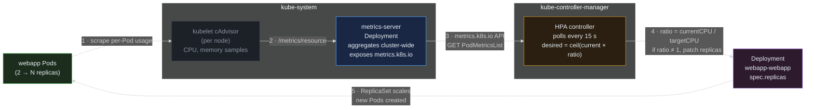

> **30 Days of DevOps** — Day 12 of 30. [← Day 11: Sealed Secrets](/articles/2026/05/22/day-11-sealed-secrets/)

Every webapp Deployment so far has had a fixed `replicaCount` — 2 in dev, 4 in prod. That is the easiest thing to declare in a Helm chart, and the worst thing to run in production. At 3 AM your two pods are idle and you are paying for capacity you do not use. At 9 AM a marketing email lands, traffic spikes 10×, and those same two pods get CPU-throttled into latency hell before anyone notices. Fixed replicas are a compromise between two failure modes; they do not solve either one.

The **Horizontal Pod Autoscaler (HPA)** removes the compromise. You tell it the minimum and maximum number of replicas, plus a target metric — typically CPU utilisation — and it scales the Deployment up or down to keep that metric near the target. Idle at 3 AM? Two pods. 10× traffic at 9 AM? Six pods. The HPA control loop runs every 15 seconds; the response curve is in minutes, not in human-reaction time.

CPU is the entry-level metric. The harder, more useful pattern is scaling on metrics your application actually cares about — requests-per-second, queue depth, websocket connections, p99 latency. The **Prometheus Adapter** plugs the metrics already in your Day 8 Prometheus stack into the same HPA API, so the autoscaler can react to anything you can write a PromQL query against.

## What you will build

By the end of this article you will have:

- The **metrics-server** installed in your kind cluster (it does not ship by default)
- An `HorizontalPodAutoscaler` resource added to the webapp Helm chart, gated by an `autoscaling.enabled` value
- The Deployment template patched to **omit `replicas:` when HPA owns scaling** — preventing a fight between Helm/Argo CD and the HPA controller
- A **k6 load Job** running inside the cluster that drives constant load against the webapp via the in-cluster Service DNS
- A live demo of **scale-up**: `kubectl get hpa --watch` showing replicas climb from 2 → 6 within ~90 seconds of load starting
- A live demo of **scale-down**: replicas falling back to 2 after the 5-minute stabilisation window
- The **Prometheus Adapter** installed and exposing `nginx_ingress_controller_requests_per_second` as a Kubernetes custom metric — and an HPA scaling on that metric directly

---

## How HPA works

Before installing anything, understand the control loop the HPA controller implements.



**Reading this diagram:**

The loop has five numbered arrows. Read them in order, left to right.

**Step 1.** The **webapp Pods** (green — the live workload being scaled) are scraped continuously by the **kubelet** running on each node. The kubelet uses an embedded cAdvisor to track CPU and memory consumption of every container on its node. This part of the loop is always running; it requires no installation.

**Step 2.** The **metrics-server** (blue, inside `kube-system`) is a separate Deployment you must install — kind clusters do not ship with it. It scrapes the `/metrics/resource` endpoint of every kubelet every 15 seconds, aggregates the per-Pod numbers cluster-wide, and stores them in memory. Nothing is persisted; this is a short-term sample buffer feeding the HPA, not a monitoring system.

**Step 3.** The **HPA controller** (amber — the decision-maker) lives inside the kube-controller-manager. Every 15 seconds it issues a `GET PodMetricsList` against the `metrics.k8s.io` API and receives the current CPU/memory usage for the Pods matching the HPA's `scaleTargetRef`. The `metrics.k8s.io` API is served by metrics-server via an `APIService` registration — that is how the HPA reaches the metrics without a direct dependency on the metrics-server Deployment.

**Step 4.** The controller computes the desired replica count using one formula: `desiredReplicas = ceil(currentReplicas × currentMetric / targetMetric)`. If your two pods are at 120 % of the 60 % CPU target, the ratio is 2.0, so desired = `ceil(2 × 2.0)` = 4. If the result differs from the current count, the controller patches the **Deployment** (purple — the resource HPA owns scaling for) `spec.replicas` field directly. Note that the HPA does *not* touch the Deployment template, only the replica count.

**Step 5.** The Deployment's existing controller takes over from there — it adjusts the ReplicaSet, which creates or terminates Pods. The cycle closes when the new Pods start reporting CPU usage, and the HPA recalculates on its next 15-second tick.

The two visual groupings — `kube-system` (the data plane) and `kube-controller-manager` (the control plane) — show that the metric collection and the scaling decision live in different parts of the cluster. This matters when you debug: if `kubectl top pods` works but the HPA reports `<unknown>`, the issue is between metrics-server and the controller; if `kubectl top` itself fails, the issue is upstream of metrics-server.

---

## Prerequisites

This article continues directly from Day 11. The following must be in place:

- The `devops-cluster` kind cluster running with NGINX Ingress Controller, cert-manager, kube-prometheus-stack, and Argo CD
- The `gitops-webapp` GitHub repo synced by an Argo CD Application named `webapp`
- The Sealed Secrets controller from Day 11 (used implicitly — your webapp consumes `webapp-secret` via `envFrom`)

Run the pre-flight check:

```bash
kubectl get application -n argocd webapp
kubectl get deployment -n default webapp-webapp
```

Expected output:

```text
NAME     SYNC STATUS   HEALTH STATUS
webapp   Synced        Healthy

NAME            READY   UP-TO-DATE   AVAILABLE   AGE
webapp-webapp   3/3     3            3           1d
```

The Deployment currently has 3 fixed replicas from the static `replicaCount: 3` set on Day 10. That value will become a default that the HPA overrides once we wire it in.

| Tool | Minimum version | Check |
|---|---|---|
| kubectl | 1.29 | `kubectl version --client` |
| Helm | 3.14 | `helm version --short` |
| gh CLI | 2.x | `gh --version` |

---

## Part 1 — Install metrics-server

The HPA does not collect metrics itself; it reads them from the `metrics.k8s.io` API. That API has to be served by something — by convention, the `metrics-server` Deployment maintained by the Kubernetes SIG. Production clusters from cloud providers (EKS, GKE, AKS) ship with metrics-server pre-installed; **kind clusters do not**, so installing it is the first step.

There is one kind-specific gotcha. By default, metrics-server validates the kubelet's serving certificate against the cluster CA. Kind's kubelet uses a self-signed certificate that is not in the cluster CA bundle, so validation fails and metrics-server cannot scrape any node. The fix is to pass `--kubelet-insecure-tls`, which tells metrics-server to skip the kubelet certificate check. This is safe inside a kind cluster (the network is local-only) but **must not be set in production** — that flag is a kind-cluster workaround, not a feature.

Add the metrics-server Helm repository:

```bash
helm repo add metrics-server https://kubernetes-sigs.github.io/metrics-server
helm repo update
```

Expected output:

```text
"metrics-server" has been added to your repositories
Hang tight while we grab the latest from your chart repositories...
...Successfully got an update from the "metrics-server" chart repository
Update Complete. ⎈Happy Helming!⎈
```

Install metrics-server with the kind-specific flag:

```bash
mkdir -p ~/30-days-devops/day-12 && cd ~/30-days-devops/day-12

# --set args puts the extra CLI argument on the metrics-server binary.
# The {} syntax escapes the curly braces so Helm passes a list, not a map.
helm install metrics-server metrics-server/metrics-server \
  --namespace kube-system \
  --version 3.12.2 \
  --set 'args={--kubelet-insecure-tls}'
```

Expected output:

```text
NAME: metrics-server
LAST DEPLOYED: Sat May 23 09:00:00 2026
NAMESPACE: kube-system
STATUS: deployed
REVISION: 1
TEST SUITE: None
NOTES:
***********************************************************************
* Metrics Server                                                       *
***********************************************************************
  Chart version: 3.12.2
  App version:   0.7.2
  Image tag:     registry.k8s.io/metrics-server/metrics-server:v0.7.2
***********************************************************************
```

Wait for the Pod to be ready and the APIService to register:

```bash
kubectl wait --namespace kube-system \
  --for=condition=ready pod \
  -l app.kubernetes.io/name=metrics-server \
  --timeout=120s
```

Expected output:

```text
pod/metrics-server-7f4c8b9d6-pp1xz condition met
```

Verify the metrics API is registered and available — without this, the HPA controller cannot read metrics:

```bash
kubectl get apiservice v1beta1.metrics.k8s.io
```

Expected output:

```text
NAME                     SERVICE                      AVAILABLE   AGE
v1beta1.metrics.k8s.io   kube-system/metrics-server   True        45s
```

The `AVAILABLE: True` state means the API server is successfully proxying requests to the metrics-server Pod. If this shows `False`, the HPA will report `<unknown>` for every metric and never scale (see Common Errors #1).

Sanity-check by querying live metrics:

```bash
# kubectl top reads from the same metrics.k8s.io API the HPA uses
kubectl top pods -n default
```

Expected output:

```text
NAME                            CPU(cores)   MEMORY(bytes)
webapp-webapp-6c9d8f7b5-x7k2p   1m           4Mi
webapp-webapp-6c9d8f7b5-q4m9r   1m           4Mi
webapp-webapp-6c9d8f7b5-z8j3n   1m           4Mi
```

Three idle nginx pods consuming 1 millicore each. This is the same data feed the HPA controller will use.

---

## Part 2 — Add HPA to the Helm chart

Three coordinated changes go into the chart, all in the `gitops-webapp` repo from Day 10–11:

1. Add `autoscaling.*` defaults to `webapp/values.yaml`
2. Patch `webapp/templates/deployment.yaml` to **conditionally omit `replicas:`** when autoscaling is enabled
3. Add a new template `webapp/templates/hpa.yaml`
4. Enable autoscaling in `webapp/values-dev.yaml`

Step 3 is the new file. Steps 1, 2, 4 are edits to existing files.

Clone (or `cd` into) the repo:

```bash
cd ~/30-days-devops/day-12
gh repo clone YOUR_GITHUB_USERNAME/gitops-webapp
cd gitops-webapp
```

### 2.1 — Add `autoscaling` defaults to values.yaml

Append the following block to the end of `webapp/values.yaml`:

```yaml
# Horizontal Pod Autoscaler defaults.
# When enabled, the HPA owns the Deployment's replica count and the
# static replicaCount above is ignored (the template drops the replicas
# field entirely when this is true — see deployment.yaml).
autoscaling:
  enabled: false                        # off by default; turn on per-env
  minReplicas: 2
  maxReplicas: 6
  targetCPUUtilizationPercentage: 60    # average across all pods
```

The defaults keep autoscaling **off** so that any existing release using this chart at `values.yaml` defaults does not silently start auto-scaling. Each environment values file opts in explicitly.

### 2.2 — Conditionally omit replicas in deployment.yaml

Open `webapp/templates/deployment.yaml`. Find the line:

```yaml
spec:
  replicas: {{ .Values.replicaCount }}
```

Replace it with this conditional block:

```yaml
spec:
  {{- if not .Values.autoscaling.enabled }}
  replicas: {{ .Values.replicaCount }}
  {{- end }}
```

This is the single most important detail in the whole article. **If the Deployment manifest contains `replicas: 3` while the HPA also patches `spec.replicas`, the two controllers fight every reconcile cycle.** Argo CD/Helm sees the live count drift away from 3 and sets it back. The HPA sees the live count is wrong and patches it again. The result is replica thrash and constant `OutOfSync` flapping in Argo CD.

By omitting the field entirely from the manifest when autoscaling is enabled, Helm/Argo CD never reconciles `spec.replicas` at all. The HPA becomes the sole owner of that field, which is exactly what the Kubernetes API server's field-manager system is designed to support.

### 2.3 — Create the HPA template

Create `webapp/templates/hpa.yaml` with the following content:

```yaml
{{- if .Values.autoscaling.enabled }}
apiVersion: autoscaling/v2
kind: HorizontalPodAutoscaler
metadata:
  name: {{ include "webapp.fullname" . }}
  labels:
    {{- include "webapp.labels" . | nindent 4 }}
spec:
  scaleTargetRef:
    apiVersion: apps/v1
    kind: Deployment
    name: {{ include "webapp.fullname" . }}
  minReplicas: {{ .Values.autoscaling.minReplicas }}
  maxReplicas: {{ .Values.autoscaling.maxReplicas }}
  metrics:
    - type: Resource
      resource:
        name: cpu
        target:
          type: Utilization
          averageUtilization: {{ .Values.autoscaling.targetCPUUtilizationPercentage }}
{{- end }}
```

Three things to note:

- **`apiVersion: autoscaling/v2`** is the stable HPA API. The older `autoscaling/v1` only supports CPU; v2 supports multiple metrics, custom metrics, and external metrics. Always use v2.
- **`type: Utilization`** scales based on the percentage of `resources.requests.cpu` actually used. `targetCPUUtilizationPercentage: 60` means the HPA tries to keep average per-pod CPU at 60 % of the requested 25 m — about 15 m sustained per pod under steady load. Without `resources.requests.cpu` set on the container, the HPA cannot compute utilisation and will report `<unknown>`.
- **`scaleTargetRef`** points at the Deployment by name; this is why the template uses the same `include "webapp.fullname"` helper as the Deployment manifest. Mismatched names would leave the HPA targeting a non-existent Deployment.

### 2.4 — Enable autoscaling in the dev values file

Edit `webapp/values-dev.yaml` and append:

```yaml
# Day 12: turn HPA on for the dev environment.
# minReplicas/maxReplicas/target inherit from values.yaml.
autoscaling:
  enabled: true
```

You inherit the chart defaults (`minReplicas: 2`, `maxReplicas: 6`, `target: 60 %`) — only the on-switch is overridden in dev. Production would typically set a higher `maxReplicas`.

---

## Part 3 — Commit and sync via Argo CD

Stage all four changes and push:

```bash
cd ~/30-days-devops/day-12/gitops-webapp

git add webapp/values.yaml webapp/values-dev.yaml \
        webapp/templates/deployment.yaml webapp/templates/hpa.yaml

git commit -m "feat(autoscaling): add HPA on CPU, drop static replicas when enabled"
git push origin main
```

Expected output:

```text
[main 9f1b4d3] feat(autoscaling): add HPA on CPU, drop static replicas when enabled
 4 files changed, 38 insertions(+), 1 deletion(-)
 create mode 100644 webapp/templates/hpa.yaml
```

Trigger the sync:

```bash
argocd app sync webapp --server argocd.local --insecure
```

Expected output (abbreviated):

```text
TIMESTAMP                  GROUP            KIND                       NAMESPACE  NAME            STATUS     HEALTH      MESSAGE
2026-05-23T09:15:01+05:30  autoscaling      HorizontalPodAutoscaler    default    webapp-webapp   OutOfSync  Missing
2026-05-23T09:15:02+05:30                   Deployment                 default    webapp-webapp   OutOfSync  Healthy
2026-05-23T09:15:03+05:30  autoscaling      HorizontalPodAutoscaler    default    webapp-webapp   Synced     Healthy     horizontalpodautoscaler.autoscaling/webapp-webapp created
2026-05-23T09:15:04+05:30                   Deployment                 default    webapp-webapp   Synced     Healthy     deployment.apps/webapp-webapp configured

SyncStatus:   Synced
HealthStatus: Healthy
```

Confirm the HPA is live:

```bash
kubectl get hpa -n default
```

Expected output:

```text
NAME            REFERENCE                  TARGETS         MINPODS   MAXPODS   REPLICAS   AGE
webapp-webapp   Deployment/webapp-webapp   cpu: 4%/60%     2         6         2          30s
```

Three things to read here:

- **`TARGETS: cpu: 4%/60%`** — current average CPU usage is 4 % of requested; target is 60 %. The numerator must be populated for the HPA to make decisions; if it shows `<unknown>/60%`, metrics-server is not feeding the HPA (Common Errors #1).
- **`REPLICAS: 2`** — the HPA has already scaled the Deployment from 3 down to 2 (its `minReplicas`). This is expected — at 4 % current usage, the desired replica count is well below `minReplicas`, so the HPA floors at the minimum.
- **`MINPODS / MAXPODS`** — the safety rails. Inside this range the HPA owns the count; outside it, the HPA refuses to scale further.

---

## Part 4 — Generate load with k6

[k6](https://k6.io/) is a load-generation tool from Grafana Labs. It runs JavaScript test scripts that drive HTTP requests at configurable concurrency, then reports latency, RPS, and error metrics. For this article you will run k6 as a Kubernetes Job — inside the cluster — so the load source is deterministic and not bottlenecked by your laptop's network.

Create a ConfigMap containing the k6 script, then a Job that mounts it:

```bash
cd ~/30-days-devops/day-12

cat > k6-load.yaml << 'EOF'
apiVersion: v1
kind: ConfigMap
metadata:
  name: k6-script
  namespace: default
data:
  load.js: |
    import http from 'k6/http';
    import { sleep } from 'k6';

    // 50 virtual users (concurrent simulated clients), each looping
    // GET / against the webapp Service. Runs for 5 minutes total.
    export const options = {
      vus: 50,
      duration: '5m',
    };

    export default function () {
      // Route through the NGINX Ingress Controller in-cluster, with the
      // Host header overridden so the controller matches the webapp Ingress
      // rule (webapp.local). This exercises the full ingress → service →
      // pod path, which is what nginx_ingress_controller_requests counts —
      // important for the custom-metric demo in Part 7.
      http.get('http://ingress-nginx-controller.ingress-nginx.svc.cluster.local/', {
        headers: { Host: 'webapp.local' },
      });
      sleep(0.1);
    }
---
apiVersion: batch/v1
kind: Job
metadata:
  name: k6-load
  namespace: default
spec:
  ttlSecondsAfterFinished: 60     # auto-delete the Pod 60 s after completion
  backoffLimit: 0
  template:
    spec:
      restartPolicy: Never
      containers:
        - name: k6
          image: grafana/k6:0.51.0
          args: ["run", "/scripts/load.js"]
          volumeMounts:
            - name: script
              mountPath: /scripts
      volumes:
        - name: script
          configMap:
            name: k6-script
EOF

kubectl apply -f k6-load.yaml
```

Expected output:

```text
configmap/k6-script created
job.batch/k6-load created
```

The k6 Pod starts immediately and begins driving traffic. The script hits the NGINX Ingress Controller's in-cluster Service (`ingress-nginx-controller.ingress-nginx.svc.cluster.local`) with the `Host: webapp.local` header — so requests follow the full ingress → service → pod path, exactly as production traffic would. This is required for Part 7's custom-metric demo to see anything. Each of the 50 virtual users issues a request every 100 ms, so steady-state load is ~500 RPS.

Check the Job is running:

```bash
kubectl get pods -n default -l job-name=k6-load
```

Expected output:

```text
NAME            READY   STATUS    RESTARTS   AGE
k6-load-xk2vp   1/1     Running   0          10s
```

---

## Part 5 — Watch HPA scale up

In one terminal, watch the HPA in real time:

```bash
kubectl get hpa -n default --watch
```

Expected output (each line is a state change, shown over ~2 minutes):

```text
NAME            REFERENCE                  TARGETS          MINPODS   MAXPODS   REPLICAS   AGE
webapp-webapp   Deployment/webapp-webapp   cpu: 4%/60%      2         6         2          2m
webapp-webapp   Deployment/webapp-webapp   cpu: 152%/60%    2         6         2          2m30s
webapp-webapp   Deployment/webapp-webapp   cpu: 152%/60%    2         6         6          2m45s
webapp-webapp   Deployment/webapp-webapp   cpu: 110%/60%    2         6         6          3m15s
webapp-webapp   Deployment/webapp-webapp   cpu: 62%/60%     2         6         6          4m
```

The sequence to read:

1. **t=0** — idle baseline, 4 % CPU, 2 replicas.
2. **t=30 s** — load has hit the two pods and metrics-server has scraped the new numbers; average CPU is 152 % of the 60 % target (each pod is doing ~38 m against a 25 m request). The HPA controller has observed the spike but the snapshot here is the moment just before it patches.
3. **t=45 s** — the controller has computed desired = `ceil(2 × 152/60)` = 6 and patched `spec.replicas` from 2 → 6 **in a single step**. The default `behavior.scaleUp` policy with `selectPolicy: Max` allows the larger of `+4 Pods` or `+100 %` per 15 s window — from 2 pods, both rules permit reaching 6 in one tick.
4. **t=75 s** — the four new Pods have come up and are absorbing requests; average CPU has dropped to 110 % of target. Still over, but the HPA cannot scale further because it is already at `maxReplicas: 6`.
5. **t=2 m** — load is fully distributed across all 6 pods; average CPU settles near the 60 % target and the HPA stops moving.

Open a second terminal and confirm new Pods exist:

```bash
kubectl get pods -n default -l app.kubernetes.io/instance=webapp
```

Expected output:

```text
NAME                            READY   STATUS    RESTARTS   AGE
webapp-webapp-6c9d8f7b5-x7k2p   1/1     Running   0          5m
webapp-webapp-6c9d8f7b5-q4m9r   1/1     Running   0          5m
webapp-webapp-6c9d8f7b5-aa1tt   1/1     Running   0          75s
webapp-webapp-6c9d8f7b5-bb2uu   1/1     Running   0          75s
webapp-webapp-6c9d8f7b5-cc3vv   1/1     Running   0          75s
webapp-webapp-6c9d8f7b5-dd4ww   1/1     Running   0          75s
```

Two original pods (5 min old) plus four added by the HPA in a single scale event. Cross-check CPU per pod via `kubectl top`:

```bash
kubectl top pods -n default -l app.kubernetes.io/instance=webapp
```

Expected output:

```text
NAME                            CPU(cores)   MEMORY(bytes)
webapp-webapp-6c9d8f7b5-x7k2p   15m          5Mi
webapp-webapp-6c9d8f7b5-q4m9r   14m          5Mi
webapp-webapp-6c9d8f7b5-aa1tt   16m          5Mi
webapp-webapp-6c9d8f7b5-bb2uu   15m          5Mi
webapp-webapp-6c9d8f7b5-cc3vv   15m          5Mi
webapp-webapp-6c9d8f7b5-dd4ww   14m          5Mi
```

Each pod is using ~15 millicores, which is 60 % of the 25 m request — the HPA has settled exactly on its target.

---

## Part 6 — Stop load and watch scale-down

The k6 Job ends after its 5-minute duration. Either wait for it, or delete it now to fast-forward:

```bash
kubectl delete job k6-load -n default
```

Expected output:

```text
job.batch "k6-load" deleted
```

Continue watching the HPA. You will notice **scale-down is much slower than scale-up** — this is intentional. Kubernetes' default scale-down behaviour holds the replica count steady for **5 minutes** after the last scale-up event before lowering it. The full timeline is roughly:

```text
NAME            REFERENCE                  TARGETS          MINPODS   MAXPODS   REPLICAS   AGE
webapp-webapp   Deployment/webapp-webapp   cpu: 12%/60%     2         6         6          8m
# ... 5 minutes of nothing — the stabilisation window protects against flapping ...
webapp-webapp   Deployment/webapp-webapp   cpu: 4%/60%      2         6         3          13m
webapp-webapp   Deployment/webapp-webapp   cpu: 4%/60%      2         6         2          14m
```

**Why scale-down is conservative:**

- A scale-up that turns out to have been premature wastes 30 s of compute. A scale-down that turns out to have been premature kills serving pods just as a second wave of traffic arrives — costing latency and dropped requests.
- The default `behavior.scaleDown.stabilizationWindowSeconds: 300` smooths out short load valleys. Brief dips below target do not immediately trigger termination.
- The default policy then allows a **maximum of 100 % of pods removed per 15 s**, but only after the window expires.

You can tune this in the HPA `spec.behavior` block. For example, to react more aggressively in a non-prod environment:

```yaml
spec:
  behavior:
    scaleDown:
      stabilizationWindowSeconds: 60   # default 300
      policies:
        - type: Percent
          value: 50                    # at most 50 % removed per period
          periodSeconds: 15
    scaleUp:
      stabilizationWindowSeconds: 0    # respond immediately to load
      policies:
        - type: Percent
          value: 100
          periodSeconds: 15
```

For this article we keep defaults — they reflect what almost every production HPA actually runs.

---

## Part 7 — Custom metric: scale on requests-per-second

CPU is a proxy. The real thing a webapp cares about is **request rate**. Two pods at 30 % CPU getting 1 000 RPS each are still close to saturation if the bottleneck is per-pod connection limits, not CPU. To scale on RPS directly, you wire the **Prometheus Adapter** into the HPA pipeline.

```mermaid
%%{init: {'theme': 'dark'}}%%
flowchart LR
    INGRESS["NGINX Ingress\ncontroller\n(emits nginx_ingress_\ncontroller_requests)"]:::ingress

    subgraph MON ["namespace monitoring"]
        PROM["Prometheus\n(kube-prometheus-stack\nfrom Day 8)"]:::prom
        ADAPTER["Prometheus Adapter\n(translates PromQL\n→ k8s metrics API)"]:::adapter
    end

    HPA["HPA controller\nreads custom.metrics.k8s.io"]:::hpa

    DEP["Deployment\nwebapp-webapp"]:::dep

    INGRESS -->|"1 · /metrics scrape"| PROM
    PROM -->|"2 · PromQL query\n(rate of requests)"| ADAPTER
    ADAPTER -->|"3 · custom.metrics.k8s.io\nGET requests_per_second"| HPA
    HPA -->|"4 · patch spec.replicas\nbased on RPS target"| DEP

    classDef ingress fill:#1c2128,stroke:#30363d,color:#8b949e
    classDef prom fill:#2d1a1a,stroke:#f85149,color:#e6edf3
    classDef adapter fill:#1a2744,stroke:#58a6ff,color:#e6edf3
    classDef hpa fill:#2a1f10,stroke:#d29922,color:#e6edf3
    classDef dep fill:#2d1a2d,stroke:#bc8cff,color:#e6edf3
```



**Reading this diagram:**

Four numbered arrows trace the metric's journey from emission to autoscaling decision.

**Step 1.** The **NGINX Ingress controller** (grey, on the left — an existing component from Day 7 that already exposes Prometheus metrics) increments the counter `nginx_ingress_controller_requests` on every request it routes. The counter is labelled with `service`, `host`, and `status`, so we can filter to just the webapp's traffic.

**Step 2.** The **Prometheus** server from Day 8 (red, inside the `monitoring` namespace — the colour signals "the metrics warehouse, owns the data") scrapes the ingress controller's `/metrics` endpoint every 30 s, accumulating the counter over time. PromQL queries run against this in-memory time-series store.

**Step 3.** The **Prometheus Adapter** (blue — a new component this section introduces) is a translation layer. It registers as the `APIService` for the `custom.metrics.k8s.io` API group, the same way metrics-server registers for `metrics.k8s.io`. When the HPA queries `custom.metrics.k8s.io/v1beta1/namespaces/default/services/webapp-webapp/requests_per_second`, the adapter resolves that path to a PromQL query against Prometheus, runs it, and returns the numeric result.

**Step 4.** The **HPA controller** (amber — same component as before, but now reading from a different API group) treats custom metrics identically to CPU. It computes a ratio, decides on a desired replica count, and patches the **Deployment** (purple). To the HPA, the only difference is the API path it queries — the scaling logic is unchanged.

The architectural insight: by registering as an `APIService`, the adapter makes any PromQL expression look like a first-class Kubernetes metric. You can scale on p99 latency, queue depth, websocket connection count — anything Prometheus can compute.

### 7.1 — Enable ingress-nginx Prometheus metrics

The NGINX Ingress Controller installed on Day 7 was deployed without its metrics endpoint enabled (the chart defaults to `controller.metrics.enabled: false` to keep the install lean). The `nginx_ingress_controller_requests` counter is therefore not currently being scraped by the Day 8 Prometheus. Turn it on with a `helm upgrade --reuse-values` so the rest of the Day 7 configuration stays intact:

```bash
# --reuse-values keeps the Day 7 values file untouched; we only flip the
# two new flags. The ServiceMonitor is created in the ingress-nginx
# namespace; Day 8 Prometheus has serviceMonitorSelectorNilUsesHelmValues=false
# so it picks up every ServiceMonitor cluster-wide automatically.
helm upgrade ingress-nginx ingress-nginx/ingress-nginx \
  --namespace ingress-nginx --reuse-values \
  --set controller.metrics.enabled=true \
  --set controller.metrics.serviceMonitor.enabled=true
```

Expected output (abbreviated):

```text
Release "ingress-nginx" has been upgraded. Happy Helming!
NAME: ingress-nginx
NAMESPACE: ingress-nginx
STATUS: deployed
REVISION: 2
```

Wait ~30 seconds for the ingress controller to roll out and for Prometheus to discover the new ServiceMonitor, then confirm the metric exists. Port-forward to Prometheus and query:

```bash
kubectl port-forward -n monitoring svc/kps-kube-prometheus-stack-prometheus 9090:9090 &
sleep 2
curl -s 'http://localhost:9090/api/v1/query?query=nginx_ingress_controller_requests' | jq '.data.result | length'
```

Expected output:

```text
3
```

A non-zero count means Prometheus is now collecting the metric (the exact number depends on how many ingress rules exist). If you see `0`, the ServiceMonitor has not been picked up yet — wait another 30 s and retry.

Kill the port-forward when done:

```bash
kill %1   # or kill the backgrounded job in your shell
```

### 7.2 — Install Prometheus Adapter

```bash
helm repo add prometheus-community https://prometheus-community.github.io/helm-charts
helm repo update

cd ~/30-days-devops/day-12

cat > values-adapter.yaml << 'EOF'
# Point the adapter at the in-cluster Prometheus from kube-prometheus-stack.
# The service name follows the chart's naming pattern from Day 8.
prometheus:
  url: http://kps-kube-prometheus-stack-prometheus.monitoring.svc
  port: 9090

# Custom rules tell the adapter which PromQL queries to expose as
# Kubernetes metrics. The default rules cover CPU/memory only; we add
# one rule for ingress-derived requests-per-second.
rules:
  default: false
  custom:
    - seriesQuery: 'nginx_ingress_controller_requests{namespace!="",service!=""}'
      resources:
        overrides:
          namespace: {resource: "namespace"}
          service:   {resource: "service"}
      name:
        matches: "^nginx_ingress_controller_requests$"
        as: "requests_per_second"
      metricsQuery: 'sum(rate(<<.Series>>{<<.LabelMatchers>>}[1m])) by (<<.GroupBy>>)'
EOF

helm install prometheus-adapter prometheus-community/prometheus-adapter \
  --namespace monitoring \
  --version 4.11.0 \
  -f values-adapter.yaml
```

Expected output:

```text
NAME: prometheus-adapter
LAST DEPLOYED: Sat May 23 09:30:00 2026
NAMESPACE: monitoring
STATUS: deployed
REVISION: 1
```

Wait for the adapter Pod and confirm the new APIService is registered:

```bash
kubectl wait --namespace monitoring \
  --for=condition=ready pod \
  -l app.kubernetes.io/name=prometheus-adapter \
  --timeout=120s

kubectl get apiservice v1beta1.custom.metrics.k8s.io
```

Expected output:

```text
pod/prometheus-adapter-6f8d5c7b9-tt9xy condition met

NAME                            SERVICE                                AVAILABLE   AGE
v1beta1.custom.metrics.k8s.io   monitoring/prometheus-adapter          True        45s
```

Verify the custom metric is being served (the adapter is querying Prometheus and converting the result):

```bash
# This is the raw API call the HPA will make. Reasonable load must already
# be flowing through the ingress for the value to be non-zero.
kubectl get --raw "/apis/custom.metrics.k8s.io/v1beta1/namespaces/default/services/webapp-webapp/requests_per_second" | jq .
```

Expected output:

```json
{
  "kind": "MetricValueList",
  "apiVersion": "custom.metrics.k8s.io/v1beta1",
  "metadata": {},
  "items": [
    {
      "describedObject": {
        "kind": "Service",
        "namespace": "default",
        "name": "webapp-webapp",
        "apiVersion": "/v1"
      },
      "metricName": "requests_per_second",
      "timestamp": "2026-05-23T09:32:18Z",
      "value": "0",
      "selector": null
    }
  ]
}
```

Value is `0` because there is no load right now. Send a quick burst to confirm the value moves:

```bash
# Apply the k6 Job again, wait 30 s for Prometheus to scrape, query again
kubectl apply -f k6-load.yaml
sleep 60
kubectl get --raw "/apis/custom.metrics.k8s.io/v1beta1/namespaces/default/services/webapp-webapp/requests_per_second" | jq '.items[0].value'
```

Expected output:

```text
"487"
```

~487 RPS — matches the 50 VUs × ~10 req/s/VU expected rate from the k6 script.

### 7.3 — Add a custom-metric scaling rule to the HPA

In real GitOps flow you would commit this to the chart. For demonstration purposes we patch the live HPA directly to keep this section tight:

```bash
kubectl patch hpa webapp-webapp -n default --type=merge -p '
{
  "spec": {
    "metrics": [
      {
        "type": "Resource",
        "resource": {
          "name": "cpu",
          "target": {"type": "Utilization", "averageUtilization": 60}
        }
      },
      {
        "type": "Object",
        "object": {
          "describedObject": {
            "apiVersion": "v1",
            "kind": "Service",
            "name": "webapp-webapp"
          },
          "metric": {"name": "requests_per_second"},
          "target": {"type": "Value", "value": "200"}
        }
      }
    ]
  }
}'
```

Expected output:

```text
horizontalpodautoscaler.autoscaling/webapp-webapp patched
```

The HPA now scales on **two metrics simultaneously**: CPU and RPS. Kubernetes runs each independently, gets a desired replica count from each, and picks the **maximum** — whichever metric is most stressed drives the scaling. Target is `200` RPS per Service (note: this is total RPS across all pods, not per-pod, because the metric is attached to the Service object). At 487 RPS observed against a 200 target, the HPA will quickly scale to `maxReplicas: 6`:

```bash
kubectl get hpa -n default
```

Expected output:

```text
NAME            REFERENCE                  TARGETS                     MINPODS   MAXPODS   REPLICAS
webapp-webapp   Deployment/webapp-webapp   487/200, 88%/60%            2         6         6
```

Two `TARGETS` columns now — both contributing to the scaling decision. To revert to CPU-only and clean up:

```bash
kubectl delete job k6-load -n default
# After validation, re-apply the chart's HPA template from Git to restore single-metric scaling:
argocd app sync webapp --server argocd.local --insecure
```

---

## Common Errors

**1. HPA shows `<unknown>/60%` for CPU target**

```text
NAME            REFERENCE                  TARGETS               MINPODS   MAXPODS   REPLICAS
webapp-webapp   Deployment/webapp-webapp   <unknown>/60%         2         6         2
```

The HPA cannot read CPU metrics. Three possible causes, in order of frequency:

```bash
# (a) metrics-server is not installed or not Available
kubectl get apiservice v1beta1.metrics.k8s.io
# AVAILABLE must be True. If False, check metrics-server logs:
kubectl logs -n kube-system -l app.kubernetes.io/name=metrics-server

# (b) On kind, metrics-server is installed but missing --kubelet-insecure-tls
# Symptom in logs: "x509: cannot validate certificate ... because it doesn't contain any IP SANs"
helm upgrade metrics-server metrics-server/metrics-server \
  --namespace kube-system \
  --reuse-values \
  --set 'args={--kubelet-insecure-tls}'

# (c) The Deployment container has no resources.requests.cpu set.
# HPA cannot compute Utilization without a request to compute against.
kubectl get deploy webapp-webapp -n default -o jsonpath='{.spec.template.spec.containers[0].resources.requests}'
# Must return {"cpu":"25m","memory":"32Mi"} or similar.
```

**2. Argo CD reports Deployment as `OutOfSync` after every HPA scale event**

Symptom: the Argo CD UI flickers between `Synced` and `OutOfSync`. The diff shows `spec.replicas: 3` (from Git) vs `spec.replicas: 5` (from cluster, set by HPA).

Cause: the deployment.yaml template was not patched to omit `replicas:` when autoscaling is enabled. Helm/Argo CD keep reconciling the static count back, fighting the HPA.

Fix: verify the template conditional from Part 2.2 is present. After redeploying, also set `ignoreDifferences` on the Application as a belt-and-braces guard:

```yaml
spec:
  ignoreDifferences:
    - group: apps
      kind: Deployment
      jsonPointers:
        - /spec/replicas
```

**3. `Error from server (NotFound): the server could not find the requested resource`**

```text
kubectl top pods -n default
error: Metrics API not available
```

The `metrics.k8s.io` APIService is registered but `Available: False`. Almost always a metrics-server problem on kind.

Fix:

```bash
# Look at why metrics-server is unhealthy
kubectl describe apiservice v1beta1.metrics.k8s.io | tail -10
kubectl logs -n kube-system deploy/metrics-server --tail=50
# Most common: kubelet TLS validation failure — apply --kubelet-insecure-tls
```

**4. HPA scales up but new Pods stay `Pending` with `0/3 nodes available`**

```text
Events:
  Warning  FailedScheduling  10s  default-scheduler  0/3 nodes are available: 3 Insufficient cpu.
```

The HPA created new replicas, but the kind cluster has run out of CPU capacity to schedule them. Each pod requests 25 m; six pods need 150 m, plus the system overhead.

Fix: either lower `resources.requests.cpu` in `values-dev.yaml`, or lower `maxReplicas`, or give Docker Desktop more CPU. On a 4-CPU laptop you usually want `maxReplicas: 4` for this chart.

**5. Custom metric returns empty `items: []`**

```bash
kubectl get --raw "/apis/custom.metrics.k8s.io/v1beta1/namespaces/default/services/webapp-webapp/requests_per_second" | jq
# {"kind":"MetricValueList","apiVersion":"custom.metrics.k8s.io/v1beta1","metadata":{},"items":[]}
```

The adapter is running but Prometheus has no matching series. Two checks:

```bash
# (a) Is the ingress controller actually being scraped? Open the Day 8 Prometheus UI
# (kubectl port-forward svc/kps-kube-prometheus-stack-prometheus 9090:9090 -n monitoring)
# and run: nginx_ingress_controller_requests
# If no series, the ingress-nginx ServiceMonitor is missing or pointing wrong.

# (b) Is there any traffic? Counters only exist after the first request.
# Send a few requests, wait 30 s, query again.
```

**6. HPA scales but `kubectl describe hpa` shows `Unable to fetch metrics from custom metrics API`**

```text
Conditions:
  Type            Status  Reason                Message
  AbleToScale     True    SucceededRescale
  ScalingActive   False   FailedGetObjectMetric  unable to get metric requests_per_second
```

Both metrics-server and Prometheus Adapter must report `AVAILABLE: True`. If the adapter is degraded, HPAs scaling on custom metrics stall while CPU-only HPAs continue working.

Fix:

```bash
kubectl get apiservice v1beta1.custom.metrics.k8s.io
kubectl logs -n monitoring deploy/prometheus-adapter --tail=30
# Common cause: wrong prometheus.url in values-adapter.yaml.
# Confirm the actual service:
kubectl get svc -n monitoring | grep prometheus
```

---

## Recap

In this article you:

- Installed **metrics-server** (chart 3.12.2 / app v0.7.2) into `kube-system` with the kind-specific `--kubelet-insecure-tls` flag, exposing the `metrics.k8s.io` API
- Added an `HorizontalPodAutoscaler` resource to the webapp Helm chart, gated by `.Values.autoscaling.enabled`, scaling on CPU utilisation between 2 and 6 replicas
- Patched the Deployment template to **conditionally omit `spec.replicas`** when autoscaling is enabled — preventing Helm/Argo CD from fighting the HPA
- Pushed the changes through the GitOps loop from Day 10 and watched Argo CD apply the new HPA resource
- Drove constant load against the webapp using a **k6 Kubernetes Job** routed through cluster DNS
- Watched the HPA scale 2 → 4 → 6 replicas as CPU climbed past target, then **scale back down** after the 5-minute stabilisation window
- Installed **Prometheus Adapter** (chart 4.11.0), wired a PromQL rule that converts `nginx_ingress_controller_requests` into the Kubernetes custom metric `requests_per_second`, and scaled the HPA on RPS in addition to CPU

The cluster now auto-adjusts its capacity to actual load — both to a system-level signal (CPU) and to an application-level signal (RPS).

---

## What's next

[Day 13: Network Policies — Default-Deny and Least-Privilege Pod Networking →](/articles/2026/05/24/day-13-network-policies/)

On Day 13 you will replace kind's default "every pod can talk to every pod" networking with a zero-trust posture. You will install the **Calico** CNI in policy-only mode, apply a **default-deny ingress NetworkPolicy** to the `default` namespace, then write explicit allow rules for ingress-nginx → webapp traffic. You will use `kubectl exec` and `nc` to prove that the webapp is unreachable from a sidecar pod in the same namespace until the policy explicitly permits it — turning the cluster network from a flat trust zone into segmented compartments.
