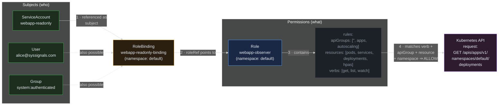

> **30 Days of DevOps** — Day 13 of 30. [← Day 12: HPA Autoscaling](/articles/2026/05/23/day-12-hpa-autoscaling/)

Every `kubectl` command runs through two gates: **authentication** ("who is making this call?") and **authorization** ("is this caller allowed to do that?"). The authorization gate is RBAC. Whenever you `kubectl get pods`, the API server asks RBAC whether your user has the `get` verb on the `pods` resource in the requested namespace; if RBAC says no, you get a 403 and the request never reaches etcd.

This same machinery applies to Pods. Every Pod runs as a **ServiceAccount** — an identity that exists inside the cluster, separate from the human-user identities you log in with. By default Kubernetes auto-creates a ServiceAccount called `default` in every namespace, attaches it to every Pod that does not specify a different one, and **automatically mounts a valid JWT token for that ServiceAccount into the Pod at `/var/run/secrets/kubernetes.io/serviceaccount/token`**. Every Pod you have deployed in this series — including the nginx webapp that does not talk to the Kubernetes API at all — has been carrying this token since Day 5.

That token is a credential. If the webapp container ever runs a vulnerable dependency, gets RCE'd, or has a misconfigured shared volume, the attacker now has it. And while the `default` ServiceAccount by itself has very few RBAC permissions, "very few" is not zero — and a token plus the in-cluster API endpoint is enough to start mapping the cluster.

The fix has two parts: **stop handing out tokens nobody needs**, and **define explicit, narrowly scoped identities for the things that do**.

## What you will build

By the end of this article you will have:

- A new ServiceAccount **`webapp-runtime`** for the webapp Pods, with **`automountServiceAccountToken: false`** set both on the SA and on the Pod spec — so the webapp ships with zero API credentials inside it
- The webapp Deployment template patched in the `gitops-webapp` chart to use the new SA, synced via Argo CD
- A second ServiceAccount **`webapp-readonly`** plus a namespace-scoped **`Role`** granting **only** `get / list / watch` on `pods`, `services`, `deployments`, and `horizontalpodautoscalers` in the `default` namespace
- A **`RoleBinding`** linking the two — this is the only thing that actually grants permission
- A live verification using **`kubectl auth can-i`** that confirms each permission is exactly what you intended — including the cases that should return `no`
- A clear mental model of the four-step RBAC chain: **subject → binding → role → verb-on-resource**
- An understanding of when to use **`Role`** (namespace-scoped) vs **`ClusterRole`** (cluster-wide) and the same distinction for bindings

---

## How RBAC authorization works

Every authorization decision the API server makes follows the same four-step chain.



**Reading this diagram:**

The whole authorization decision flows through four numbered arrows, left to right. There are no loops; every API request travels this path exactly once.

The **Subjects** group (green, left) lists the three kinds of identity Kubernetes recognises. **ServiceAccounts** live inside the cluster — they are the identity Pods use. **Users** and **Groups** live outside the cluster; they come from whatever authentication system you configured (OIDC, client certificates, etc.). All three kinds plug into the same RBAC machinery, which is why you can grant the exact same Role to a human user and to a Pod's ServiceAccount.

**Arrow 1** points from the subject to the **RoleBinding** (amber, centre). The binding is where permission is actually granted — not in the Role, not on the ServiceAccount itself. Without a binding, a Role is just a dormant list of verbs that applies to nobody. The binding has two fields: `subjects` (who this applies to) and `roleRef` (which Role's permissions to grant).

**Arrow 2** is `roleRef`. It connects the binding to a single **Role** (blue). The Role and the RoleBinding both live in a namespace — `default` in this example — and the binding can only point to a Role in the same namespace, or to a cluster-wide `ClusterRole` (more on that distinction in Part 5).

**Arrow 3** is the body of the Role — its **rules** (grey, descriptive). Each rule is a triplet: `apiGroups`, `resources`, and `verbs`. To allow `GET /apis/apps/v1/.../deployments`, the rule needs `apiGroups: ["apps"]`, `resources: ["deployments"]`, and `verbs: ["get"]` — all three must match. Listing `apiGroups: [""]` (the empty string) targets the core API group, which contains `pods`, `services`, `configmaps`, etc.

**Arrow 4** is the API server checking an incoming request against the rule. The incoming request (purple, right) is dissected into `<verb, apiGroup, resource, namespace>`. The API server walks every binding the subject participates in, expands each binding's `roleRef` into its rules, and looks for a rule whose verbs, apiGroups, and resources all match. The first match wins — RBAC is **allow-only**, so there are no deny rules to override the match. If no rule matches, the default answer is `forbidden` and the API server returns a 403.

The key insight: **RBAC is purely additive**. You cannot say "alice has admin except she cannot delete pods." You compose smaller Roles and bind exactly the ones you want — the absence of a permission is what enforces denial. This is why the principle of least privilege is so naturally expressed in Kubernetes RBAC: start from nothing, add only what is needed.

---

## Prerequisites

This article continues directly from Day 12. The following must be in place:

- The `devops-cluster` kind cluster running with Argo CD managing the `gitops-webapp` repository
- The webapp Deployment running (HPA may have scaled it; replica count does not matter)
- Local clone of `gitops-webapp` at `~/30-days-devops/day-12/gitops-webapp` (or wherever your previous days left it)

Pre-flight check:

```bash
# What ServiceAccount is the webapp currently running under?
kubectl get pods -n default -l app.kubernetes.io/instance=webapp \
  -o jsonpath='{.items[0].spec.serviceAccountName}'
echo
```

Expected output:

```text
default
```

That single word is what this article exists to fix.

| Tool | Minimum version | Check |
|---|---|---|
| kubectl | 1.29 | `kubectl version --client` |
| Helm | 3.14 | `helm version --short` |
| gh CLI | 2.x | `gh --version` |

---

## Part 1 — Audit the current state

Before changing anything, see exactly what the `default` ServiceAccount can do. `kubectl auth can-i` answers a single question — "is this subject allowed to do this verb on this resource right now?" — by running the request through the same RBAC machinery the API server uses, but without actually executing the request.

```bash
# Ask RBAC: can the default SA list Pods in the default namespace?
kubectl auth can-i list pods \
  --as=system:serviceaccount:default:default \
  -n default

# Same question, but for getting any Secret (a real attack-surface check)
kubectl auth can-i get secrets \
  --as=system:serviceaccount:default:default \
  -n default

# And the most permissive: can it do everything?
kubectl auth can-i '*' '*' \
  --as=system:serviceaccount:default:default \
  -n default
```

Expected output (three lines, one per command):

```text
no
no
no
```

Three `no`s. The `default` ServiceAccount on a vanilla cluster has no RBAC permissions of its own. That is the good news.

The bad news is that **the token is still mounted**, so it can still authenticate to the API server — it just gets 403'd on every request. Confirm by exec'ing into a webapp Pod:

```bash
POD=$(kubectl get pod -n default -l app.kubernetes.io/instance=webapp \
  -o jsonpath='{.items[0].metadata.name}')

# The well-known path where every Pod's SA token is mounted by default
kubectl exec -n default "$POD" -- ls -l /var/run/secrets/kubernetes.io/serviceaccount/
```

Expected output:

```text
total 0
lrwxrwxrwx 1 root root 13 May 24 09:00 ca.crt -> ..data/ca.crt
lrwxrwxrwx 1 root root 16 May 24 09:00 namespace -> ..data/namespace
lrwxrwxrwx 1 root root 12 May 24 09:00 token -> ..data/token
```

Three files: the cluster CA certificate (so the Pod can verify the API server's TLS), the namespace it is running in, and a JWT token signed by the cluster. The token is what gets sent as `Authorization: Bearer <token>` on every API call. Because nginx has no reason to call the API server, this is purely attack surface.

Quick demonstration of how much an attacker would have:

```bash
# From inside the Pod, hit the Kubernetes API and report on identity
kubectl exec -n default "$POD" -- /bin/sh -c '
  TOKEN=$(cat /var/run/secrets/kubernetes.io/serviceaccount/token)
  curl -s --cacert /var/run/secrets/kubernetes.io/serviceaccount/ca.crt \
    -H "Authorization: Bearer $TOKEN" \
    https://kubernetes.default.svc/apis/authentication.k8s.io/v1/selfsubjectreview \
    -X POST -H "Content-Type: application/json" \
    -d "{\"apiVersion\":\"authentication.k8s.io/v1\",\"kind\":\"SelfSubjectReview\"}"
' 2>/dev/null | head -20
```

Expected output (abbreviated JSON):

```json
{
  "kind": "SelfSubjectReview",
  "apiVersion": "authentication.k8s.io/v1",
  "status": {
    "userInfo": {
      "username": "system:serviceaccount:default:default",
      "uid": "8a1f3c40-...",
      "groups": [
        "system:serviceaccounts",
        "system:serviceaccounts:default",
        "system:authenticated"
      ]
    }
  }
}
```

The attacker now knows: this is the `default` SA in the `default` namespace, and it is a member of three groups. Any RoleBinding that grants permissions to `system:authenticated` (a surprisingly common pattern in older clusters) would apply to this token. Even on a hardened cluster, the attacker has a confirmed valid credential to probe with.

The fix is to not have a token at all.

---

## Part 2 — `webapp-runtime` ServiceAccount with no token

Add a new template to the chart that creates a SA explicitly designed for the webapp workload. Two flags matter:

- **`automountServiceAccountToken: false`** on the **ServiceAccount** itself — sets the default for any Pod that uses it
- **`automountServiceAccountToken: false`** on the **Pod spec** — belt-and-braces; this takes precedence over the SA-level setting

Setting it in both places is intentional. The Pod-level setting is the one Kubernetes actually honours on token mount; the SA-level setting documents intent and protects against accidental Pod-spec changes in the future.

### 2.1 — Add `webapp/templates/serviceaccount.yaml`

```bash
cd ~/30-days-devops/day-12/gitops-webapp

cat > webapp/templates/serviceaccount.yaml << 'EOF'
apiVersion: v1
kind: ServiceAccount
metadata:
  name: webapp-runtime
  namespace: {{ .Release.Namespace }}
  labels:
    {{- include "webapp.labels" . | nindent 4 }}
# nginx does not call the Kubernetes API. There is no reason for a
# token to be available on disk inside the Pod, so we disable the
# default automatic mount at the ServiceAccount level.
automountServiceAccountToken: false
EOF
```

### 2.2 — Patch `webapp/templates/deployment.yaml`

Open `webapp/templates/deployment.yaml` and locate the Pod `spec:` line (the inner one, inside `template:`). Add two fields immediately under it:

```yaml
    spec:
      serviceAccountName: webapp-runtime
      automountServiceAccountToken: false
      containers:
        - name: {{ .Chart.Name }}
          ...
```

The full Pod spec head should now look like this (the rest of the container spec is unchanged from Days 6 and 11):

```yaml
  template:
    metadata:
      labels:
        {{- include "webapp.selectorLabels" . | nindent 8 }}
    spec:
      serviceAccountName: webapp-runtime
      automountServiceAccountToken: false
      containers:
        - name: {{ .Chart.Name }}
          image: "{{ .Values.image.repository }}:{{ .Values.image.tag }}"
          # ... ports, probes, resources, envFrom (from Day 11) ...
```

### 2.3 — Commit, push, sync

```bash
git add webapp/templates/serviceaccount.yaml webapp/templates/deployment.yaml
git commit -m "feat(security): run webapp under webapp-runtime SA with no token"
git push origin main

argocd app sync webapp --server argocd.local --insecure
```

Expected output (abbreviated):

```text
[main 5d7e8f2] feat(security): run webapp under webapp-runtime SA with no token
 2 files changed, 14 insertions(+), 0 deletions(-)
 create mode 100644 webapp/templates/serviceaccount.yaml

TIMESTAMP                  GROUP   KIND            NAMESPACE  NAME             STATUS     HEALTH
2026-05-24T09:15:01+05:30          ServiceAccount  default    webapp-runtime   OutOfSync  Missing
2026-05-24T09:15:01+05:30          Deployment      default    webapp-webapp    OutOfSync  Healthy
2026-05-24T09:15:02+05:30          ServiceAccount  default    webapp-runtime   Synced     Healthy
2026-05-24T09:15:03+05:30          Deployment      default    webapp-webapp    Synced     Progressing

SyncStatus:   Synced
HealthStatus: Healthy
```

Argo CD created the ServiceAccount first (correct dependency order — the Deployment references it) then rolled the Deployment.

### 2.4 — Verify the token is gone

```bash
# Wait for the rollout
kubectl rollout status deployment/webapp-webapp -n default

# Get one of the freshly rolled Pods
POD=$(kubectl get pod -n default -l app.kubernetes.io/instance=webapp \
  -o jsonpath='{.items[0].metadata.name}')

# Confirm the new Pod uses webapp-runtime, not default
kubectl get pod -n default "$POD" \
  -o jsonpath='{.spec.serviceAccountName}'
echo

# Confirm the token mount is gone
kubectl exec -n default "$POD" -- \
  ls /var/run/secrets/kubernetes.io/serviceaccount/ 2>&1 || true
```

Expected output:

```text
deployment "webapp-webapp" successfully rolled out

webapp-runtime

ls: cannot access '/var/run/secrets/kubernetes.io/serviceaccount/': No such file or directory
```

The directory does not even exist any more. There is no token, no CA cert, no namespace file — nothing to steal. An attacker who lands code execution inside this Pod now has to do real work to find the API server before they can even try to authenticate.

---

## Part 3 — `webapp-readonly` ServiceAccount with a tight Role

Some workloads do legitimately need to talk to the API: dashboards, controllers, sidecars, scrapers. Those are the cases RBAC was designed for — give them an identity, define a Role with the minimum permissions, bind the two. This part creates that pattern end-to-end.

The scenario: a future status-checker Pod that wants to read the webapp's own resources — its Pods, its Service, its Deployment, its HPA. Nothing else. No Secrets. No write verbs. No cross-namespace reach.

### 3.1 — Three resources, one template file

A `ServiceAccount`, a `Role` (the permissions), and a `RoleBinding` (the link). All three go into one template file because they are inseparable — committing the SA without the binding leaves dead permissions; committing the Role without the binding leaves dead permissions; deleting any of them without the others leaves the other two stranded.

```bash
cat > webapp/templates/rbac-readonly.yaml << 'EOF'
# ServiceAccount for read-only observers of the webapp.
# Token mounting defaults to ON here — anything using this SA explicitly
# wants to talk to the API server.
apiVersion: v1
kind: ServiceAccount
metadata:
  name: webapp-readonly
  namespace: {{ .Release.Namespace }}
  labels:
    {{- include "webapp.labels" . | nindent 4 }}
---
# Role: a namespace-scoped permission list. This Role exists in the
# default namespace; bindings to it only grant access inside default.
apiVersion: rbac.authorization.k8s.io/v1
kind: Role
metadata:
  name: webapp-observer
  namespace: {{ .Release.Namespace }}
  labels:
    {{- include "webapp.labels" . | nindent 4 }}
rules:
  # Core API group ("") — Pods and Services live here.
  - apiGroups: [""]
    resources: ["pods", "services"]
    verbs: ["get", "list", "watch"]
  # apps API group — Deployments and ReplicaSets.
  - apiGroups: ["apps"]
    resources: ["deployments", "replicasets"]
    verbs: ["get", "list", "watch"]
  # autoscaling API group — HorizontalPodAutoscalers (Day 12).
  - apiGroups: ["autoscaling"]
    resources: ["horizontalpodautoscalers"]
    verbs: ["get", "list", "watch"]
---
# RoleBinding: connects the SA to the Role. Without this, both above
# are inert. The binding's namespace is what scopes the grant.
apiVersion: rbac.authorization.k8s.io/v1
kind: RoleBinding
metadata:
  name: webapp-readonly-binding
  namespace: {{ .Release.Namespace }}
  labels:
    {{- include "webapp.labels" . | nindent 4 }}
subjects:
  - kind: ServiceAccount
    name: webapp-readonly
    namespace: {{ .Release.Namespace }}
roleRef:
  # Points at the Role above. apiGroup MUST be rbac.authorization.k8s.io
  # — this is how the binding selector finds the Role kind.
  apiGroup: rbac.authorization.k8s.io
  kind: Role
  name: webapp-observer
EOF
```

The three resources are separated by `---` document markers so Helm renders them as three independent manifests. Argo CD applies them in document order (SA → Role → RoleBinding), which is also the right dependency order — the RoleBinding references both of the first two.

### 3.2 — Commit and sync

```bash
git add webapp/templates/rbac-readonly.yaml
git commit -m "feat(security): add webapp-readonly SA + Role + RoleBinding"
git push origin main

argocd app sync webapp --server argocd.local --insecure
```

Expected output (abbreviated):

```text
TIMESTAMP                  GROUP                       KIND            NAMESPACE  NAME                      STATUS     HEALTH
2026-05-24T09:30:01+05:30                              ServiceAccount  default    webapp-readonly           OutOfSync  Missing
2026-05-24T09:30:01+05:30  rbac.authorization.k8s.io   Role            default    webapp-observer           OutOfSync  Missing
2026-05-24T09:30:01+05:30  rbac.authorization.k8s.io   RoleBinding     default    webapp-readonly-binding   OutOfSync  Missing
2026-05-24T09:30:02+05:30                              ServiceAccount  default    webapp-readonly           Synced     Healthy
2026-05-24T09:30:02+05:30  rbac.authorization.k8s.io   Role            default    webapp-observer           Synced     Healthy
2026-05-24T09:30:02+05:30  rbac.authorization.k8s.io   RoleBinding     default    webapp-readonly-binding   Synced     Healthy

SyncStatus:   Synced
HealthStatus: Healthy
```

Three new resources, all Synced and Healthy. RBAC has no "running" state — these are pure configuration, evaluated on every API request.

---

## Part 4 — Verify every permission with `kubectl auth can-i`

The flag that makes this audit possible is `--as`, which tells `kubectl` to impersonate another subject when constructing the request. Combined with `kubectl auth can-i`, you can ask the cluster's actual RBAC engine — not a static analysis tool — whether the SA you just defined has exactly the permissions you intended.

```bash
# The full subject string for a ServiceAccount is:
#   system:serviceaccount:<namespace>:<name>
SA=system:serviceaccount:default:webapp-readonly

# Each line below is a separate question.
# Should all return "yes" — these are the permissions the Role grants.
kubectl auth can-i list pods            --as=$SA -n default
kubectl auth can-i get  services        --as=$SA -n default
kubectl auth can-i watch deployments    --as=$SA -n default
kubectl auth can-i list hpa             --as=$SA -n default

# Should all return "no" — these were deliberately not granted.
kubectl auth can-i create pods          --as=$SA -n default
kubectl auth can-i delete deployments   --as=$SA -n default
kubectl auth can-i get  secrets         --as=$SA -n default
kubectl auth can-i list pods            --as=$SA -n kube-system
```

Expected output (one line per question, in the same order):

```text
yes
yes
yes
yes
no
no
no
no
```

Eight checks, eight correct answers. Every one of those lines maps to a specific aspect of the RBAC chain:

- The first four match the verbs (`get`, `list`, `watch`) and resources (`pods`, `services`, `deployments`, `horizontalpodautoscalers`) listed in the Role's `rules`.
- `create pods` and `delete deployments` are `no` because their verbs are not in the Role — only `get/list/watch`. RBAC's allow-only model means anything not granted is denied.
- `get secrets` is `no` because `secrets` is not in the Role's `resources`. The webapp-readonly SA has no way to read Sealed Secrets' decrypted output, the kube-system tokens, or anything else stored in Secrets.
- `list pods` in `kube-system` is `no` because the binding is a `RoleBinding` — it only grants permissions inside the namespace where the binding lives (`default`). The same Role bound through a `ClusterRoleBinding` would have granted cluster-wide.

The last point is the most common RBAC bug, and the segue into Part 5.

---

## Part 5 — `Role` vs `ClusterRole`, `RoleBinding` vs `ClusterRoleBinding`

RBAC has two scope levels and four resource types. Pick the right combination or you will accidentally grant either too much or too little.

| | Namespace-scoped | Cluster-scoped |
|---|---|---|
| **Permissions** | `Role` | `ClusterRole` |
| **Grant** | `RoleBinding` | `ClusterRoleBinding` |

The interaction matters. Three of the four combinations are useful; one is invalid.

**Combination 1 — `Role` + `RoleBinding`** (what you built in Part 3)
Both resources live in a namespace. The binding can only grant permissions inside its own namespace. This is the everyday case: a workload in `default` that needs to read other resources in `default`.

**Combination 2 — `ClusterRole` + `ClusterRoleBinding`**
Both cluster-wide. The binding grants the role's permissions across every namespace. Use this for genuinely cluster-wide tooling: a monitoring agent that needs to scrape every node, a logging DaemonSet that needs to read every Pod's logs, an admission controller.

**Combination 3 — `ClusterRole` + `RoleBinding`**
The most subtle and most useful combination. The `ClusterRole` is a *reusable template* of permissions; the `RoleBinding` scopes the grant to a single namespace. This is how the built-in `view`, `edit`, and `admin` ClusterRoles get applied per-team — there is one `ClusterRole: view` cluster-wide, but every team gets its own `RoleBinding` granting `view` only inside their namespace.

**Combination 4 — `Role` + `ClusterRoleBinding`** — **invalid**. The API server rejects this at admission time because a `ClusterRoleBinding` cannot reference a namespaced `Role` — there is no defined namespace to scope it to.

Demonstrate combination 3 quickly without changing anything in the chart:

```bash
# The cluster ships with a ClusterRole called "view" — read-only on most resources.
kubectl get clusterrole view -o yaml | head -20

# Imagine you want to give the webapp-readonly SA the same broad read access,
# but ONLY in the default namespace. Use a RoleBinding to a ClusterRole:
kubectl create rolebinding webapp-readonly-view \
  --clusterrole=view \
  --serviceaccount=default:webapp-readonly \
  --namespace=default \
  --dry-run=client -o yaml
```

Expected output (abbreviated):

```text
# (head of view ClusterRole — note the long rules list)
kind: ClusterRole
apiVersion: rbac.authorization.k8s.io/v1
metadata:
  name: view
  ...
rules:
- apiGroups: [""]
  resources: [configmaps, endpoints, persistentvolumeclaims, ...]
  verbs: [get, list, watch]
...

# (RoleBinding that would scope it to default)
apiVersion: rbac.authorization.k8s.io/v1
kind: RoleBinding
metadata:
  name: webapp-readonly-view
  namespace: default
roleRef:
  apiGroup: rbac.authorization.k8s.io
  kind: ClusterRole
  name: view
subjects:
- kind: ServiceAccount
  name: webapp-readonly
  namespace: default
```

Notice `roleRef.kind: ClusterRole` while the binding itself is a `RoleBinding`. The binding's own namespace (`default`) is what limits the grant — not the Role's scope.

Do **not** apply this binding — the `webapp-observer` Role you wrote in Part 3 is intentionally narrower than `view` (it does not grant access to ConfigMaps, Secrets, Endpoints, etc.). Using the built-in `view` here would *widen* what `webapp-readonly` can do, which is the opposite of least privilege.

---

## Common Errors

**1. `RoleBinding` references a non-existent ServiceAccount — silently ineffective**

If the `subjects[].name` does not match an existing ServiceAccount, **the binding is still created successfully** — RBAC bindings are not validated against the existence of their subjects. The mistake only surfaces later, when the Pod cannot do anything its Role would have allowed.

```bash
# Check: every subject the binding refers to must actually exist.
kubectl get rolebinding webapp-readonly-binding -n default \
  -o jsonpath='{.subjects[*].name}'

kubectl get sa -n default
```

Fix: re-check the name spelling and the `namespace` field on each subject entry. Subjects are matched on the `(kind, name, namespace)` triple, all case-sensitive.

**2. `RoleBinding` and `Role` in different namespaces — `forbidden` at runtime**

```text
Error from server (Forbidden): pods is forbidden:
User "system:serviceaccount:default:webapp-readonly" cannot list resource
"pods" in API group "" in the namespace "default"
```

…even though both the SA and the Role exist. The Role is in `staging`, the RoleBinding is in `default`. A `RoleBinding` can only reference a `Role` in **its own namespace** (or any `ClusterRole`).

Fix:

```bash
kubectl get role webapp-observer -A
kubectl get rolebinding webapp-readonly-binding -A
# Both rows must show the same NAMESPACE column.
```

**3. Used `ClusterRoleBinding` when you meant `RoleBinding` — accidentally cluster-wide**

```bash
kubectl auth can-i list pods \
  --as=system:serviceaccount:default:webapp-readonly \
  -n kube-system
# Unexpected: yes
```

The intent was to grant `webapp-readonly` access only inside `default`. Using a `ClusterRoleBinding` granted it everywhere. This is the most dangerous RBAC misconfiguration because the grant works as expected in your test namespace and silently extends across the entire cluster.

Fix: confirm the binding kind:

```bash
kubectl get rolebinding,clusterrolebinding -A | grep webapp-readonly
# The matching row must be of type RoleBinding, not ClusterRoleBinding.
```

If a `ClusterRoleBinding` slipped in, delete it and create a `RoleBinding` instead.

**4. `apiGroup` typo — the rule never matches**

```yaml
rules:
  - apiGroups: ["app"]            # typo: should be "apps"
    resources: ["deployments"]
    verbs: ["get", "list"]
```

The rule is technically valid YAML and the API server accepts it without error. But `Deployment` lives in the `apps` API group, not `app`, so the rule never matches a real request. `kubectl auth can-i get deployments` returns `no`.

Common pitfalls:

- Core resources (`pods`, `services`, `configmaps`, `secrets`, `nodes`, `namespaces`) use the empty string `""` as their group, **not** `"core"`.
- `Deployment`, `ReplicaSet`, `StatefulSet`, `DaemonSet` are in `apps`.
- `HorizontalPodAutoscaler` is in `autoscaling`.
- `Job`, `CronJob` are in `batch`.
- `Ingress`, `NetworkPolicy` are in `networking.k8s.io`.
- All RBAC resources themselves are in `rbac.authorization.k8s.io`.

Fix: look up the right group with `kubectl api-resources`:

```bash
kubectl api-resources | grep -E "^deployments|^horizontalpod"
```

```text
deployments                         deploy           apps/v1                       true   Deployment
horizontalpodautoscalers            hpa              autoscaling/v2                true   HorizontalPodAutoscaler
```

The `APIVERSION` column gives you the value to put in `apiGroups` (drop the `/v1` — only the group prefix goes in the rule).

**5. `kubectl auth can-i` says `yes` but the real API call returns `forbidden`**

```bash
kubectl auth can-i list pods --as=$SA -n default
# yes
kubectl get pods -n default --as=$SA
# Error from server (Forbidden): pods is forbidden...
```

Almost always caused by a missing **resource name** in the rule when the call targets a specific named object, or by an admission controller (PodSecurity, ValidatingAdmissionPolicy) intercepting after RBAC said yes.

Fix: check whether the rule restricts to a specific `resourceNames`:

```bash
kubectl get role webapp-observer -n default -o jsonpath='{.rules[*].resourceNames}'
# Should print nothing if the rule applies to all objects of that kind.
```

If `resourceNames` is set, the rule only matches calls that name those specific objects — `kubectl list` (no name) fails because the engine sees a wildcard request.

**6. Pod cannot reach the API after `automountServiceAccountToken: false`**

```text
error: unable to read Kubernetes config: open /var/run/secrets/.../token: no such file or directory
```

Some application or sidecar inside the Pod *does* need to talk to the API — for example, an Argo CD application controller, a Prometheus Adapter, or a service-mesh sidecar. Disabling token mount cluster-wide for those Pods breaks them.

Fix: do not blanket-disable. Set `automountServiceAccountToken: false` only on Pods that genuinely need no API access (your application Pods), and leave it `true` (the default) on Pods that talk to the API. For Pods that need API access, also create a dedicated SA + Role + RoleBinding instead of relying on `default`.

---

## Recap

In this article you:

- Audited the over-broad `default` ServiceAccount your webapp Pods had been running under since Day 5 — and confirmed with `kubectl auth can-i` and a `selfsubjectreview` API call that the mounted token, while not granting RBAC permissions on its own, was still a valid credential carrying the Pod's identity
- Added a **`webapp-runtime` ServiceAccount** to the gitops-webapp chart with **`automountServiceAccountToken: false`** at both the SA and the Pod-spec levels — the webapp Pod now ships with **no `/var/run/secrets/kubernetes.io/serviceaccount/` directory at all**
- Patched the Deployment template to use the new SA, committed through the GitOps loop from Day 10, and verified the rollout
- Built a complete least-privilege identity for a hypothetical observer: a **`webapp-readonly` ServiceAccount**, a namespace-scoped **`Role: webapp-observer`** granting only `get / list / watch` on `pods`, `services`, `deployments`, `replicasets`, and `horizontalpodautoscalers`, and a **`RoleBinding`** linking them — all three in a single chart template so the dependency is committed atomically
- Verified eight RBAC outcomes (four `yes`, four `no`) with `kubectl auth can-i --as=` impersonation, including a `no` on `secrets` and a `no` on cross-namespace `list pods`
- Learned the four-step **subject → binding → role → verb-on-resource** chain that drives every RBAC decision, and the three valid (and one invalid) combinations of `Role`/`ClusterRole` × `RoleBinding`/`ClusterRoleBinding`

Every Pod in your cluster now either carries no token (the safe default for workloads that do not call the API) or carries a token bound to a precise, auditable Role.

---

## What's next

[Day 14: Pod Security Standards — Restricting Privilege at Admission Time →](/articles/2026/05/25/day-14-pod-security-standards/)

On Day 14 you will turn on **Pod Security Standards (PSS)** — the built-in admission controller that replaces the deprecated PodSecurityPolicy. You will label the `default` namespace with `pod-security.kubernetes.io/enforce: restricted`, then try to deploy a Pod with `securityContext.privileged: true` and watch the API server refuse it at admission, before the Pod ever reaches a node. You will harden the webapp Deployment with `runAsNonRoot: true`, `readOnlyRootFilesystem: true`, and a dropped capabilities set so it cleanly passes the `restricted` profile — making "principle of least privilege" enforceable for workloads in the same way RBAC enforces it for identities.
