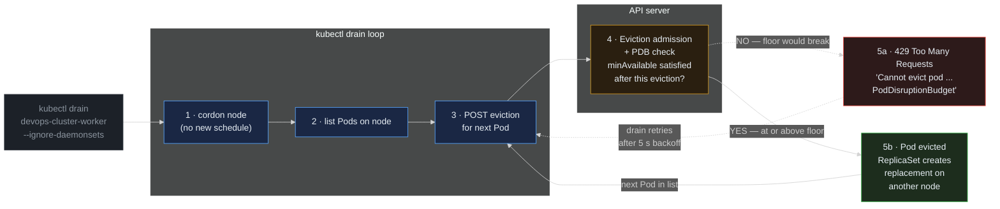

> **30 Days of DevOps** — Day 16 of 30. [← Day 15: ResourceQuotas and LimitRanges](/articles/2026/05/20/day-15-resource-quotas-limit-ranges/)

Pods get torn down all the time. Some of it is *voluntary* — someone runs `kubectl drain` to take a node out for maintenance, the cluster autoscaler decides a node is underutilised and scales it down, an operator triggers a rolling restart. These actions are caused by humans or controllers acting on the cluster on purpose. Others are *involuntary* — a node crashes, a kernel OOM kills a container, hardware fails — nobody asked for it, it just happened.

Kubernetes only protects against one of these categories: the voluntary one. The mechanism is the **PodDisruptionBudget (PDB)**, a tiny declarative policy object that says, in effect, "no matter what voluntary action you're taking, at least N matching Pods must remain Ready at any moment." The **eviction API** — the path every `kubectl drain` and autoscaler scale-down goes through — consults the PDB before evicting any matching Pod, and if the eviction would push the Ready count below the floor, the API server returns **HTTP 429 Too Many Requests** and the caller backs off and retries.

This is the difference between cluster maintenance that respects your workload and cluster maintenance that drops traffic on the floor. A `kubectl drain` against a node with two of your webapp Pods, with no PDB, evicts both Pods in quick succession — and for the 20–30 seconds it takes the ReplicaSet to schedule replacements on another node, the Service has zero healthy endpoints. With a PDB enforcing `minAvailable: 1`, the drain evicts one Pod, waits until the replacement is Ready, then evicts the second — total traffic loss: zero requests.

## What you will build

By the end of this article you will have:

- A `PodDisruptionBudget` resource added to the webapp Helm chart, gated by a `.Values.podDisruptionBudget.enabled` flag and parameterised with `minAvailable`
- The PDB synced via Argo CD and confirmed live with `kubectl get pdb` showing `ALLOWED DISRUPTIONS: 1`
- A live `kubectl drain` of one of the kind worker nodes — the Pod on that node is evicted, a replacement is scheduled on the other worker, and `webapp.local` keeps returning `HTTP/2 200` throughout
- A second `kubectl drain` attempt against the other worker — observed **blocked by the PDB** with a clear `Cannot evict pod ... PodDisruptionBudget` message, and `kubectl drain` retrying the eviction every few seconds in a loop
- An understanding of what PDB does *not* protect against — involuntary disruptions, Deployment rolling-update strategy, and the surprising fact that a Deployment with `replicas: 1` and `minAvailable: 1` is effectively un-drainable

---

## How the eviction API and PDB compose

A `kubectl drain` is not a single API call. It is a loop that issues one eviction request per Pod on the node, and each request goes through admission against every PDB whose selector matches.



**Reading this diagram:**

Read left to right, following the five numbered steps. Two of them (5a and 5b) are alternatives — the same eviction request either resolves to the green "Pod evicted" path or the red "blocked by PDB" path, depending on whether the PDB's floor would be broken.

**Steps 1–3 (blue, inside the drain loop)** are entirely client-side. `kubectl drain` is a wrapper script: it first cordons the node (annotates it so the scheduler will not place any new Pods there), then lists every Pod currently on the node, then issues one **POST to `/api/v1/namespaces/<ns>/pods/<name>/eviction`** for the first Pod. The drain command does *not* call DELETE on Pods directly — that would bypass the PDB entirely. It uses the eviction subresource specifically so admission, including PDB enforcement, runs.

**Step 4 (amber, inside the API server)** is where the eviction admission controller runs. For each PDB whose `spec.selector` matches the Pod being evicted, the controller computes: "if I let this eviction through, will `currentHealthy − 1 ≥ minAvailable`?" If yes (or if `maxUnavailable` is the form used: "will `desired − (currentHealthy − 1) ≤ maxUnavailable`?"), admit. If no — reject with **HTTP 429**.

**Step 5a (red, the rejection path)** carries the 429 back to the `kubectl drain` loop. The error body includes the PDB name and the current health numbers, so the user sees something like `Cannot evict pod ... default/webapp-pdb`. The drain loop is patient: it sleeps for ~5 seconds and **retries the same Pod's eviction** in step 3. It does not give up; it does not move on to the next Pod. The retry continues until either the PDB is satisfied (replacement Pods come Ready, raising `currentHealthy`) or the drain's `--timeout` elapses.

**Step 5b (green, the success path)** completes the eviction: the Pod's grace period starts, the kubelet sends SIGTERM, the container exits, the Pod is removed from etcd. The Deployment's ReplicaSet immediately notices its replica count is below `spec.replicas` and creates a new Pod, which the scheduler places on **another node** (the cordoned one is no longer eligible). The drain loop then proceeds to the next Pod in its list.

The architectural insight: **PDB is enforced by the API server, not by the drain client**. A clever user with a bash script that does `kubectl delete pod` instead of `kubectl drain` bypasses the PDB entirely — DELETE on a Pod resource goes through normal admission, not eviction admission. This is a deliberate split: PDB is a contract for the cluster control plane and its operators, not a runtime safety net against arbitrary deletion. The fix for that gap is RBAC (Day 13) — restrict who can DELETE Pods directly.

---

## Prerequisites

This article continues directly from Day 15. Required state:

- The `devops-cluster` kind cluster running with **at least 2 worker nodes** (the standard 3-node config has `control-plane`, `worker`, `worker2`)
- Argo CD managing the `gitops-webapp` repository
- The webapp Deployment running under the HPA from Day 12 (`minReplicas: 2`)
- The PSS-restricted security context and ResourceQuota from Days 14 and 15 in place

Pre-flight check:

```bash
# Three nodes — control-plane + 2 workers — is the assumption.
kubectl get nodes

# Two webapp Pods at HPA baseline. The -o wide column shows which node
# each Pod is on; that matters for the drain demo.
kubectl get pods -n default -l app.kubernetes.io/instance=webapp -o wide

# No PDB yet — this is the starting state.
kubectl get pdb -n default
```

Expected output:

```text
NAME                          STATUS   ROLES           AGE   VERSION
devops-cluster-control-plane  Ready    control-plane   2w    v1.30.0
devops-cluster-worker         Ready    <none>          2w    v1.30.0
devops-cluster-worker2        Ready    <none>          2w    v1.30.0

NAME                            READY   STATUS    RESTARTS   AGE   IP           NODE                    NOMINATED NODE   READINESS GATES
webapp-webapp-7d8c6b4f9-aa1bb   1/1     Running   0          1d    10.244.1.7   devops-cluster-worker    <none>           <none>
webapp-webapp-7d8c6b4f9-cc2dd   1/1     Running   0          1d    10.244.2.8   devops-cluster-worker2   <none>           <none>

No resources found in default namespace.
```

Two Pods, one on each worker — exactly the layout we want for the demo. If both your Pods happen to be on the same worker, restart the rollout (`kubectl rollout restart deployment webapp-webapp -n default`) until they land on different nodes. The Kubernetes scheduler's default `PodTopologySpread` constraints usually distribute them automatically, but they can collapse onto one node after enough evictions.

| Tool | Minimum version | Check |
|---|---|---|
| kubectl | 1.29 | `kubectl version --client` |
| Helm | 3.14 | `helm version --short` |
| gh CLI | 2.x | `gh --version` |

---

## Part 1 — Add a PodDisruptionBudget to the chart

Three coordinated changes go into the `gitops-webapp` repo. The PDB lives in the chart so it ships with the workload — operators draining nodes should not need to know about your PDB; it should already be there.

Open the chart:

```bash
cd ~/30-days-devops/day-12/gitops-webapp
```

### 1.1 — Add defaults to `webapp/values.yaml`

Append the following block to the end of the chart's default values:

```yaml
# PodDisruptionBudget defaults.
# Disabled by default so installing this chart at chart-defaults does not
# create a PDB that blocks node maintenance in clusters that don't expect one.
# Environment values files opt in explicitly.
podDisruptionBudget:
  enabled: false
  # Either minAvailable OR maxUnavailable — not both. We use minAvailable
  # because it composes cleanly with HPA: as the HPA scales up,
  # minAvailable: 50% scales with it.
  minAvailable: 50%
```

### 1.2 — Create `webapp/templates/poddisruptionbudget.yaml`

```yaml
{{- if .Values.podDisruptionBudget.enabled }}
apiVersion: policy/v1
kind: PodDisruptionBudget
metadata:
  name: {{ include "webapp.fullname" . }}
  labels:
    {{- include "webapp.labels" . | nindent 4 }}
spec:
  # The selector MUST match the Deployment's Pod labels. The chart's
  # selectorLabels helper is the same one used by the Service and the
  # Deployment, so the three resources agree on what "a webapp Pod" is.
  selector:
    matchLabels:
      {{- include "webapp.selectorLabels" . | nindent 6 }}
  minAvailable: {{ .Values.podDisruptionBudget.minAvailable }}
{{- end }}
```

`apiVersion: policy/v1` is the stable PDB API since Kubernetes 1.21 — do not use the older `policy/v1beta1`, which was removed in 1.25.

### 1.3 — Enable in `webapp/values-dev.yaml`

```yaml
# Day 16: turn on the PDB for the dev environment.
# minAvailable inherits from values.yaml (50%).
podDisruptionBudget:
  enabled: true
```

### 1.4 — Commit, push, sync

```bash
git add webapp/values.yaml webapp/values-dev.yaml webapp/templates/poddisruptionbudget.yaml
git commit -m "feat(availability): add PodDisruptionBudget with minAvailable: 50%"
git push origin main

argocd app sync webapp --server argocd.local --insecure
```

Expected output (abbreviated):

```text
TIMESTAMP                  GROUP    KIND                  NAMESPACE  NAME            STATUS     HEALTH
2026-05-27T10:00:01+05:30  policy   PodDisruptionBudget   default    webapp-webapp   OutOfSync  Missing
2026-05-27T10:00:02+05:30  policy   PodDisruptionBudget   default    webapp-webapp   Synced     Healthy

SyncStatus:   Synced
HealthStatus: Healthy
```

Confirm the PDB is live and computing the floor correctly:

```bash
kubectl get pdb -n default
```

Expected output:

```text
NAME            MIN AVAILABLE   MAX UNAVAILABLE   ALLOWED DISRUPTIONS   AGE
webapp-webapp   50%             N/A               1                     30s
```

Read the columns:

- **MIN AVAILABLE: 50%** — what you declared.
- **ALLOWED DISRUPTIONS: 1** — the PDB controller's live computation. With 2 webapp Pods currently Ready and a floor of `ceil(2 × 0.5) = 1`, the budget allows **one Pod to be evicted at a time**. As the HPA scales the Deployment up, this number grows proportionally — at 6 Pods, the floor is 3 and `ALLOWED DISRUPTIONS` becomes 3.

`MAX UNAVAILABLE: N/A` because we used `minAvailable`. You can use either, never both.

---

## Part 2 — Drain a node, watch eviction succeed

Pick the worker node hosting one of the webapp Pods (per the pre-flight check, either `devops-cluster-worker` or `devops-cluster-worker2`).

**Before draining, sanity-check where ingress-nginx is running**:

```bash
kubectl get pod -n ingress-nginx -l app.kubernetes.io/name=ingress-nginx -o wide
```

The ingress-nginx controller is a single-replica Deployment (not a DaemonSet) with no PodDisruptionBudget of its own. If it is running on the node you are about to drain, `kubectl drain` will evict it, and the host-port-80 → ingress mapping will be unreachable for the few seconds it takes the replacement Pod to come up on the other worker. The webapp's PDB does **not** protect ingress-nginx — only the webapp Pods. To keep the `curl` loop below at `200` throughout, drain a node that the ingress-nginx controller is **not** currently on. If you need to swap them, `kubectl delete pod` the ingress controller and wait for it to land on the other worker before starting the drain.

Drain the chosen worker:

```bash
# --ignore-daemonsets: don't try to evict DaemonSet Pods (kindnet and
#   kube-proxy in a standard kind cluster). The cordon on the node prevents
#   new DaemonSet Pods from being scheduled, but the existing ones stay
#   running until the node itself is removed.
#
# --delete-emptydir-data: emptyDir volumes (Day 14 added one at /tmp for
#   nginx's writable temp path) are by definition local to the Pod and
#   will be lost on eviction. The flag acknowledges this.
kubectl drain devops-cluster-worker \
  --ignore-daemonsets \
  --delete-emptydir-data
```

Expected output:

```text
node/devops-cluster-worker cordoned
Warning: ignoring DaemonSet-managed Pods: kube-system/kindnet-yyyyy, kube-system/kube-proxy-zzzzz
evicting pod default/webapp-webapp-7d8c6b4f9-aa1bb
pod/webapp-webapp-7d8c6b4f9-aa1bb evicted
node/devops-cluster-worker drained
```

In a second terminal, watch what happened during the drain:

```bash
# The PDB's status now shows currentHealthy briefly drop, then recover
kubectl get pdb -n default --watch

# Pods move to the surviving worker
kubectl get pods -n default -l app.kubernetes.io/instance=webapp -o wide --watch

# And — importantly — the webapp keeps serving traffic the whole time
while true; do curl -ksI -o /dev/null -w '%{http_code}\n' https://webapp.local; sleep 1; done
```

Expected behaviour (interleaved across the three watchers):

```text
# kubectl get pdb --watch
NAME            MIN AVAILABLE   MAX UNAVAILABLE   ALLOWED DISRUPTIONS   AGE
webapp-webapp   50%             N/A               1                     10m
webapp-webapp   50%             N/A               0                     10m   # evicting in progress
webapp-webapp   50%             N/A               1                     10m   # replacement Pod Ready

# kubectl get pods --watch (timeline)
NAME                            READY   STATUS              NODE
webapp-webapp-7d8c6b4f9-aa1bb   1/1     Running             devops-cluster-worker
webapp-webapp-7d8c6b4f9-cc2dd   1/1     Running             devops-cluster-worker2
webapp-webapp-7d8c6b4f9-aa1bb   1/1     Terminating         devops-cluster-worker
webapp-webapp-7d8c6b4f9-ee3ff   0/1     ContainerCreating   devops-cluster-worker2
webapp-webapp-7d8c6b4f9-ee3ff   1/1     Running             devops-cluster-worker2

# curl loop — every 1 second
200
200
200
200
200
200
```

Three things to notice:

1. **`ALLOWED DISRUPTIONS` dropped to 0 transiently** between the eviction and the replacement coming Ready. While that count is 0, any second drain attempt would be rejected. This is the gate the next part exploits.

2. **The replacement Pod landed on `worker2`**, not back on `worker`. The node is now cordoned (the drain's first action); the scheduler has marked it ineligible.

3. **The curl loop never returned anything other than 200.** The webapp's Service had at least one Ready endpoint throughout, because the PDB held the eviction back from creating a zero-endpoint window.

---

## Part 3 — Try a second drain, watch the PDB block it

Both webapp Pods are now on `worker2`. The PDB's current state is `ALLOWED DISRUPTIONS: 1` (the second Pod that came up restored the budget). Try to drain `worker2`:

```bash
kubectl drain devops-cluster-worker2 \
  --ignore-daemonsets \
  --delete-emptydir-data \
  --timeout=30s
```

The `--timeout` is added so this terminates instead of retrying forever — without it the demo would hang.

Expected output (the drain command will run for ~30 seconds, retrying):

```text
node/devops-cluster-worker2 cordoned
Warning: ignoring DaemonSet-managed Pods: kube-system/kindnet-..., kube-system/kube-proxy-...
evicting pod default/webapp-webapp-7d8c6b4f9-ee3ff
evicting pod default/webapp-webapp-7d8c6b4f9-cc2dd
error when evicting pods/"webapp-webapp-7d8c6b4f9-cc2dd" -n "default" (will retry after 5s): Cannot evict pod as it would violate the pod's disruption budget.
evicting pod default/webapp-webapp-7d8c6b4f9-cc2dd
error when evicting pods/"webapp-webapp-7d8c6b4f9-cc2dd" -n "default" (will retry after 5s): Cannot evict pod as it would violate the pod's disruption budget.
... (more retries) ...
There are pending pods in node "devops-cluster-worker2" when an error occurred: drain did not complete within 30s
```

Walk through what happened, line by line:

1. `node ... cordoned` — first action. New Pods cannot land here.
2. The drain identifies the two webapp Pods on this node and starts evicting in parallel order.
3. The first eviction (`ee3ff`) succeeds. The PDB had `ALLOWED DISRUPTIONS: 1` — one Pod could come out. Now `currentHealthy` drops to 1, exactly at the floor.
4. The second eviction (`cc2dd`) is admitted to the API server, the PDB check runs: "if I let this through, `currentHealthy` would become 0, which is below `minAvailable: 1`." **Rejected with 429**.
5. `kubectl drain` sleeps 5 seconds and retries. Each retry: same answer, same rejection.
6. After 30 s of retries the `--timeout` fires and drain exits with an error.

Meanwhile, in your watcher terminals you would see:

```text
# kubectl get pdb
webapp-webapp   50%   N/A   0   12m   # at the floor — no more evictions allowed

# kubectl get pods
NAME                            STATUS         NODE
webapp-webapp-7d8c6b4f9-cc2dd   Running        devops-cluster-worker2     # still here, rejected
webapp-webapp-7d8c6b4f9-ee3ff   Terminating    devops-cluster-worker2     # the successful eviction
webapp-webapp-7d8c6b4f9-gg4hh   Pending                                   # replacement — no node available
```

The replacement Pod (`gg4hh`) cannot be scheduled because **both workers are cordoned** (worker by Part 2, worker2 by this drain command's first action) and the control-plane has the standard `node-role.kubernetes.io/control-plane:NoSchedule` taint that user workloads don't tolerate.

This is the deadlock the PDB is protecting against: the cluster operator asked to drain two nodes faster than the workload can survive. Without the PDB, both Pods would have been evicted in quick succession and the webapp would have had a zero-endpoint window of 20–30 seconds while the replacement got Pending → Ready. With the PDB, the drain refused to proceed past the half-eviction point.

---

## Part 4 — Recover

Uncordon both nodes:

```bash
kubectl uncordon devops-cluster-worker
kubectl uncordon devops-cluster-worker2
```

Expected output:

```text
node/devops-cluster-worker uncordoned
node/devops-cluster-worker2 uncordoned
```

The pending replacement Pod (`gg4hh`) finds a node within the next scheduling cycle, comes Ready, and the PDB returns to `ALLOWED DISRUPTIONS: 1`:

```bash
kubectl get pdb,pods -n default -l app.kubernetes.io/instance=webapp -o wide
```

Expected output:

```text
NAME                                            MIN AVAILABLE   MAX UNAVAILABLE   ALLOWED DISRUPTIONS   AGE
poddisruptionbudget.policy/webapp-webapp        50%             N/A               1                     15m

NAME                                READY   STATUS    NODE
pod/webapp-webapp-7d8c6b4f9-cc2dd   1/1     Running   devops-cluster-worker2
pod/webapp-webapp-7d8c6b4f9-gg4hh   1/1     Running   devops-cluster-worker
```

Two Ready Pods on two different workers — the cluster is back to the pre-drain layout.

---

## Common Errors

**1. `ALLOWED DISRUPTIONS: 0` even when the workload is healthy**

```text
NAME            MIN AVAILABLE   MAX UNAVAILABLE   ALLOWED DISRUPTIONS   AGE
webapp-webapp   1               N/A               0                     5m
```

…but `kubectl get pods` shows the Deployment is fine. This is `minAvailable: 1` on a Deployment with `replicas: 1` — the only Pod is the floor, so the PDB will never permit any eviction. The cluster cannot drain the node that Pod is running on without `--disable-eviction` (which bypasses PDB entirely) or `--force`.

Fix: change `minAvailable` to a value lower than the replica count, or use `maxUnavailable: 1` so the PDB scales with the workload. As a rule of thumb, **never set `minAvailable: 100%` on anything with `replicas: 1`** — it locks the workload to its current node.

**2. PDB created, but ALLOWED DISRUPTIONS shows `0` and `currentHealthy: 0`**

```bash
kubectl describe pdb webapp-webapp -n default | grep -A 3 Status
```

```text
Status:
  Current Healthy:           0
  Desired Healthy:           1
  Disruptions Allowed:       0
  Expected Pods:             0
```

The PDB selector matches **no Pods**. Almost always a label-selector mismatch — the PDB's `spec.selector` does not align with the Deployment's `spec.template.metadata.labels`.

Fix:

```bash
# What does the PDB select on?
kubectl get pdb webapp-webapp -n default -o jsonpath='{.spec.selector}{"\n"}'
# What labels do the actual Pods carry?
kubectl get pods -n default -l app.kubernetes.io/instance=webapp \
  --show-labels --no-headers | head -1
```

The selector's `matchLabels` must be a subset of the Pod's labels. In Helm charts, always use the same `selectorLabels` helper that the Deployment and Service use — copy-pasting partial labels into the PDB template is the most common cause of this.

**3. `kubectl drain` hangs forever**

The drain command does not have `--timeout` and the PDB cannot ever be satisfied because the workload has nowhere to schedule a replacement (cordoned nodes everywhere, NoSchedule taint on control-plane, etc.).

Fix: always pass `--timeout=<duration>` to drain in scripts, and if you hit this manually, Ctrl-C, uncordon some nodes, and retry. Diagnose with:

```bash
kubectl get nodes
# Look for SchedulingDisabled (cordon) on every worker.

kubectl describe pod -n default <pending-pod> | grep -A 3 Events
# Look for "FailedScheduling" with "0/3 nodes are available".
```

**4. Deployment rolling update bypasses the PDB**

Common misconception: "I set `minAvailable: 1`, but my Deployment rollout still goes to 0 Ready Pods briefly."

The PDB is consulted by the **eviction API**. The Deployment controller does **not use the eviction API** for routine rollouts — it patches the ReplicaSet, which DELETEs Pods directly. PDB does not run on DELETE.

What controls rollout safety is the Deployment's own `spec.strategy.rollingUpdate.maxSurge` and `maxUnavailable`. Set both to sane values (Day 6's chart uses `maxSurge: 25%, maxUnavailable: 25%`) and **leave the PDB for drains and autoscaler scale-downs**, where it belongs.

**5. Cluster autoscaler ignores the PDB**

Some cluster autoscaler implementations (especially older or vendor-customised ones) bypass the eviction API when scaling down nodes — they DELETE Pods directly to avoid getting stuck on PDB rejections. Check your autoscaler's docs.

Fix: ensure the autoscaler is using a recent version, and set `--skip-nodes-with-system-pods=false` if you want it to respect PDB on system workloads.

**6. PDB blocks an evicted Pod's replacement — chicken-and-egg**

Scenario: `kubectl drain` evicts a Pod. The Deployment creates a replacement. The replacement can't schedule (no available node). The PDB now sees `currentHealthy: 1` of 2 desired. Drain tries to evict the next Pod — rejected. But the only way to get below the floor was the cordon we just created. The drain is stuck on its own side effect.

Fix: this is exactly the Part 3 scenario. The resolution is to uncordon a node so the replacement can schedule. The general lesson: drain **one node at a time**, wait for the replacement Pods to be Ready (PDB's `ALLOWED DISRUPTIONS` returns to its pre-drain value), then move to the next.

---

## Recap

In this article you:

- Walked through how the **eviction API** and **PodDisruptionBudget** compose: every `kubectl drain` is a loop of eviction calls, each one runs through admission, the PDB controller checks whether the floor would be broken, and the API server returns either success or **HTTP 429** to back the caller off
- Added a `PodDisruptionBudget` resource to the webapp Helm chart, gated by `.Values.podDisruptionBudget.enabled` and parameterised with **`minAvailable: 50%`** — a percentage form that **scales with the HPA** (at 6 Pods the floor becomes 3, not stuck at the 2-Pod baseline)
- Committed through the Day 10 GitOps loop, confirmed live with **`ALLOWED DISRUPTIONS: 1`** in `kubectl get pdb`
- Drained one kind worker node and watched the eviction proceed cleanly: one Pod terminated, replacement scheduled on the other worker, **`webapp.local` returned `HTTP/2 200` throughout** (verified with a `while true` curl loop)
- Drained a second worker and watched the **second eviction blocked by the PDB**, with the precise `Cannot evict pod as it would violate the pod's disruption budget` message and the drain retrying every 5 s until its `--timeout` expired
- Uncordoned both nodes, watched the pending replacement Pod find a home, and `ALLOWED DISRUPTIONS` return to 1
- Learned six common pitfalls, including the most important one: **PDB does not affect Deployment rolling updates**, because Deployment scale-down uses DELETE not eviction. Rolling update safety is the Deployment's `strategy.rollingUpdate` block; PDB is for drains and autoscaler scale-downs.

The webapp now survives routine cluster maintenance: a node drain, a planned restart, an autoscaler scale-down. Day 14 made the workload's *posture* safe; Day 15 made its *resource use* bounded; Day 16 makes its *availability* explicitly contractual.

---

## What's next

[Day 17: StatefulSets and Persistent Volumes — Stable Identity for Stateful Workloads →](/articles/2026/05/28/day-17-statefulsets-persistent-volumes/)

On Day 17 you will step out of the stateless-webapp story and into stateful workloads. You will deploy a PostgreSQL instance as a **StatefulSet** behind a **headless Service**, configure the StatefulSet's `volumeClaimTemplates` to provision a per-Pod **PersistentVolumeClaim**, and observe that — unlike the webapp's Pods — these Pods come up with **stable network identities** (`postgres-0`, `postgres-1`) and **stable disks** that survive Pod deletion. You will then exec into `postgres-0`, write a row, delete the Pod, and watch the same row come back when the kubelet recreates it. This is the architectural shift from "treat my workload as a herd of identical cattle" to "treat each instance as a named pet with permanent storage attached."
