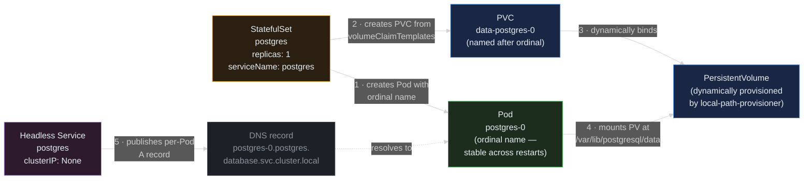

> **30 Days of DevOps** — Day 17 of 30. [← Day 16: PodDisruptionBudgets](/articles/2026/05/27/day-16-pod-disruption-budgets/)

Every workload in this series so far has been **stateless**: the webapp's Pods are interchangeable, their names are random hashes, and if a Pod gets killed it comes back with no memory of what it was doing. That model works because nginx doesn't care which Pod served the previous request — the request didn't change anything that needs to survive.

The moment a workload writes a byte it expects to read back later, that model breaks. A PostgreSQL Pod that gets a new name and a new empty disk every restart is not a database — it's a cron job that drops your data. A Kafka broker that loses its log directory on Pod restart is not a broker; it's chaos. Anything with state needs three things Deployments cannot give it:

1. **Stable identity** — the same Pod must always be `postgres-0`, never `postgres-9d8c6b-x7k2p`. Clients reconnect by name. Replication peers expect `broker-2` to always be `broker-2`.
2. **Stable storage** — the disk that `postgres-0` was using yesterday must be the same disk it uses today, even if the Pod was deleted and recreated.
3. **Ordered lifecycle** — `postgres-0` must be Ready before `postgres-1` starts. On scale-down, the higher ordinals are removed first.

Kubernetes' answer is the **StatefulSet**: a workload controller with all three guarantees baked in, paired with a **Headless Service** (`clusterIP: None`) that turns each Pod into a separately-resolvable DNS name, and **`volumeClaimTemplates`** that give every Pod its own `PersistentVolumeClaim` named after the ordinal.

## What you will build

By the end of this article you will have:

- A new namespace `database`, isolated from the webapp's `default`
- A plain `Secret` (`postgres-secret`) holding the Postgres superuser password — in a production setup you would ship this as a SealedSecret per Day 11
- A **Headless Service** named `postgres` (`clusterIP: None`) — what gives each Pod a stable DNS name like `postgres-0.postgres.database.svc.cluster.local`
- A **StatefulSet** running PostgreSQL 16-alpine with:
  - `replicas: 1` (single instance — multi-instance Postgres needs logical replication, out of scope today)
  - `volumeClaimTemplates` that auto-provisions a `1Gi` PVC named `data-postgres-0`
  - `PGDATA` pointing at a *subdirectory* of the mount path (the standard pattern that avoids Postgres tripping on `lost+found`)
- A live demo:
  - `kubectl exec` into `postgres-0`, create a table, insert a row
  - `kubectl delete pod postgres-0` — the Pod is gone
  - The StatefulSet recreates it with the **same name** and the **same disk** within ~5 seconds
  - `SELECT * FROM notes` returns the same row — disk persistence proven
- A DNS demo from a temporary `busybox` Pod: `nslookup postgres-0.postgres.database.svc.cluster.local` resolves cleanly to the Pod's IP — stable identity proven

---

## How StatefulSet, Headless Service, and PVC compose

Three independent objects, one stable topology.



**Reading this diagram:**

Read left to right, following the five numbered arrows. They show what the StatefulSet does the very first time it's applied, and (importantly) what it re-does if you delete the Pod and let the controller recreate it.

The **StatefulSet controller** (amber, left — the controller is the "thing in charge") is responsible for both the Pod and the PVC. Compare with a Deployment, which only manages Pods and treats storage as someone else's problem. The StatefulSet owns the *pairing* of Pod ordinal to PVC name, and that pairing is what makes restarts safe.

**Arrow 1** creates the **Pod** (green, the live workload) with the ordinal name `postgres-0`. Names are sequential and predictable: `postgres-0`, `postgres-1`, `postgres-2`, never a random hash. If you delete the Pod, the controller recreates it with the *same* name — that is the difference from a Deployment, which would generate a fresh random suffix.

**Arrow 2** creates the **PVC** (blue, persistent storage) from the StatefulSet's `volumeClaimTemplates`. The PVC's name is derived from the volume name in the template plus the Pod's ordinal: `data` + `postgres-0` → `data-postgres-0`. This naming convention is deterministic — it is *the* feature that lets a recreated Pod find its old disk.

**Arrow 3** is the storage layer: the PVC's `StorageClass` (in kind, the `standard` class backed by Rancher's `local-path-provisioner`) sees the unbound PVC and dynamically creates a matching **PersistentVolume**. On kind that PV is a `hostPath` directory on the node where the Pod ran first.

**Arrow 4** is the mount. The kubelet sees the Pod's `volumeMounts` reference `data` at `/var/lib/postgresql/data` and binds the PV to that path inside the container. Postgres writes its database files there. When the Pod is deleted and recreated (same name, ordinal preserved), the kubelet performs the same lookup and the same PV gets mounted — the bytes Postgres wrote yesterday are still there.

**Arrow 5** is the **Headless Service** (purple — the "names" side of the topology). A normal Service issues one ClusterIP and load-balances across all matching Pods; a *headless* Service (with `clusterIP: None`) issues no VIP at all. Instead it publishes one DNS A record per matching Pod, keyed by the Pod's name. So `postgres-0.postgres.database.svc.cluster.local` resolves directly to the IP of `postgres-0` — the same way `postgres-1` would resolve to the IP of `postgres-1` if we had one. Clients that need to talk to a specific replica (a Postgres follower picking its leader, a Kafka consumer reconnecting to its partition's leader) use this DNS scheme.

The key insight: **none of these three guarantees works without the other two.** Without `serviceName` on the StatefulSet, the Headless Service does not get the per-Pod A records. Without `volumeClaimTemplates`, the PVC name does not encode the ordinal and a restarted Pod would not find its old disk. Without ordinal names, the PVC selector would have nothing stable to match against. StatefulSet's job is to keep those three threads in sync.

---

## Prerequisites

This article continues from Day 16. Required state:

- The `devops-cluster` kind cluster running with the default `standard` `StorageClass` (kind ships this — `kubectl get sc` should show it)
- Day 14's PSS restricted label on the `default` namespace is **not** in the way: we will deploy into a fresh `database` namespace that has no PSS enforcement

Pre-flight check:

```bash
# Confirm the default StorageClass for dynamic PVC provisioning
kubectl get storageclass

# Confirm we don't already have a database namespace (or remove it cleanly first)
kubectl get ns database 2>&1 || true
```

Expected output:

```text
NAME                 PROVISIONER             RECLAIMPOLICY   VOLUMEBINDINGMODE      ALLOWVOLUMEEXPANSION   AGE
standard (default)   rancher.io/local-path   Delete          WaitForFirstConsumer   false                  3w

Error from server (NotFound): namespaces "database" not found
```

The `(default)` annotation on the StorageClass is what makes PVC creation work without specifying a class explicitly. `WaitForFirstConsumer` is the binding mode — important: the PV is not created until a Pod that uses the PVC is actually scheduled. This matters for the demo (see Common Errors #3).

| Tool | Minimum version | Check |
|---|---|---|
| kubectl | 1.29 | `kubectl version --client` |
| Helm | 3.14 | `helm version --short` |

---

## Part 1 — Namespace and Secret

```bash
mkdir -p ~/30-days-devops/day-17 && cd ~/30-days-devops/day-17

kubectl create namespace database

# The Secret is plain here for clarity. In a production GitOps setup
# this would be a SealedSecret per Day 11 — same content, but the YAML
# committed to Git is encrypted.
kubectl create secret generic postgres-secret \
  --namespace database \
  --from-literal=password=changeMeInProd_8f3kQ
```

Expected output:

```text
namespace/database created
secret/postgres-secret created
```

---

## Part 2 — The Headless Service

```bash
cat > postgres-service.yaml << 'EOF'
apiVersion: v1
kind: Service
metadata:
  name: postgres
  namespace: database
  labels:
    app: postgres
spec:
  # The single line that makes the Service "headless".
  # With clusterIP: None, Kubernetes skips VIP allocation and instead
  # publishes one DNS A record per Pod that matches the selector.
  # This is what lets clients address postgres-0 specifically.
  clusterIP: None
  selector:
    app: postgres
  ports:
    - name: postgres
      port: 5432
      targetPort: 5432
EOF

kubectl apply -f postgres-service.yaml
```

Expected output:

```text
service/postgres created
```

Confirm it is actually headless:

```bash
kubectl get svc -n database postgres
```

Expected output:

```text
NAME       TYPE        CLUSTER-IP   EXTERNAL-IP   PORT(S)    AGE
postgres   ClusterIP   None         <none>        5432/TCP   15s
```

`CLUSTER-IP: None` — confirmed. A regular Service would show an IP like `10.96.x.y` here.

---

## Part 3 — The StatefulSet

```bash
cat > postgres-statefulset.yaml << 'EOF'
apiVersion: apps/v1
kind: StatefulSet
metadata:
  name: postgres
  namespace: database
  labels:
    app: postgres
spec:
  # This MUST match the Headless Service's name. Without it the
  # StatefulSet still runs, but no per-Pod DNS records are published —
  # see Common Errors #1.
  serviceName: postgres
  replicas: 1
  selector:
    matchLabels:
      app: postgres
  template:
    metadata:
      labels:
        app: postgres
    spec:
      containers:
        - name: postgres
          image: postgres:16-alpine
          ports:
            - name: postgres
              containerPort: 5432
          env:
            - name: POSTGRES_PASSWORD
              valueFrom:
                secretKeyRef:
                  name: postgres-secret
                  key: password
            - name: POSTGRES_DB
              value: appdb
            # PGDATA points at a subdirectory inside the mount path,
            # not the mount path itself. On real block-storage backends
            # (EBS, GCE PD, Azure Disk) the freshly-formatted ext4 mount
            # root contains a `lost+found` directory that Postgres' initdb
            # refuses to run on top of; the subdirectory sidesteps it. On
            # kind's local-path (a hostPath bind-mount, not a formatted
            # volume) there is no lost+found, but we keep the subdirectory
            # pattern so the chart is portable to real storage unchanged.
            # See Common Errors #4.
            - name: PGDATA
              value: /var/lib/postgresql/data/pgdata
          volumeMounts:
            - name: data
              mountPath: /var/lib/postgresql/data
          resources:
            requests:
              cpu: 100m
              memory: 256Mi
            limits:
              cpu: 500m
              memory: 512Mi
  # The defining feature of StatefulSet — every replica gets its own
  # PVC, named <volumeName>-<podName>. For replicas: 1 we get exactly
  # one: data-postgres-0.
  volumeClaimTemplates:
    - metadata:
        name: data
      spec:
        accessModes:
          - ReadWriteOnce
        resources:
          requests:
            storage: 1Gi
EOF

kubectl apply -f postgres-statefulset.yaml
```

Expected output:

```text
statefulset.apps/postgres created
```

Wait for the Pod to be Ready. Postgres takes ~10–15 seconds on a cold start because it initialises the cluster on first boot. Use `kubectl rollout status` rather than `kubectl wait pod/postgres-0` here — immediately after `kubectl apply` the StatefulSet controller may not have created the Pod yet, and `kubectl wait` errors out with `no matching resources found` if the Pod object does not exist. `kubectl rollout status` watches the StatefulSet itself, so it handles that gap:

```bash
kubectl rollout status statefulset/postgres -n database --timeout=120s
```

Expected output:

```text
Waiting for 1 pods to be ready...
statefulset rolling update complete 1 pods at revision postgres-6d4f8b9c7...
```

Inspect what got created:

```bash
kubectl get statefulset,pod,pvc,pv -n database
```

Expected output:

```text
NAME                        READY   AGE
statefulset.apps/postgres   1/1     30s

NAME             READY   STATUS    RESTARTS   AGE
pod/postgres-0   1/1     Running   0          30s

NAME                                   STATUS   VOLUME                                     CAPACITY   ACCESS MODES   STORAGECLASS   AGE
persistentvolumeclaim/data-postgres-0  Bound    pvc-7e3c8b5d-2a1f-4d6e-9c08-3e7a1b5d8f24   1Gi        RWO            standard       28s

NAME                                                        CAPACITY   ACCESS MODES   RECLAIM POLICY   STATUS   CLAIM                            STORAGECLASS   AGE
persistentvolume/pvc-7e3c8b5d-2a1f-4d6e-9c08-3e7a1b5d8f24   1Gi        RWO            Delete           Bound    database/data-postgres-0         standard       28s
```

Four resources, each with the predictable name the diagram described:

- `pod/postgres-0` — ordinal name, not a random suffix
- `pvc/data-postgres-0` — `<volume-name>-<pod-name>`
- `pv/pvc-…` — the dynamically-provisioned PV; its name is a UUID assigned by the provisioner
- The PV's `CLAIM` column references the PVC by `<namespace>/<name>` — confirming the binding

---

## Part 4 — Verify stable DNS identity

The Headless Service publishes one A record per Pod. Confirm it works from inside the cluster by launching a one-shot `busybox` Pod and running `nslookup`:

```bash
# Run in the database namespace, which has no Pod Security enforcement.
# A bare busybox Pod has no securityContext, so it would be rejected by the
# "restricted" profile that Day 14 enforces on the default namespace — but
# DNS resolves cross-namespace anyway, so the database namespace is the right
# (and working) place to run this from.
kubectl run -it --rm dnstest \
  --namespace database \
  --image=busybox:1.36 \
  --restart=Never \
  -- nslookup postgres-0.postgres.database.svc.cluster.local
```

Expected output (Pod IP will differ):

```text
Server:		10.96.0.10
Address:	10.96.0.10:53

Name:	postgres-0.postgres.database.svc.cluster.local
Address: 10.244.1.18

pod "dnstest" deleted
```

`10.96.0.10` is the CoreDNS Service IP. The resolved `10.244.1.18` is the Pod IP of `postgres-0` — confirm by:

```bash
kubectl get pod postgres-0 -n database -o jsonpath='{.status.podIP}{"\n"}'
```

Expected output:

```text
10.244.1.18
```

Same IP. The DNS scheme `<pod-name>.<headless-service>.<namespace>.svc.cluster.local` works because (a) the StatefulSet's `serviceName` is set, and (b) the Service has `clusterIP: None`. Drop either and DNS falls back to round-robin across all matching Pods (a regular Service) or vanishes entirely (Service-less StatefulSet).

---

## Part 5 — Verify storage persistence

This is the central demo. Write data, delete the Pod, watch the same Pod come back with the same data.

```bash
# Step 1 — create a table and insert a row through psql.
kubectl exec -n database postgres-0 -- \
  psql -U postgres -d appdb -c "
    CREATE TABLE notes (id serial PRIMARY KEY, body text);
    INSERT INTO notes (body) VALUES ('hello from postgres-0 before deletion');
  "

# Step 2 — read it back to confirm.
kubectl exec -n database postgres-0 -- \
  psql -U postgres -d appdb -c "SELECT * FROM notes;"
```

Expected output:

```text
CREATE TABLE
INSERT 0 1

 id |                 body                  
----+---------------------------------------
  1 | hello from postgres-0 before deletion
(1 row)
```

Now delete the Pod. The StatefulSet controller will immediately recreate it:

```bash
# Note the Pod UID before deletion so we can confirm it actually changed
OLD_UID=$(kubectl get pod -n database postgres-0 -o jsonpath='{.metadata.uid}')
echo "old uid: $OLD_UID"

kubectl delete pod -n database postgres-0
```

Expected output:

```text
old uid: 7e3c8b5d-2a1f-4d6e-9c08-3e7a1b5d8f24
pod "postgres-0" deleted
```

Wait for the replacement. `kubectl delete pod` returns once the old Pod is gone but before the StatefulSet controller has recreated it — so once again use `kubectl rollout status` (which waits for the StatefulSet to be fully Ready again) rather than `kubectl wait pod/postgres-0`, which could momentarily hit `no matching resources found` in that gap:

```bash
kubectl rollout status statefulset/postgres -n database --timeout=120s

# Confirm it really is a new Pod (different UID) using the same name
NEW_UID=$(kubectl get pod -n database postgres-0 -o jsonpath='{.metadata.uid}')
echo "new uid: $NEW_UID"
```

Expected output:

```text
Waiting for 1 pods to be ready...
statefulset rolling update complete 1 pods at revision postgres-6d4f8b9c7...
new uid: 9b5d8f24-1f4d-6e08-3e7a-2a1f7e3c8b5d
```

Different UID, same name. Same Pod identity from the outside, fresh container inside. **Now the punchline** — the disk:

```bash
kubectl exec -n database postgres-0 -- \
  psql -U postgres -d appdb -c "SELECT * FROM notes;"
```

Expected output:

```text
 id |                 body                  
----+---------------------------------------
  1 | hello from postgres-0 before deletion
(1 row)
```

**Same row, same data.** The new Pod mounted the same PVC `data-postgres-0`, which is bound to the same PV, which still holds the bytes Postgres wrote before deletion. Postgres on startup ran its WAL replay against the on-disk state and the row was already there.

This is the StatefulSet promise in one demonstration: the workload object's identity (`postgres-0`) outlives the Pod's identity (the UID changed). Whatever data the workload writes to its volume is durable across the Pod's lifecycle.

---

## Part 6 — Scaling, ordering, and what NOT to do

Scale the StatefulSet by editing `replicas`. This is where StatefulSet's third guarantee — **ordered lifecycle** — becomes visible:

```bash
# Caution: this creates postgres-1 with an EMPTY disk. Postgres does
# NOT auto-replicate from postgres-0; this Pod would come up as an
# independent, blank database. For a real multi-replica Postgres you
# need a Helm chart like bitnami/postgresql-ha or a dedicated operator
# (CloudNativePG, Zalando postgres-operator) that wires up replication.
# We do this here only to demonstrate scaling mechanics, then scale back.
kubectl scale statefulset postgres -n database --replicas=2

# Watch the ordered scale-up: postgres-1 only starts once postgres-0
# is Ready.
kubectl get pod -n database -l app=postgres --watch
```

Expected output (incrementally):

```text
NAME         READY   STATUS    RESTARTS   AGE
postgres-0   1/1     Running   0          5m
postgres-1   0/1     Pending   0          0s
postgres-1   0/1     ContainerCreating   0          2s
postgres-1   1/1     Running             0          12s
```

Two Pods, but with independent data. Now scale back to 1:

```bash
kubectl scale statefulset postgres -n database --replicas=1
```

Watch what gets terminated:

```bash
kubectl get pod -n database -l app=postgres --watch
```

Expected output:

```text
postgres-1   1/1     Terminating   0          1m
postgres-1   0/1     Terminating   0          1m
# postgres-1 gone; postgres-0 untouched
```

**Scale-down removes the highest ordinal first.** `postgres-1` goes; `postgres-0` stays. The opposite of scale-up. This matters for stateful workloads — if you had a leader-follower topology with `postgres-0` as leader, you would not want a scale-down to remove the leader.

Notice what *did not* get deleted:

```bash
kubectl get pvc -n database
```

Expected output:

```text
NAME              STATUS   VOLUME                                     CAPACITY   ACCESS MODES   STORAGECLASS   AGE
data-postgres-0   Bound    pvc-7e3c8b5d-2a1f-4d6e-9c08-3e7a1b5d8f24   1Gi        RWO            standard       8m
data-postgres-1   Bound    pvc-c4f2a8b6-9e1d-4a5f-8b27-1c3e6d9f0a4b   1Gi        RWO            standard       2m
```

**`data-postgres-1` survived the scale-down.** PVCs created from `volumeClaimTemplates` are not garbage-collected by StatefulSet — by design, so that an accidental scale-down does not destroy data. If you ever scale back up to 2, `postgres-1` will rebind to its old PVC and find whatever bytes were there before. To actually delete the data you must delete the PVC explicitly:

```bash
kubectl delete pvc -n database data-postgres-1
```

Expected output:

```text
persistentvolumeclaim "data-postgres-1" deleted
```

---

## Common Errors

**1. StatefulSet running, but `nslookup postgres-0.postgres...` returns NXDOMAIN**

```text
*** Can't find postgres-0.postgres.database.svc.cluster.local: No answer
```

Cause: the StatefulSet's `spec.serviceName` field is missing, or its value does not match a real Service. Without that line, the DNS controller does not publish per-Pod A records, even though the Pods exist and have IPs.

Fix:

```bash
kubectl get statefulset -n database postgres -o jsonpath='{.spec.serviceName}{"\n"}'
# Must print: postgres (or whatever your Service name is)
kubectl get svc -n database
# Must include a Service with that exact name AND clusterIP: None
```

**2. PVC stuck in `Pending` with `no persistent volumes available`**

```bash
kubectl describe pvc -n database data-postgres-0 | tail -10
```

```text
Events:
  Warning  ProvisioningFailed  10s  persistentvolume-controller
    storageclass.storage.k8s.io "standard" not found
```

Cause: no default StorageClass on the cluster. kind ships with one (`standard` backed by `rancher.io/local-path`) but some custom kind configs disable it.

Fix:

```bash
kubectl get storageclass
# One of them must have annotation "storageclass.kubernetes.io/is-default-class: true"
# If none does, reinstall the local-path-provisioner:
kubectl apply -f https://raw.githubusercontent.com/rancher/local-path-provisioner/v0.0.30/deploy/local-path-storage.yaml
```

**3. PVC stays `Pending` indefinitely with `WaitingForFirstConsumer`**

```text
Events:
  Normal  WaitForFirstConsumer  5s  persistentvolume-controller
    waiting for first consumer to be created before binding
```

This is **not an error** — it is the `WaitForFirstConsumer` binding mode on the StorageClass deferring PV creation until a Pod actually schedules. The PVC will bind the moment the Pod gets a node assignment.

Fix: confirm the Pod is making progress:

```bash
kubectl describe pod -n database postgres-0 | tail -10
# If the Pod is FailedScheduling for some other reason, fix that first.
# If the Pod is Pending because of this PVC, the PVC is also waiting for
# the Pod — a deadlock that resolves once anything kicks the scheduler.
# Often a delete + reapply of the StatefulSet does it.
```

**4. Postgres Pod crash-loop with `directory "/var/lib/postgresql/data" exists but is not empty`**

```text
initdb: error: directory "/var/lib/postgresql/data" exists but is not empty
It contains a lost+found directory, perhaps due to it being a mount point.
```

Cause: `PGDATA` was set to the mount path itself, not a subdirectory, **and** the volume backend formats the volume as a filesystem. On real block-storage CSI drivers (AWS EBS, GCE PD, Azure Disk, Ceph RBD) the volume is a freshly-formatted ext4/xfs block device, and the filesystem driver creates a `lost+found` directory at the root. Postgres' `initdb` refuses to run on a non-empty directory, so it crash-loops.

**This specific error will *not* appear on kind.** kind's `local-path-provisioner` provisions a `hostPath` bind-mount of a directory on the node — there is no formatted block device and therefore no `lost+found`. A learner who points `PGDATA` directly at `/var/lib/postgresql/data` on kind will *not* hit this error. So why does this article still use the subdirectory? Portability: the moment you move the same chart to a real cloud StorageClass, the mount root *will* contain `lost+found`, and the subdirectory pattern means the manifest works unchanged. Treat it as the safe default everywhere.

Fix (on a backend where you do hit this): set `PGDATA` to a subdirectory of the mount:

```yaml
env:
  - name: PGDATA
    value: /var/lib/postgresql/data/pgdata     # subdir, not the mount root
volumeMounts:
  - name: data
    mountPath: /var/lib/postgresql/data        # mount root — may have lost+found
```

This is exactly the pattern Part 3 uses; verify both lines if you see this error.

**5. Pod rescheduled to a different node after the original node was drained — Pod stuck `Pending` with `node(s) had volume node affinity conflict`**

```text
Events:
  Warning  FailedScheduling   1m  default-scheduler
    0/3 nodes are available: 2 node(s) had volume node affinity conflict.
```

Cause: kind uses Rancher's `local-path-provisioner`, which creates the PV as a `hostPath` on a specific node. The PV has a `nodeAffinity` requirement pinning it to that node. If the Pod is forced to schedule elsewhere (because the original node was drained or cordoned), it cannot mount its local volume.

Fix: this is a kind-specific limitation, not a Postgres bug. On a real cluster you would use a network-backed StorageClass (EBS on EKS, PD on GKE, Azure Disk, Ceph, etc.) that lets the PV follow the Pod. To recover on kind:

```bash
kubectl uncordon <original-node>
# OR delete the PVC and Pod to let the workload provision a new PV on the new node
# (loses the data — only do this if you do not care)
```

**6. Deleting the StatefulSet leaves PVCs behind — and that's intentional**

```bash
kubectl delete statefulset postgres -n database
kubectl get pvc -n database
# data-postgres-0 still here!
```

Cause: not a bug. StatefulSet's deletion cascade does not include PVCs created by `volumeClaimTemplates`, so that an accidental delete of the workload does not destroy your data. The `spec.persistentVolumeClaimRetentionPolicy` field (alpha in 1.23, beta and on-by-default from Kubernetes 1.27, GA in 1.32) lets you opt into deleting the PVCs instead:

```yaml
spec:
  persistentVolumeClaimRetentionPolicy:
    whenDeleted: Delete   # default is Retain
    whenScaled: Retain    # default is Retain
```

Fix: if you actually wanted the PVCs gone:

```bash
kubectl delete pvc -n database -l app=postgres
```

---

## Recap

In this article you:

- Mapped the **three guarantees** a StatefulSet provides — stable identity (ordinal names), stable storage (per-Pod PVC from `volumeClaimTemplates`), ordered lifecycle (sequential scale-up, reverse scale-down) — and how a **Headless Service** plus `serviceName` on the StatefulSet ties them together with **per-Pod DNS records**
- Deployed a single-replica **PostgreSQL 16-alpine** StatefulSet into a fresh `database` namespace, behind a Headless Service named `postgres`, with a `1Gi` PVC dynamically provisioned by kind's `standard` (local-path) StorageClass
- Confirmed the wiring by inspecting the four named resources (`statefulset/postgres`, `pod/postgres-0`, `pvc/data-postgres-0`, the dynamically named PV) and watching the PVC name encode the Pod ordinal
- Verified **stable DNS identity** by running a one-shot `busybox` Pod that resolved `postgres-0.postgres.database.svc.cluster.local` to the Pod's IP
- Demonstrated **storage persistence** by inserting a row, deleting the Pod (UID changes), watching the StatefulSet recreate `postgres-0` with the same name on the same PVC, and reading the same row back from the new container
- Explored **ordered scaling** (postgres-1 only starts after postgres-0 is Ready; scale-down removes the highest ordinal first) and learned that **PVCs survive scale-down by default** unless you opt in with `persistentVolumeClaimRetentionPolicy`
- Worked through six common pitfalls — missing `serviceName`, no default StorageClass, the (non-error) `WaitForFirstConsumer` binding mode, the `PGDATA`-on-mount-root crashloop, the kind-specific `node affinity conflict` after drain, and the intentional StatefulSet→PVC retention behaviour

The cluster now hosts a real piece of state alongside the stateless webapp from the previous 16 days. The pattern generalises immediately — swap the image and ports and you can run Kafka, Redis (in append-only-file mode), Elasticsearch, MinIO, or any other stateful workload that needs the same three guarantees.

---

## What's next

[Day 18: Init Containers and Sidecars — Multi-Container Pod Patterns →](/articles/2026/05/28/day-18-init-containers-sidecars/)

On Day 18 you will exploit the fact that a Pod can hold *more than one container*. You will add an **init container** to the webapp Deployment that runs once before the main container — fetching a config file from S3, running database migrations, waiting on a TCP port — and exits cleanly before nginx starts. Then you will attach a **sidecar container** to the same Pod that lives for the Pod's whole life — a log shipper, a metric exporter, a service-mesh proxy. You will also use the **`restartPolicy: Always`** sidecar pattern that became stable in Kubernetes 1.29, which finally fixes the long-standing "init containers that need to keep running" hack. Multi-container Pods are one of the most flexible primitives in Kubernetes and one of the most often misused.
