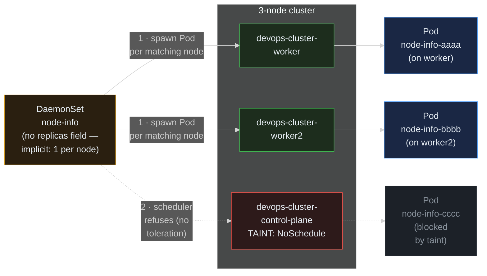

> **30 Days of DevOps** — Day 20 of 30. [← Day 19: Jobs and CronJobs](/articles/2026/06/01/day-19-jobs-cronjobs/)

You have now used three of the four mainstream workload controllers. **Deployments** (Day 5 onwards) give you N replicas of a stateless app, wherever the scheduler likes. **StatefulSets** (Day 17) give you N replicas with stable identity and per-Pod storage. **Jobs and CronJobs** (Day 19) run a Pod to completion. None of them answer one specific question: "how do I run **exactly one Pod on every node**, and have the cluster handle that for me when nodes come and go?"

That is the **DaemonSet**. It has no `replicas` field — the replica count is implicit, equal to the number of nodes that match the DaemonSet's selector. When a new node joins the cluster, the DaemonSet controller schedules a Pod on it automatically. When a node leaves, the Pod is cleaned up. The controller's contract is the per-node guarantee, not a count.

This shape is the right one for anything that does *node-level* work: the CNI plugin that programs each node's iptables/eBPF (`kindnet`, Calico, Cilium), `kube-proxy` (the service routing layer), log shippers that read `/var/log/containers/` on every node (`Promtail` from Day 9, Fluentd, Vector), metric exporters that read `/proc` and `/sys` on every node (`node-exporter` from Day 8's kube-prometheus-stack), security agents (Falco), and storage agents (Longhorn, OpenEBS).

Today you will deploy a small `node-info` DaemonSet of your own that demonstrates the per-node guarantee, see exactly why the **control-plane node does not get a Pod by default** (a taint), open that gate with a **toleration**, restrict it to a subset of nodes with a **nodeSelector**, and watch a rolling update roll one Pod at a time so a bad agent push cannot take the whole fleet down.

## What you will build

By the end of this article you will have:

- A guided tour of the **DaemonSets already running on your kind cluster** — `kindnet` and `kube-proxy` (the foundational two), plus the Day 8 `node-exporter` and the Day 9 `promtail`
- A new namespace `agents` (deliberately without PSS enforcement — DaemonSets routinely need `hostPath` volumes that PSS `restricted` blocks)
- A custom **`node-info` DaemonSet** that mounts the node's `/proc/cpuinfo` and `/etc/os-release` read-only and reports per-node identity into its log every 30 seconds
- A demonstration of the **control-plane node being skipped** by default, with the exact taint that does it (`node-role.kubernetes.io/control-plane:NoSchedule`)
- The DaemonSet patched with the matching **toleration**, then verified that a Pod now lands on the control-plane too
- A `nodeSelector`-restricted variant that only runs on nodes labelled `agents/role=edge`, demonstrated by labelling one node and watching the Pod count drop
- A **rolling update** triggered by changing the Pod template's image tag, observed with `kubectl rollout status daemonset/node-info` — `maxUnavailable: 1` so the rollout walks one node at a time, never taking the whole fleet down at once

---

## How a DaemonSet decides where a Pod goes

The DaemonSet controller is one of the simplest in Kubernetes. On every reconcile, for every node in the cluster, it asks: "does this node match my selector, and is there no Pod from this DaemonSet on it yet?" If yes, create one. The scheduler then has the final say — and that is where taints and tolerations enter.



**Reading this diagram:**

The amber **DaemonSet** controller on the left has one job: scan the node list and ensure one of its Pods is running on every eligible node. There is no "desired replicas" knob — the per-node guarantee *is* the desired state.

The three nodes (the **3-node cluster** group) are coloured by their schedulability for this workload. The two **workers** are green: ordinary nodes with no taints, and the DaemonSet's selector matches them. The **control-plane** node is red because kind, like every production-grade cluster, applies the taint **`node-role.kubernetes.io/control-plane:NoSchedule`** to it by default. That taint is not a security feature — it is a *scheduling* constraint that says "the scheduler is not allowed to place a Pod here unless the Pod's spec explicitly tolerates this taint."

**Arrow 1** is the controller-to-node arrow, drawn solid because the DaemonSet's `spec.template` matches both worker nodes and the scheduler accepts both placements. Two Pods get scheduled, one each (the blue **Pod** nodes on the right).

**Arrow 2** is the dotted refusal. The DaemonSet controller *tries* to create a Pod for the control-plane node (it doesn't know about the taint — that is the scheduler's job), but the scheduler refuses, because the Pod's spec has no toleration matching `node-role.kubernetes.io/control-plane:NoSchedule`. The Pod stays at the grey "would-be" position, never admitted to the API as `Running`. From the operator's point of view, the DaemonSet's `DESIRED` and `CURRENT` counts diverge from `NODES` — a clear signal that some nodes are being skipped.

The fix, when you actually want the agent on the control-plane (typical for cluster-wide monitoring and logging — `node-exporter` and `promtail` both do this), is to add the matching toleration to the Pod template, which Part 3 demonstrates.

The key insight: **a DaemonSet's job is per-node coverage, but the scheduler's job is policy.** The two work together. The DaemonSet controller is happy to create a Pod for every node; the scheduler decides whether that Pod is actually allowed to land. Taints and tolerations are the contract between the two.

---

## Prerequisites

This article continues from Day 19. Required state:

- The `devops-cluster` kind cluster running with the three nodes from Day 5: `devops-cluster-control-plane`, `devops-cluster-worker`, `devops-cluster-worker2`
- kubectl 1.29+

Pre-flight check:

```bash
# Confirm three nodes and read each node's taints — `<none>` for workers,
# `node-role.kubernetes.io/control-plane:NoSchedule` on the control-plane.
kubectl get nodes -o custom-columns=NAME:.metadata.name,TAINTS:.spec.taints
```

Expected output:

```text
NAME                           TAINTS
devops-cluster-control-plane   [map[effect:NoSchedule key:node-role.kubernetes.io/control-plane]]
devops-cluster-worker          <none>
devops-cluster-worker2         <none>
```

The `NoSchedule` taint on the control-plane is what every Pod must tolerate (or be denied scheduling). The two workers have no taints, so any Pod can land on them.

| Tool | Minimum version | Check |
|---|---|---|
| kubectl | 1.29 | `kubectl version --client` |

---

## Part 1 — Tour the DaemonSets already running on your cluster

Before adding your own, see the four DaemonSets your past 19 days have already installed:

```bash
kubectl get daemonset -A
```

Expected output:

```text
NAMESPACE     NAME                           DESIRED   CURRENT   READY   UP-TO-DATE   AVAILABLE   NODE SELECTOR            AGE
kube-system   kindnet                        3         3         3       3            3           <none>                   3w
kube-system   kube-proxy                     3         3         3       3            3           kubernetes.io/os=linux   3w
loki          promtail                       3         3         3       3            3           <none>                   3w
monitoring    kps-prometheus-node-exporter   3         3         3       3            3           kubernetes.io/os=linux   3w
```

(Note that **`ingress-nginx-controller` does NOT appear** here, even though Day 7 installed it. `kubectl get daemonset` only lists resources of kind `DaemonSet`, and Day 7's ingress controller was deployed as a single-replica **Deployment**. If you ever switch your ingress install to its DaemonSet mode — common in production for direct host-port binding on every node — a fifth row would appear.)

Read the columns:

- **`DESIRED`** — how many Pods the controller wants. For a DaemonSet, this equals the count of matching nodes.
- **`CURRENT`** — Pods that exist (some may still be starting).
- **`READY`** — Pods that have passed their readiness checks.
- **`UP-TO-DATE`** — Pods whose template hash matches the DaemonSet's current `spec.template`. Lower than `CURRENT` during a rolling update.
- **`AVAILABLE`** — `READY` Pods that have been stable for `minReadySeconds` (default `0`).
- **`NODE SELECTOR`** — what `nodeSelector` the DaemonSet uses (`<none>` means "every node").

`DESIRED 3` on `kindnet`, `kube-proxy`, `node-exporter`, and `promtail` means **all three nodes** are getting a Pod — including the control-plane. Confirm by listing the actual `kindnet` Pods. We grep by the Pod-name prefix rather than a label selector because kindnet's exact label key (`app: kindnet` vs `k8s-app: kindnet`) varies by kind release, but the name prefix is stable:

```bash
kubectl get pod -n kube-system -o wide --no-headers \
  | awk '/^kindnet-/ {print $1, $7}'
```

Expected output:

```text
kindnet-abcde devops-cluster-control-plane
kindnet-fghij devops-cluster-worker
kindnet-klmno devops-cluster-worker2
```

Three Pods, three nodes — including the control-plane. `kindnet` tolerates the control-plane taint (it has to — without it, the CNI is missing on a node, and Pods on that node have no networking). The same is true for `kube-proxy`, `node-exporter`, and `promtail`.

Inspect `kindnet`'s tolerations to see the pattern:

```bash
kubectl get daemonset -n kube-system kindnet \
  -o jsonpath='{range .spec.template.spec.tolerations[*]}{.key}{":"}{.effect}{" "}{end}{"\n"}'
```

Expected output (the exact toleration list varies slightly across kind releases — the constant is at least one catch-all entry):

```text
:NoSchedule
```

An empty `key` with `effect: NoSchedule` is a **catch-all toleration** — it matches *every* `NoSchedule` taint on every node, which is the right thing for cluster-critical infrastructure that must run absolutely everywhere. (Some kind releases add a second catch-all for `NoExecute` too; if your output shows `:NoSchedule :NoExecute`, that is the same idea applied to both effects.) Application DaemonSets should usually be more targeted (Part 3).

---

## Part 2 — Deploy your own `node-info` DaemonSet

A namespace first. PSS `restricted` (enforced on `default` since Day 14) blocks `hostPath` volumes, which is exactly what node agents need. Most node-agent workloads live in dedicated namespaces without `restricted`:

```bash
mkdir -p ~/30-days-devops/day-20 && cd ~/30-days-devops/day-20

kubectl create namespace agents
```

Expected output:

```text
namespace/agents created
```

The DaemonSet itself. The container mounts the node's `/proc` and `/etc/os-release` read-only, uses the **downward API** to learn its own node name, and loops printing identity every 30 seconds:

```bash
cat > node-info.yaml << 'EOF'
apiVersion: apps/v1
kind: DaemonSet
metadata:
  name: node-info
  namespace: agents
  labels:
    app: node-info
spec:
  # No `replicas` field — that is the defining feature of DaemonSet.
  # The desired count is implicit: one Pod per node that matches selector
  # AND tolerates the node's taints AND satisfies nodeAffinity, if set.
  selector:
    matchLabels:
      app: node-info
  template:
    metadata:
      labels:
        app: node-info
    spec:
      # Default behaviour: the scheduler refuses to place this on the
      # control-plane because of the NoSchedule taint. Part 3 adds a
      # toleration to opt in.
      containers:
        - name: node-info
          image: busybox:1.36
          env:
            # Downward API: expose the node name and the Pod's name to
            # the container as environment variables. NODE_NAME is set
            # by spec.nodeName at scheduling time and lets the container
            # know which node it is running on.
            - name: NODE_NAME
              valueFrom:
                fieldRef:
                  fieldPath: spec.nodeName
            - name: POD_NAME
              valueFrom:
                fieldRef:
                  fieldPath: metadata.name
          command:
            - sh
            - -c
            - |
              # Read node-level facts via the read-only host mounts.
              # Note: the fallback is a separate statement, NOT a `||` on the
              # pipeline — a pipeline's exit status is the LAST command's
              # (sed exits 0 even when grep matched nothing), so `pipeline
              # || echo fallback` would never fire.
              CPU_MODEL=$(grep -m1 'model name' /host/proc/cpuinfo \
                           | sed 's/^.*: //')
              # x86 cpuinfo has "model name"; ARM cpuinfo (e.g. kind on an
              # Apple Silicon Mac) does not — fall back to the architecture.
              [ -n "$CPU_MODEL" ] || CPU_MODEL=$(uname -m)
              OS_PRETTY=$(grep -m1 PRETTY_NAME /host/etc/os-release \
                            | sed 's/^.*="\(.*\)"$/\1/')
              [ -n "$OS_PRETTY" ] || OS_PRETTY=unknown
              while true; do
                echo "$(date -u +%FT%TZ) pod=$POD_NAME node=$NODE_NAME os=\"$OS_PRETTY\" cpu=\"$CPU_MODEL\""
                sleep 30
              done
          volumeMounts:
            - name: host-proc
              mountPath: /host/proc
              readOnly: true
            - name: host-etc
              mountPath: /host/etc
              readOnly: true
          resources:
            requests:
              cpu: 10m
              memory: 16Mi
            limits:
              cpu: 50m
              memory: 32Mi
      volumes:
        # hostPath volumes give the container read access to specific
        # paths on the underlying node. They are NOT allowed under PSS
        # `restricted` (which is why this DaemonSet lives in `agents`,
        # not `default`).
        - name: host-proc
          hostPath:
            path: /proc
            type: Directory
        - name: host-etc
          hostPath:
            path: /etc
            type: Directory
EOF

kubectl apply -f node-info.yaml
```

Expected output:

```text
daemonset.apps/node-info created
```

Watch the per-node fan-out:

```bash
kubectl rollout status daemonset/node-info -n agents --timeout=60s
kubectl get daemonset -n agents node-info
kubectl get pod -n agents -l app=node-info -o wide
```

Expected output:

```text
daemon set "node-info" successfully rolled out

NAME        DESIRED   CURRENT   READY   UP-TO-DATE   AVAILABLE   NODE SELECTOR   AGE
node-info   2         2         2       2            2           <none>          15s

NAME              READY   STATUS    RESTARTS   AGE   IP           NODE                     NOMINATED NODE   READINESS GATES
node-info-aaaaa   1/1     Running   0          15s   10.244.1.9   devops-cluster-worker    <none>           <none>
node-info-bbbbb   1/1     Running   0          15s   10.244.2.9   devops-cluster-worker2   <none>           <none>
```

**`DESIRED: 2`, not `3`.** The cluster has three nodes, but the control-plane was excluded by the taint, so the DaemonSet controller computed the per-node count as `2` for this workload. The two worker Pods are running.

Confirm the downward-API value made it into the running container:

```bash
POD=$(kubectl get pod -n agents -l app=node-info \
       -o jsonpath='{.items[0].metadata.name}')
kubectl logs -n agents "$POD" | head -2
```

Expected output (the `cpu=` value depends on your machine — an Intel/AMD host shows the CPU model string from `model name`; an Apple Silicon or other ARM host has no `model name` line in cpuinfo, so the fallback prints the architecture, `aarch64`):

```text
2026-06-07T11:50:01Z pod=node-info-aaaaa node=devops-cluster-worker os="Debian GNU/Linux 12 (bookworm)" cpu="aarch64"
```

The Pod knows the name of the node it landed on without any external config — that is the downward API at work. And the `os=` line shows Debian regardless of your laptop's OS, because each kind "node" is a Debian-based container image (`kindest/node`) — the DaemonSet is reporting the node's identity, not your machine's.

---

## Part 3 — Add a toleration so the control-plane is covered too

`kubectl edit` then `apply` is the fastest way to demonstrate this. Open the file you wrote and add a `tolerations:` block to `spec.template.spec`, before `containers:`:

```yaml
    spec:
      tolerations:
        # Tolerate the standard control-plane NoSchedule taint so that
        # the scheduler is allowed to place this DaemonSet's Pod on the
        # control-plane node. `operator: Exists` matches the taint by key
        # alone, ignoring the value (this taint has none). Set it
        # explicitly: if you OMIT the operator it defaults to `Equal`,
        # which also compares values — fine here (both empty), but a
        # frequent source of silent mismatches on taints that carry values.
        - key: node-role.kubernetes.io/control-plane
          operator: Exists
          effect: NoSchedule
      containers:
        ...
```

Re-apply:

```bash
kubectl apply -f node-info.yaml
```

Expected output:

```text
daemonset.apps/node-info configured
```

A new Pod immediately appears on the control-plane:

```bash
kubectl rollout status daemonset/node-info -n agents --timeout=60s
kubectl get daemonset -n agents node-info
kubectl get pod -n agents -l app=node-info -o wide
```

Expected output:

```text
daemon set "node-info" successfully rolled out

NAME        DESIRED   CURRENT   READY   UP-TO-DATE   AVAILABLE   NODE SELECTOR   AGE
node-info   3         3         3       3            3           <none>          2m

NAME              READY   STATUS    RESTARTS   AGE   IP           NODE                           NOMINATED NODE   READINESS GATES
node-info-aaaaa   1/1     Running   0          2m    10.244.1.9   devops-cluster-worker          <none>           <none>
node-info-bbbbb   1/1     Running   0          2m    10.244.2.9   devops-cluster-worker2         <none>           <none>
node-info-ccccc   1/1     Running   0          20s   10.244.0.6   devops-cluster-control-plane   <none>           <none>
```

`DESIRED: 3` now. Note **the two original Pods were not restarted** — only the new control-plane Pod was added. The DaemonSet controller is delta-aware: adding a toleration that *enables* more placements does not disturb existing Pods. Removing a toleration that *disables* current placements would terminate the now-unschedulable Pods.

---

## Part 4 — `nodeSelector`: scoping the DaemonSet to a subset of nodes

For agents that should run only on certain node classes (e.g., GPU nodes, edge nodes, only-windows nodes), DaemonSets use the same `nodeSelector` field every other Pod uses. Demonstrate by adding a selector to the file:

```yaml
    spec:
      nodeSelector:
        agents/role: edge
      tolerations:
        ...
```

Re-apply:

```bash
kubectl apply -f node-info.yaml
kubectl get daemonset -n agents node-info
```

Expected output:

```text
daemonset.apps/node-info configured

NAME        DESIRED   CURRENT   READY   UP-TO-DATE   AVAILABLE   NODE SELECTOR    AGE
node-info   0         0         0       0            0           agents/role=edge 3m
```

`DESIRED: 0` because **no node carries the `agents/role=edge` label yet**. The existing three Pods are terminated. Now label one worker and watch the Pod come back:

```bash
kubectl label node devops-cluster-worker agents/role=edge
```

Expected output:

```text
node/devops-cluster-worker labeled
```

Within a couple of seconds:

```bash
kubectl get daemonset -n agents node-info
kubectl get pod -n agents -l app=node-info -o wide
```

Expected output:

```text
NAME        DESIRED   CURRENT   READY   UP-TO-DATE   AVAILABLE   NODE SELECTOR    AGE
node-info   1         1         1       1            1           agents/role=edge 3m

NAME              READY   STATUS    RESTARTS   AGE   NODE
node-info-ddddd   1/1     Running   0          8s    devops-cluster-worker
```

One Pod, on the one matching node. Label a second node and the count grows to 2 automatically — the same per-node guarantee, now scoped.

For the rest of the article, revert the selector so the DaemonSet returns to "every node":

```bash
# Drop the nodeSelector from node-info.yaml (delete the two lines), then:
kubectl apply -f node-info.yaml

# And clean up the demo label
kubectl label node devops-cluster-worker agents/role-
```

Expected output:

```text
daemonset.apps/node-info configured
node/devops-cluster-worker unlabeled
```

`DESIRED: 3` again — all three nodes (the toleration from Part 3 is still in place).

---

## Part 5 — Rolling update with `maxUnavailable`

A DaemonSet rollout walks one Pod at a time by default, so a bad image cannot take the whole fleet down at once. Trigger a rollout by changing the image tag — bump `busybox:1.36` to `busybox:1.37`:

```bash
# Show the default update strategy first
kubectl get daemonset -n agents node-info \
  -o jsonpath='{.spec.updateStrategy}{"\n"}'
```

Expected output:

```text
{"rollingUpdate":{"maxSurge":0,"maxUnavailable":1},"type":"RollingUpdate"}
```

`maxUnavailable: 1` — only one Pod terminated at a time. `maxSurge: 0` — never run more than one Pod per node (DaemonSets default to no surge; you can opt in with `maxSurge: 1` since 1.25 if your workload supports two replicas briefly on one node).

Change the image and apply:

```bash
sed -i.bak 's|busybox:1.36|busybox:1.37|' node-info.yaml
kubectl apply -f node-info.yaml
```

Expected output:

```text
daemonset.apps/node-info configured
```

Watch the rollout walk node by node:

```bash
kubectl rollout status daemonset/node-info -n agents --timeout=120s
```

Expected output (one line per rolling step):

```text
Waiting for daemon set "node-info" rollout to finish: 0 out of 3 new pods have been updated...
Waiting for daemon set "node-info" rollout to finish: 1 out of 3 new pods have been updated...
Waiting for daemon set "node-info" rollout to finish: 1 of 3 updated pods are available...
Waiting for daemon set "node-info" rollout to finish: 2 out of 3 new pods have been updated...
Waiting for daemon set "node-info" rollout to finish: 2 of 3 updated pods are available...
Waiting for daemon set "node-info" rollout to finish: 3 out of 3 new pods have been updated...
daemon set "node-info" successfully rolled out
```

Six lines, three node rollovers. At every moment, at most one node is "in flight" (its old Pod terminated, new Pod still starting). The other two nodes are still serving on the old image. This is the production-safety guarantee — bump it to `maxUnavailable: 50%` if you have many nodes and want faster rollouts, or keep it tight at `1` for cluster-critical agents.

Roll back if the new image misbehaved:

```bash
# rollout history works on DaemonSets the same way it does on Deployments
kubectl rollout history daemonset/node-info -n agents
kubectl rollout undo daemonset/node-info -n agents
```

Expected output:

```text
daemonsets "node-info"
REVISION  CHANGE-CAUSE
1         <none>
2         <none>

daemonset.apps/node-info rolled back
```

Same `maxUnavailable: 1` governs the rollback, so the rollback is just as safe as the rollout.

---

## Common Errors

**1. `DESIRED` and `NODES` numbers diverge — some nodes are being skipped silently**

```bash
kubectl get nodes --no-headers | wc -l
# 3
kubectl get daemonset -n agents node-info \
  -o jsonpath='{.status.desiredNumberScheduled} of {.status.currentNumberScheduled}{"\n"}'
# 2 of 2
```

The DaemonSet thinks only 2 nodes are eligible, but you have 3 nodes. The most common cause is a taint the Pod template does not tolerate (Part 3's situation before adding the control-plane toleration). Less common: a `nodeSelector` or `nodeAffinity` that does not match all nodes.

Fix: list every node's taints and labels, find what the missing nodes have that the others don't:

```bash
kubectl describe node devops-cluster-control-plane | grep -E '^(Taints|Labels)'
```

**2. New Pods all `Pending` on every node, `Events:` show `FailedScheduling: 0/3 nodes are available: 3 Insufficient cpu`**

DaemonSet scheduling is decided **per node, independently**: each node must have enough free allocatable capacity for *its own* Pod's requests. There is no cluster-wide averaging — a node with only 50m CPU free skips its `requests.cpu: 100m` agent Pod even if the other two nodes have cores to spare. The error above means *every* node individually failed the check (on a small dev machine, all nodes share the same crowded Docker VM, so they tend to fail together).

Fix: lower the per-Pod request (the article uses `10m`), free capacity on the specific nodes that are failing, or accept that those nodes will skip the agent until they have headroom.

**3. `hostPath` mount fails with `forbidden: violates PodSecurity "restricted"`**

```text
Error from server (Forbidden): error when creating "node-info.yaml":
daemonsets.apps "node-info" is forbidden: violates PodSecurity "restricted:latest":
hostPath volumes (volume "host-proc")
```

The DaemonSet was applied to a namespace with `pod-security.kubernetes.io/enforce: restricted` (Day 14 set this on `default`). PSS `restricted` does not allow `hostPath` volumes — only the safe-list (`configMap`, `secret`, `emptyDir`, `persistentVolumeClaim`, etc.).

Fix: deploy node agents into a namespace without `restricted` (this article uses `agents`), or relax that namespace to `baseline` if you want some PSS coverage.

**4. The toleration was added but no Pod ever lands on the tainted node**

```bash
kubectl get pod -n agents -o wide
# No Pod on devops-cluster-control-plane
```

Tolerations have to match the taint **exactly** — the same `key`, the same `effect`, and the same `value` (or `operator: Exists` to wildcard the value). A toleration with `effect: NoExecute` does *not* match a `NoSchedule` taint. With `operator: Equal` (the default when you omit the field), the values are compared too: two empty values match each other, but `value: "true"` in the toleration will silently fail to match a taint with no value — and vice versa. `operator: Exists` sidesteps value comparison entirely, which is why it is the standard choice for the valueless control-plane taint.

Fix:

```bash
kubectl get node devops-cluster-control-plane \
  -o jsonpath='{range .spec.taints[*]}{.key}={.value}:{.effect}{"\n"}{end}'
# node-role.kubernetes.io/control-plane=:NoSchedule
```

The taint has key `node-role.kubernetes.io/control-plane`, empty value, effect `NoSchedule`. Match it with `key: node-role.kubernetes.io/control-plane`, `operator: Exists`, `effect: NoSchedule`.

**5. After a `nodeSelector` change, old Pods on non-matching nodes are NOT gone immediately**

You add `nodeSelector: agents/role=edge`, expect existing Pods on non-edge nodes to vanish instantly, and they linger in `Terminating` for up to ~30 seconds.

The controller part of this is actually fast: it watches the API server and reacts to the spec change within moments, issuing the Pod deletions almost immediately. The lingering you see is the **Pod termination lifecycle** — each Pod gets its `terminationGracePeriodSeconds` (default 30 s) to exit cleanly after SIGTERM, and a busy or signal-ignoring process rides out the full grace period before the kubelet sends SIGKILL.

Fix: nothing to fix — `Terminating` is the system working as designed. If your agent shuts down fast on SIGTERM, set a shorter `terminationGracePeriodSeconds` in the Pod template so node-reassignment churn settles quicker.

**6. Rolling update stuck at `maxUnavailable` because a new Pod is failing health checks**

A `kubectl rollout status` that does not progress past `1 out of 3 new pods have been updated...` means the new image's Pod is up but failing readiness, so the controller refuses to take down another old Pod (that would breach `maxUnavailable`).

Fix:

```bash
kubectl get pod -n agents -l app=node-info -o wide \
  | grep -v Running
kubectl describe pod -n agents <failing-pod-name> | tail -20
kubectl logs -n agents <failing-pod-name>
```

Investigate the failing Pod's logs/events, fix the image or the probe, and re-apply. The controller will resume the rollout from where it stopped — you do not need to undo anything.

---

## Recap

In this article you:

- Filled in the fourth and last mainstream workload controller — **DaemonSet** — and saw the four already running on your cluster (`kindnet`, `kube-proxy`, the Day 8 `node-exporter`, the Day 9 `promtail`) and the columns that govern their per-node state (`DESIRED`, `CURRENT`, `READY`, `UP-TO-DATE`, `AVAILABLE`)
- Walked through the **DaemonSet controller × scheduler split** with a Mermaid diagram: the controller wants per-node coverage, the scheduler decides whether each placement is actually allowed, and **taints/tolerations are the contract** between them
- Created a dedicated `agents` namespace (without PSS `restricted`, because node agents legitimately need `hostPath` volumes that the profile blocks) and deployed a `node-info` DaemonSet that mounts the node's `/proc` and `/etc/os-release` read-only and uses the **downward API** to learn its own `NODE_NAME`
- Saw the control-plane node skipped by default (`DESIRED: 2`, not `3`), inspected the exact taint with `kubectl get node ... .spec.taints`, and added the matching `node-role.kubernetes.io/control-plane:NoSchedule` toleration to bring `DESIRED` up to `3`
- Scoped the DaemonSet to a subset of nodes with **`nodeSelector: agents/role=edge`**, watched `DESIRED` drop to `0`, then labelled one node and saw the Pod return — the same per-node guarantee, restricted to a class of node
- Triggered a **rolling update** by changing the image tag and observed `kubectl rollout status` walking one node at a time under the default `maxUnavailable: 1`, plus the `kubectl rollout undo` rollback path
- Worked through six pitfalls including silent node skipping, the PSS+hostPath collision that forces a dedicated namespace, exact-match taint/toleration semantics, and rollouts stuck at `maxUnavailable` waiting on a failing-probe new Pod

The webapp from Days 5–18 covers the "stateless app" workload type. The Postgres from Day 17 covers the "stateful app." The CronJob from Day 19 covers the "scheduled batch." Today's `node-info` covers the "node-level agent." Four workload types, four controllers, four places they belong in the cluster.

---

## What's next

[Day 21: Affinity, Anti-Affinity, and Topology Spread Constraints →](/articles/2026/06/08/day-21-affinity-topology-spread/)

On Day 21 you will turn from "where Pods *must* run" (DaemonSet's per-node guarantee) to "where Pods *should* run" (the scheduler's soft and hard preferences). You will add **`podAntiAffinity`** to the webapp Deployment so its replicas refuse to land on the same node — a real availability win for a small cluster, the difference between "one node down" and "outage". You will use **`topologySpreadConstraints`** to express "spread evenly across the workers, ±1 Pod per node" — the modern, declarative replacement for the old anti-affinity tricks. And you will see **`nodeAffinity`** as the gentler cousin of `nodeSelector` (`required` vs `preferred`), so a Pod prefers GPU nodes but does not refuse to start without one.
