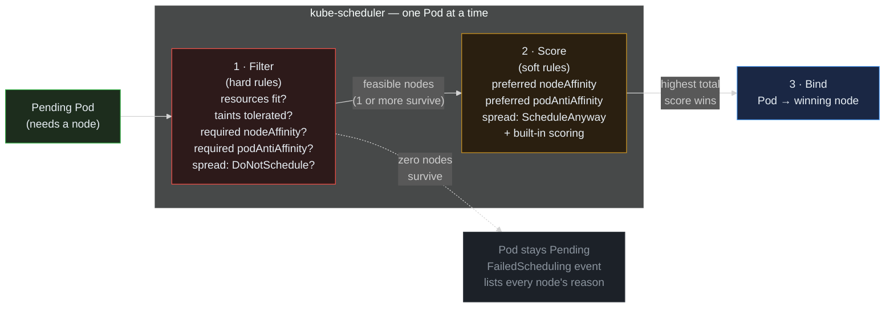

> **30 Days of DevOps** — Day 21 of 30. [← Day 20: DaemonSets](/articles/2026/06/07/day-20-daemonsets/)

Day 20 covered the workload type for "this Pod **must** run on every node." Today is the other side of placement: workloads where the scheduler chooses the node, and you want a say in the choice — without taking the choice away entirely.

The motivating problem is one you have already half-met. On Day 16, the PodDisruptionBudget demo only worked because the two webapp Pods happened to sit on different workers. The pre-flight even warned: *"If both your Pods happen to be on the same worker, restart the rollout until they land on different nodes."* That was a confession. The scheduler's default spreading is a **preference**, not a promise — under node-resource pressure, after enough evictions, or just on an unlucky day, both replicas can land on one node. Then a single node failure (or a routine `kubectl drain` without a PDB) takes the whole Service to zero endpoints.

Kubernetes gives you three instruments to turn that preference into policy, in increasing order of modernity:

- **`nodeAffinity`** — constrain or steer a Pod toward **nodes with certain labels**. The expressive successor to `nodeSelector`: full operators (`In`, `NotIn`, `Exists`, `Gt`, `Lt`), and crucially a choice between **required** (hard filter) and **preferred** (weighted scoring).
- **`podAntiAffinity`** (and its mirror, `podAffinity`) — constrain or steer a Pod's placement **relative to other Pods**. "Do not put me on a node that already runs a Pod matching this selector" is anti-affinity; "put me near the cache Pods" is affinity. Same required/preferred split.
- **`topologySpreadConstraints`** — the modern, purpose-built way to say "distribute the Pods matching this selector evenly across a topology, within a tolerance of `maxSkew`." It subsumes most anti-affinity use cases with better semantics for autoscaling — and one well-known gotcha this article walks you straight into, on purpose.

## What you will build

By the end of this article you will have:

- A mental model of the scheduler's **two-phase pipeline** — Filter (hard rules eliminate nodes) then Score (soft rules rank survivors) — and which field of which instrument lands in which phase
- A scratch `sched-lab` namespace with a `pause`-container Deployment for safe experiments (deliberately **not** Argo CD-managed — Day 10's `selfHeal: true` would revert live patches to the webapp within seconds)
- **`nodeAffinity` demos**: a `required` rule against a label no node has (Pod `Pending`, with the exact `FailedScheduling` event), the label applied (Pod schedules), and the `preferred` form that steers without blocking
- **`podAntiAffinity` demos**: the `required` form spreading 2 replicas perfectly across 2 workers — and then the failure mode, scaling to 3 replicas with only 2 schedulable nodes, leaving replica 3 `Pending` forever. The reason hard anti-affinity and the Day 12 HPA must never be combined on a small cluster.
- **`topologySpreadConstraints` demos**: `maxSkew: 1` with `DoNotSchedule` hitting the **tainted-control-plane-counts-as-a-domain** gotcha at replica 3, then fixed with `nodeTaintsPolicy: Honor`, then 6 replicas spreading a clean 3/3
- The production-safe variant — `whenUnsatisfiable: ScheduleAnyway` — **shipped to the webapp chart** via Argo CD, with a rollout restart and verification that the replicas now sit one per worker, closing the Day 16 loophole for good

---

## How the scheduler decides: Filter, then Score

Every instrument in this article is a plug-in to one of two phases. Understanding which phase explains every behaviour you will see today.



**Reading this diagram:**

Read left to right. The scheduler processes **one Pod at a time** from its queue; the whole pipeline runs per Pod.

The **Pending Pod** (green) enters stage **1 · Filter** (red — red because this stage *eliminates*). Every node in the cluster is tested against every hard rule: does the node have enough free CPU/memory for the Pod's requests (Day 15's math)? Does the Pod tolerate the node's taints (Day 20)? Does the node satisfy a `required` nodeAffinity? Would placing the Pod here violate a `required` podAntiAffinity, or push a `DoNotSchedule` topology spread past its `maxSkew`? A node that fails **any** test is gone. Filtering is absolute — there is no "almost passed."

If **one or more nodes survive**, the solid arrow carries them to stage **2 · Score** (amber — amber because this stage *ranks*, it never eliminates). Each surviving node gets points: `preferred` nodeAffinity adds up the weights of matched preferences; `preferred` podAntiAffinity scores nodes that avoid co-location higher; `ScheduleAnyway` topology spread scores better-balanced placements higher; built-in plugins add their own scores (image already pulled, balanced utilisation, the default spreading you have been relying on until today). The node with the **highest total** wins.

Stage **3 · Bind** (blue) writes the decision: the Pod's `spec.nodeName` is set, the kubelet on the winning node sees it and starts pulling images. Scheduling is done.

The dotted path is the one you will trigger twice today: if **zero nodes survive filtering**, the Pod stays `Pending` and the scheduler emits a `FailedScheduling` event that itemises *every* node's elimination reason — `1 node(s) had untolerated taint …, 2 node(s) didn't match pod anti-affinity rules`. Learning to read that event line is half of this article.

The key insight: **"required" rules live in Filter; "preferred" rules live in Score.** A required rule can leave you with zero nodes and a Pod that never starts. A preferred rule always lets the Pod schedule *somewhere* — it just biases where. Every production decision in this article comes down to choosing which phase you want your intent to live in.

---

## Prerequisites

This article continues from Day 20. Required state:

- The `devops-cluster` kind cluster: `control-plane` (tainted `NoSchedule`), `worker`, `worker2`
- The webapp running under Argo CD with the Day 12 HPA (2–6 replicas) and the Day 16 PDB
- kubectl 1.29+; the cluster itself 1.26+ (the `nodeTaintsPolicy` field used in Part 4 is on by default from 1.26)

Pre-flight check:

```bash
# Two schedulable workers, one tainted control-plane
kubectl get nodes -o custom-columns=NAME:.metadata.name,TAINTS:.spec.taints

# Where are the webapp replicas right now?
kubectl get pod -n default -l app.kubernetes.io/instance=webapp -o wide \
  --no-headers | awk '{print $1, $7}'
```

Expected output:

```text
NAME                           TAINTS
devops-cluster-control-plane   [map[effect:NoSchedule key:node-role.kubernetes.io/control-plane]]
devops-cluster-worker          <none>
devops-cluster-worker2         <none>

webapp-webapp-6b9f8c7d4-aa1bb devops-cluster-worker
webapp-webapp-6b9f8c7d4-cc2dd devops-cluster-worker
```

If your two webapp Pods show **the same node** (as above — a perfectly possible outcome of the default scheduler), you are looking at the exact problem this article fixes. If they happen to be split across both workers today, the problem still exists — it is just not visible right now. Nothing currently *guarantees* the split.

| Tool | Minimum version | Check |
|---|---|---|
| kubectl | 1.29 | `kubectl version --client` |
| Helm | 3.14 | `helm version --short` |
| Kubernetes (server) | 1.26+ | `kubectl version` |

---

## Part 1 — A lab namespace, deliberately outside Argo CD

Two reasons not to experiment on the live webapp. First, Day 10's Argo CD Application has `selfHeal: true` — any `kubectl patch` you make to the webapp Deployment is drift, and Argo CD reverts it within seconds. Your demo would undo itself mid-observation. Second, half of today's demos *deliberately* wedge Pods into `Pending`; doing that to the production-ish workload is bad practice even on a laptop.

So: a scratch namespace and a scratch Deployment using the `pause` container — the smallest possible workload (it starts instantly and does nothing), which makes it the standard tool for scheduling experiments:

```bash
mkdir -p ~/30-days-devops/day-21 && cd ~/30-days-devops/day-21

kubectl create namespace sched-lab

cat > spread-lab.yaml << 'EOF'
apiVersion: apps/v1
kind: Deployment
metadata:
  name: spread-lab
  namespace: sched-lab
spec:
  replicas: 2
  selector:
    matchLabels:
      app: spread-lab
  template:
    metadata:
      labels:
        app: spread-lab
    spec:
      containers:
        - name: pause
          # The pause container: ~700 KiB, starts in milliseconds, does
          # nothing. Perfect for scheduling demos — every effect you see
          # is the scheduler's, not the app's.
          image: registry.k8s.io/pause:3.9
          resources:
            requests:
              cpu: 10m
              memory: 8Mi
EOF

kubectl apply -f spread-lab.yaml
kubectl get pod -n sched-lab -o wide --no-headers | awk '{print $1, $7}'
```

Expected output:

```text
namespace/sched-lab created
deployment.apps/spread-lab created

spread-lab-7c9d5f8b6-aaaaa devops-cluster-worker2
spread-lab-7c9d5f8b6-bbbbb devops-cluster-worker
```

Two replicas, and on this run they landed on different workers — the scheduler's built-in scoring (which includes a default soft spreading plugin) *usually* does this. Run `kubectl scale deployment spread-lab -n sched-lab --replicas=0` then back `--replicas=2` a few times and you may well catch them co-located. "Usually spread" is the baseline we are about to upgrade.

---

## Part 2 — `nodeAffinity`: required vs preferred

`nodeAffinity` answers "which **nodes** may (or should) host this Pod," based on node labels. It is `nodeSelector` (Day 20, Part 4) with two upgrades: real operators, and the choice of hard vs soft.

**The hard form first.** Add a `required` rule for a label no node currently has:

```bash
kubectl patch deployment spread-lab -n sched-lab --type=merge -p '
{
  "spec": {
    "template": {
      "spec": {
        "affinity": {
          "nodeAffinity": {
            "requiredDuringSchedulingIgnoredDuringExecution": {
              "nodeSelectorTerms": [
                {
                  "matchExpressions": [
                    {"key": "hw", "operator": "In", "values": ["fast"]}
                  ]
                }
              ]
            }
          }
        }
      }
    }
  }
}'
```

Expected output:

```text
deployment.apps/spread-lab patched
```

The patch changed the Pod template, so the Deployment starts a rolling update — and the new Pods cannot schedule anywhere:

```bash
kubectl get pod -n sched-lab
```

Expected output:

```text
NAME                          READY   STATUS    RESTARTS   AGE
spread-lab-7c9d5f8b6-aaaaa    1/1     Running   0          5m
spread-lab-7c9d5f8b6-bbbbb    1/1     Running   0          5m
spread-lab-5d8e6f9c7-ccccc    0/1     Pending   0          30s
```

Note the old Pods are still `Running` — the rolling update (Day 6's `maxUnavailable`) holds them until replacements are Ready, and the replacement never will be. Read the new Pod's event:

```bash
kubectl describe pod -n sched-lab -l app=spread-lab | grep FailedScheduling | tail -1
```

Expected output:

```text
  Warning  FailedScheduling  45s   default-scheduler  0/3 nodes are available: 1 node(s) had untolerated taint {node-role.kubernetes.io/control-plane: }, 2 node(s) didn't match Pod's node affinity/selector. preemption: 0/3 nodes are available: 3 Preemption is not helpful for scheduling.
```

This is the Filter stage's itemised verdict: the control-plane fell to its taint, both workers fell to the affinity rule. Note the `preemption:` suffix — the scheduler also checked whether evicting lower-priority Pods would help (it would not; no node passes the affinity filter at any priority). Day 22 is about exactly that mechanism.

**Now satisfy the rule.** Label a worker:

```bash
kubectl label node devops-cluster-worker2 hw=fast
kubectl get pod -n sched-lab -o wide --no-headers | awk '{print $1, $2, $7}'
```

Expected output (within a few seconds — the scheduler retries Pending Pods when cluster state changes):

```text
node/devops-cluster-worker2 labeled

spread-lab-5d8e6f9c7-ccccc 1/1 devops-cluster-worker2
spread-lab-5d8e6f9c7-ddddd 1/1 devops-cluster-worker2
```

The rollout completed, and **both** replicas are on `worker2` — the only node passing the required rule. You have traded the co-location problem for a guaranteed version of it. That is the trouble with `required`: it expresses "never anywhere else," which is rarely what you actually mean.

**The soft form is usually what you mean.** Replace `required` with `preferred`:

```bash
kubectl patch deployment spread-lab -n sched-lab --type=merge -p '
{
  "spec": {
    "template": {
      "spec": {
        "affinity": {
          "nodeAffinity": {
            "requiredDuringSchedulingIgnoredDuringExecution": null,
            "preferredDuringSchedulingIgnoredDuringExecution": [
              {
                "weight": 100,
                "preference": {
                  "matchExpressions": [
                    {"key": "hw", "operator": "In", "values": ["fast"]}
                  ]
                }
              }
            ]
          }
        }
      }
    }
  }
}'
```

Expected output:

```text
deployment.apps/spread-lab patched
```

`preferred` rules carry a `weight` (1–100). At Score time, each node that matches the preference gets the weight added to its total. The Pod schedules *somewhere* no matter what — if `worker2` has room it will tend to win, but if it is full (or the label disappears tomorrow), the Pod lands on `worker` instead of wedging `Pending`. This is the "prefers GPU nodes but does not refuse to start without one" pattern from Day 20's preview.

The suffix on both field names — **`IgnoredDuringExecution`** — is a promise about *running* Pods: if you remove the `hw=fast` label from `worker2` right now, the Pods already on it stay put. Affinity is evaluated at scheduling time only. (There is no `RequiredDuringExecution` variant today; evicting Pods when labels change is the job of the descheduler project, not the scheduler.)

Clean up the label and reset the lab before Part 3. One subtlety: **`kubectl apply` would not undo the patch.** Apply computes its changes against the `last-applied-configuration` annotation, and the affinity block was added by `kubectl patch` — it was never *in* an applied configuration, so apply does not know to remove it. `kubectl replace` swaps the entire live spec for the file's content, patched fields included:

```bash
kubectl label node devops-cluster-worker2 hw-
kubectl replace -f spread-lab.yaml    # full spec swap — clears the patched-in affinity
```

Expected output:

```text
node/devops-cluster-worker2 unlabeled
deployment.apps/spread-lab replaced
```

---

## Part 3 — `podAntiAffinity`: keep replicas apart, and the trap inside `required`

Anti-affinity changes the reference point. Node affinity asks "what labels does the **node** have?" Pod anti-affinity asks "what Pods are **already running** in this topology?" — where "this topology" is defined by `topologyKey`, the node label whose value delimits the domain. `kubernetes.io/hostname` (every node has it, value = node name) makes the domain "one node." A cloud cluster would use `topology.kubernetes.io/zone` to spread across availability zones; kind has no zones, so hostname is our domain throughout.

Apply the hard form — "never schedule me onto a node that already runs a Pod with my own label." But first, **scale to zero**:

```bash
kubectl scale deployment spread-lab -n sched-lab --replicas=0
```

Why? Because patching hard self-anti-affinity onto a *running* Deployment deadlocks the rolling update. The default strategy (`maxSurge: 25%` → 1 extra Pod, `maxUnavailable: 25%` → rounds down to 0 removable Pods) creates the new Pod *before* deleting any old one — and the new Pod's own anti-affinity rule forbids every node that still hosts an old replica, which is all of them. The surge Pod wedges `Pending`, the old Pods cannot be removed, and the rollout hangs forever. Production charts that carry `required` anti-affinity must pair it with `maxSurge: 0, maxUnavailable: 1` (free a node first, then place) or accept `strategy: Recreate`. One more hidden cost of "required." For the lab, scaling to zero sidesteps it entirely:

```bash
kubectl patch deployment spread-lab -n sched-lab --type=merge -p '
{
  "spec": {
    "template": {
      "spec": {
        "affinity": {
          "podAntiAffinity": {
            "requiredDuringSchedulingIgnoredDuringExecution": [
              {
                "labelSelector": {"matchLabels": {"app": "spread-lab"}},
                "topologyKey": "kubernetes.io/hostname"
              }
            ]
          }
        }
      }
    }
  }
}'
kubectl scale deployment spread-lab -n sched-lab --replicas=2
sleep 5
kubectl get pod -n sched-lab -o wide --no-headers | awk '{print $1, $2, $7}'
```

Expected output:

```text
deployment.apps/spread-lab scaled
deployment.apps/spread-lab patched
deployment.apps/spread-lab scaled

spread-lab-8f7a6b5c4-eeeee 1/1 devops-cluster-worker
spread-lab-8f7a6b5c4-fffff 1/1 devops-cluster-worker2
```

Perfect spread, **guaranteed**: 2 replicas, 2 schedulable workers, one each. For a static replica count that exactly matches your node count, hard anti-affinity is airtight.

Now watch it strangle scaling:

```bash
kubectl scale deployment spread-lab -n sched-lab --replicas=3
sleep 5
kubectl get pod -n sched-lab -o wide --no-headers | awk '{print $1, $3, $7}'
```

Expected output:

```text
deployment.apps/spread-lab scaled

spread-lab-8f7a6b5c4-eeeee Running devops-cluster-worker
spread-lab-8f7a6b5c4-fffff Running devops-cluster-worker2
spread-lab-8f7a6b5c4-ggggg Pending <none>
```

Replica 3 has nowhere legal to go: both workers already host a matching Pod, and the control-plane is tainted. Its event:

```bash
kubectl describe pod -n sched-lab -l app=spread-lab | grep FailedScheduling | tail -1
```

Expected output:

```text
  Warning  FailedScheduling  20s   default-scheduler  0/3 nodes are available: 1 node(s) had untolerated taint {node-role.kubernetes.io/control-plane: }, 2 node(s) didn't match pod anti-affinity rules. preemption: 0/3 nodes are available: 3 No preemption victims found for incoming pod.
```

Now connect this to Day 12. The webapp's HPA scales 2 → 6 under load. With `required` anti-affinity on a 2-worker cluster, **replicas 3 through 6 would all wedge `Pending` during a traffic spike** — the exact moment you need them. Worse, nothing alerts by default: the HPA reports its desired count, the Deployment shows the intent, and the ReplicaSet quietly accumulates Pods that will never run (the same hidden-failure shape as Day 15's quota demo). Hard anti-affinity plus an autoscaler whose `maxReplicas` exceeds your schedulable-node count is a standing outage appointment.

The `preferred` form (same shape as node affinity's: a `weight` plus a `podAffinityTerm`) avoids the wedge — replicas 3+ would co-locate rather than not run. But "soft anti-affinity for spreading" is exactly the use case `topologySpreadConstraints` was designed to replace, with a tunable tolerance instead of an all-or-nothing preference. So rather than demo preferred anti-affinity, go straight to the better tool.

Reset the lab — `replace` again, to strip the patched-in anti-affinity, and straight down to zero ready for the next patch:

```bash
kubectl replace -f spread-lab.yaml
kubectl scale deployment spread-lab -n sched-lab --replicas=0
```

Expected output:

```text
deployment.apps/spread-lab replaced
deployment.apps/spread-lab scaled
```

---

## Part 4 — `topologySpreadConstraints`: the modern tool, and its famous gotcha

A topology spread constraint says: *"across all domains identified by `topologyKey`, the count of Pods matching `labelSelector` must not differ by more than `maxSkew` — and if a placement would violate that, do `whenUnsatisfiable`."* It is anti-affinity generalised: instead of "never two per node," you express "never *unbalanced by more than N* per node," which keeps working as the autoscaler moves the replica count.

Apply the strict form to the (scaled-to-zero) lab, then scale to 3:

```bash
kubectl patch deployment spread-lab -n sched-lab --type=merge -p '
{
  "spec": {
    "template": {
      "spec": {
        "topologySpreadConstraints": [
          {
            "maxSkew": 1,
            "topologyKey": "kubernetes.io/hostname",
            "whenUnsatisfiable": "DoNotSchedule",
            "labelSelector": {"matchLabels": {"app": "spread-lab"}}
          }
        ]
      }
    }
  }
}'
kubectl scale deployment spread-lab -n sched-lab --replicas=3
sleep 5
kubectl get pod -n sched-lab --no-headers | awk '{print $1, $3}'
```

Expected output:

```text
deployment.apps/spread-lab patched
deployment.apps/spread-lab scaled

spread-lab-9a8b7c6d5-hhhhh Running
spread-lab-9a8b7c6d5-iiiii Running
spread-lab-9a8b7c6d5-jjjjj Pending
```

**Pending again — but for a subtler reason than Part 3.** Three replicas across two workers should be a legal 2/1 split (skew = 1, within `maxSkew: 1`). So why is replica 3 refused?

```bash
kubectl describe pod -n sched-lab -l app=spread-lab | grep FailedScheduling | tail -1
```

Expected output:

```text
  Warning  FailedScheduling  15s   default-scheduler  0/3 nodes are available: 1 node(s) had untolerated taint {node-role.kubernetes.io/control-plane: }, 2 node(s) didn't match pod topology spread constraints. preemption: 0/3 nodes are available: 3 No preemption victims found for incoming pod.
```

Here is the gotcha, and it is worth slowing down for. The skew calculation runs over **every domain whose node could conceivably be considered — and by default, taints are not consulted when enumerating domains** (`nodeTaintsPolicy` defaults to `Ignore`). So the scheduler sees **three** hostname domains:

```text
control-plane: 0 matching Pods   ← counted as a domain, even though
worker:        1                    no Pod can actually schedule there
worker2:       1
```

Placing replica 3 on either worker would make that domain `2`, and `2 − 0 = 2 > maxSkew 1` — violation. The control-plane's permanent zero **anchors the skew calculation**, capping every other domain at 1. The constraint is unsatisfiable not because the workers are unbalanced, but because a node that can never receive a Pod is being counted as if it could.

The fix is the `nodeTaintsPolicy` field (on by default since Kubernetes 1.26): set it to `Honor` and domains whose taints the Pod does not tolerate are excluded from the calculation:

```bash
kubectl patch deployment spread-lab -n sched-lab --type=merge -p '
{
  "spec": {
    "template": {
      "spec": {
        "topologySpreadConstraints": [
          {
            "maxSkew": 1,
            "topologyKey": "kubernetes.io/hostname",
            "whenUnsatisfiable": "DoNotSchedule",
            "nodeTaintsPolicy": "Honor",
            "labelSelector": {"matchLabels": {"app": "spread-lab"}}
          }
        ]
      }
    }
  }
}'
kubectl scale deployment spread-lab -n sched-lab --replicas=0
kubectl scale deployment spread-lab -n sched-lab --replicas=6
sleep 8
kubectl get pod -n sched-lab -o wide --no-headers | awk '{print $7}' | sort | uniq -c
```

(The scale to 0 and back clears the wedged old-template Pods so all six schedule fresh under the corrected constraint — old Pods still match the `labelSelector` and would otherwise distort the skew counts mid-rollout.)

Expected output:

```text
deployment.apps/spread-lab patched
deployment.apps/spread-lab scaled
deployment.apps/spread-lab scaled

   3 devops-cluster-worker
   3 devops-cluster-worker2
```

Six replicas, three per worker, skew 0 — and at every intermediate count the split was within ±1. This is the contract anti-affinity could not give you: **even distribution that scales**, instead of "exactly one per node or nothing."

One more knob before shipping it: `whenUnsatisfiable`. `DoNotSchedule` puts the constraint in the Filter phase — strict, and as you just saw, capable of wedging Pods when the domain math goes wrong. `ScheduleAnyway` moves it to the Score phase — the scheduler *prefers* balanced placements but never refuses a placement over it. For a workload whose availability matters more than its symmetry (most workloads), `ScheduleAnyway` is the production-safe choice; it also makes the control-plane-domain gotcha harmless, since a scoring penalty against an impossible node changes nothing.

Tear the lab down — it has served:

```bash
kubectl delete namespace sched-lab
```

Expected output:

```text
namespace "sched-lab" deleted
```

---

## Part 5 — Ship it: topology spread on the webapp, via the chart

The webapp gets the soft variant: `maxSkew: 1`, `ScheduleAnyway`. Combined with the Day 16 PDB this closes the loop: spread keeps replicas on different nodes so a node failure costs at most ~half the fleet, and the PDB stops voluntary drains from finishing the job.

```bash
cd ~/30-days-devops/day-12/gitops-webapp
```

### 5.1 — Defaults in `webapp/values.yaml`

Rewrite `webapp/values.yaml` with the full file below — your existing defaults plus a new
`topologySpread` block at the bottom:

```bash
cat > webapp/values.yaml << 'EOF'
# Default values for webapp chart.
# Override these from the CLI (--set) or from a values file (-f).

replicaCount: 3

image:
  repository: nginx
  tag: "1.25-alpine"
  pullPolicy: IfNotPresent

rollingUpdate:
  maxSurge: 1
  maxUnavailable: 0

service:
  type: NodePort
  port: 80
  targetPort: 80
  nodePort: 30080

probes:
  readiness:
    initialDelaySeconds: 5
    periodSeconds: 5
  liveness:
    initialDelaySeconds: 10
    periodSeconds: 10

resources:
  requests:
    cpu: 50m
    memory: 64Mi
  limits:
    cpu: 100m
    memory: 128Mi

# Horizontal Pod Autoscaler defaults (Day 12).
autoscaling:
  enabled: false
  minReplicas: 2
  maxReplicas: 6
  targetCPUUtilizationPercentage: 60

# PodDisruptionBudget defaults (Day 16).
podDisruptionBudget:
  enabled: false
  minAvailable: 50%

# Topology spread defaults. Soft (ScheduleAnyway) so the constraint can
# never block scheduling — it biases the scheduler toward even spread
# across nodes. Pairs with the PodDisruptionBudget (Day 16): spread
# limits the blast radius of a node failure; the PDB limits voluntary
# disruptions. Off by default; environments opt in.
topologySpread:
  enabled: false
  maxSkew: 1
  whenUnsatisfiable: ScheduleAnyway
EOF
```

### 5.2 — The template block in `webapp/templates/deployment.yaml`

Rewrite `webapp/templates/deployment.yaml` with the full file below. Compared to your Day 18
version it adds **one block** — a conditional `topologySpreadConstraints:` in the Pod template's
`spec:`, right after the Pod-level `securityContext` and before `initContainers:`:

```bash
cat > webapp/templates/deployment.yaml << 'EOF'
apiVersion: apps/v1
kind: Deployment
metadata:
  name: {{ include "webapp.fullname" . }}
  labels:
    {{- include "webapp.labels" . | nindent 4 }}
spec:
  {{- if not .Values.autoscaling.enabled }}
  replicas: {{ .Values.replicaCount }}
  {{- end }}
  strategy:
    type: RollingUpdate
    rollingUpdate:
      maxSurge: {{ .Values.rollingUpdate.maxSurge }}
      maxUnavailable: {{ .Values.rollingUpdate.maxUnavailable }}
  selector:
    matchLabels:
      {{- include "webapp.selectorLabels" . | nindent 6 }}
  template:
    metadata:
      labels:
        {{- include "webapp.selectorLabels" . | nindent 8 }}
    spec:
      serviceAccountName: webapp-runtime
      automountServiceAccountToken: false
      securityContext:
        runAsNonRoot: true
        runAsUser: 101
        runAsGroup: 101
        fsGroup: 101
        seccompProfile:
          type: RuntimeDefault
      {{- if .Values.topologySpread.enabled }}
      topologySpreadConstraints:
        - maxSkew: {{ .Values.topologySpread.maxSkew }}
          topologyKey: kubernetes.io/hostname
          whenUnsatisfiable: {{ .Values.topologySpread.whenUnsatisfiable }}
          labelSelector:
            matchLabels:
              {{- include "webapp.selectorLabels" . | nindent 14 }}
      {{- end }}
      initContainers:
        # Ordinary init container: runs once, must exit 0 before anything else
        # starts. Renders the page nginx serves, into the shared volume.
        - name: init-content
          image: busybox:1.36
          command:
            - sh
            - -c
            - |
              cat > /shared/index.html <<HTML
              <!doctype html><html><body>
              <h1>{{ .Chart.Name }}</h1>
              <p>Rendered by the init container at $(date -u +%FT%TZ)</p>
              </body></html>
              HTML
              echo "init-content: wrote /shared/index.html"
          securityContext:
            allowPrivilegeEscalation: false
            readOnlyRootFilesystem: true
            capabilities:
              drop: ["ALL"]
          volumeMounts:
            - name: shared-content
              mountPath: /shared
        # Native sidecar: an init container with restartPolicy: Always. It
        # STARTS during the init phase (up before nginx) but never exits —
        # the kubelet treats it as a long-lived sidecar.
        - name: clock-sidecar
          image: busybox:1.36
          restartPolicy: Always          # <-- the one line that makes it a sidecar
          command:
            - sh
            - -c
            - |
              while true; do
                echo "ok $(date -u +%FT%TZ)" > /shared/health.txt
                sleep 15
              done
          securityContext:
            allowPrivilegeEscalation: false
            readOnlyRootFilesystem: true
            capabilities:
              drop: ["ALL"]
          volumeMounts:
            - name: shared-content
              mountPath: /shared
      containers:
        - name: {{ .Chart.Name }}
          image: "{{ .Values.image.repository }}:{{ .Values.image.tag }}"
          imagePullPolicy: {{ .Values.image.pullPolicy }}
          ports:
            - name: http
              containerPort: {{ .Values.service.targetPort }}
              protocol: TCP
          readinessProbe:
            httpGet:
              path: /
              port: http
            initialDelaySeconds: {{ .Values.probes.readiness.initialDelaySeconds }}
            periodSeconds: {{ .Values.probes.readiness.periodSeconds }}
          livenessProbe:
            httpGet:
              path: /
              port: http
            initialDelaySeconds: {{ .Values.probes.liveness.initialDelaySeconds }}
            periodSeconds: {{ .Values.probes.liveness.periodSeconds }}
          resources:
            {{- toYaml .Values.resources | nindent 12 }}
          securityContext:
            allowPrivilegeEscalation: false
            readOnlyRootFilesystem: true
            capabilities:
              drop:
                - ALL
          volumeMounts:
            - name: tmp
              mountPath: /tmp
            - name: shared-content
              mountPath: /usr/share/nginx/html
          envFrom:
            - secretRef:
                name: webapp-secret
      volumes:
        - name: tmp
          emptyDir: {}
        - name: shared-content
          emptyDir: {}
EOF
```

The `labelSelector` reuses the chart's `selectorLabels` helper — the same labels the Deployment selector, the Service, and the Day 16 PDB already agree on. The constraint counts exactly the Pods that are replicas of this release, nothing else.

### 5.3 — Enable in `webapp/values-dev.yaml`

Rewrite `webapp/values-dev.yaml` with the full file below — your Day 16 dev values plus the
topology-spread on-switch at the bottom:

```bash
cat > webapp/values-dev.yaml << 'EOF'
# Dev environment overrides — merged over webapp/values.yaml at sync time.
# Only include keys that differ from the chart defaults.

replicaCount: 3

# Day 14: unprivileged nginx image — runs as UID 101, listens on 8080.
image:
  repository: nginxinc/nginx-unprivileged
  tag: "1.27-alpine"
  pullPolicy: IfNotPresent

# ClusterIP so traffic enters through the NGINX Ingress, not a NodePort.
service:
  type: ClusterIP
  port: 80
  targetPort: 8080

resources:
  requests:
    cpu: 25m
    memory: 32Mi
  limits:
    cpu: 50m
    memory: 64Mi

# Day 12: HPA on for the dev environment.
autoscaling:
  enabled: true

# Day 16: PDB on for the dev environment.
podDisruptionBudget:
  enabled: true

# Day 21: prefer even spread of webapp replicas across nodes.
topologySpread:
  enabled: true
EOF
```

### 5.4 — Render-check, commit, sync

```bash
helm template webapp ./webapp -f webapp/values-dev.yaml \
  | grep -B 2 -A 7 topologySpreadConstraints
```

Expected output (the two lines above the constraint are the tail of Day 14's Pod-level `securityContext` — confirming the block landed in the right place in the spec):

```text
        seccompProfile:
          type: RuntimeDefault
      topologySpreadConstraints:
        - maxSkew: 1
          topologyKey: kubernetes.io/hostname
          whenUnsatisfiable: ScheduleAnyway
          labelSelector:
            matchLabels:
              app.kubernetes.io/name: webapp
              app.kubernetes.io/instance: webapp
```

```bash
git add webapp/values.yaml webapp/values-dev.yaml webapp/templates/deployment.yaml
git commit -m "feat(scheduling): soft topology spread for webapp replicas"
git push origin main

argocd app sync webapp --server argocd.local --insecure
```

The sync rolls the Deployment (the Pod template changed). Spread constraints — like everything else in this article — are evaluated **at scheduling time only**, so it is the rolling update itself that re-places the Pods under the new rule:

```bash
kubectl rollout status deployment/webapp-webapp -n default --timeout=120s
kubectl get pod -n default -l app.kubernetes.io/instance=webapp -o wide \
  --no-headers | awk '{print $1, $7}'
```

Expected output:

```text
deployment "webapp-webapp" successfully rolled out

webapp-webapp-7e6d5c4b3-mmmmm devops-cluster-worker
webapp-webapp-7e6d5c4b3-nnnnn devops-cluster-worker2
```

One per worker. And unlike the Day 16 pre-flight's "restart the rollout until they land on different nodes," this is now the scheduler's stated preference on every placement — including each step of every future HPA scale-up, where the 6-replica ceiling will tend toward 3/3 instead of wherever the dice land.

---

## Common Errors

**1. Hard anti-affinity + HPA: replicas wedge `Pending` exactly during traffic spikes**

The Part 3 trap, in production clothing. `requiredDuringSchedulingIgnoredDuringExecution` podAntiAffinity with `topologyKey: kubernetes.io/hostname` caps your replica count at your schedulable-node count. The HPA scales past it, the extra Pods go `Pending`, and the HPA dashboard still shows the *desired* count.

Fix: audit before it bites —

```bash
# Max replicas the HPA may request:
kubectl get hpa -n default webapp-webapp -o jsonpath='{.spec.maxReplicas}{"\n"}'
# Schedulable (untainted-for-you) nodes:
kubectl get nodes --no-headers | wc -l
```

If max replicas exceeds the schedulable-node count, hard anti-affinity is the wrong tool: use `topologySpreadConstraints` (tolerance-based) or `preferred` anti-affinity (bias-based).

**2. `DoNotSchedule` spread blocks Pods even though the schedulable nodes are balanced**

The Part 4 gotcha: `nodeTaintsPolicy` defaults to `Ignore`, so tainted nodes (the kind control-plane, cordoned nodes, dedicated-workload nodes) are **counted as domains** with a permanent Pod count of zero, anchoring the skew math. The `FailedScheduling` event says `didn't match pod topology spread constraints` while `kubectl get pod -o wide` shows a perfectly even spread across the nodes you can actually use.

Fix: add `nodeTaintsPolicy: Honor` to the constraint (1.26+), or switch to `whenUnsatisfiable: ScheduleAnyway` where the miscount costs a meaningless scoring penalty instead of a refusal.

**3. The spread constraint's `labelSelector` matches nothing — silent no-op**

A typo'd selector (or one that drifted from the chart's labels) means every domain counts **zero matching Pods**, every skew is 0, and the constraint is always trivially satisfied. Nothing fails, nothing warns — the Pods just cluster wherever they like, and you believe you have spreading.

Fix: the selector must match the Pod template's own labels. Verify by counting:

```bash
kubectl get pod -n default -l app.kubernetes.io/instance=webapp --no-headers | wc -l
# If this is 0, the selector in the constraint is matching nothing too.
```

In a Helm chart, always derive both from the same helper (`include "webapp.selectorLabels"`), never hand-copy.

**4. Changed the affinity rules but the running Pods didn't move**

Everything in this article is `…IgnoredDuringExecution` (or, for spread constraints, simply scheduling-time-only): the rules apply when a Pod is *placed*, never to Pods already running. Applying a new rule via the chart changes the Pod template, which triggers a rolling update, which re-places Pods as a side effect — that is why Part 5 worked. Patching a rule that does *not* change the template (e.g. editing a node label) moves nothing.

Fix: `kubectl rollout restart deployment/<name>` to force re-placement under current rules. For continuous enforcement of placement rules on running Pods, that is the [descheduler](https://github.com/kubernetes-sigs/descheduler)'s job — a separate component, deliberately not part of the scheduler.

**5. `preferred` rules seem to be ignored**

A `preferred` rule is one scoring input among many — image locality, balanced resource usage, the default spreading plugin all vote too. A weight-10 preference is easily outvoted; even weight-100 loses if the preferred node is short on resources (Filter runs first; Score only ranks survivors).

Fix: weights are relative, not absolute. Use 100 for "I mean it," and accept that preferred means *preferred*. If a placement rule must hold always, it belongs in a required rule or a `DoNotSchedule` constraint — with the failure modes this article just showed you priced in.

**6. `topologyKey` typo: every Pod `Pending` with `DoNotSchedule`, or no effect with `ScheduleAnyway`**

The `topologyKey` must be a **node label key that actually exists on your nodes**. Write `topology.kubernetes.io/hostname` (a plausible-looking key that does not exist — the real ones are `kubernetes.io/hostname` for nodes and `topology.kubernetes.io/zone` for zones) and no node has the label: with `DoNotSchedule`, nodes without the key fail the constraint and everything wedges; with `ScheduleAnyway`, the constraint silently contributes nothing.

Fix: check what your nodes actually carry before writing the constraint:

```bash
kubectl get node devops-cluster-worker -o jsonpath='{.metadata.labels}' | tr ',' '\n' | grep -E 'hostname|zone'
```

On kind you will find `kubernetes.io/hostname`; on cloud clusters also `topology.kubernetes.io/zone` and `topology.kubernetes.io/region`.

---

## Recap

In this article you:

- Mapped the scheduler's **Filter → Score → Bind** pipeline and the rule of thumb that governs everything else: **required rules filter (and can leave you with zero nodes); preferred rules score (and always let the Pod land somewhere)**
- Built a `sched-lab` namespace with a `pause`-container Deployment — outside Argo CD's reach, because `selfHeal: true` reverts live patches to managed workloads within seconds
- Used **`nodeAffinity`** in both forms: `required` against an absent label (Pod `Pending`, with the full `FailedScheduling` itemisation including the `preemption:` suffix), satisfied it with `kubectl label node`, then switched to `preferred` with `weight: 100` — steering without blocking, the `nodeSelector` upgrade path
- Used **`podAntiAffinity`** `required` to get a guaranteed 2-across-2 spread — then scaled to 3 and watched replica 3 wedge, the exact failure an HPA with `maxReplicas: 6` would mass-produce during a traffic spike on a 2-worker cluster
- Hit the **topology-spread domain gotcha** on purpose: `maxSkew: 1` + `DoNotSchedule` refused a legal-looking 2/1 split because the tainted control-plane counts as a permanent-zero domain under the default `nodeTaintsPolicy: Ignore`; fixed it with `Honor` and watched 6 replicas spread a clean 3/3
- Shipped the production-safe form — `whenUnsatisfiable: ScheduleAnyway` — to the webapp chart through the GitOps loop, render-checked with `helm template`, synced via Argo CD, and verified one replica per worker, **closing the co-location hole the Day 16 PDB demo had to warn you about**
- Catalogued six failure modes, three of them silent: the HPA × hard-anti-affinity wedge, the mismatched-selector no-op, and the typo'd `topologyKey`

Placement on the cluster is now policy at every layer: DaemonSets for "everywhere" (Day 20), spread constraints for "evenly," the PDB for "never below the floor" (Day 16), and the HPA for "as many as the load needs" (Day 12) — four controls that finally compose instead of colliding.

---

## What's next

[Day 22: PriorityClasses and Preemption — Who Gets Evicted When the Cluster Is Full →](/articles/2026/06/11/day-22-priority-classes-preemption/)

Twice today the `FailedScheduling` event ended with a `preemption:` clause — the scheduler checking whether **evicting someone else** would make room, and concluding it would not help. On Day 22 you will make it help. You will create **`PriorityClass`** resources (`critical`, `standard`, `batch`), assign them to workloads, fill the cluster with low-priority filler Pods, and watch the scheduler **preempt** them — evicting running Pods mid-flight — the moment a higher-priority Pod needs the room. Plus the system classes (`system-cluster-critical`, `system-node-critical`) that explain why kube-proxy never loses that fight, and `preemptionPolicy: Never` for workloads that should queue politely instead of shoving.
