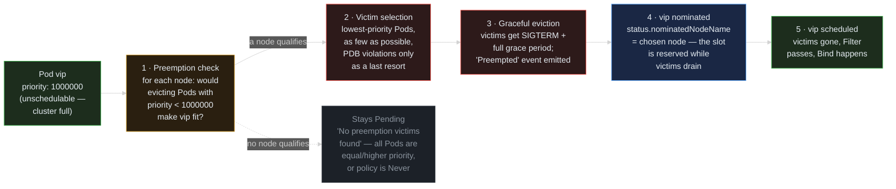

> **30 Days of DevOps** — Day 22 of 30. [← Day 21: Affinity and Topology Spread](/articles/2026/06/10/day-21-affinity-topology-spread/)

Yesterday's `FailedScheduling` events all carried a second clause you were told to ignore:

```text
... 2 node(s) didn't match pod anti-affinity rules. preemption: 0/3 nodes are available: 3 No preemption victims found for incoming pod.
```

That clause is the scheduler running a second, darker algorithm. When the Filter phase (Day 21) leaves zero feasible nodes, the scheduler does not give up immediately — it asks: *"is there a node where **evicting running Pods of lower priority** would make this Pod fit?"* If yes, it kills them. Gracefully, with their full termination grace period, with an event on each victim — but kills them, mid-flight, without consulting their owner. That is **preemption**, and the number that decides who is "lower" is the Pod's **priority**.

Every Pod has one. Look:

```text
kubectl get pod -n default <webapp-pod> -o jsonpath='{.spec.priority}'
0
```

Zero — the default for any Pod that does not name a **`PriorityClass`**. Your webapp, your Postgres, your CronJob backups: all priority 0, all legally evictable by anything with a bigger number. Meanwhile `kube-proxy` and `kindnet` run at priority **2,000,001,000** — which is why, on a genuinely full node, the network agents are the last things standing. Today you join that game deliberately: define the tiers, fill the cluster, and watch the scheduler enforce them.

## What you will build

By the end of this article you will have:

- Three **`PriorityClass`** resources — `batch-priority` (100), `standard-priority` (10000), `critical-priority` (1000000) — plus a fourth, `critical-no-preempt`, with **`preemptionPolicy: Never`**
- A reading of the **system classes** (`system-cluster-critical`: 2000000000, `system-node-critical`: 2000001000) and proof that kube-proxy and kindnet carry them — the Day 20 agents' unfair advantage, explained
- A `priority-lab` namespace **packed full** with low-priority filler Pods whose CPU *requests* (not usage — they are `sleep` containers) exhaust both workers, self-calibrating to whatever size your Docker VM is
- A single `vip` Pod at `critical-priority` submitted into the full cluster — and the full preemption sequence observed live: a filler victim going `Terminating`, the **`Preempted` event**, the `vip` Pod's **`nominatedNodeName`** set while it waits out the victim's grace period, then `Running`
- The proof that **equal priority cannot preempt** (the Pending fillers' own events say so) and that the freed slot goes to the **highest-priority waiter**, not the longest-waiting one
- A `vip2` Pod at `preemptionPolicy: Never` that refuses to evict anyone but still **jumps the scheduling queue** the moment space appears
- The uncomfortable interaction documented: preemption respects your Day 16 **PodDisruptionBudget only best-effort** — it will violate the PDB if that is the only way to seat the higher-priority Pod

---

## How preemption works

Preemption is not part of the Filter → Score pipeline from Day 21 — it is what runs when that pipeline returns empty.



**Reading this diagram:**

Read left to right. The flow begins where Day 21's pipeline ends: the **vip Pod** (green) has been through Filter, zero nodes survived, and it would normally just sit `Pending`.

**Step 1 — the preemption check** (amber, a *decision*): for every node, the scheduler simulates removing all Pods with priority **strictly lower** than vip's and re-runs the Filter against the freed capacity. Equal priority never qualifies — a 1000000 Pod cannot evict another 1000000 Pod, which is also why the filler Pods you will create cannot preempt *each other* no matter how long they queue. If no node passes even this simulation, the dotted path applies: the Pod stays `Pending` and the event reads `No preemption victims found` — exactly the clause from Day 21, now legible.

**Step 2 — victim selection** (red — from here on, someone is losing their Pod): among qualifying nodes the scheduler picks the *cheapest* eviction — it prefers nodes where the victims have the lowest priorities, where the fewest Pods must die, and — important for Day 16 — where no PodDisruptionBudget would be violated. **Prefers**, not guarantees: if every qualifying option violates someone's PDB, the preemption proceeds anyway. A PDB is armour against the polite eviction API, not against the scheduler.

**Step 3 — graceful eviction** (red): the victims are deleted through the normal Pod-termination path — SIGTERM, the full `terminationGracePeriodSeconds`, the works. Each victim gets a `Preempted` event naming who took its place. Preemption is rude in intent but polite in mechanics.

**Step 4 — nomination** (blue): the scheduler stamps `status.nominatedNodeName` on vip. This is a *reservation*: while the victims drain (which can take their entire grace period), the scheduler will not hand the freeing capacity to any lower-priority Pod from the queue. Without nomination, the 46 Pending fillers would race vip for the slot it just cleared.

**Step 5 — scheduling** (green): victims gone, the Filter now passes for the nominated node, and the ordinary Bind from Day 21 happens. Note vip was never guaranteed *that exact node* — if something better frees up mid-wait, the scheduler may place it elsewhere; nomination is a reservation, not a binding.

The key insight: **priority is consulted at two separate moments** — when a Pod *waits* (higher priority goes to the head of the scheduling queue) and when a Pod *cannot fit* (lower-priority running Pods become candidate victims). `preemptionPolicy: Never` switches off only the second; Part 5 demonstrates the first surviving without it.

---

## Prerequisites

This article continues from Day 21. Required state:

- The `devops-cluster` kind cluster: tainted control-plane + two workers
- The webapp, Postgres, and monitoring stacks running as left by previous days (they coexist fine with today's lab — the fillers pack *around* them)
- kubectl 1.29+

Pre-flight check:

```bash
# The two system classes every cluster ships with:
kubectl get priorityclass

# Proof the Day 20 node agents use them:
kubectl get daemonset -n kube-system kube-proxy \
  -o jsonpath='{.spec.template.spec.priorityClassName}{"\n"}'
```

Expected output:

```text
NAME                      VALUE        GLOBAL-DEFAULT   PREEMPTIONPOLICY       AGE
system-cluster-critical   2000000000   false            PreemptLowerPriority   4w
system-node-critical      2000001000   false            PreemptLowerPriority   4w

system-node-critical
```

Two built-in classes, both far above the 1,000,000,000 ceiling user classes are allowed (Part 1 proves that ceiling). `system-node-critical` is the higher of the two — node-local agents (kube-proxy, the CNI) outrank even cluster-critical control components, because a node whose network agent was evicted cannot host *anything*.

| Tool | Minimum version | Check |
|---|---|---|
| kubectl | 1.29 | `kubectl version --client` |

---

## Part 1 — Define the tiers

PriorityClass is **cluster-scoped** (no namespace) and almost flat — its fields sit at the top level, not under a `spec:`:

```bash
mkdir -p ~/30-days-devops/day-22 && cd ~/30-days-devops/day-22

cat > priority-classes.yaml << 'EOF'
apiVersion: scheduling.k8s.io/v1
kind: PriorityClass
metadata:
  name: batch-priority
# value is a top-level field — PriorityClass has no spec block.
value: 100
globalDefault: false
description: "Interruptible batch work. First to be preempted."
---
apiVersion: scheduling.k8s.io/v1
kind: PriorityClass
metadata:
  name: standard-priority
value: 10000
globalDefault: false
description: "Normal services. Evicts batch if the cluster is full."
---
apiVersion: scheduling.k8s.io/v1
kind: PriorityClass
metadata:
  name: critical-priority
value: 1000000
globalDefault: false
description: "Revenue-critical. Evicts anything below it."
EOF

kubectl apply -f priority-classes.yaml
```

Expected output:

```text
priorityclass.scheduling.k8s.io/batch-priority created
priorityclass.scheduling.k8s.io/standard-priority created
priorityclass.scheduling.k8s.io/critical-priority created
```

Two deliberate choices in that file. First, the values are spaced by orders of magnitude — leave room between tiers; you will want a `standard-high` someday, and renumbering is painful because **`value` is immutable** (Common Errors #6). Second, every class says `globalDefault: false`. A class with `globalDefault: true` silently applies to *every new Pod that names no class* — cluster-wide, including namespaces you forgot exist. At most one class may carry it, and on a shared cluster the safest number of `globalDefault: true` classes is zero.

Confirm the user-class ceiling while we are here — try to mint a class above one billion:

```bash
kubectl create priorityclass too-big --value=2000000001 2>&1 | tail -1
```

Expected output:

```text
The PriorityClass "too-big" is invalid: value: Invalid value: 2000000001: maximum allowed value of a user defined priority is 1000000000
```

Values above 1,000,000,000 are reserved for the two system classes. You cannot out-rank kube-proxy. That is the design working.

---

## Part 2 — Fill the cluster

A namespace for the lab, and a filler Deployment whose Pods each *request* one full CPU while *using* approximately none (they just `sleep`). Scheduling math runs on requests (Day 15), so the fillers pack the workers' allocatable CPU without making your laptop fan spin:

```bash
kubectl create namespace priority-lab

cat > filler.yaml << 'EOF'
apiVersion: apps/v1
kind: Deployment
metadata:
  name: filler
  namespace: priority-lab
spec:
  replicas: 60
  selector:
    matchLabels:
      app: filler
  template:
    metadata:
      labels:
        app: filler
    spec:
      priorityClassName: batch-priority      # value 100 — the bottom tier
      # A generous-but-bounded grace period. busybox `sleep` runs as PID 1
      # and installs no SIGTERM handler, and the kernel ignores unhandled
      # fatal signals for PID 1 — so a preempted filler rides out the FULL
      # grace period before SIGKILL. Deliberate: it widens the window in
      # which you can observe the victim Terminating and vip's nomination.
      terminationGracePeriodSeconds: 25
      containers:
        - name: sleep
          image: busybox:1.36
          command: ["sleep", "86400"]
          resources:
            requests:
              cpu: "1"          # the packing unit: 1 full CPU *requested*
              memory: 16Mi      # actual usage: ~1 MiB and ~0 CPU
EOF

kubectl apply -f filler.yaml
sleep 10
kubectl get pod -n priority-lab --no-headers | awk '{print $3}' | sort | uniq -c
```

Expected output (the split varies with your Docker VM's CPU count — what matters is that **both numbers are non-zero**):

```text
namespace/priority-lab created
deployment.apps/filler created

  14 Pending
  46 Running
```

On this machine, 46 fillers found a CPU each and 14 did not — the workers are now **full by construction**. (If all 60 are `Running`, your Docker VM is unusually large: scale up with `kubectl scale deployment filler -n priority-lab --replicas=100` until some go `Pending`.)

Look at what a Pending *filler* says — this is the control group for the whole article:

```bash
kubectl describe pod -n priority-lab -l app=filler | grep FailedScheduling | tail -1
```

Expected output:

```text
  Warning  FailedScheduling  30s   default-scheduler  0/3 nodes are available: 1 node(s) had untolerated taint {node-role.kubernetes.io/control-plane: }, 2 Insufficient cpu. preemption: 0/3 nodes are available: 3 No preemption victims found for incoming pod.
```

`No preemption victims found` — because every Pod occupying the CPUs is **the same priority** as the one asking. Equal priority can never preempt; sixty fillers can queue for a year without evicting one another. Preemption needs a *gradient*.

---

## Part 3 — The preemption, observed end to end

Create the gradient. One Pod, one CPU requested, at `critical-priority` (1000000 vs the fillers' 100):

```bash
cat > vip.yaml << 'EOF'
apiVersion: v1
kind: Pod
metadata:
  name: vip
  namespace: priority-lab
spec:
  priorityClassName: critical-priority
  containers:
    - name: app
      image: busybox:1.36
      command: ["sleep", "86400"]
      resources:
        requests:
          cpu: "1"
          memory: 16Mi
EOF

kubectl apply -f vip.yaml
```

Expected output:

```text
pod/vip created
```

Now move fast — the next ~25 seconds (the victim's grace period) are the observable window. First, the nomination:

```bash
kubectl get pod -n priority-lab vip -o wide
```

Expected output:

```text
NAME   READY   STATUS    RESTARTS   AGE   IP       NODE     NOMINATED NODE          READINESS GATES
vip    0/1     Pending   0          5s    <none>   <none>   devops-cluster-worker   <none>
```

`STATUS Pending`, `NODE <none>` — but **`NOMINATED NODE` is set**. The scheduler has chosen its victim's node, started the eviction, and reserved the freeing capacity for vip. The 14 Pending fillers cannot take that slot, despite being older in the queue — nomination plus their inferior priority locks them out.

Second, the victim:

```bash
kubectl get pod -n priority-lab -l app=filler --no-headers | grep Terminating
```

Expected output:

```text
filler-7c9d5f8b6-qq3rt   1/1     Terminating   0          8m
```

Exactly **one** filler is dying — the scheduler evicts as few victims as possible, and one freed CPU is all vip needs. The victim is riding out its full 25-second grace period (busybox `sleep` as PID 1 ignores the SIGTERM), which is precisely why you can see all of this happen.

A question worth pausing on: the cluster also holds **priority-0** Pods — the webapp (25m requests), the Day 20 `node-info` agents (10m) — all *lower* priority than the fillers' 100. Why is none of them the victim? Because victim selection is not "evict the lowest-priority thing"; it is "evict the **cheapest set that frees enough**." Evicting the webapp Pod frees 25m — vip needs a full 1000m, so the set would still have to include a filler, plus the webapp Pod would have died for nothing. The minimal sufficient set is one filler, alone, so the priority-0 Pods survive untouched. Lower priority makes a Pod *eligible* as a victim, never *preferred* when its eviction does not help.

Third, the paper trail:

```bash
kubectl get events -n priority-lab --field-selector reason=Preempted
```

Expected output:

```text
LAST SEEN   TYPE     REASON      OBJECT                       MESSAGE
20s         Normal   Preempted   pod/filler-7c9d5f8b6-qq3rt   Preempted by pod 4f8c2a1e-... on node devops-cluster-worker
```

The victim's record names its preemptor. (Since Kubernetes 1.27 the message identifies the preemptor by UID rather than name — a deliberate privacy/abstraction choice; `kubectl get pod vip -o jsonpath='{.metadata.uid}'` confirms the match.)

After the grace period expires:

```bash
kubectl get pod -n priority-lab vip -o wide --no-headers | awk '{print $1, $3, $7}'
```

Expected output:

```text
vip Running devops-cluster-worker
```

Running, on the nominated node. Total elapsed: roughly the victim's grace period plus a couple of scheduler cycles — preemption is not instant, and that latency (bounded by the victims' `terminationGracePeriodSeconds`) is worth knowing when you size grace periods for batch workloads.

One more reading before moving on. The ReplicaSet behind `filler` replaced its lost Pod immediately — but the replacement just joined the Pending pool:

```bash
kubectl get pod -n priority-lab --no-headers | awk '{print $3}' | sort | uniq -c
```

Expected output:

```text
  15 Pending
  46 Running
```

Same totals as Part 2 — but the composition changed. The 46 Running are now 45 fillers **plus vip**; the Pending count grew by one because the ReplicaSet's replacement filler joined the queue. One batch CPU became one critical CPU, the batch tier's controller is queuing to get it back, and it will wait until either capacity grows or something below it appears. **Priority does not create capacity — it decides who holds it.**

---

## Part 4 — `preemptionPolicy: Never`: priority without violence

Some workloads deserve head-of-queue treatment but should never kill to get it — expensive-to-restart batch jobs, or anything whose owner cannot justify evicting a colleague's service. That is a fourth class:

```bash
cat > critical-no-preempt.yaml << 'EOF'
apiVersion: scheduling.k8s.io/v1
kind: PriorityClass
metadata:
  name: critical-no-preempt
value: 999999
globalDefault: false
description: "Queues ahead of everything below it, but never evicts."
# The switch: this class's Pods skip the preemption check entirely.
# They still sort by value in the scheduling queue. GA since 1.24.
preemptionPolicy: Never
EOF

kubectl apply -f critical-no-preempt.yaml

cat > vip2.yaml << 'EOF'
apiVersion: v1
kind: Pod
metadata:
  name: vip2
  namespace: priority-lab
spec:
  priorityClassName: critical-no-preempt
  containers:
    - name: app
      image: busybox:1.36
      command: ["sleep", "86400"]
      resources:
        requests:
          cpu: "1"
          memory: 16Mi
EOF

kubectl apply -f vip2.yaml
sleep 5
# $8 is the NOMINATED NODE field in -o wide output
kubectl get pod -n priority-lab vip2 -o wide --no-headers | awk '{print $1, $3, $8}'
kubectl describe pod -n priority-lab vip2 | grep FailedScheduling | tail -1
```

Expected output:

```text
priorityclass.scheduling.k8s.io/critical-no-preempt created
pod/vip2 created

vip2 Pending <none>
  Warning  FailedScheduling  5s   default-scheduler  0/3 nodes are available: 1 node(s) had untolerated taint {node-role.kubernetes.io/control-plane: }, 2 Insufficient cpu. preemption: not eligible due to preemptionPolicy=Never.
```

Two readings. `NOMINATED NODE` is `<none>` — no victim was selected, nothing is dying on vip2's behalf. And the event's preemption clause changed from "no victims found" to **`not eligible due to preemptionPolicy=Never`** — the check was skipped, not failed.

But the *queue* half of priority survives. Free one slot by hand and watch who gets it — vip2 (value 999999) or the fifteen batch fillers (value 100) that have been waiting far longer:

```bash
VICTIM=$(kubectl get pod -n priority-lab -l app=filler \
  --field-selector=status.phase=Running -o jsonpath='{.items[0].metadata.name}')
kubectl delete pod -n priority-lab "$VICTIM" --wait=false
sleep 35   # the filler's 25s grace period, plus scheduling margin
kubectl get pod -n priority-lab vip2 -o wide --no-headers | awk '{print $1, $3, $7}'
```

Expected output:

```text
pod "filler-7c9d5f8b6-ab1cd" deleted

vip2 Running devops-cluster-worker2
```

vip2 took the slot. Fifteen fillers were ahead of it chronologically; none were ahead of it in priority, and the scheduling queue sorts by priority before age. `preemptionPolicy: Never` is exactly one switch: it disables the violence, never the privilege.

Clean up the lab (note the two scopes — the namespace removes the Pods, but PriorityClasses are **cluster-scoped** and survive namespace deletion):

```bash
kubectl delete namespace priority-lab
kubectl delete priorityclass batch-priority standard-priority critical-priority critical-no-preempt
```

Expected output:

```text
namespace "priority-lab" deleted
priorityclass.scheduling.k8s.io "batch-priority" deleted
priorityclass.scheduling.k8s.io "standard-priority" deleted
priorityclass.scheduling.k8s.io "critical-priority" deleted
priorityclass.scheduling.k8s.io "critical-no-preempt" deleted
```

---

## Part 5 — Where this touches everything you built before

Priority is not an isolated feature — it re-wires the behaviour of half the earlier days:

- **Day 16's PDB** protects against the eviction API (`kubectl drain`, autoscalers) **strictly**, but against preemption only **best-effort**. The scheduler prefers victims whose PDBs stay intact; when no such choice exists, it violates the budget and seats the higher-priority Pod anyway. If you run genuinely critical workloads alongside anything higher-priority, the PDB is a strong fence with one gate in it.
- **Day 12's HPA** creates Pods; priority decides whether they *land*. A scale-up of priority-0 webapp replicas into a cluster crowded by higher-priority workloads just produces Pending Pods (the Day 15 ReplicaSet-events story again). Conversely, giving the webapp `standard-priority` means *its* scale-ups can displace batch work — autoscaling and priority compose into "elastic, at whose expense."
- **Day 19's Jobs and CronJobs** are the natural `batch-priority` citizens: interruptible, retry-aware (`backoffLimit` absorbs a preemption like any other Pod failure), and the nightly `pg_dump` rerunning ten minutes late is cheaper than the webapp serving 503s. Preemption-tolerance is a *workload property*; the priority value should encode it.
- **Day 20's DaemonSets** at `system-node-critical` now read differently: that value is not bureaucratic decoration, it is what guarantees the network agent survives the exact full-node scenario you manufactured in Part 2.
- And under true **node pressure** (memory exhaustion rather than a scheduling squeeze), the kubelet's own eviction logic also consults priority — among Pods exceeding their requests, lower priority dies first. The number follows the Pod from the scheduler's queue to the kubelet's knife.

---

## Common Errors

**1. `no PriorityClass with name X was found` — Pod rejected at creation**

```text
Error from server (Forbidden): error when creating "vip.yaml": pods "vip" is forbidden: no PriorityClass with name critical-prioirty was found
```

Unlike most dangling references in Kubernetes (a Secret that does not exist yet, a ConfigMap to be created later), `priorityClassName` is resolved **at admission** — the class must exist *before* the Pod, because the admission controller copies the class's integer into `pod.spec.priority` at that moment. A typo (note the transposed letters above) or a missing class is a hard, immediate rejection.

Fix: `kubectl get priorityclass` and compare spelling. In CI, apply PriorityClasses in the same wave as namespaces — before any workloads.

**2. The high-priority Pod preempted victims, but a *different* Pod took the freed slot**

Rare but real: nomination is a reservation against **lower-priority** Pods only. If an even-higher-priority Pod arrives while your preemptor waits out the victims' grace period, it can claim the capacity, and your Pod's `nominatedNodeName` quietly changes or clears. Also possible: the victims' termination freed less than the simulation assumed (an init container had already finished, releasing its requests earlier).

Fix: nothing is broken — re-examine `kubectl get pod -o wide` and the scheduler will re-nominate. If this happens chronically, your tiers are too crowded at the top: widen the value gaps so "critical" stays rare.

**3. Preemption tore through a PodDisruptionBudget**

Symptom: the Day 16 PDB shows `ALLOWED DISRUPTIONS: 0`, yet a protected Pod was just evicted, and its event says `Preempted`, not the eviction API's 429 dance.

Cause: working as designed. The scheduler *prefers* victim sets that keep every PDB whole and falls back to violating one when no compliant choice exists. PDBs gate the **Eviction API**; preemption uses ordinary (graceful) deletion after its own best-effort PDB check.

Fix: do not rely on a PDB to protect a workload from preemption — protect it with **priority**. A Pod at equal-or-higher priority than everything else in the cluster has no legal preemptors, PDB or not.

**4. Set `globalDefault: true` on a new class; weeks later, mass preemptions "out of nowhere"**

A `globalDefault` class applies to every Pod created afterwards that names no class — every namespace, every Helm chart, every operator's child Pods. New Pods at (say) 10000 now outrank every pre-existing priority-0 Pod in the cluster, and each scheduling squeeze quietly evicts old workloads to seat new ones. The API permits exactly one `globalDefault` class, but one is plenty to cause this.

Fix: avoid `globalDefault` on shared clusters; assign classes explicitly per workload. If you must have a default, make its value low (below your explicit tiers), and remember it only affects Pods created **after** it — existing Pods keep the priority stamped at their admission.

**5. Expecting Pending same-priority Pods to eventually preempt each other**

Sixty batch fillers, fourteen Pending, and someone files a ticket: "the queue is stuck." It is not stuck — it is correct. Preemption requires the victim's priority to be **strictly lower** than the preemptor's. Within one tier there is no gradient, so there is no preemption; the Pending Pods wait for capacity, exactly like a priority-less cluster.

Fix: if some batch work genuinely matters more than other batch work, that is two tiers, not one — split the class. Otherwise, this is the system honouring your own declaration that all this work is equally interruptible.

**6. Edited a PriorityClass to raise its value — rejected; deleted and recreated it — running Pods unchanged**

```text
The PriorityClass "standard-priority" is invalid: value: Invalid value: 20000: field is immutable
```

Two layers of surprise. First, `value` is **immutable** — you must delete and recreate the class to change it. Second, even after recreating it, **running Pods keep their old number**: the integer was copied into `pod.spec.priority` at admission, and nothing ever re-reads the class. Your "upgraded" tier applies only to Pods created from now on, so for a while the same class name means two different priorities in the same cluster.

Fix: plan values with gaps from day one (100 / 10000 / 1000000, not 1 / 2 / 3). When you genuinely must migrate a tier, recreate the class and then roll every Deployment that uses it (`kubectl rollout restart`) so their Pods re-admit at the new value.

---

## Recap

In this article you:

- Decoded the **`preemption:` clause** that Day 21 left hanging: when Filter returns zero nodes, the scheduler simulates evicting strictly-lower-priority Pods per node, picks the cheapest victim set (fewest Pods, lowest priorities, PDBs intact *if possible*), evicts gracefully, and **nominates** the node for the waiting Pod
- Created three spaced tiers (**100 / 10000 / 1000000**), hit the **1,000,000,000 user-class ceiling** by trying to exceed it, and read the system classes (`system-node-critical` = 2000001000) off kube-proxy — the Day 20 agents' guaranteed survival, explained by a number
- Packed the cluster **by requests, not usage**: sixty 1-CPU-requesting `sleep` Pods at `batch-priority`, self-calibrating to any Docker VM size, with the Pending ones proving that **equal priority never preempts**
- Ran one `critical-priority` Pod into the full cluster and watched the whole sequence in real time — single victim `Terminating` through its grace period (busybox `sleep` as PID 1 ignores SIGTERM, deliberately widening the window), the **`Preempted` event** naming the preemptor by UID, **`NOMINATED NODE`** holding the reservation, then `Running`
- Confirmed the conservation law: the ReplicaSet refilled its lost filler straight into the Pending pool — **priority decides who holds capacity; it never creates any**
- Demonstrated **`preemptionPolicy: Never`** as exactly one switch: vip2 refused to evict (event: `not eligible due to preemptionPolicy=Never`) yet still beat fifteen longer-waiting fillers to a manually freed slot, because the scheduling queue sorts by priority before age
- Mapped the blast radius into earlier days: PDBs are **best-effort** against preemption (strict only against the eviction API), HPA scale-ups land or wedge by priority, Jobs are the natural bottom tier, and the kubelet's node-pressure eviction consults the same number
- Catalogued six failure modes, including the admission-time class resolution (dangling `priorityClassName` = instant rejection), the immutable-`value` migration trap, and the `globalDefault` time bomb

The cluster now has an explicit answer to the question every full cluster eventually asks: *who matters more?* Before today the answer was "whoever got here first." Now it is policy.

---

## What's next

[Day 23: Ephemeral Containers and kubectl debug — Debugging Pods You Deliberately Locked Down →](/articles/2026/06/12/day-23-ephemeral-containers-kubectl-debug/)

Day 14 hardened the webapp so thoroughly — read-only root filesystem, dropped capabilities, no shell access worth having — that conventional `kubectl exec` debugging is mostly dead there, and that is the *intended* state. Day 23 covers the tooling Kubernetes built for exactly this situation: **ephemeral containers**, which attach a fully-tooled debug container to a *running* Pod without restarting it, sharing its process namespace so you can inspect the locked-down app from the outside. You will use **`kubectl debug`** in its three modes — attach to a Pod, copy a Pod with mutations (probes off, command swapped) for post-mortem work, and debug a **node** through a privileged host-namespace Pod — and see why none of this violates the Day 14 security story: ephemeral containers have their own securityContext, their own admission checks, and leave no trace in the Pod spec that Git ever knew about.
