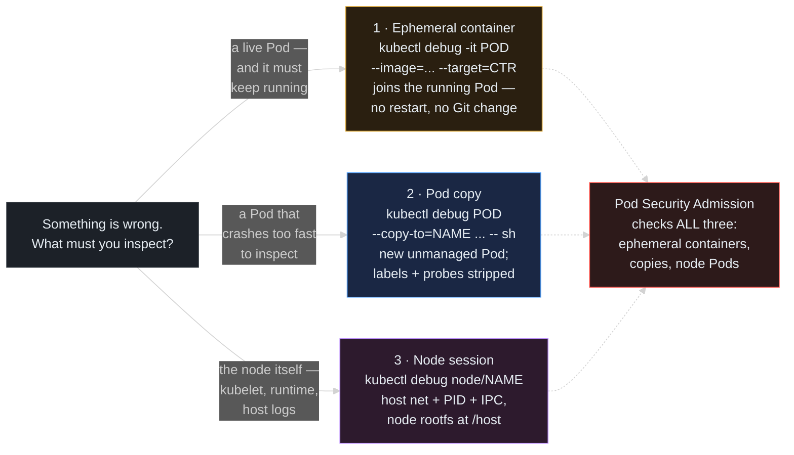

> **30 Days of DevOps** — Day 23 of 30. [← Day 22: PriorityClasses and Preemption](/articles/2026/06/11/day-22-priority-classes-preemption/)

Back on Day 13, mid-demo, we hit a wall that was quietly a preview of today: the webapp container had no `curl`. We worked around it then (extracted the token, ran the API call from the laptop), but the wall was not an accident — it was Day 14's whole philosophy arriving early. A production container should carry the application and *nothing else*: no curl, no package manager, no debugging toolkit an attacker could turn around and use. The industry endpoint of that philosophy is the **distroless image** — no shell, no `ls`, nothing but the binary — where `kubectl exec` is not merely unhelpful but *impossible*.

Which leaves a real question: when that locked-down Pod misbehaves at 2 AM, how do you look inside it?

The old answers are all bad. Rebuilding the image with tools added means deploying unverified artifacts mid-incident. Loosening the securityContext means undoing Day 14 exactly when you are most exposed. Running a privileged "toolbox" Deployment permanently means carrying attack surface forever for the few minutes a year you debug.

Kubernetes' answer is **`kubectl debug`** — three distinct tools behind one command, all built on the principle that *the debugging tools should come to the workload at debug time, and leave a clean audit trail*:

1. **Ephemeral containers** (GA since 1.25): attach a new, fully-tooled container to a **running Pod** — no restart, no spec change in Git, optionally sharing the target container's process namespace so you can see its processes from the outside.
2. **Pod copies** (`--copy-to`): clone a Pod with surgical mutations — swap the crashing command for a shell, strip the probes — for post-mortem work on something that will not stay alive long enough to inspect.
3. **Node debugging** (`debug node/`): a Pod that joins the node's host namespaces with the node's root filesystem mounted at `/host` — the modern replacement for SSH-ing into workers.

And because all three create or mutate Pods, **Pod Security Admission referees every one of them** — today you will see PSS reject a naive debug attempt against the hardened webapp, and learn the `--profile` flag that exists precisely for that moment.

## What you will build

By the end of this article you will have:

- A demonstration of why `kubectl exec` is not enough on the Day 14 webapp — the shell opens, but it is a shell in a toolless, read-only, unprivileged box (no `curl`, and `apk add` fails twice over)
- An **ephemeral container** attached to the running `postgres-0` from Day 17 with `--target`, seeing the Postgres processes from inside the debugger via the shared process namespace — and the proof in `pod.spec.ephemeralContainers` that the attach is recorded, accumulates, and cannot be removed without a Pod restart
- The **PSS collision, on purpose**: a naive `kubectl debug` against the webapp in the `restricted` namespace rejected by Pod Security Admission with the same violation list you met on Day 14 — then the fix: **`--profile=restricted`** plus a non-root debug image (the article's own `nginx-unprivileged`, doing double duty)
- From inside that compliant debugger: the webapp's nginx processes listed, and the Day 18 init-rendered `index.html` read **through `/proc/1/root`** — inspecting another container's read-only filesystem without touching it
- A **crash-looping Pod debugged via `--copy-to`**: the copy gets the same image but a shell instead of the dying command, and the labels and probes are stripped by design so the copy neither receives Service traffic nor gets restart-cycled
- A **node debugging session** on a worker: host PID namespace (the kubelet visible in `ps`), the node's root filesystem at `/host` (including `/var/log/containers` — the very directory Day 9's Promtail tails), and `journalctl -u kubelet` through a chroot — launched into the `agents` namespace because the `default` namespace's PSS would reject the host-namespace Pod outright

---

## Three tools, one decision: what exactly is broken?

`kubectl debug` changes behaviour completely depending on what you point it at. The decision tree is the mental model.



**Reading this diagram:**

The grey question box on the left is the triage moment, and the three solid arrows leaving it are the three answers `kubectl debug` can give.

**Path 1 — the ephemeral container** (amber): the target is a *live* Pod that must stay live — an intermittent memory climb, a connection pool that drains under real traffic, anything that dies with the Pod if you restart it. The debug container is injected into the **existing** Pod alongside the app container; with `--target` it joins that container's process namespace, so the app's processes appear in the debugger's `ps`. Nothing restarts, and nothing changes in the Git-managed manifest — the attach happens through a dedicated API subresource, which Part 2 examines.

**Path 2 — the Pod copy** (blue): the target crashes too fast to attach anything. The copy is a **new, unmanaged** Pod cloned from the original, with mutations applied at creation — most usefully, the failing container's command replaced by a shell. Two things are stripped from the copy by design: the original's **labels** (so no Service from Day 5 onward routes traffic to your debugging session) and, by default, its **probes** (so the Day 5 liveness probe cannot restart-cycle your shell out from under you).

**Path 3 — the node session** (purple): the suspect is below the Pods — kubelet behaviour, container runtime state, node-level logs, disk pressure. `kubectl debug node/<name>` creates a Pod that joins the node's **host network, PID, and IPC namespaces** with the node's root filesystem mounted at `/host`. It is SSH without sshd, and it places the Pod by setting `nodeName` directly — bypassing the scheduler, which is why it works even on nodes the scheduler would refuse.

The red box is the thread tying today to Day 14: **all three paths produce Pod-shaped objects, and Pod Security Admission evaluates every one** — the ephemeral container added to a Pod in a `restricted` namespace, the copy created in it, the node Pod with its forbidden host namespaces. The dotted arrows mark where each path can be refused. Debugging tooling does not get a security bypass; it gets a `--profile` flag to *comply*, which is the better deal.

---

## Prerequisites

This article continues from Day 22. Required state:

- The `devops-cluster` kind cluster; kubectl **1.27+** (ephemeral containers are GA from 1.25; the `--profile` flag this article depends on arrived in 1.27)
- The webapp running in `default` (PSS `restricted` enforced — Day 14), with the Day 18 init container and sidecar
- `postgres-0` running in `database` (no PSS — Day 17)
- The `agents` namespace from Day 20 (no PSS — needed for the node session in Part 5)

Pre-flight check:

```bash
kubectl get pod -n default -l app.kubernetes.io/instance=webapp --no-headers | head -1
kubectl get pod -n database postgres-0 --no-headers
kubectl get ns agents --no-headers
```

Expected output:

```text
webapp-webapp-7e6d5c4b3-mmmmm   2/2     Running   0   2d
postgres-0                      1/1     Running   0   10d
agents                          Active  5d
```

| Tool | Minimum version | Check |
|---|---|---|
| kubectl | **1.27** | `kubectl version --client` |
| Kubernetes (server) | 1.25+ | `kubectl version` |

---

## Part 1 — Why `exec` is not enough

Be precise about what Day 14 did and did not break. `kubectl exec` still opens a shell on the webapp — `nginx-unprivileged` is Alpine-based, so `/bin/sh` exists:

```bash
POD=$(kubectl get pod -n default -l app.kubernetes.io/instance=webapp \
  -o jsonpath='{.items[0].metadata.name}')

kubectl exec -n default "$POD" -c webapp -- id
```

Expected output:

```text
uid=101(nginx) gid=101(nginx) groups=101(nginx)
```

A shell, as UID 101. Now try to *do* anything with it:

```bash
# Day 13's wall, revisited:
kubectl exec -n default "$POD" -c webapp -- curl --version 2>&1 || true

# Fine — install it, then?
kubectl exec -n default "$POD" -c webapp -- apk add curl 2>&1 | tail -2
```

Expected output:

```text
OCI runtime exec failed: exec failed: unable to start container process: exec: "curl": executable file not found in $PATH: unknown

ERROR: Unable to lock database: Read-only file system
ERROR: Failed to open apk database: Read-only file system
```

No curl — and no way to add it. The `apk` failure is Day 14 working twice over: the root filesystem is **read-only** (`readOnlyRootFilesystem: true`), and even on a writable filesystem UID 101 could not write to `/lib/apk`. The shell you have is a viewing platform with nothing to view through. And remember this is the *gentle* case — a distroless image would have refused the `id` command too, because there is no shell to run it. The container is working exactly as hardened. The debugging tools have to come from somewhere else.

---

## Part 2 — Ephemeral containers, mechanics first

Start in easy mode: `postgres-0` in the `database` namespace, where no PSS profile complicates the picture. The Postgres image has psql but little else — no `ps`, even. Attach a busybox toolbox to the running Pod:

```bash
# -it            interactive shell
# --image        the toolbox to bring
# --target       join THIS container's process namespace
# -c             name the debug container explicitly (otherwise: debugger-<random>)
kubectl debug -it postgres-0 -n database \
  --image=busybox:1.36 \
  --target=postgres \
  -c toolbox \
  -- sh
```

Expected output (you land in a shell inside the new container):

```text
Targeting container "postgres". If you don't see processes from this container it may be because the container runtime doesn't support this feature.
Defaulting debug container name to debugger-vk2x9.
/ #
```

(The "Defaulting debug container name" line only appears when you omit `-c`; with `-c toolbox` the name is yours.) Now look around — these are **Postgres' processes, seen from busybox**:

```bash
ps
```

Expected output (inside the debug shell; trimmed):

```text
PID   USER     TIME  COMMAND
    1 70        0:00 postgres
   17 70        0:00 postgres: checkpointer
   18 70        0:00 postgres: background writer
   20 70        0:00 postgres: walwriter
   25 root      0:00 sh
   31 root      0:00 ps
```

Three readings. First, `--target` worked: the debugger shares the `postgres` container's PID namespace, so the database's processes are simply *there*, with the Postgres master at PID 1. Second, the `USER` column shows `70` numerically — that is Alpine Postgres' UID, but *busybox's* `/etc/passwd` has no name for it; user names resolve against the debugger's own files, a small reminder that you are in a different container sharing a window. Third, your `sh` runs as `root` — the `database` namespace has no PSS profile, and `kubectl debug` adds no securityContext by default. Convenient here; exactly what gets rejected in Part 3.

Exit the shell (`exit` or Ctrl-D), then look at what the attach actually did to the Pod:

```bash
kubectl get pod -n database postgres-0 \
  -o jsonpath='{range .spec.ephemeralContainers[*]}{.name}{" -> "}{.image}{"\n"}{end}'
```

Expected output:

```text
toolbox -> busybox:1.36
```

The ephemeral container is **part of the Pod spec now** — but it got there through a dedicated API subresource (`/pods/<name>/ephemeralcontainers`), not through an ordinary update. That distinction has teeth: you cannot add one with `kubectl edit` or `kubectl apply` (the API rejects ephemeral-container changes through the normal update path), Argo CD never sees a diff against Git (the field is ignored for ordinary updates, so there is no drift to heal), and — the part that surprises everyone — **you cannot remove it either**. Exiting the shell only *terminated* it. Run a second session and count again:

```bash
kubectl debug -it postgres-0 -n database --image=busybox:1.36 --target=postgres -c toolbox2 -- \
  sh -c 'echo second session; exit'

kubectl get pod -n database postgres-0 \
  -o jsonpath='{range .spec.ephemeralContainers[*]}{.name}{" "}{end}{"\n"}'
```

Expected output:

```text
second session

toolbox toolbox2
```

They accumulate — terminated, harmless, but listed forever in this Pod's spec and status. The only eraser is a Pod replacement, and Day 17 already proved that is safe here:

```bash
kubectl delete pod -n database postgres-0
kubectl rollout status statefulset/postgres -n database --timeout=120s
kubectl get pod -n database postgres-0 -o jsonpath='{.spec.ephemeralContainers}{"\n"}'
```

Expected output:

```text
pod "postgres-0" deleted
Waiting for 1 pods to be ready...
statefulset rolling update complete 1 pods at revision postgres-6d4f8b9c7...

```

Empty output on the last line — the fresh `postgres-0` (same name, same PVC, same data, per Day 17) carries no debugging history.

One more property worth knowing before the hard mode: ephemeral containers are forbidden from declaring **ports, probes, lifecycle hooks, or resources**. No resources means no scheduler involvement and no reservation — the debugger borrows the node's spare capacity. That is also the honest reason they are a debugging tool and not a sidecar mechanism: Day 18's native sidecars exist precisely because ephemeral containers refuse to be load-bearing.

---

## Part 3 — Hard mode: debugging inside the `restricted` namespace

Now the webapp. Same naive command that just worked for Postgres:

```bash
POD=$(kubectl get pod -n default -l app.kubernetes.io/instance=webapp \
  -o jsonpath='{.items[0].metadata.name}')

kubectl debug -it "$POD" -n default --image=busybox:1.36 --target=webapp -- sh
```

Expected output:

```text
error: ephemeral containers are not allowed: pods "webapp-webapp-7e6d5c4b3-mmmmm" is forbidden: violates PodSecurity "restricted:latest": allowPrivilegeEscalation != false (container "debugger-x8k2p" must set securityContext.allowPrivilegeEscalation=false), unrestricted capabilities (container "debugger-x8k2p" must set securityContext.capabilities.drop=["ALL"]), runAsNonRoot != true (pod or container "debugger-x8k2p" must set securityContext.runAsNonRoot=true), seccompProfile (pod or container "debugger-x8k2p" must set securityContext.seccompProfile.type to "RuntimeDefault" or "Localhost")
```

Read the container name in the violations: `debugger-x8k2p`. That is Day 14's admission controller evaluating the **ephemeral container** exactly as it evaluated the webapp's own containers — the subresource update is still a Pod mutation, and PSS checks every container in the result, ephemeral ones included. The naive debugger (root, full capabilities, no seccomp) fails all four `restricted` requirements. This is the security model holding, not a bug.

The fix has two halves, because the requirements split two ways:

- Three of the four violations are *securityContext fields* — and `kubectl debug --profile=restricted` sets exactly those: `allowPrivilegeEscalation: false`, `capabilities.drop: [ALL]`, `runAsNonRoot: true`, `seccompProfile: RuntimeDefault`.
- The fourth is sneakier: `runAsNonRoot: true` is a *promise the image must keep*. busybox's default user is root, so with the profile alone the API would admit the container and then the kubelet would refuse to start it (`CreateContainerConfigError` — Common Errors #2). You need a debug image whose default user is non-root — and the article's own `nginx-unprivileged` (Alpine, UID 101, has a shell and busybox tools) is sitting right there:

```bash
kubectl debug -it "$POD" -n default \
  --image=nginxinc/nginx-unprivileged:1.27-alpine \
  --target=webapp \
  --profile=restricted \
  -c toolbox \
  -- sh
```

Expected output:

```text
Targeting container "webapp". If you don't see processes from this container it may be because the container runtime doesn't support this feature.
$
```

Admitted — and note the prompt is `$`, not `#`: you are UID 101, non-root, exactly as `restricted` demands. Now use the shared process namespace:

```bash
ps
```

Expected output (inside the debug shell; trimmed):

```text
PID   USER     TIME  COMMAND
    1 nginx     0:00 nginx: master process nginx -g daemon off;
   30 nginx     0:00 nginx: worker process
   31 nginx     0:00 nginx: worker process
   52 nginx     0:00 sh
   58 nginx     0:00 ps
```

The webapp's nginx master sits at PID 1 of the shared namespace (this time the `USER` column resolves to `nginx`, because the *debugger's* image also has UID 101 named `nginx` in its passwd file). The Day 18 `clock-sidecar` is absent from this listing — `--target` joins exactly one container's PID namespace, and the sidecar is a different container.

And now the trick that makes shared PID namespaces genuinely powerful — **reaching the target's filesystem through procfs**. The debugger and the target run as the same UID, so the target's root is readable at `/proc/<pid>/root`:

```bash
ls /proc/1/root/usr/share/nginx/html
cat /proc/1/root/usr/share/nginx/html/health.txt
```

Expected output:

```text
health.txt
index.html

ok 2026-06-12T11:10:31Z
```

That is the Day 18 shared `emptyDir` — the init-rendered `index.html` and the sidecar's refreshing `health.txt` — read from the webapp container's mount table, through the master process' `/proc` entry, without `exec`-ing into the webapp container at all. Its read-only filesystem was never written, its process never disturbed; the debugger looked *through* PID 1 rather than acting inside the target. Exit the shell when done.

The audit story completes the picture: the webapp Pod now carries a `toolbox` entry in `spec.ephemeralContainers` recording the image and securityContext used — visible to anyone who inspects the Pod, erased at the next rollout (which, per Part 2, is the only eraser anyway).

---

## Part 4 — `--copy-to`: debugging what will not stay alive

Ephemeral containers need a running Pod to join. A crash-looper gives you no such thing — by the time you attach, the container is gone again. Manufacture one in the `database` namespace:

```bash
mkdir -p ~/30-days-devops/day-23 && cd ~/30-days-devops/day-23

cat > broken.yaml << 'EOF'
apiVersion: v1
kind: Pod
metadata:
  name: broken
  namespace: database
  labels:
    app: broken
spec:
  # OnFailure restarts the crashing app (exit 1) just like Always would —
  # but it matters for the COPY we make later: the copy inherits this
  # policy, and when our debug shell exits 0, OnFailure lets the copy go
  # to Completed instead of restarting the shell into its own crash loop.
  restartPolicy: OnFailure
  containers:
    - name: app
      image: busybox:1.36
      # Simulates an app that fails during boot — config missing,
      # dependency unreachable, take your pick. Exits before any
      # debugger could attach.
      command: ["sh", "-c", "echo 'FATAL: config /etc/app/app.conf not found'; exit 1"]
EOF

kubectl apply -f broken.yaml
sleep 20
kubectl get pod -n database broken
```

Expected output:

```text
pod/broken created

NAME     READY   STATUS             RESTARTS      AGE
broken   0/1     CrashLoopBackOff   2 (10s ago)   20s
```

`kubectl logs broken -n database` shows the FATAL line, but logs only show what the app *said* — not what its environment looked like. For that you need a shell **where the app runs**: same image, same volumes, same env, same node-ish conditions, but with the dying command replaced. That is exactly what `--copy-to` with a `--container` override does:

```bash
# --copy-to       name of the NEW pod (a clone of broken)
# --container     which container's command to replace in the copy
# -- sh           the replacement: an interactive shell instead of the crash
kubectl debug broken -n database -it \
  --copy-to=broken-debug \
  --container=app \
  -- sh
```

Expected output (you land in a shell where the crashing app would have been):

```text
/ #
```

Now do the post-mortem the crash never allowed:

```bash
ls /etc/app 2>&1
id
exit
```

Expected output:

```text
ls: /etc/app: No such file or directory
uid=0(root) gid=0(root) groups=...
```

There is the answer the logs hinted at: the config directory genuinely does not exist in this image — the FATAL message was honest. (In a real incident this is where you would discover the missing ConfigMap mount, the typo'd volume path, the absent Secret.) Compare the two Pods:

```bash
kubectl get pod -n database broken broken-debug --show-labels
```

Expected output:

```text
NAME           READY   STATUS             RESTARTS        AGE     LABELS
broken         0/1     CrashLoopBackOff   5 (90s ago)     5m      app=broken
broken-debug   0/1     Completed          0               2m      <none>
```

Two design choices visible in one listing. The copy's `LABELS` column reads `<none>` — `--copy-to` **strips the original's labels** so that no Service selector can match the debug copy and route real traffic into your shell session. And the copy shows `Completed`, not CrashLoopBackOff: your `sh` exited cleanly when you typed `exit`, and nothing restarted it — the copy also drops the original's probes by default (`--keep-liveness=false`, `--keep-readiness=false`), so the Day 5 probe machinery cannot kill a debugging session that fails a health check it was never going to pass.

The copy is an unmanaged, ordinary Pod — no controller owns it, so no controller cleans it up:

```bash
kubectl delete pod -n database broken broken-debug
```

Expected output:

```text
pod "broken" deleted
pod "broken-debug" deleted
```

---

## Part 5 — `debug node/`: the node itself, without SSH

The third target is the layer below: kubelet behaviour, runtime state, host logs. The classic answer was SSH onto the worker; the kind-era answer (and increasingly the production answer, where workers have no sshd at all) is a node debug session.

One placement decision matters before the command: the node-debugger Pod joins the **host network, PID, and IPC namespaces** and mounts the node's root filesystem via `hostPath` — four things the `default` namespace's `restricted` profile forbids outright. `kubectl debug node/` creates its Pod in your *current* namespace, so point it somewhere PSS-free — the Day 20 `agents` namespace exists for exactly this kind of node-level tooling:

```bash
kubectl debug node/devops-cluster-worker -n agents -it --image=busybox:1.36 -- sh
```

Expected output:

```text
Creating debugging pod node-debugger-devops-cluster-worker-x7k2p with container debugger on node devops-cluster-worker.
/ #
```

Prove where you are, in three steps of increasing depth:

```bash
# 1 — host PID namespace: the kubelet itself is in your process list
ps | grep kubelet | head -1

# 2 — the node's filesystem at /host: the exact directory Day 9's
#     Promtail DaemonSet tails for every container's logs
ls /host/var/log/containers | head -3

# 3 — full node context via chroot: the kubelet's own journal
chroot /host journalctl -u kubelet --no-pager -n 2
```

Expected output (trimmed; hashes and timestamps will differ):

```text
  612 root      4:12 /usr/bin/kubelet --bootstrap-kubeconfig=/etc/kubernetes/bootstrap-kubelet.conf ...

kube-proxy-kkty2_kube-system_kube-proxy-3f2a...19.log
node-info-aaaaa_agents_node-info-7d8c...41.log
webapp-webapp-7e6d5c4b3-mmmmm_default_webapp-9e1b...77.log

Jun 12 11:20:14 devops-cluster-worker kubelet[612]: I0612 11:20:14.318 ... "Pod status updated" pod="agents/node-debugger-devops-cluster-worker-x7k2p"
Jun 12 11:20:31 devops-cluster-worker kubelet[612]: I0612 11:20:31.552 ... probe="readiness" pod="default/webapp-webapp-7e6d5c4b3-mmmmm"
```

Step 1: host PID namespace — the kubelet is just *there* in `ps`, the unambiguous proof you are looking at the node, not at a container's view of it. Step 2: `/host` is the node's real root; that `containers/` directory full of `<pod>_<namespace>_<container>-<id>.log` files is precisely what Day 9 wired Promtail to tail — you are standing in your own logging pipeline's source. Step 3: `chroot /host` switches from busybox's toolkit to the **node's** toolkit (kind nodes are systemd-based Debian, so `journalctl` is available there even though busybox has no such thing), and the kubelet's journal even records the debugging session you are currently running.

Two mechanics worth knowing. The node-debugger Pod was placed by setting **`spec.nodeName` directly** — no scheduler involved — which is why this works even against nodes the scheduler would refuse (you could debug the tainted control-plane the same way, no toleration required, since `NoSchedule` is enforced by the scheduler that was just bypassed). And the Pod is **not cleaned up when you exit**:

```bash
# after exiting the shell:
kubectl get pod -n agents | grep node-debugger
kubectl delete pod -n agents node-debugger-devops-cluster-worker-x7k2p
```

Expected output:

```text
node-debugger-devops-cluster-worker-x7k2p   0/1     Completed   0   6m
pod "node-debugger-devops-cluster-worker-x7k2p" deleted
```

A `Completed` host-namespace Pod is harmless but untidy — and on a `kubectl get pod -A` it reads like an incident. Delete them when you are done.

---

## Common Errors

**1. `kubectl debug` rejected with `violates PodSecurity "restricted:latest"`**

The Part 3 collision. The naive debug container (root, no securityContext) fails every `restricted` requirement, and PSS evaluates ephemeral containers like any other container in the Pod.

Fix: `--profile=restricted` for the securityContext fields, **plus** an image whose default user is non-root (see #2). If you are on kubectl older than 1.27, the `--profile` flag does not exist — upgrade kubectl; no server change is needed.

**2. Debug container admitted, then stuck in `CreateContainerConfigError`**

```text
Error: container has runAsNonRoot and image will run as root (pod: "webapp-...", container: toolbox)
```

The two-layer trap from Part 3: `--profile=restricted` satisfied the *admission* check by setting `runAsNonRoot: true`, but that field is verified again by the **kubelet at start time** against the image's actual user — and busybox, like most debug images, defaults to root. Admission and runtime are separate gates; the profile only opens the first.

Fix: use a debug image with a non-root default user (`nginxinc/nginx-unprivileged` works and you already trust it), or build a small toolbox image with `USER 1000` baked in.

**3. `ps` in the debugger shows only `sh` and `ps` — no target processes**

Two causes, in order of likelihood. You forgot `--target` — without it the ephemeral container gets its own PID namespace, tools but no view. Or the container runtime does not support process-namespace targeting — in which case `kubectl debug` printed its warning (`If you don't see processes from this container it may be because the container runtime doesn't support this feature`) right at attach, and it was not being rhetorical. kind's containerd supports it; some older or exotic runtimes do not.

Fix: re-run with `--target=<container-name>` (the *container* name — `webapp`, not the Pod name; check with `kubectl get pod <pod> -o jsonpath='{.spec.containers[*].name}'`).

**4. Tried to remove an old ephemeral container with `kubectl edit` — rejected**

```text
Pod "postgres-0" is invalid: spec.ephemeralContainers: Forbidden: existing ephemeral containers may not be removed or changed
```

Ephemeral containers are append-only through their subresource, and immutable through everything else. `edit`, `apply`, `patch` against the main Pod resource cannot add, change, or remove them — by design, so a debugging mechanism can never morph into an unaudited deployment mechanism.

Fix: there is none, and that is the point. The list clears when the Pod is replaced — `kubectl rollout restart` for managed Pods, delete-and-recreate for the StatefulSet case (Part 2 did exactly this, leaning on Day 17's storage guarantees).

**5. `kubectl debug node/` rejected — or its Pod stuck `Pending` — in a hardened namespace**

```text
error: ... pods "node-debugger-..." is forbidden: violates PodSecurity "restricted:latest": host namespaces (hostNetwork=true, hostPID=true, hostIPC=true), hostPath volumes (volume "host-root")
```

The node-debugger Pod is, by PSS `restricted` standards, maximally illegal — host namespaces and a hostPath mount of `/`. Run from a kubectl context whose namespace is `restricted` and the rejection is instant.

Fix: aim it at a PSS-free (or `privileged`-labelled) namespace with `-n` — this article used `agents`. The same namespace logic from Day 20 applies: node-level tooling lives where node-level access is policy.

**6. The `--copy-to` copy behaves differently from the original — "works in the copy, crashes in the real Pod"**

Not a paradox; an inventory problem. The copy differs from the original in precisely the ways that make it debuggable: labels stripped (no Service traffic reaches it — so a bug triggered by *real requests* never fires), probes stripped by default (a liveness-probe kill loop will not reproduce), your `-- sh` replaced the entrypoint (initialisation the real command performs never ran), and the copy may have landed on a different node (Day 21's spread preferences apply to it like any new Pod).

Fix: treat the copy as the app's *environment*, not its *behaviour* — inspect filesystems, env vars, DNS, mounts. To reproduce traffic-dependent behaviour, keep probes with `--keep-liveness --keep-readiness`, run the real command, and send requests by hand from inside or via a second ephemeral container.

---

## Recap

In this article you:

- Drew the line precisely: Day 14's hardening leaves `kubectl exec` a shell with nothing to wield (`curl` absent — Day 13's wall, now explained; `apk add` doubly impossible on a read-only filesystem as UID 101), and distroless images delete even the shell
- Attached an **ephemeral container** to the live `postgres-0` with `--target`, read the database's processes from busybox's `ps` (UID 70 unresolved by the debugger's passwd — a healthy reminder of whose namespace is whose), and learned the lifecycle rules: added only via the `ephemeralcontainers` subresource, invisible to Argo CD's drift detection, **append-only and permanent until the Pod is replaced**, forbidden from carrying ports, probes, lifecycle hooks, or resources
- Collided with **Pod Security Admission on purpose**: the naive debug attempt against the webapp rejected with the Day 14 violation list naming `debugger-x8k2p`, then fixed properly — `--profile=restricted` for the securityContext, a non-root image (`nginx-unprivileged`, doing double duty) for the `runAsNonRoot` promise the kubelet verifies separately
- Used the shared PID namespace for its two real powers: the target's process table, and the target's **filesystem through `/proc/1/root`** — reading Day 18's init-rendered `index.html` and ticking `health.txt` without touching the webapp container
- Debugged a **crash-looper via `--copy-to`**: same image and volumes, the dying command swapped for a shell, labels stripped (no Service traffic), probes stripped (no restart-cycling), and the diagnosis (`/etc/app` genuinely absent) that logs alone could not deliver
- Ran a **node session** without SSH: host PID namespace (kubelet in `ps`), the node's rootfs at `/host` (standing inside Day 9's Promtail source directory), `journalctl -u kubelet` through `chroot /host` — placed by direct `nodeName` assignment that bypasses the scheduler entirely, launched into `agents` because `default`'s PSS would refuse the host namespaces, and cleaned up manually because nothing else will
- Catalogued six failure modes, including the **two-gate trap** (admission's `runAsNonRoot` vs the kubelet's image-user check) and the **copy-fidelity inventory** (everything `--copy-to` deliberately changes, and why each change is the feature)

The hardening from Day 14 and the debuggability from today are not in tension — they are the same design. Tools arrive at debug time, with their own audited securityContext, through an append-only mechanism that cannot become a deployment path, and they leave when the Pod does.

---

## What's next

[Day 24: ConfigMaps and Configuration Patterns — env vs Files, Immutability, and the Reload Problem →](/articles/2026/06/13/day-24-configmaps-configuration-patterns/)

Part 4's broken Pod died looking for a config file that was never mounted — tomorrow is about doing configuration properly. On Day 24 you will work through the **ConfigMap** patterns that separate config from images: environment variables vs mounted files (and why the two have *completely different* update semantics — env is frozen at container start, mounted files update live), **immutable ConfigMaps** and what they buy you in safety and kubelet load, the **hash-suffix trick** that turns config changes into observable rollouts through the Day 10 GitOps loop, and the reload problem — how a Day 18-style sidecar can watch a mounted ConfigMap and signal the app, closing the loop between "the file changed on disk" and "the process noticed."
