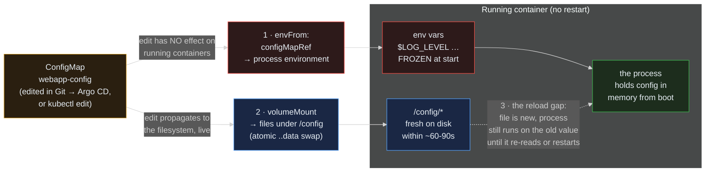

> **30 Days of DevOps** — Day 24 of 30. [← Day 23: Ephemeral Containers and kubectl debug](/articles/2026/06/12/day-23-ephemeral-containers-kubectl-debug/)

Day 23's `broken` Pod crashed with `FATAL: config /etc/app/app.conf not found`, and the `--copy-to` debug confirmed the directory genuinely did not exist. That was a manufactured failure, but it named a real one: applications need configuration, and the worst place to put it is baked into the image. An image with the database URL compiled in is one image per environment; an image with the log level hard-coded needs a rebuild to turn on debugging at 2 AM. The twelve-factor rule — *config in the environment, not the artifact* — exists because the alternative is misery.

The **ConfigMap** is Kubernetes' answer: a namespaced object holding key-value configuration data, decoupled from any Pod, consumed by Pods in one of two ways. And here is the thing nobody tells you until it bites: **those two ways have completely opposite update semantics.**

- Consume a ConfigMap as **environment variables** and the values are **frozen at container start**. Edit the ConfigMap afterwards and the running container's environment does not change — cannot change — until the container is recreated. The process environment is fixed for the life of the process; that is a Linux fact, not a Kubernetes choice.
- Consume the same ConfigMap as **mounted files** and the files **update live**. Edit the ConfigMap and, within about a minute, the files on disk inside the running container change — no restart. The kubelet swaps them atomically underneath the running process.

Get these backwards and you ship one of the two classic config bugs: editing a ConfigMap and wondering why the env var never changed (it is frozen — you needed a restart), or mounting config as a file and assuming the *application* noticed it changed (it did not — the file is fresh but the process still holds the old value in memory). Today you will prove both behaviours with a stopwatch, then learn the three production patterns built on top of them: **immutable ConfigMaps**, the **checksum-annotation rollout**, and a clear-eyed treatment of the **reload problem**.

## What you will build

By the end of this article you will have:

- A `config-lab` namespace with one busybox Pod consuming a single ConfigMap **both ways at once** — `envFrom` and a volume mount — so you can watch one edit produce two different outcomes
- A stopwatch demonstration of the asymmetry: after editing the ConfigMap, the env var stays stale **forever** (until restart) while the mounted file flips to the new value in ~60–90 seconds, plus a look at the **`..data` symlink** mechanism that makes the file swap atomic
- An **immutable ConfigMap** (`immutable: true`): an edit rejected with `field is immutable`, the delete-and-recreate workflow it forces, and the real reason it exists — the kubelet stops watching it, cutting API-server load on clusters with thousands of ConfigMaps
- A real `webapp-config` ConfigMap **shipped to the webapp chart**, consumed as env via `envFrom` (composing with Day 11's Secret env), with the **`checksum/config` Pod-template annotation** that turns "edit the config" into a rolling update Argo CD can see, sequence, and roll back — the fix for the frozen-env trap in a GitOps world
- The **reload problem** confronted directly: the famous **`subPath` gotcha** (subPath mounts do *not* live-update — a frozen file masquerading as a live one), and the spectrum of real solutions from checksum-rollout (what you shipped) through a Day-18-style sidecar file-watcher to the Reloader operator

---

## Two ways in, two different update rules

The whole article hangs on one diagram: the same ConfigMap, two delivery paths, opposite behaviours, and a gap at the end.



**Reading this diagram:**

The amber **ConfigMap** on the left is the single source of truth — one object, edited in exactly one place (in this series, a values file in Git that Argo CD reconciles). Everything to its right is consumption.

**Path 1 — environment variables** (red, because this path is a trap for the unwary). `envFrom: configMapRef` copies every key in the ConfigMap into the container's process environment **at container creation time**. The red `env vars … FROZEN at start` box is the consequence: those variables are baked into the process when it spawns, and the Linux process environment is immutable thereafter. The arrow from the ConfigMap is labelled "edit has NO effect on running containers" — because it genuinely does not. There is no watch, no propagation, no sync interval; the only way a running container picks up a new env value is to be replaced by a new container.

**Path 2 — mounted files** (blue). A ConfigMap mounted as a volume projects each key as a file under the mount path. The blue `/config/* fresh on disk` box updates **live**: the kubelet watches the ConfigMap and, on change, writes the new content and atomically repoints the mount (the `..data` symlink swap, which Part 2 dissects) so readers never see a half-written file. The arrow is labelled "edit propagates to the filesystem, live" — within roughly the kubelet sync period, ~60–90 seconds.

The green **process** box and the dotted red arrow are the punchline — **the reload gap**. Even on the live path, updating the *file* does nothing to the *process*: a long-running program reads its config once at startup and holds it in memory. The file under `/config` is fresh; the process is still running on what it read at boot. Closing that gap — making the process actually re-read — is a separate problem with its own solutions (Part 5), and conflating "the file changed" with "the app reloaded" is the second classic config bug.

The key insight: **there is no single 'update a ConfigMap' behaviour.** There are two, they are opposite, and choosing between them — or bridging the gap with a rollout — is what configuration management on Kubernetes actually is.

---

## Prerequisites

This article continues from Day 23. Required state:

- The `devops-cluster` kind cluster; kubectl 1.29+
- The webapp running under Argo CD in `default` (Day 11's `envFrom: secretRef` already in place — today's ConfigMap env sits right beside it)

Pre-flight check:

```bash
# The webapp already consumes a Secret as env (Day 11). Confirm it's there —
# today adds a ConfigMap to the same envFrom list.
POD=$(kubectl get pod -n default -l app.kubernetes.io/instance=webapp \
  -o jsonpath='{.items[0].metadata.name}')
kubectl get pod -n default "$POD" \
  -o jsonpath='{.spec.containers[0].envFrom[*].secretRef.name}{"\n"}'
```

Expected output:

```text
webapp-secret
```

| Tool | Minimum version | Check |
|---|---|---|
| kubectl | 1.29 | `kubectl version --client` |
| Helm | 3.14 | `helm version --short` |

---

## Part 1 — One ConfigMap, consumed both ways

A lab namespace, a ConfigMap, and a single Pod that consumes it as **env vars and files simultaneously** — the only way to see the two behaviours diverge from one edit.

```bash
mkdir -p ~/30-days-devops/day-24 && cd ~/30-days-devops/day-24

kubectl create namespace config-lab

cat > demo-config.yaml << 'EOF'
apiVersion: v1
kind: ConfigMap
metadata:
  name: demo-config
  namespace: config-lab
data:
  GREETING: hello
  TIER: bronze
EOF

kubectl apply -f demo-config.yaml
```

Expected output:

```text
namespace/config-lab created
configmap/demo-config created
```

Now the consumer. `envFrom` pulls every key in as an env var; the volume mount projects every key as a file under `/config`:

```bash
cat > consumer.yaml << 'EOF'
apiVersion: v1
kind: Pod
metadata:
  name: consumer
  namespace: config-lab
spec:
  containers:
    - name: app
      image: busybox:1.36
      command: ["sleep", "86400"]
      # Path 1: every key becomes an environment variable, at start.
      envFrom:
        - configMapRef:
            name: demo-config
      # Path 2: every key becomes a file at /config/<key>, live.
      volumeMounts:
        - name: config
          mountPath: /config
  volumes:
    - name: config
      configMap:
        name: demo-config
EOF

kubectl apply -f consumer.yaml
kubectl wait --for=condition=ready pod/consumer -n config-lab --timeout=30s
```

Expected output:

```text
pod/consumer created
pod/consumer condition met
```

Read the config both ways. They agree — for now:

```bash
echo "--- as env vars ---"
kubectl exec -n config-lab consumer -- sh -c 'echo "GREETING=$GREETING TIER=$TIER"'
echo "--- as files ---"
kubectl exec -n config-lab consumer -- sh -c 'echo "GREETING=$(cat /config/GREETING) TIER=$(cat /config/TIER)"'
```

Expected output:

```text
--- as env vars ---
GREETING=hello TIER=bronze
--- as files ---
GREETING=hello TIER=bronze
```

Both paths show `hello`/`bronze`. The next edit is where they part ways.

---

## Part 2 — The asymmetry, with a stopwatch

Change one key — `GREETING: hello` → `GREETING: goodbye` — and apply it. Nothing restarts; we are editing the ConfigMap object only:

```bash
cat > demo-config.yaml << 'EOF'
apiVersion: v1
kind: ConfigMap
metadata:
  name: demo-config
  namespace: config-lab
data:
  GREETING: goodbye
  TIER: bronze
EOF

kubectl apply -f demo-config.yaml
```

Expected output:

```text
configmap/demo-config configured
```

Immediately check the env var. It is **stale**, and it will stay stale:

```bash
kubectl exec -n config-lab consumer -- sh -c 'echo "env GREETING=$GREETING"'
```

Expected output:

```text
env GREETING=hello
```

Still `hello`. Wait ten minutes, ten hours — the running container's environment was sealed when its process started. There is no mechanism, anywhere, that will update it; only a new container gets the new value. This is **Path 1's** entire behaviour in one observation.

Now poll the file. It changes — but not instantly. The kubelet propagates ConfigMap volume updates on its sync loop, so the delay can be up to the kubelet sync period (1 minute by default) plus cache propagation — call it ~60–90 seconds:

```bash
# Poll until the file flips, printing the elapsed seconds.
start=$(date +%s)
until [ "$(kubectl exec -n config-lab consumer -- cat /config/GREETING)" = "goodbye" ]; do
  printf '\r%ss elapsed — file still says: %s' \
    "$(( $(date +%s) - start ))" \
    "$(kubectl exec -n config-lab consumer -- cat /config/GREETING)"
  sleep 5
done
echo
echo "file GREETING is now: $(kubectl exec -n config-lab consumer -- cat /config/GREETING)"
```

Expected output (the elapsed time varies, typically 30–90s):

```text
65s elapsed — file still says: hello
file GREETING is now: goodbye
```

The file updated, live, with no restart — **Path 2's** behaviour. One ConfigMap edit, two outcomes: the env frozen at `hello`, the file now `goodbye`. Same source, opposite rules.

How does the file change without ever being half-written? Look at the mount directory's real structure:

```bash
kubectl exec -n config-lab consumer -- ls -la /config
```

Expected output:

```text
total 12
drwxrwxrwx    3 root     root          4096 Jun 13 11:02 .
drwxr-xr-x    1 root     root          4096 Jun 13 11:00 ..
drwxr-xr-x    2 root     root          4096 Jun 13 11:02 ..2026_06_13_11_02_07.318492051
lrwxrwxrwx    1 root     root            31 Jun 13 11:02 ..data -> ..2026_06_13_11_02_07.318492051
lrwxrwxrwx    1 root     root            15 Jun 13 11:00 GREETING -> ..data/GREETING
lrwxrwxrwx    1 root     root            11 Jun 13 11:00 TIER -> ..data/TIER
```

The keys you see (`GREETING`, `TIER`) are **symlinks** pointing through `..data` into a timestamped directory holding the real content. On update, the kubelet writes a *new* timestamped directory with the new content, then atomically repoints the single `..data` symlink to it. Because a symlink swap is one atomic operation, a reader either follows the old `..data` (all-old content) or the new one (all-new content) — never a torn mix of half-updated keys. That atomicity is the quiet feature that makes live config mounts safe to read at any instant.

---

## Part 3 — Immutable ConfigMaps

Most ConfigMaps should never change in place — and you can enforce that. Setting `immutable: true` (stable since Kubernetes 1.21) locks the object: its `data` can no longer be edited, and the `immutable` flag itself cannot be flipped back. Recreate the demo ConfigMap as immutable:

```bash
kubectl delete configmap demo-config -n config-lab

cat > demo-config-immutable.yaml << 'EOF'
apiVersion: v1
kind: ConfigMap
metadata:
  name: demo-config
  namespace: config-lab
immutable: true
data:
  GREETING: hello
  TIER: gold
EOF

kubectl apply -f demo-config-immutable.yaml
```

Expected output:

```text
configmap "demo-config" deleted
configmap/demo-config created
```

Now try to edit it — change `TIER` and re-apply:

```bash
sed 's/gold/platinum/' demo-config-immutable.yaml | kubectl apply -f - 2>&1 | tail -1
```

Expected output:

```text
The ConfigMap "demo-config" is invalid: data: Forbidden: field is immutable when `immutable` is set
```

Rejected. The only way to "change" an immutable ConfigMap is to delete and recreate it — which sounds like a downside until you see what it buys.

The headline benefit is **performance at scale**. The kubelet ordinarily *watches* every ConfigMap and Secret mounted by its Pods, so it can deliver the live updates from Part 2. On a cluster with thousands of ConfigMaps, that is a continuous load on the API server's watch machinery. An immutable ConfigMap, by definition, will never change — so the kubelet **stops watching it entirely**, dropping that watch and its memory. On large clusters this is a measurable reduction in control-plane load.

The second benefit is **safety**: a config that thousands of Pods depend on cannot be mutated out from under them by a fat-fingered `kubectl edit`. And the third is **honesty about update semantics** — an immutable ConfigMap forces every change to be a new object with a new name, which is precisely the pattern Part 4 builds on. If your config genuinely should not drift, immutability turns a convention into a guarantee.

(The `immutable` flag itself is immutable, too — you cannot un-freeze a ConfigMap, only delete it. Verify if curious: `sed 's/immutable: true/immutable: false/' demo-config-immutable.yaml | kubectl apply -f -` is rejected the same way.)

---

## Part 4 — Ship config to the webapp, and make edits roll

Now the real pattern. The webapp gets a `webapp-config` ConfigMap consumed as env — the non-secret companion to Day 11's `webapp-secret`. But raw `envFrom` would walk straight into Part 2's frozen-env trap: editing the ConfigMap in Git would update the object, Argo CD would report it `Synced`, and the running Pods would keep their old env **forever**, because nothing changed in the Deployment to trigger new Pods.

The fix is the **`checksum/config` annotation** — a sha256 of the rendered ConfigMap, stamped onto the Pod template. Change the config, the checksum changes, the Pod template changes, and the Deployment rolls. Config edits become first-class, observable, rollback-able rollouts. Three chart changes.

```bash
cd ~/30-days-devops/day-12/gitops-webapp
```

### 4.1 — `webapp/values.yaml` defaults

Append:

```yaml
# Application config delivered as a ConfigMap (non-secret companion to
# webapp-secret from Day 11). Off by default; environments opt in.
appConfig:
  enabled: false
  data:
    APP_ENV: production
    LOG_LEVEL: info
    FEATURE_DARK_MODE: "false"
```

### 4.2 — `webapp/templates/configmap.yaml` (new file)

```yaml
{{- if .Values.appConfig.enabled }}
apiVersion: v1
kind: ConfigMap
metadata:
  name: webapp-config
  labels:
    {{- include "webapp.labels" . | nindent 4 }}
data:
  {{- range $key, $val := .Values.appConfig.data }}
  {{ $key }}: {{ $val | quote }}
  {{- end }}
{{- end }}
```

### 4.3 — `webapp/templates/deployment.yaml`: the annotation and the envFrom entry

Add a `checksum/config` annotation to the **Pod template's** `metadata.annotations` (alongside the labels already there). This is the standard Helm idiom — it hashes the rendered `configmap.yaml`, so any change to `appConfig.data` changes the hash:

```yaml
  template:
    metadata:
      labels:
        {{- include "webapp.selectorLabels" . | nindent 8 }}
      annotations:
        {{- if .Values.appConfig.enabled }}
        checksum/config: {{ include (print $.Template.BasePath "/configmap.yaml") . | sha256sum }}
        {{- end }}
```

Then add the ConfigMap to the container's existing `envFrom` list, right beside Day 11's Secret:

```yaml
          envFrom:
            - secretRef:
                name: webapp-secret
            {{- if .Values.appConfig.enabled }}
            - configMapRef:
                name: webapp-config
            {{- end }}
```

### 4.4 — Enable in `webapp/values-dev.yaml`

```yaml
# Day 24: deliver app config via ConfigMap, with checksum-triggered rollouts.
appConfig:
  enabled: true
  data:
    APP_ENV: dev
    LOG_LEVEL: debug
    FEATURE_DARK_MODE: "true"
```

### 4.5 — Render-check: the ConfigMap and the checksum together

```bash
helm template webapp ./webapp -f webapp/values-dev.yaml \
  | grep -E 'checksum/config|kind: ConfigMap|LOG_LEVEL|configMapRef|name: webapp-config'
```

Expected output:

```text
        checksum/config: 3a7bd3e2360a3d... (64 hex chars)
        - configMapRef:
            name: webapp-config
kind: ConfigMap
  LOG_LEVEL: "debug"
```

The annotation, the `envFrom` reference, and the ConfigMap itself all render. Commit and sync:

```bash
git add webapp/values.yaml webapp/values-dev.yaml \
        webapp/templates/configmap.yaml webapp/templates/deployment.yaml
git commit -m "feat(config): webapp-config ConfigMap with checksum-triggered rollout"
git push origin main

argocd app sync webapp --server argocd.local --insecure
kubectl rollout status deployment/webapp-webapp -n default --timeout=120s
```

Confirm the new env landed in the new Pods:

```bash
POD=$(kubectl get pod -n default -l app.kubernetes.io/instance=webapp \
  -o jsonpath='{.items[0].metadata.name}')
kubectl exec -n default "$POD" -c webapp -- sh -c 'echo "$APP_ENV / $LOG_LEVEL / $FEATURE_DARK_MODE"'
```

Expected output:

```text
dev / debug / true
```

(nginx itself ignores these variables — a real application would read them; this is the identical delivery mechanism Day 11's `API_KEY` and `DB_PASSWORD` use, ConfigMap for non-secret config, Secret for secret config.)

**Now the payoff.** Change one value — `LOG_LEVEL: debug` → `LOG_LEVEL: trace` in `webapp/values-dev.yaml` — and watch the edit become a rollout:

```bash
sed -i.bak 's/LOG_LEVEL: debug/LOG_LEVEL: trace/' webapp/values-dev.yaml

# The ConfigMap data changed → the rendered configmap.yaml changed →
# the checksum changed → the Pod template changed. Prove it before syncing:
helm template webapp ./webapp -f webapp/values-dev.yaml | grep 'checksum/config'
```

Expected output (a *different* hash than 4.5):

```text
        checksum/config: 9f2c1ab4e8d7... (a different 64 hex chars)
```

```bash
git commit -am "chore(config): raise webapp dev log level to trace"
git push origin main
argocd app sync webapp --server argocd.local --insecure
kubectl rollout status deployment/webapp-webapp -n default --timeout=120s
```

Expected output (abbreviated — note the Deployment rolls, not just the ConfigMap):

```text
deployment "webapp-webapp" successfully rolled out
```

```bash
POD=$(kubectl get pod -n default -l app.kubernetes.io/instance=webapp \
  -o jsonpath='{.items[0].metadata.name}')
kubectl exec -n default "$POD" -c webapp -- printenv LOG_LEVEL
```

Expected output:

```text
trace
```

The new Pods carry `LOG_LEVEL=trace`. **Without** the checksum annotation, this same edit would have updated the `webapp-config` object, left the Deployment untouched, and the old Pods would have served `debug` until something unrelated happened to restart them — the frozen-env trap, in a GitOps disguise where Argo CD even reports everything `Synced`. The checksum is what makes a config change a deployment.

---

## Part 5 — The reload problem (and the subPath trap)

Part 4 sidestepped the reload gap by *restarting* — a checksum rollout gives every Pod a fresh process with fresh env, so the process re-reads config because it is a new process. That is the simplest, safest, most GitOps-native answer, and it is the right default. But it is not the only one, and the alternatives exist because sometimes you genuinely cannot afford a restart.

First, the trap that derails people who try to use live-updating files to *avoid* the restart. The intuition is: "mount the config as a file (Path 2, live updates), have the app watch the file, no rollout needed." Reasonable — except for the way most people mount a *single* config file into a directory that already has other content. They reach for `subPath`:

```yaml
# THE TRAP — subPath mounts do NOT receive live updates.
volumeMounts:
  - name: config
    mountPath: /etc/nginx/conf.d/custom.conf
    subPath: custom.conf      # <-- this line freezes the file
```

A `subPath` mount is resolved **once, at container start**, into a bind mount of that single file. The kubelet's atomic `..data` symlink swap from Part 2 happens in the volume's root — which the subPath bind mount does not point at. So a subPath-mounted ConfigMap file is **frozen at start**, exactly like an env var, with none of the warning signs: it *looks* like a live file mount. This is one of the most reported "my ConfigMap update isn't working" surprises in Kubernetes, and the fix is to mount the **whole volume** at a directory (no subPath) so the symlink swap is visible — accepting that the whole directory, not one file, is what gets projected.

With a genuine live-updating mount (no subPath), you still face the reload gap: the file is fresh, the process is stale. The honest spectrum of solutions, cheapest understanding-cost first:

- **Checksum rollout (Part 4)** — don't reload, *replace*. The Pod restarts, the new process reads the new config. Pros: dead simple, fully GitOps-observable, atomic, trivially rollback-able. Cons: a restart (mitigated by the Day 16 PDB + Day 21 spread so the rollout costs no availability). **This is the right default for the overwhelming majority of workloads.**
- **A sidecar file-watcher** — a Day-18-style sidecar container that shares a volume with the app, watches the mounted config file (`inotify`), and signals the app to reload (e.g., `nginx -s reload`, or `kill -HUP`) when it changes. No restart, true hot-reload. Cons: needs a shared process namespace or a shared signalling mechanism, and the app must *support* reloading without restart (nginx and Envoy do; many apps do not). Real, but more moving parts.
- **The Reloader operator** ([stakater/Reloader](https://github.com/stakater/Reloader)) — a controller that watches ConfigMaps and Secrets and triggers a rolling update of any Deployment annotated `reloader.stakater.com/auto: "true"` when a referenced config changes. It is the checksum-annotation pattern, automated cluster-wide, without templating each chart. Cons: another controller to run; and it still *restarts* (it is checksum-rollout-as-a-service, not hot-reload).

The decision is really one question: **can this app afford a restart to pick up config?** If yes — and with a PDB and spread, almost everything can — use checksum rollouts (or Reloader to automate them) and never touch the live-file machinery. If no (a stateful connection pool you cannot drop, a cache you cannot cold-start), pay for a sidecar file-watcher and the application support it requires. Live-updating files are a powerful primitive, but they are the *means* to hot-reload, never the hot-reload itself.

Tear down the lab:

```bash
kubectl delete namespace config-lab
```

Expected output:

```text
namespace "config-lab" deleted
```

---

## Common Errors

**1. Edited a ConfigMap; the env var never changed**

The number-one ConfigMap surprise. `envFrom`/`valueFrom` env vars are frozen at container start (Part 2). Editing the ConfigMap updates the object; the running container's environment is untouched, permanently.

Fix: env-consumed config requires a **new container** to pick up changes. In GitOps, wire the **`checksum/config` annotation** (Part 4) so a config edit triggers a rolling update. Out of band, `kubectl rollout restart deployment/<name>` forces it. There is no way to refresh a running process's environment in place — by design.

**2. Mounted the config as a file; the file changes but the app ignores it**

The reload gap (Part 5). The mounted file updates live, but a long-running process read its config once at startup and holds it in memory. The fresh file on disk means nothing until the process re-reads it.

Fix: either restart (checksum rollout) so the new process reads the new file, or run a watcher (sidecar / Reloader) that signals the app to reload — *and* confirm the app actually supports reloading without restart. "The file changed" and "the app reloaded" are two separate events.

**3. `subPath` ConfigMap mount won't update**

```yaml
volumeMounts:
  - name: config
    mountPath: /app/config.yaml
    subPath: config.yaml      # frozen at start
```

A subPath mount is a one-time bind of a single file and does not follow the kubelet's `..data` symlink swap. It is frozen like an env var, while *looking* like a live file mount — the worst kind of bug, because it contradicts what you can see.

Fix: mount the whole volume at a directory (drop `subPath`) so the live-update symlink swap is in effect. If you must keep a single-file path, accept that it is frozen and pair it with a checksum rollout so changes are picked up on restart anyway.

**4. `The ConfigMap "x" is invalid: data: Forbidden: field is immutable`**

You tried to edit a ConfigMap that was created with `immutable: true` (Part 3).

Fix: immutable ConfigMaps cannot be edited — delete and recreate, or (the better pattern) give each version a new *name* and update the reference (the hash-suffix approach Kustomize's `configMapGenerator` automates). If you did not mean to make it immutable, you cannot un-set the flag either; delete and recreate without it.

**5. `Error: configmap "webapp-config" not found` — Pod stuck `CreateContainerConfigError`**

```text
Warning  Failed  10s  kubelet  Error: configmap "webapp-config" not found
```

The Pod references a ConfigMap (via `envFrom` or a volume) that does not exist in its namespace. Unlike a dangling `priorityClassName` (Day 22, rejected at admission), a missing ConfigMap reference is accepted at admission and fails later, at container start.

Fix: confirm the ConfigMap exists in the **same namespace** (`kubectl get configmap -n <ns>`). In Helm, ensure the `appConfig.enabled` flag gates the ConfigMap *and* the `envFrom` entry together (Part 4 does this) so you never reference a ConfigMap the chart didn't render. If a missing ConfigMap should be tolerated rather than fatal, set `optional: true` on the `configMapRef`/`configMapKeyRef`.

**6. Argo CD shows the ConfigMap `Synced` but the app behaviour didn't change**

You edited config in Git, Argo CD applied it, everything is green — and the app still behaves the old way. Because the ConfigMap is consumed as env (frozen) and there is no checksum annotation, nothing told the Deployment to roll. Argo CD did its job perfectly; the Pods just never restarted.

Fix: add the `checksum/config` annotation (Part 4) so a ConfigMap change forces a Pod-template change, which Argo CD then rolls. With it, the same edit produces a visible Deployment rollout in the Argo CD UI — config changes become deployments you can watch and roll back, instead of silent object updates that may or may not ever take effect.

---

## Recap

In this article you:

- Established the asymmetry at the heart of Kubernetes configuration — **env vars are frozen at container start; mounted files update live** — and proved it with a stopwatch: one ConfigMap edit left the env at `hello` permanently while the mounted file flipped to `goodbye` in ~60–90 seconds
- Dissected the **`..data` symlink** mechanism that makes live file updates atomic — the kubelet writes a new timestamped directory and repoints one symlink, so a reader never sees a half-updated set of keys
- Created an **immutable ConfigMap**, watched an edit rejected with `field is immutable`, and learned the real payoff: the kubelet stops watching it, cutting control-plane load on clusters with thousands of ConfigMaps, while turning "don't mutate this" from a convention into a guarantee
- Shipped a real **`webapp-config` ConfigMap** to the chart, consumed as env beside Day 11's Secret, with the **`checksum/config` Pod-template annotation** that turns a config edit into a rolling update — proven by changing `LOG_LEVEL` and watching new Pods carry the new value, where without the checksum Argo CD would report `Synced` while the Pods kept the old env forever
- Confronted the **reload problem** head-on: the **`subPath` trap** (a frozen file disguised as a live one), and the solution spectrum from checksum-rollout (the right default, given the Day 16 PDB and Day 21 spread make a rollout cheap) through a sidecar file-watcher to the Reloader operator — with the governing question, *can this app afford a restart to pick up config?*
- Catalogued six failure modes, every one a real production surprise: the frozen env, the ignored file, the silent subPath, the immutable-edit rejection, the missing-ConfigMap `CreateContainerConfigError`, and the "Synced but unchanged" GitOps trap

Configuration is now a first-class, version-controlled, observable part of the webapp's lifecycle — non-secret values in a ConfigMap, secret values in the Day 11 Secret, both delivered as env, both rolling cleanly through the GitOps loop when they change.

---

## What's next

[Day 25: Resource Requests, Limits, and Quality of Service — Guaranteed, Burstable, BestEffort →](/articles/2026/06/14/day-25-requests-limits-qos/)

You have been setting `resources.requests` and `resources.limits` since Day 6 without ever unpacking what they really do — and they do more than the HPA math (Day 12) and the quota accounting (Day 15) you have seen so far. On Day 25 you will learn that the *relationship* between a container's requests and its limits silently assigns the Pod a **Quality of Service class** — `Guaranteed`, `Burstable`, or `BestEffort` — and that class decides who the kubelet kills first when a node runs out of memory. You will watch a `BestEffort` Pod get **OOMKilled** to save a `Guaranteed` one under real memory pressure, see why a CPU limit *throttles* but a memory limit *kills*, and learn why setting requests equal to limits — the path to `Guaranteed` — is the quiet difference between a workload that survives a bad node and one that does not.
