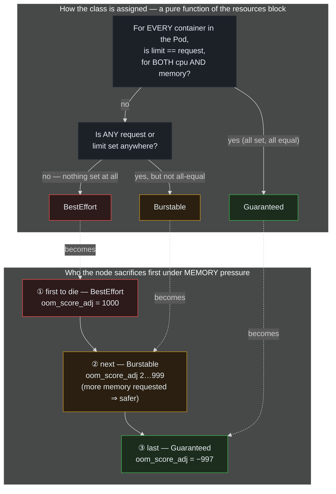

> **30 Days of DevOps** — Day 25 of 30. [← Day 24: ConfigMaps and Configuration Patterns](/articles/2026/06/13/day-24-configmaps-configuration-patterns/)

Every chart in this series has carried a `resources` block since Day 6:

```yaml
resources:
  requests: { cpu: 25m, memory: 32Mi }
  limits:   { cpu: 50m, memory: 64Mi }
```

You have used it for three things already without ever unpacking it: the HPA's
utilisation math (Day 12) divides usage by `requests.cpu`; the ResourceQuota and
LimitRange (Day 15) account against requests and limits; the scheduler's Filter
phase (Day 21) only places a Pod where its requests fit. But the block does one
more thing, silently, that none of those days mentioned — and it is the one that
decides whether your workload **survives a bad node or dies on it**.

The *relationship* between a container's requests and its limits assigns the Pod a
**Quality of Service (QoS) class**. There are exactly three:

- **Guaranteed** — every container has `limits == requests`, for *both* CPU and
  memory. The Pod is promised exactly what it asked for.
- **BestEffort** — no container sets any request or limit at all. The Pod gets
  whatever is spare, and is the first thing thrown overboard.
- **Burstable** — anything in between. Some requests or limits are set, but not in
  the tight `limits == requests` shape that earns Guaranteed.

You never write the QoS class; Kubernetes computes it from the numbers. And under
**node memory pressure** — a real node genuinely running out of RAM — that class
is the kill order. BestEffort dies first, Burstable next (worst over-committers
first), Guaranteed last. Today you will make all three classes concrete, read the
**kernel's literal kill-priority value** (`oom_score_adj`) out of each one, and
then prove the single most important distinction in resource management: a **CPU
limit throttles** your container (and never kills it), while a **memory limit
kills** it (OOMKilled, exit code 137). CPU is compressible; memory is not.

## What you will build

By the end of this article you will have:

- A `qos-lab` namespace with three Pods — **BestEffort**, **Burstable**, and
  **Guaranteed** — and the exact rules that produced each `status.qosClass`
- The kernel's kill list read straight out of the Pods: `/proc/1/oom_score_adj` =
  **1000** (BestEffort), a node-capacity-derived **~9xx** (Burstable), and
  **−997** (Guaranteed) — the literal numbers the OOM killer ranks victims by
- A demonstration that a **CPU limit throttles, never kills**: a Pod pinned to its
  CPU limit under a busy loop, surviving indefinitely with zero restarts while
  `cpu.stat` shows the throttling counter climbing
- A demonstration that a **memory limit kills**: a Pod that allocates past its
  memory limit and is **OOMKilled** — `lastState.terminated.reason: OOMKilled`,
  exit code **137**, RESTARTS climbing
- A clear-eyed decision for your own workloads: why the webapp (Burstable, behind
  HPA + PDB + spread) is *fine* as Burstable, why the Day 17 Postgres is the real
  candidate for Guaranteed, the **Day 18 sidecar gotcha** that blocks Guaranteed,
  and how QoS (eviction) and Priority (Day 22, preemption) are **two different
  axes** that both feed the kubelet's eviction decision

---

## How QoS is assigned, and who it sacrifices

The class is a pure function of the numbers. The consequence is a kill ladder.



**Reading this diagram:**

The top box is the **classification rule** — read it top to bottom as the question
Kubernetes asks when a Pod is admitted. The first question is the strict one: does
*every* container have `limit == request` for *both* CPU and memory? Only if the
answer is yes across the board does the Pod earn **Guaranteed** (green). If a
container omits a request but sets a limit, Kubernetes quietly sets the request
equal to the limit — so "all limits set and equal" is the practical test.

If it is not Guaranteed, the second question decides between the other two: is
*anything* set — a single request or limit on a single container? If literally
nothing is set anywhere, the Pod is **BestEffort** (red). If something is set but
the numbers do not meet the Guaranteed bar, the Pod is **Burstable** (amber). Note
the asymmetry: **Guaranteed is hard to get** (every container, every resource,
exactly equal), **BestEffort is hard to get** (nothing, anywhere), and **Burstable
is the default everything falls into** — including all three of this series'
workloads.

The bottom box is the **consequence**, and the dotted arrows connect each class to
its fate. When a node genuinely runs out of memory, something must die so the rest
can live — memory is *incompressible*, you cannot throttle it. The kubelet (and,
if it is too slow, the kernel's OOM killer underneath it) picks victims by the
`oom_score_adj` value Kubernetes stamped on each Pod from its QoS class.
**BestEffort carries 1000** — the maximum, "kill me first". **Guaranteed carries
−997** — deeply negative, "kill me last, only if there is nothing else". And
**Burstable sits in between, 2 to 999**, computed from how much memory the Pod
*requested* as a fraction of node capacity: a Burstable Pod that reserved a big
chunk of RAM gets a *lower* (safer) score than one that reserved almost none. The
class you never wrote is the kill order you will live or die by.

---

## Prerequisites

This article continues from Day 24. Required state:

- The `devops-cluster` kind cluster, with **metrics-server** from Day 12 (Part 3
  uses `kubectl top`)
- kubectl 1.29+
- A non-trivial detail: the demos use the `polinux/stress` image — the standard
  load-generator used in the official Kubernetes resource docs — so the Pods can
  burn CPU and allocate memory on demand

Pre-flight check:

```bash
# metrics-server is up (kubectl top works) — needed in Part 3
kubectl top nodes | head -2

# What QoS class is the webapp running at today? (spoiler: Burstable)
POD=$(kubectl get pod -n default -l app.kubernetes.io/instance=webapp \
  -o jsonpath='{.items[0].metadata.name}')
kubectl get pod -n default "$POD" -o jsonpath='{.status.qosClass}{"\n"}'
```

Expected output:

```text
NAME                           CPU(cores)   CPU%   MEMORY(bytes)   MEMORY%
devops-cluster-control-plane   142m         3%     1198Mi          15%

Burstable
```

| Tool | Minimum version | Check |
|---|---|---|
| kubectl | 1.29 | `kubectl version --client` |

---

## Part 1 — The three classes, made concrete

A namespace with no Pod Security enforcement (these demo Pods need to run a stress
tool as root and would trip the `restricted` profile), and three Pods that differ
only in their `resources` block:

```bash
kubectl create namespace qos-lab

cat > qos-trio.yaml << 'EOF'
# BestEffort — no requests, no limits, anywhere.
apiVersion: v1
kind: Pod
metadata:
  name: besteffort
  namespace: qos-lab
  labels: { qos: besteffort }
spec:
  containers:
    - name: app
      image: busybox:1.36
      command: ["sleep", "86400"]
      # (no resources block at all)
---
# Burstable — something is set, but limits != requests.
apiVersion: v1
kind: Pod
metadata:
  name: burstable
  namespace: qos-lab
  labels: { qos: burstable }
spec:
  containers:
    - name: app
      image: busybox:1.36
      command: ["sleep", "86400"]
      resources:
        requests: { cpu: 50m, memory: 64Mi }
        limits:   { cpu: 100m, memory: 128Mi }
---
# Guaranteed — every container, limits == requests, for BOTH cpu & memory.
apiVersion: v1
kind: Pod
metadata:
  name: guaranteed
  namespace: qos-lab
  labels: { qos: guaranteed }
spec:
  containers:
    - name: app
      image: busybox:1.36
      command: ["sleep", "86400"]
      resources:
        requests: { cpu: 100m, memory: 128Mi }
        limits:   { cpu: 100m, memory: 128Mi }
EOF

kubectl apply -f qos-trio.yaml
kubectl wait --for=condition=ready pod --all -n qos-lab --timeout=60s
```

Expected output:

```text
namespace/qos-lab created
pod/besteffort created
pod/burstable created
pod/guaranteed created
pod/besteffort condition met
pod/burstable condition met
pod/guaranteed condition met
```

Read the class Kubernetes computed for each — you never wrote it:

```bash
kubectl get pod -n qos-lab \
  -o custom-columns=NAME:.metadata.name,QOS:.status.qosClass
```

Expected output:

```text
NAME         QOS
besteffort   BestEffort
burstable    Burstable
guaranteed   Guaranteed
```

Three Pods, three classes, from nothing but the shape of the `resources` block.
The rules in full precision:

- **Guaranteed** requires *every* container to set *both* a CPU and a memory limit,
  with each limit equal to its request. (Omit the request and Kubernetes sets it
  equal to the limit — so in practice: every container, both resources, limit set,
  request either omitted or equal.)
- **BestEffort** requires *no* container to set *any* request or limit — a single
  number anywhere disqualifies it.
- **Burstable** is everything else. The `burstable` Pod qualifies because its
  limits (`100m/128Mi`) differ from its requests (`50m/64Mi`).

---

## Part 2 — The kernel's kill list, read out of the Pods

QoS is not an abstraction the kubelet keeps in a database — it is written into the
Linux kernel as each container's `oom_score_adj`, the knob the OOM killer adds to a
process's "badness" score when it must choose a victim. Higher means *killed
sooner*. Read it straight out of PID 1 in each Pod:

```bash
for p in besteffort burstable guaranteed; do
  printf '%-12s oom_score_adj=' "$p"
  kubectl exec -n qos-lab "$p" -- cat /proc/1/oom_score_adj
done
```

Expected output (the Burstable value depends on your node's memory capacity — see
below):

```text
besteffort   oom_score_adj=1000
burstable    oom_score_adj=982
guaranteed   oom_score_adj=-997
```

These three numbers *are* the kill order:

- **BestEffort = 1000** — the maximum. When memory runs out, the kernel adds 1000
  to this process's badness, all but guaranteeing it is chosen first.
- **Guaranteed = −997** — deeply negative. The kernel subtracts almost a thousand
  from its badness; it will only ever be killed if every non-Guaranteed process is
  already gone.
- **Burstable = 982** here — and this is the subtle one. Kubernetes computes it as
  roughly `1000 − (1000 × memoryRequest ÷ nodeMemoryCapacity)`, clamped to the
  range 2–999. The Burstable Pod requested `128Mi`; on this node that is a tiny
  fraction of capacity, so its score lands just below BestEffort's 1000. **A
  Burstable Pod that requested a large share of node memory gets a much lower
  (safer) score** — the system rewards honest, generous requests by making such
  Pods harder to evict. Request nothing and you are barely better than BestEffort;
  request a real amount and you climb toward Guaranteed's safety.

This is why "just set requests" is not empty advice: the request is not only a
scheduling hint (Day 21) and a quota line-item (Day 15), it is **your Pod's life
insurance** under pressure.

> **Two different OOM events — do not conflate them.** The `oom_score_adj` ranking
> above governs the **node-level** event: the whole node is out of RAM and the
> kernel must kill *someone*, choosing across all Pods by this score. Part 4 below
> is a **different**, more common event: a single container exceeds *its own*
> memory limit and is killed by *its own* cgroup, regardless of QoS or anyone
> else. Both produce `OOMKilled`; only the first is decided by QoS.

---

## Part 3 — A CPU limit throttles. It never kills.

CPU is **compressible**: when a container wants more CPU than its limit, the
kernel simply gives it less — it slows down, it does not die. Prove it with a Pod
that tries to burn two full cores while limited to one-tenth of one:

```bash
cat > cpu-hog.yaml << 'EOF'
apiVersion: v1
kind: Pod
metadata:
  name: cpu-hog
  namespace: qos-lab
spec:
  containers:
    - name: stress
      image: polinux/stress
      # ask for 2 cores' worth of work...
      command: ["stress", "--cpu", "2"]
      resources:
        requests: { cpu: 100m, memory: 32Mi }
        limits:   { cpu: 100m, memory: 64Mi }   # ...but capped at 0.1 core
EOF

kubectl apply -f cpu-hog.yaml
kubectl wait --for=condition=ready pod/cpu-hog -n qos-lab --timeout=60s

# Let it run, then look: pinned at ~100m (its limit), zero restarts.
sleep 30
kubectl top pod cpu-hog -n qos-lab
kubectl get pod cpu-hog -n qos-lab
```

Expected output:

```text
pod/cpu-hog created
pod/cpu-hog condition met

NAME      CPU(cores)   MEMORY(bytes)
cpu-hog   100m         1Mi

NAME      READY   STATUS    RESTARTS   AGE
cpu-hog   1/1     Running   0          45s
```

`stress` is desperately trying to consume two cores; `kubectl top` shows it pinned
at exactly **100m** — its limit — and `RESTARTS` is **0**. It has been throttled,
not killed. See the throttling directly in the kernel's CPU accounting:

```bash
kubectl exec -n qos-lab cpu-hog -- cat /sys/fs/cgroup/cpu.stat
```

Expected output (the throttled counters are large and climbing):

```text
usage_usec 14820000
user_usec 14790000
system_usec 30000
nr_periods 460
nr_throttled 457
throttled_usec 41960000
```

`nr_throttled 457` of `nr_periods 460` — in all but three scheduling periods, the
kernel hit the CPU quota and *paused* the container until the next period. This is
the silent tax of a CPU limit: the workload is never killed, but it spends most of
its life waiting, which shows up as **latency** (p99 spikes), not as crashes. That
trade-off — and when to remove CPU limits entirely — is Common Errors #3.

Clean up the CPU hog:

```bash
kubectl delete pod cpu-hog -n qos-lab
```

---

## Part 4 — A memory limit kills. OOMKilled, exit 137.

Memory is **incompressible**: there is no "give it less and let it slow down". A
container that needs more memory than its limit allows cannot be throttled — the
only lever the kernel has is to **kill it**. Prove it with a Pod that tries to
allocate ~250 MiB while limited to 64 MiB:

```bash
cat > mem-hog.yaml << 'EOF'
apiVersion: v1
kind: Pod
metadata:
  name: mem-hog
  namespace: qos-lab
spec:
  containers:
    - name: stress
      image: polinux/stress
      # allocate 250M and hold it...
      command: ["stress", "--vm", "1", "--vm-bytes", "250M", "--vm-hang", "1"]
      resources:
        requests: { cpu: 50m, memory: 32Mi }
        limits:   { cpu: 100m, memory: 64Mi }   # ...but capped at 64Mi
EOF

kubectl apply -f mem-hog.yaml

# Within seconds it allocates past 64Mi and the cgroup OOM-kills it.
sleep 15
kubectl get pod mem-hog -n qos-lab
```

Expected output:

```text
pod/mem-hog created

NAME      READY   STATUS             RESTARTS      AGE
mem-hog   0/1     CrashLoopBackOff   2 (12s ago)   15s
```

`CrashLoopBackOff` with climbing `RESTARTS` — it allocates, gets killed, restarts,
allocates again, gets killed again. Read *why* it died from the container's last
terminated state:

```bash
# (single line — a backslash-newline inside single quotes is literal in bash,
#  not a line continuation, so the whole jsonpath must stay on one line)
kubectl get pod mem-hog -n qos-lab -o jsonpath='reason={.status.containerStatuses[0].lastState.terminated.reason}{"\n"}exitCode={.status.containerStatuses[0].lastState.terminated.exitCode}{"\n"}'
```

Expected output:

```text
reason=OOMKilled
exitCode=137
```

**`OOMKilled`, exit code `137`** — the unmistakable signature of a memory-limit
kill. (137 = 128 + 9: the process was terminated by signal 9, SIGKILL, the
uninterruptible kill the OOM killer uses.) This is the single most common
resource-related incident in production, and now you can read it cold: a Pod
crash-looping with `lastState.terminated.reason: OOMKilled` and exit 137 is a Pod
whose real memory usage exceeded its `limits.memory`. The fix is always one of two
things — raise the limit, or fix the leak — never "restart it and hope".

Clean up the whole lab:

```bash
kubectl delete namespace qos-lab
```

---

## Part 5 — The decision for your own workloads

You now have the tools to make a real choice. Look at what this series is actually
running:

```bash
kubectl get pod -n default -l app.kubernetes.io/instance=webapp \
  -o custom-columns=NAME:.metadata.name,QOS:.status.qosClass
kubectl get pod -n database postgres-0 \
  -o custom-columns=NAME:.metadata.name,QOS:.status.qosClass
```

Expected output:

```text
NAME                            QOS
webapp-webapp-7e6d5c4b3-mmmmm   Burstable
NAME         QOS
postgres-0   Burstable
```

Both **Burstable** — and that is the honest default for almost everything. The
interesting question is whether either *should* be Guaranteed, and the answer
differs by how replaceable the workload is:

- **The webapp is fine as Burstable.** It is stateless, runs 2–6 identical replicas
  behind the Day 12 HPA, is protected from voluntary disruption by the Day 16 PDB,
  and is spread across nodes by Day 21. If a node sheds it under memory pressure,
  the ReplicaSet reschedules it elsewhere within seconds and the Service never
  notices. Paying for Guaranteed (reserving its limit, unused, on every node) would
  waste capacity to protect something that loses nothing by being rescheduled.
- **The Postgres StatefulSet is the real Guaranteed candidate.** It is a single,
  stateful, *irreplaceable* Pod (Day 17). If it is OOM-evicted under node pressure,
  there is no second replica to absorb the load — there is an outage and a recovery.
  This is exactly the workload you pay the Guaranteed tax for: set
  `requests == limits` so its `oom_score_adj` drops to −997 and the node sacrifices
  every webapp replica and every batch Job before it touches the database.

**The Day 18 sidecar gotcha — why "just set webapp requests==limits" would not even
work.** The webapp Pod is not one container; since Day 18 it also carries the
`init-content` init container and the `clock-sidecar` native sidecar, *neither of
which sets any resources*. Guaranteed requires **every** container to have equal
limits and requests. So even if you made nginx perfectly Guaranteed-shaped, the
resource-less sidecar would drag the whole Pod back to Burstable. Achieving
Guaranteed is an all-or-nothing, every-container commitment — a frequent and
maddening surprise (Common Errors #6).

**QoS and Priority are different axes (and both feed eviction).** It is tempting to
conflate Day 22's PriorityClasses with today's QoS, because both influence who
gets evicted — but they answer different questions:

| | **Priority** (Day 22) | **QoS** (Day 25) |
|---|---|---|
| Set by | you, via `priorityClassName` | Kubernetes, from the resources block |
| Primary job | scheduling order + **preemption** (who gets evicted to make *room* for a pending Pod) | **node-pressure eviction** order (who dies when a node runs out) |
| The knob | the integer priority value | `oom_score_adj` |

Under memory-pressure eviction the kubelet actually ranks Pods by a *combination*:
first whether they are using more than they requested (BestEffort is always over,
since it requested zero), then by **Priority**, then by how far over-request they
are. So a high-Priority BestEffort Pod is a genuinely dangerous combination — high
priority gets it scheduled and protected from preemption, but BestEffort QoS still
puts it near the front of the node-pressure kill line. **Match the two:** anything
you mark high-priority should also carry real requests (at least Burstable, ideally
Guaranteed), or you have protected it on one axis and abandoned it on the other.

(We will not change the chart today — the webapp's Burstable class is the correct
choice, and the Postgres-to-Guaranteed change belongs with a broader Day-17
hardening pass, not buried in a resources tweak. The lesson is the *decision
framework*, not a diff.)

---

## Common Errors

**1. Set limits, expected Guaranteed, got Burstable**

```bash
kubectl get pod <pod> -o jsonpath='{.status.qosClass}{"\n"}'   # Burstable, not Guaranteed
```

Guaranteed has three simultaneous requirements and all of them are easy to miss:
*every* container (not just the main one), *both* cpu and memory (not just memory),
and limit *exactly equal* to request (not merely "both set"). The most common
misses: a sidecar with no resources (Day 18), setting only a memory limit and no
CPU limit, or setting `limits` larger than `requests`.

Fix: dump every container's numbers and check the three conditions hold across all
of them:

```bash
kubectl get pod <pod> -o jsonpath='{range .spec.containers[*]}{.name}{": req="}{.resources.requests}{" lim="}{.resources.limits}{"\n"}{end}'
```

**2. `OOMKilled` / exit 137 on a Pod that "wasn't using that much"**

The container exceeded `limits.memory`, not the node. `kubectl top` may show low
*average* usage while a brief spike (a large request, a batch import, a memory
leak's peak) crossed the limit for a moment — and a moment is all it takes.

Fix: read `lastState.terminated.reason` (Part 4) to confirm it is OOMKilled, then
either raise `limits.memory` to cover the real peak (watch the actual high-water
mark over time, do not guess) or fix the allocation. Exit 137 is *always* a memory
limit; it is never CPU.

**3. p99 latency spikes with zero restarts — the silent CPU-limit tax**

The opposite confusion. A service is slow but never crashes, dashboards are green,
no OOMKills — yet tail latency is terrible. The cause is CPU throttling (Part 3):
the container keeps hitting its CPU limit and being paused until the next CFS
period, adding tens of milliseconds of stall that never shows up as an error.

Fix: confirm with the throttling counters, then decide:

```bash
kubectl exec <pod> -- cat /sys/fs/cgroup/cpu.stat | grep throttled
# high nr_throttled / throttled_usec => the limit is hurting you
```

For latency-sensitive services the modern guidance is often to **set a CPU request
but no CPU limit** — the request guarantees a floor and scheduling fairness, while
removing the limit lets the container use spare cores instead of stalling. (Keep
memory limits; remove CPU limits only.)

**4. A BestEffort Pod gets evicted "for no reason"**

Its Pod events show `Evicted` with `The node was low on resource: memory`. There
was a reason: it was BestEffort (`oom_score_adj 1000`), so when the node came under
memory pressure it was, by design, the first thing thrown overboard.

Fix: give it at least requests (making it Burstable) so it climbs off the bottom of
the kill list. Anything you care about should never be BestEffort; reserve
BestEffort for genuinely interruptible, retry-safe work — and even then, prefer a
small request.

**5. A LimitRange silently turned your BestEffort Pod into Burstable**

You deliberately wrote a Pod with no resources, expecting BestEffort, and got
Burstable. A `LimitRange` (Day 15) in the namespace injected default requests/limits
at admission, which by definition disqualifies BestEffort.

Fix: this is usually *good* (BestEffort is rarely what you want), but if you truly
need BestEffort, deploy into a namespace without a defaulting LimitRange, or
understand that the namespace policy overrides the Pod's omission — the LimitRange
wins.

**6. One container without resources downgrades the whole Pod**

The Day 18 lesson, generalised: Guaranteed is a property of the **Pod**, computed
from **all** its containers — main, sidecar, and init. A single resource-less
sidecar (a log shipper, a mesh proxy, a `clock-sidecar`) makes the entire Pod
Burstable no matter how carefully the main container is tuned.

Fix: if you need a Pod to be Guaranteed, set equal requests==limits on *every*
container it carries, sidecars and init containers included. There is no
"main container only" QoS.

---

## Recap

In this article you:

- Learned that the **relationship** between requests and limits silently assigns
  every Pod a **QoS class** — Guaranteed (`limits==requests` on every container,
  both resources), BestEffort (nothing set anywhere), Burstable (everything else,
  and the default almost everything lands in)
- Built all three classes in `qos-lab` and confirmed them with `status.qosClass`
- Read the kernel's literal kill-priority out of each Pod: `oom_score_adj` of
  **1000** (BestEffort), **−997** (Guaranteed), and a node-capacity-derived value
  in between for Burstable — where requesting *more* memory earns a *safer* score
- Proved the two failure modes that must never be confused: a **CPU limit
  throttles** (pinned at the limit, `nr_throttled` climbing, zero restarts —
  compressible) and a **memory limit kills** (`OOMKilled`, exit `137`,
  CrashLoopBackOff — incompressible)
- Distinguished the two OOM events: a container exceeding **its own** memory limit
  (cgroup OOM, QoS-independent, what Part 4 showed) versus a **node** running out
  and the kernel choosing a victim by QoS (`oom_score_adj`, what Part 2's numbers
  govern)
- Made the real decision for your workloads: the webapp stays Burstable (stateless,
  HPA + PDB + spread make it freely reschedulable), Postgres is the Guaranteed
  candidate (stateful, irreplaceable), the **Day 18 sidecars block Guaranteed**
  until they too carry equal requests/limits, and **QoS (eviction) and Priority
  (preemption) are orthogonal axes** that must be matched — never high-priority +
  BestEffort
- Catalogued six failure modes, including the silent CPU-throttle latency tax and
  the every-container Guaranteed requirement

Resource management is no longer four numbers you copy between charts. It is a
deliberate choice about how each workload should behave when the node it lives on
has a bad day.

---

## What's next

[Day 26: Vertical Pod Autoscaler — Right-Sizing Requests Automatically →](/articles/2026/06/14/day-26-vertical-pod-autoscaler/)

Today you set requests and limits by hand and reasoned about QoS from them — but
how do you know the *right* numbers? Guess too low and you OOMKill (Part 4) or get
evicted (Part 2); guess too high and you waste the reservation on every node and
starve the ResourceQuota (Day 15). On Day 26 you will install the **Vertical Pod
Autoscaler (VPA)** — the recommender that watches a workload's real usage over time
and tells you (or, in `Auto` mode, sets for you) the requests it *should* have. You
will run VPA in `Off` (recommendation-only) mode against the webapp to read its
suggested right-sizing, see why **VPA and the Day 12 HPA must never both act on CPU
for the same workload** (they fight — one resizes the Pod, the other counts replicas
off the same signal), and learn the `updateMode` spectrum and the disruption VPA
causes when it actually applies a change. Autoscaling, finally, on *both* axes —
out (HPA) and up (VPA).
