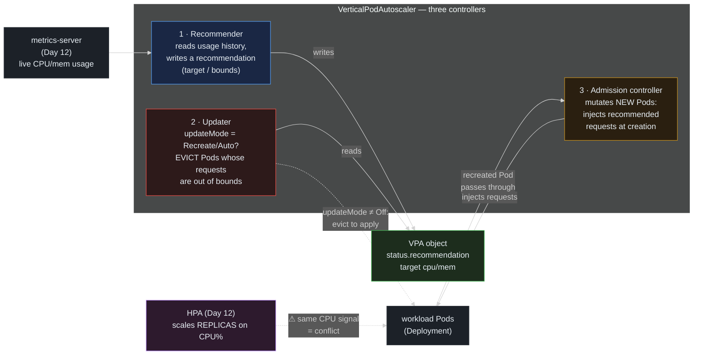

> **30 Days of DevOps** — Day 26 of 30. [← Day 25: Requests, Limits, and QoS](/articles/2026/06/14/day-25-requests-limits-qos/)

Day 25 left you with a sharper understanding of `resources.requests` and a harder
question: *what should the numbers actually be?* The whole of Day 25 — QoS classes,
`oom_score_adj`, OOMKills, throttling — assumed you already knew the right requests.
But getting them right by hand is a genuinely bad job:

- **Guess too low** and you pay the Day 25 penalties: the container OOMKills when it
  crosses `limits.memory`, or it gets evicted first under node pressure because its
  tiny request earned a near-1000 `oom_score_adj`.
- **Guess too high** and you waste it everywhere: every replica reserves capacity it
  never uses, the scheduler (Day 21) can place fewer Pods per node, and the
  ResourceQuota (Day 15) fills up against reservations nobody is consuming.

So engineers do what engineers do: they copy a `resources` block from another
service, round up "to be safe," and never revisit it. The result is a cluster that
is simultaneously over-provisioned (wasting money) and fragile (some workload's
real peak quietly exceeds its forgotten limit).

The **Vertical Pod Autoscaler (VPA)** attacks this directly. Where the Day 12 HPA
scales a workload **out** — more replicas of the same size — VPA scales it **up**:
same replica count, *right-sized requests*. It watches a workload's actual CPU and
memory usage over time and produces a **recommendation** — the requests this
workload should have — which it can either just *report* (so a human decides) or
*apply* automatically by recreating Pods with the corrected numbers injected.

Today you will install VPA, point it at a deliberately over-provisioned workload to
read its recommendation, switch it to a mode where it actually evicts-and-resizes,
and then face the single most important fact about VPA: **it must never manage CPU
on a workload the HPA is also scaling on CPU.** They key off the same signal in
opposite ways, and they will oscillate forever. The resolution — and the safe way
to give the webapp VPA's advice without the fight — is the payoff.

## What you will build

By the end of this article you will have:

- **VPA** installed on the kind cluster (recommender + updater + admission
  controller) via the Fairwinds Helm chart, reusing the Day 12 metrics-server
- A `vpa-lab` workload that **requests 20× more than it uses**, with a VPA in
  **`Off` (recommendation-only)** mode — and the recommendation read out of it:
  `target`, `lowerBound`, `upperBound`, `uncappedTarget`
- The same VPA flipped to **`Recreate`** mode, caught in the act: the updater
  **evicts** the over-provisioned Pod, the admission controller **injects** the
  recommended requests into its replacement, and the new Pod comes up right-sized
- A clear model of the **four `updateMode` values** (`Off` / `Initial` / `Recreate`
  / `Auto`) and the disruption each one does (or doesn't) cause
- The **HPA × VPA conflict** made concrete: why pointing an `Auto` VPA at the
  webapp — which the Day 12 HPA already scales on CPU — makes them fight, and the
  three real resolutions (recommendation-only, split resources, or HPA-on-a-custom-
  metric)
- A **recommendation-only VPA shipped to the webapp chart**, so the team gets
  right-sizing advice through GitOps with zero risk of the conflict

---

## How VPA works — three components, one loop

VPA is not one controller; it is three, plus a Custom Resource that ties them
together. Understanding the split explains every behaviour and every failure mode.



**Reading this diagram:**

Read left to right. The whole thing is a loop, but the three VPA controllers each
own one job and run independently — which is why VPA can *recommend* without ever
*acting*.

**The Recommender** (blue, ①) is the brain. It reads each target Pod's real CPU and
memory usage from the metrics API (the Day 12 metrics-server) plus its own stored
history, and computes a recommendation: a `target` (the request it thinks the
workload should have) bracketed by a `lowerBound` and `upperBound`. It writes this
into the **VPA object's `status.recommendation`** (green) — and then stops. The
Recommender never touches a Pod. In `Off` mode, this is the *only* thing that
happens: a recommendation appears, a human reads it, nothing is disrupted.

**The Updater** (red, ②) is the enforcer, and it only acts when `updateMode` is
`Recreate` or `Auto`. It reads the recommendation, compares it to each running
Pod's actual requests, and if a Pod is sufficiently out of bounds it **evicts**
it — deletes it through the eviction API (the same one Day 16's PDB guards). The
Updater cannot change a running Pod's requests in place (that is the alpha
in-place-resize feature, not the default); its only lever is *eviction*. This is
why VPA in an active mode is **disruptive** — every resize is a Pod restart.

**The Admission controller** (amber, ③) is the hands. It is a mutating webhook on
Pod creation: when *any* Pod under a VPA's control is created — including the
replacement the Updater just forced, or a new replica, or the very first Pod — it
**rewrites the Pod's `resources.requests`** to the recommended values before the
Pod is admitted. So the corrected numbers are applied at birth, not after.

The dotted purple arrow is the warning this whole article builds to: the **Day 12
HPA** also reads the workload's CPU and also acts on the same Pods — but it scales
*replica count*, computing utilisation as `usage ÷ requests.cpu`. If a VPA is busy
*changing* `requests.cpu` underneath it, the HPA's denominator keeps moving and the
two autoscalers chase each other. **Two controllers, one CPU signal, opposite
actions** — Part 5 is about never letting that happen.

---

## Prerequisites

This article continues from Day 25. Required state:

- The `devops-cluster` kind cluster with **metrics-server** (Day 12) — VPA's
  recommender reads from it
- Helm 3.14+, kubectl 1.29+
- The webapp running under its Day 12 HPA (used, read-only, in Part 5)

Pre-flight check:

```bash
# metrics-server is serving the metrics API VPA's recommender needs
kubectl get apiservice v1beta1.metrics.k8s.io

# the webapp HPA exists and scales on CPU (the conflict in Part 5)
kubectl get hpa -n default webapp-webapp
```

Expected output:

```text
NAME                     SERVICE                      AVAILABLE   AGE
v1beta1.metrics.k8s.io   kube-system/metrics-server   True        3w

NAME            REFERENCE                  TARGETS         MINPODS   MAXPODS   REPLICAS   AGE
webapp-webapp   Deployment/webapp-webapp   cpu: 4%/60%     2         6         2          3w
```

| Tool | Minimum version | Check |
|---|---|---|
| kubectl | 1.29 | `kubectl version --client` |
| Helm | 3.14 | `helm version --short` |

---

## Part 1 — Install VPA

VPA is not built into Kubernetes the way the HPA controller is — it is an add-on
from the `kubernetes/autoscaler` project, installed as three Deployments plus two
CRDs (`VerticalPodAutoscaler` and `VerticalPodAutoscalerCheckpoint`). The official
installer (`vpa-up.sh`) clones the repo and hand-rolls webhook certificates; the
**Fairwinds Helm chart** packages all of it cleanly, which is what we will use.

```bash
helm repo add fairwinds-stable https://charts.fairwinds.com/stable
helm repo update

# Check the current chart version for reproducibility:
helm search repo fairwinds-stable/vpa
```

Expected output:

```text
"fairwinds-stable" has been added to your repositories
...Successfully got an update from the "fairwinds-stable" chart repository
Update Complete. ⎈Happy Helming!⎈

NAME                    CHART VERSION   APP VERSION   DESCRIPTION
fairwinds-stable/vpa    4.7.1           1.0.0         A Helm chart for Kubernetes Vertical Pod Auto...
```

Install the three components into a dedicated namespace. We **disable the bundled
metrics-server** — Day 12's is already serving the metrics API, and running two
would collide:

```bash
# --version pins the chart for reproducibility (use what `helm search` showed).
# metrics-server.enabled=false: reuse the Day 12 install, don't deploy a second.
helm install vpa fairwinds-stable/vpa \
  --namespace vpa-system --create-namespace \
  --version 4.7.1 \
  --set metrics-server.enabled=false
```

Expected output:

```text
NAME: vpa
LAST DEPLOYED: Sun Jun 14 11:00:00 2026
NAMESPACE: vpa-system
STATUS: deployed
REVISION: 1
```

Wait for the three controllers and confirm the CRD registered:

```bash
kubectl wait --for=condition=available deployment --all \
  -n vpa-system --timeout=120s
kubectl get crd verticalpodautoscalers.autoscaling.k8s.io
```

Expected output:

```text
deployment.apps/vpa-recommender condition met
deployment.apps/vpa-updater condition met
deployment.apps/vpa-admission-controller condition met

NAME                                              CREATED AT
verticalpodautoscalers.autoscaling.k8s.io         2026-06-14T11:00:30Z
```

Three Deployments — recommender, updater, admission-controller — exactly the three
boxes from the diagram, and the `VerticalPodAutoscaler` resource type is now
available.

---

## Part 2 — Read a recommendation (the safe, `Off` mode)

The whole point of VPA is to tell you the right number. Make the lesson vivid with
a workload whose requests are deliberately, absurdly wrong: an idle nginx asking for
**400m CPU and 512Mi memory** while actually using a couple of millicores and a few
mebibytes.

```bash
kubectl create namespace vpa-lab

cat > overprovisioned.yaml << 'EOF'
apiVersion: apps/v1
kind: Deployment
metadata:
  name: greedy
  namespace: vpa-lab
spec:
  replicas: 2
  selector:
    matchLabels: { app: greedy }
  template:
    metadata:
      labels: { app: greedy }
    spec:
      containers:
        - name: nginx
          image: nginx:1.27-alpine
          ports:
            - containerPort: 80
          resources:
            # wildly over-provisioned on purpose — nginx idle uses ~2m / ~5Mi
            requests: { cpu: 400m, memory: 512Mi }
            limits:   { cpu: 800m, memory: 1Gi }
EOF

kubectl apply -f overprovisioned.yaml
kubectl rollout status deployment/greedy -n vpa-lab --timeout=60s
```

Expected output:

```text
namespace/vpa-lab created
deployment.apps/greedy created
deployment "greedy" successfully rolled out
```

Now attach a VPA in **`Off`** mode — recommendation only, it will never touch the
Pods:

```bash
cat > greedy-vpa.yaml << 'EOF'
apiVersion: autoscaling.k8s.io/v1
kind: VerticalPodAutoscaler
metadata:
  name: greedy-vpa
  namespace: vpa-lab
spec:
  targetRef:
    apiVersion: apps/v1
    kind: Deployment
    name: greedy
  updatePolicy:
    updateMode: "Off"      # Recommender writes recommendations; nothing is evicted.
EOF

kubectl apply -f greedy-vpa.yaml
```

Expected output:

```text
verticalpodautoscaler.autoscaling.k8s.io/greedy-vpa created
```

The recommender needs a few minutes of usage samples before it commits to numbers.
Wait, then read the recommendation:

```bash
# give the recommender time to gather samples (first recommendation: ~2-5 min)
sleep 240
kubectl describe vpa greedy-vpa -n vpa-lab | sed -n '/Recommendation/,/Events/p'
```

Expected output:

```text
  Recommendation:
    Container Recommendations:
      Container Name:  nginx
      Lower Bound:
        Cpu:     25m
        Memory:  262144k
      Target:
        Cpu:     25m
        Memory:  262144k
      Uncapped Target:
        Cpu:     25m
        Memory:  262144k
      Upper Bound:
        Cpu:     224m
        Memory:  262144k
```

Four numbers per resource, and each one means something distinct:

- **`Target`** — the request VPA recommends *right now*. Here `25m / 262144k`
  (≈250Mi) against the **400m / 512Mi** you requested: a **16× CPU over-provision**.
  (25m is VPA's built-in floor — an idle nginx genuinely needs almost nothing, and
  VPA refuses to recommend a request so small it courts throttling. Memory ≈250Mi
  is likewise the recommender's memory floor.)
- **`LowerBound`** — the smallest request VPA considers safe; below this it would
  start evicting to scale *up*. In `Auto` mode, a Pod requesting less than this gets
  recreated.
- **`UpperBound`** — the largest request it considers justified; above this (your
  400m sits well above) a Pod is a candidate to be scaled *down*.
- **`UncappedTarget`** — what the target would be *ignoring* any `minAllowed` /
  `maxAllowed` policy bounds you set. Useful for spotting when your own caps are
  hiding the real recommendation.

The lesson is already delivered without VPA touching a thing: you reserved 400m of
CPU per replica, across 2 replicas, and the workload needs ~25m. That is **750m of
CPU reserved and idle** — capacity the scheduler can't give to anything else and the
ResourceQuota counts against you, protecting nothing.

---

## Part 3 — Let VPA act: `Recreate` mode

`Off` recommends; the other modes *apply*. Switch the VPA to **`Recreate`** and
watch the updater evict the over-provisioned Pods and the admission controller
inject the right-sized requests into their replacements.

```bash
kubectl patch vpa greedy-vpa -n vpa-lab --type=merge \
  -p '{"spec":{"updatePolicy":{"updateMode":"Recreate"}}}'
```

Expected output:

```text
verticalpodautoscaler.autoscaling.k8s.io/greedy-vpa patched
```

Watch the Pods. Within a minute or two the updater starts evicting — one at a time,
respecting availability — and replacements appear:

```bash
kubectl get pod -n vpa-lab -l app=greedy --watch
```

Expected output (over ~1-2 minutes):

```text
NAME                      READY   STATUS        RESTARTS   AGE
greedy-7c9d5f8b6-aa1bb    1/1     Running       0          6m
greedy-7c9d5f8b6-cc2dd    1/1     Running       0          6m
greedy-7c9d5f8b6-aa1bb    1/1     Terminating   0          6m
greedy-7c9d5f8b6-ee3ff    0/1     Pending       0          0s
greedy-7c9d5f8b6-ee3ff    1/1     Running       0          8s
greedy-7c9d5f8b6-cc2dd    1/1     Terminating   0          7m
greedy-7c9d5f8b6-gg4hh    1/1     Running       0          9s
```

The old Pods (`aa1bb`, `cc2dd`) are evicted; new ones (`ee3ff`, `gg4hh`) replace
them. Confirm the replacements came up with **VPA-injected requests**, not the 400m
you wrote in the manifest:

```bash
POD=$(kubectl get pod -n vpa-lab -l app=greedy -o jsonpath='{.items[0].metadata.name}')
kubectl get pod -n vpa-lab "$POD" \
  -o jsonpath='{.spec.containers[0].resources.requests}{"\n"}'
kubectl get pod -n vpa-lab "$POD" \
  -o jsonpath='{.metadata.annotations.vpaUpdates}{"\n"}'
```

Expected output:

```text
{"cpu":"25m","memory":"262144k"}
nginx: Pod resources updated by greedy-vpa: container 0: cpu request, memory request
```

The Deployment's template still says `400m / 512Mi`, but the *running Pod* requests
`25m / 250Mi` — the admission controller rewrote it on creation, and the
`vpaUpdates` annotation records that VPA did it. The workload was right-sized
automatically.

**Notice what that cost: two Pod restarts.** Every VPA resize in `Recreate`/`Auto`
mode is an eviction. On a 2-replica Deployment the updater spaces them out, but the
disruption is real — which is the whole reason the next part exists.

Clean up the lab before the webapp section:

```bash
kubectl delete namespace vpa-lab
```

---

## Part 4 — The four update modes, and the disruption each causes

`updateMode` is the entire risk dial. There are four values:

| Mode | What the updater does | Disruption | Use it for |
|---|---|---|---|
| **`Off`** | nothing — only the recommendation is written | **none** | reading recommendations; right-sizing by hand; **the only safe mode alongside an HPA** |
| **`Initial`** | injects recommended requests **only at Pod creation** (new replicas, rollouts) — never evicts a running Pod | low — happens on natural restarts only | workloads you'll restart anyway; getting new Pods right without forced churn |
| **`Recreate`** | evicts running Pods whose requests are out of bounds, applying the recommendation on recreation | **high** — every resize is a restart | workloads that tolerate restarts and need active right-sizing |
| **`Auto`** | currently **identical to `Recreate`** (eviction-based) | **high** | the "let VPA manage it" intent; will become in-place when that feature graduates |

Two things about this table matter more than the rest.

First, **`Auto` is not magic** — today it just means `Recreate`. The thing people
*want* from "Auto" — resizing a Pod's requests **in place, without a restart** — is
the separate **in-place Pod resize** feature (the `InPlaceOrRecreate` VPA mode,
backed by Kubernetes' `InPlacePodVerticalScaling` feature gate, alpha in recent
releases). Until that graduates and VPA adopts it by default, every active VPA
resize is a Pod kill.

Second, because active modes evict, **VPA must be paired with the Day 16
PodDisruptionBudget.** The updater goes through the eviction API, so a PDB caps how
many replicas it can take down at once — exactly the protection the webapp's
`minAvailable: 50%` PDB already provides. And the corollary: a **single-replica**
workload in `Recreate`/`Auto` mode takes **downtime on every resize**, because there
is no second replica and no PDB floor can save the only Pod. For singletons, prefer
`Off` or `Initial`.

---

## Part 5 — The webapp: why you cannot just point VPA at it

The webapp is the obvious candidate for right-sizing — but it is also the one
workload you must be most careful with, because the **Day 12 HPA already scales it
on CPU.** Here is the collision, precisely:

- The **HPA** keeps average CPU near 60% of `requests.cpu` by changing the
  **replica count**. Its math is `utilisation = currentCPU ÷ requests.cpu`.
- A **VPA managing CPU** changes `requests.cpu` itself — the *denominator* of that
  exact fraction.

Put an `Auto` VPA and the CPU HPA on the same Deployment and they enter a loop: the
VPA lowers `requests.cpu` to match real usage → the HPA's utilisation fraction
suddenly *jumps* (same usage, smaller denominator) → the HPA adds replicas → spread
across more Pods, per-Pod usage drops → the VPA lowers requests again → repeat.
They never settle. **This is not a tuning problem; it is a design rule:** never let
HPA and VPA both act on the same resource for the same workload.

There are exactly three correct resolutions:

1. **VPA in `Off` mode (recommendation-only).** VPA never changes requests, so there
   is nothing for the HPA to fight. A human (or a follow-up commit) applies the
   advice. **This is what we ship** — zero risk, real value.
2. **Split the resources.** VPA manages **memory only** (`controlledResources:
   ["memory"]`), the HPA keeps **CPU**. They touch different signals, no conflict.
   Powerful, but the VPA still evicts to apply memory changes, so the PDB caveat
   from Part 4 applies.
3. **Move the HPA off CPU.** If the HPA scales on a **custom/external metric**
   instead — like the requests-per-second metric you wired through the Prometheus
   Adapter on Day 12 — then VPA is free to own *both* CPU and memory requests, and
   the two autoscalers are genuinely independent (HPA on RPS, VPA on resources).

Ship resolution #1 to the chart: a recommendation-only VPA, gated behind a flag so
it's opt-in per environment.

### 5.1 — `webapp/values.yaml` defaults

```yaml
# Vertical Pod Autoscaler — recommendation ONLY. updateMode: Off is the one
# mode that is safe to run alongside the CPU HPA (Day 12): VPA never changes
# requests, so the two autoscalers cannot fight. Read the advice with
# `kubectl describe vpa webapp-webapp` and apply it deliberately.
verticalAutoscaler:
  enabled: false
  updateMode: "Off"
```

### 5.2 — `webapp/templates/vpa.yaml` (new, gated)

```yaml
{{- if .Values.verticalAutoscaler.enabled }}
apiVersion: autoscaling.k8s.io/v1
kind: VerticalPodAutoscaler
metadata:
  name: {{ include "webapp.fullname" . }}
  labels:
    {{- include "webapp.labels" . | nindent 4 }}
spec:
  targetRef:
    apiVersion: apps/v1
    kind: Deployment
    name: {{ include "webapp.fullname" . }}
  updatePolicy:
    updateMode: {{ .Values.verticalAutoscaler.updateMode | quote }}
{{- end }}
```

### 5.3 — Enable in `webapp/values-dev.yaml`, render-check, ship

```yaml
# Day 26: recommendation-only right-sizing advice for the webapp.
verticalAutoscaler:
  enabled: true
```

```bash
cd ~/30-days-devops/day-12/gitops-webapp

helm template webapp ./webapp -f webapp/values-dev.yaml \
  | grep -A 10 'kind: VerticalPodAutoscaler'
```

Expected output:

```text
kind: VerticalPodAutoscaler
metadata:
  name: webapp-webapp
  labels:
    ...
spec:
  targetRef:
    apiVersion: apps/v1
    kind: Deployment
    name: webapp-webapp
  updatePolicy:
    updateMode: "Off"
```

```bash
git add webapp/values.yaml webapp/values-dev.yaml webapp/templates/vpa.yaml
git commit -m "feat(autoscaling): recommendation-only VPA for the webapp (Off mode)"
git push origin main
argocd app sync webapp --server argocd.local --insecure
```

After a few minutes of samples, read what VPA thinks the webapp should request —
advice you now get continuously, through GitOps, with no risk to the running HPA:

```bash
kubectl describe vpa webapp-webapp -n default | sed -n '/Target/,/Uncapped/p'
```

Expected output:

```text
      Target:
        Cpu:     25m
        Memory:  262144k
```

The webapp already requests `25m / 32Mi` (Day 10). VPA confirms the CPU is bang on
and suggests **more memory** (~250Mi vs the 32Mi requested) — a genuinely useful
nudge: nginx plus the Day 18 sidecar likely do use more than 32Mi under load, and
that gap is exactly the kind of under-provisioning that bites as an OOMKill (Day 25)
right when traffic peaks. You now have the data to make that call — without VPA ever
touching the Pods the HPA is managing.

(We leave `updateMode: Off`. Turning it to `Recreate` here would reintroduce the
conflict; the right next step is a *human* deciding whether to raise the memory
request in `values-dev.yaml`, which then rolls cleanly through the Day 24 checksum
pattern.)

---

## Common Errors

**1. VPA recommendation stays empty / `Pending`**

```bash
kubectl describe vpa <name> | grep -A2 Recommendation
# Recommendation:  <nothing>
```

Two usual causes. The recommender needs a few minutes of metrics samples before it
commits to numbers — wait 2–5 minutes after first creating the VPA. Or the metrics
API isn't available: VPA's recommender reads from metrics-server (Day 12), so if
`kubectl top pods` fails, VPA has no data.

Fix:

```bash
kubectl top pods -n <ns>                       # must work
kubectl logs -n vpa-system deploy/vpa-recommender --tail=20   # look for metrics errors
```

**2. HPA and VPA both on CPU — replicas and requests oscillate forever**

The Part 5 collision in the wild: the Deployment's replica count and the Pods'
CPU requests both keep changing and never settle, often with periodic eviction
churn. Root cause is always the same: an `Auto`/`Recreate` VPA managing CPU on a
workload with a CPU-based HPA.

Fix: pick one of the three resolutions (Part 5) — VPA `Off`, VPA memory-only
(`controlledResources: ["memory"]`), or move the HPA to a custom metric. Never both
on CPU.

**3. VPA in `Recreate` mode thrashes a workload — constant evictions**

The updater evicts more aggressively than you expected, restarting Pods repeatedly.
Usually the workload's usage is genuinely spiky (so the recommendation keeps moving)
or there are too few replicas to spread evictions over.

Fix: raise `minReplicas` in the VPA's `updatePolicy` (the updater won't evict below
it), widen the recommendation's stability with longer history, or drop to `Initial`
mode so resizing only happens on natural restarts. And always pair active VPA with a
PDB (Day 16) so it can't evict everything at once.

**4. A single-replica workload goes down on every VPA resize**

`Recreate`/`Auto` evicts to resize, and a PDB cannot protect the *only* replica
(`minAvailable: 1` on a 1-replica Deployment makes it un-evictable, blocking VPA
entirely; anything lower allows the single Pod to be killed → downtime).

Fix: for singletons use `updateMode: Off` or `Initial`. Active vertical autoscaling
needs ≥2 replicas to be non-disruptive, the same way the Day 16 drain demo did.

**5. VPA recommendation looks wrong / capped at a floor**

`Target` shows `25m` CPU or `~250Mi` memory no matter what — those are VPA's
built-in *minimum* recommendations, deliberately conservative so it never advises a
request small enough to cause throttling (Day 25) or instant OOM. For a truly idle
workload, the floor *is* the right answer. If you need different bounds, set
`resourcePolicy.containerPolicies[].minAllowed` / `maxAllowed` — and watch
`UncappedTarget` to see what VPA *would* have said without your caps.

**6. VPA does nothing — wrong `targetRef`**

The VPA exists, the recommender runs, but no recommendation appears and no Pods are
touched. The `targetRef` doesn't match a real controller (wrong `name`, wrong
`kind`, wrong `apiVersion`), so VPA has nothing to observe.

Fix: the `targetRef` must point at the **controller** (Deployment/StatefulSet),
not the Pods, with the exact name:

```bash
kubectl get vpa <name> -o jsonpath='{.spec.targetRef}{"\n"}'
kubectl get deployment <name> -n <ns>    # the targetRef.name must resolve to this
```

---

## Recap

In this article you:

- Installed **VPA** (recommender + updater + admission controller) via the Fairwinds
  Helm chart, reusing the Day 12 metrics-server, and saw the three-controller split
  that lets VPA *recommend* without *acting*
- Read a real recommendation in **`Off` mode** off a deliberately over-provisioned
  workload — `Target`, `LowerBound`, `UpperBound`, `UncappedTarget` — and learned to
  read the 16× gap between a 400m request and a 25m recommendation as wasted,
  reservation-only capacity
- Flipped to **`Recreate`** mode and caught VPA in the act: the updater **evicting**
  the over-provisioned Pods, the admission controller **injecting** right-sized
  requests into their replacements (`vpaUpdates` annotation and all), at the cost of
  a Pod restart per resize
- Mapped the four **`updateMode`** values — `Off` (none), `Initial` (creation-only),
  `Recreate` (evict to apply), `Auto` (today == Recreate; in-place resize is the
  pending future) — and the disruption each causes, plus the PDB and single-replica
  caveats
- Confronted the **HPA × VPA conflict**: two autoscalers keying off the same CPU
  signal in opposite directions oscillate forever, and the three correct
  resolutions — VPA `Off`, VPA memory-only while HPA owns CPU, or HPA on a custom
  metric so VPA owns resources
- Shipped a **recommendation-only VPA to the webapp chart** (gated, `updateMode:
  Off`), so the team gets continuous right-sizing advice through GitOps with zero
  risk to the running HPA — and read VPA's nudge to raise the webapp's memory request
- Catalogued six failure modes, from the empty-recommendation wait to the
  single-replica downtime trap

Autoscaling is now complete on **both axes**: the HPA scales the webapp **out**
(Day 12), VPA tells you how to size it **up** (today), and you know the one rule that
keeps them from fighting.

---

## What's next

[Day 27: Helm Hooks and Chart Testing — Ordering, Migrations, and `helm test` →](/articles/2026/06/15/day-27-helm-hooks-chart-testing/)

You have shipped a dozen changes through the Helm chart since Day 6, but always
assuming every resource applies at once and in no particular order. Real releases
need ordering: a database migration that must run **before** the new code starts, a
cache that must be warmed **after** the Deployment is ready, a cleanup job on
uninstall. On Day 27 you will meet **Helm hooks** — `pre-install`, `post-upgrade`,
`pre-delete` and friends — that run Jobs at precise points in a release's lifecycle,
with `hook-weight` for ordering and `hook-delete-policy` for cleanup. Then you will
write a **`helm test`** suite — a Pod that Helm runs on demand to prove a release
actually works (the webapp answers on `webapp.local`, Postgres accepts a connection)
— turning "the deploy succeeded" from a hope into an assertion. Plus the sharp edges:
why a failed `pre-install` hook leaves a release stuck, and how hooks interact with
the Argo CD sync waves you have been relying on since Day 10.
