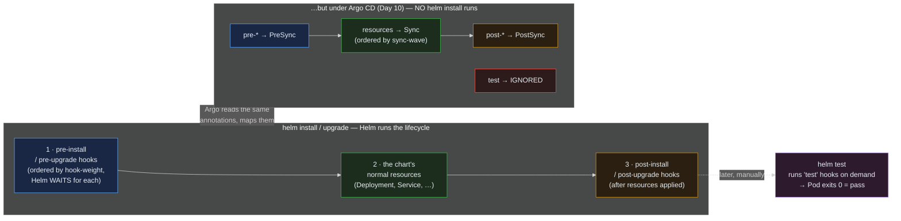

> **30 Days of DevOps** — Day 27 of 30. [← Day 26: Vertical Pod Autoscaler](/articles/2026/06/14/day-26-vertical-pod-autoscaler/)

Every Helm release in this series has been a flat pile of YAML applied all at once.
When you `helm install` or Argo CD syncs, the Deployment, Service, Ingress,
ConfigMap, and the rest land together, in whatever order the API server happens to
accept them. For most of what you have built that is fine — Kubernetes is
declarative and self-healing, so a Service that appears a half-second before its
Deployment simply has no endpoints for that half-second.

But "all at once, any order" breaks the moment a release has a **sequence
requirement**:

- A **database migration** must run and finish *before* the new application code
  starts — start the new code against the old schema and it crashes or corrupts.
- A **cache warm** or smoke check should run *after* the Deployment is Ready, not
  before it exists.
- A **cleanup** Job should run when the release is *uninstalled*, to drop a database
  or revoke a credential the chart created.

None of these fit "apply everything simultaneously." They need to run *at a specific
point in the release's lifecycle*, and that is exactly what **Helm hooks** are: a
Job (usually) annotated to run at `pre-install`, `post-upgrade`, `pre-delete`, and
similar moments, with a **weight** to order multiple hooks and a **delete policy**
to control their cleanup. And once a release can run arbitrary Jobs to prepare
itself, the natural next question is *did it actually work?* — which is what
**`helm test`** answers: a Pod, shipped in the chart, that Helm runs on demand to
*assert* the release is healthy, turning "the deploy succeeded" from a hope into a
check.

Today you will build a small chart with ordered hooks and watch them fire across
install, upgrade, and delete; write a `helm test` that proves a release works; hit
the sharp edge where a failed `pre-install` hook leaves a release wedged; and then
confront the GitOps reality this series has quietly depended on since Day 10 —
**Argo CD does not run Helm's hook lifecycle.** It reads the same annotations and
maps them onto its *own* sync phases, with a couple of consequences (notably: it
ignores `helm test`) you need to know before you rely on a hook in production.

## What you will build

By the end of this article you will have:

- A focused `hookdemo` chart whose hooks run in a proven order: two `pre-install`
  Jobs (a "migration" then a "verify", ordered by `hook-weight`) before the app, and
  a `post-install` "cache warm" after it
- A clear reading of the **release lifecycle**: which hooks fire on `install`,
  `upgrade`, and `delete`, and that Helm **waits** for each hook to complete before
  moving on
- Control over hook cleanup with **`hook-delete-policy`** — and a live demo of the
  classic sharp edge: a **failed `pre-install` hook leaves the release in `failed`
  status with the main resources never created**, and how to recover
- A **`helm test`** Pod shipped in the chart that connectivity-checks the release;
  `helm test <release>` runs it and reports pass/fail
- The **Helm-hooks → Argo CD mapping** that governs every chart in this series'
  GitOps repo: `pre-*` → `PreSync`, `post-*` → `PostSync`, `hook-weight` honored,
  `helm test` **ignored** — and why the webapp's connectivity check therefore
  belongs in CI, not in an Argo sync

---

## The release lifecycle, and where hooks fire

A Helm release is not an event; it is a sequence with named moments. Hooks plug
into those moments.



**Reading this diagram:**

The top track is **Helm's own lifecycle** — what runs when you type `helm install`
or `helm upgrade`. Read it left to right as time. First (①, blue) Helm executes the
**pre-install / pre-upgrade hooks**, in ascending `hook-weight` order, and crucially
**waits for each one to reach completion** before continuing — a `pre-install` Job
that takes 30 seconds blocks the whole install for 30 seconds. Only once the pre
hooks succeed does Helm apply (②, green) the **chart's normal resources** — the
Deployment, Service, everything without a hook annotation. Then (③, amber) it runs
the **post-install / post-upgrade hooks**, after the resources are in the cluster.
This ordering is the entire value: a `pre-upgrade` migration is *guaranteed* to have
finished before the new Deployment's Pods start.

The purple **`helm test`** box sits apart, on a dotted arrow, because it is not part
of install at all — it runs only when *you* type `helm test <release>`, executing
any `test`-annotated Pods and reporting whether they exit 0. It is the on-demand
"is this release actually working?" assertion.

The bottom track is the GitOps reality and the reason this is not just a Helm
tutorial. **Under Argo CD (Day 10), there is no `helm install` — Argo renders the
chart with `helm template` and applies the manifests itself.** So Helm's hook
*executor* never runs. Instead, Argo CD reads the same `helm.sh/hook` annotations
and **translates** them onto its own sync phases: `pre-install`/`pre-upgrade` become
**PreSync**, `post-*` become **PostSync**, `hook-weight` is honored within a phase,
and the normal resources sync in between (ordered by the `sync-wave` annotation from
Day 10). The one that does not survive the translation is **`test`** — Argo CD
**ignores** test hooks entirely (red). The same chart, two different engines: know
which one is driving before you depend on a hook.

---

## Prerequisites

This article continues from Day 26. Required state:

- The `devops-cluster` kind cluster; Helm 3.14+, kubectl 1.29+
- Nothing else is required for Parts 1–3 (a self-contained scratch chart); Part 4 is
  about the Argo CD that has managed the webapp since Day 10

Pre-flight check:

```bash
helm version --short
kubectl get ns | grep -E 'NAME|default'
```

Expected output:

```text
v3.14.4+g...

NAME       STATUS   AGE
default    Active   4w
```

| Tool | Minimum version | Check |
|---|---|---|
| Helm | 3.14 | `helm version --short` |
| kubectl | 1.29 | `kubectl version --client` |

---

## Part 1 — A chart with ordered hooks

Build a small, self-contained chart so the hooks are the whole story. It has an app
(an nginx Deployment + Service) and three hook Jobs: two `pre-install` (a migration,
then a verify, ordered by weight) and one `post-install` (a cache warm).

```bash
mkdir -p ~/30-days-devops/day-27 && cd ~/30-days-devops/day-27

mkdir -p hookdemo/templates

cat > hookdemo/Chart.yaml << 'EOF'
apiVersion: v2
name: hookdemo
description: A chart for demonstrating Helm hooks and helm test
version: 0.1.0
appVersion: "1.0"
EOF

cat > hookdemo/values.yaml << 'EOF'
image: nginx:1.27-alpine
EOF

# The app: a normal Deployment + Service (NO hook annotation).
cat > hookdemo/templates/app.yaml << 'EOF'
apiVersion: apps/v1
kind: Deployment
metadata:
  name: hookdemo
spec:
  replicas: 1
  selector:
    matchLabels: { app: hookdemo }
  template:
    metadata:
      labels: { app: hookdemo }
    spec:
      containers:
        - name: nginx
          image: {{ .Values.image }}
          ports:
            - containerPort: 80
---
apiVersion: v1
kind: Service
metadata:
  name: hookdemo
spec:
  selector: { app: hookdemo }
  ports:
    - port: 80
      targetPort: 80
EOF
```

`app.yaml` is an ordinary templated manifest — `{{ .Values.image }}` is a
normal Helm value, and it carries **no hook annotation**, so it is part of the
release's regular resources (the green "②" in the diagram). Now the three hooks.
**`hook-weight` orders multiple hooks in the same phase — lower runs first** — so the
migration
(weight `-10`) runs before the verify (weight `-5`):

```bash
# pre-install hook #1: the "migration" (lowest weight = runs first)
cat > hookdemo/templates/hook-migrate.yaml << 'EOF'
apiVersion: batch/v1
kind: Job
metadata:
  name: hookdemo-migrate
  annotations:
    "helm.sh/hook": pre-install,pre-upgrade
    "helm.sh/hook-weight": "-10"
    # before-hook-creation only (NO hook-succeeded) so the Job survives after
    # success and we can read its logs below. Part 2 adds hook-succeeded.
    "helm.sh/hook-delete-policy": before-hook-creation
spec:
  backoffLimit: 0
  template:
    spec:
      restartPolicy: Never
      containers:
        - name: migrate
          image: busybox:1.36
          command: ["sh","-c","echo \"[$(date -u +%T)] step 1: running schema migration\"; sleep 5; echo done"]
EOF

# pre-install hook #2: the "verify" (higher weight = runs after migrate)
cat > hookdemo/templates/hook-verify.yaml << 'EOF'
apiVersion: batch/v1
kind: Job
metadata:
  name: hookdemo-verify
  annotations:
    "helm.sh/hook": pre-install,pre-upgrade
    "helm.sh/hook-weight": "-5"
    "helm.sh/hook-delete-policy": before-hook-creation
spec:
  backoffLimit: 0
  template:
    spec:
      restartPolicy: Never
      containers:
        - name: verify
          image: busybox:1.36
          command: ["sh","-c","echo \"[$(date -u +%T)] step 2: verifying migration\"; sleep 2; echo ok"]
EOF

# post-install hook: the "cache warm" (runs AFTER the app resources are applied)
cat > hookdemo/templates/hook-warm.yaml << 'EOF'
apiVersion: batch/v1
kind: Job
metadata:
  name: hookdemo-warm
  annotations:
    "helm.sh/hook": post-install,post-upgrade
    "helm.sh/hook-weight": "0"
    "helm.sh/hook-delete-policy": before-hook-creation
spec:
  backoffLimit: 0
  template:
    spec:
      restartPolicy: Never
      containers:
        - name: warm
          image: busybox:1.36
          command: ["sh","-c","echo \"[$(date -u +%T)] post: warming cache\"; sleep 2; echo warmed"]
EOF
```

Install it, and **watch the install block** while Helm runs the pre hooks, applies
the app, then runs the post hook:

```bash
helm install hookdemo ./hookdemo -n hooks-lab --create-namespace
```

Expected output (note the elapsed wall-clock — the install paused ~7s for the two
pre hooks):

```text
NAME: hookdemo
LAST DEPLOYED: Sun Jun 14 15:00:00 2026
NAMESPACE: hooks-lab
STATUS: deployed
REVISION: 1
TEST SUITE: None
```

Prove the order from the hook Jobs' logs (the timestamps tell the story):

```bash
kubectl logs -n hooks-lab job/hookdemo-migrate
kubectl logs -n hooks-lab job/hookdemo-verify
kubectl logs -n hooks-lab job/hookdemo-warm
```

Expected output:

```text
[15:00:01] step 1: running schema migration
done
[15:00:07] step 2: verifying migration
ok
[15:00:10] post: warming cache
warmed
```

The timeline is exactly the diagram: migrate (15:00:01) → verify (15:00:07, after
migrate's 5s) → then the app was applied → warm (15:00:10, after the resources).
`hook-weight -10` ran before `-5`; both pre hooks ran before the post hook; and the
post hook ran after the Deployment existed.

Those logs were readable for a deliberate reason: the hooks used
`hook-delete-policy: before-hook-creation` only, so the Jobs **persist** after they
succeed. Confirm — they are still there:

```bash
kubectl get jobs -n hooks-lab
```

Expected output:

```text
NAME               STATUS     COMPLETIONS   DURATION   AGE
hookdemo-migrate   Complete   1/1           5s         2m
hookdemo-verify    Complete   1/1           2s         2m
hookdemo-warm      Complete   1/1           2s         2m
```

Three completed hook Jobs cluttering the namespace — which is exactly the problem
the *next* part's cleanup policy solves.

---

## Part 2 — `hook-delete-policy`, and the failed-hook trap

Hook Jobs do not clean themselves up the way a normal Job with
`ttlSecondsAfterFinished` would — you saw the three from Part 1 still sitting there.
Helm manages hook lifecycle via the **`helm.sh/hook-delete-policy`** annotation, and
its three values control exactly when each hook Job is removed:

- **`before-hook-creation`** (the default, and what Part 1 used) — delete the
  *previous* instance of this hook right before creating a new one. This is why
  re-running an upgrade does not error on "Job already exists"; it is also why the
  Part 1 Jobs survived (they are only deleted on the *next* run).
- **`hook-succeeded`** — delete the hook Job *as soon as it succeeds*. Add this and
  the Part 1 clutter disappears automatically — at the cost of the logs you just
  read (a succeeded hook is gone within seconds, so `kubectl logs job/...` would
  return `NotFound`). Use it once a hook is trusted; omit it while you still want to
  inspect runs.
- **`hook-failed`** — delete it if it fails. (Usually you want the *opposite* — keep
  failed hooks so you can read why.)

The deliberately-broken hook below uses `before-hook-creation` **only** — no
`hook-failed` — so when it fails it is **kept** for debugging, which sets up the most
important sharp edge in this whole topic.

**A failed `pre-install` hook wedges the release.** Because pre hooks run *before*
the chart's resources, if a pre-install hook exits non-zero, Helm aborts — and the
Deployment, Service, everything is **never created**. Watch it:

```bash
# a chart whose pre-install hook always fails
cat > hookdemo/templates/hook-broken.yaml << 'EOF'
apiVersion: batch/v1
kind: Job
metadata:
  name: hookdemo-broken
  annotations:
    "helm.sh/hook": pre-install
    "helm.sh/hook-weight": "-20"
    "helm.sh/hook-delete-policy": before-hook-creation
spec:
  backoffLimit: 0
  template:
    spec:
      restartPolicy: Never
      containers:
        - name: broken
          image: busybox:1.36
          command: ["sh","-c","echo 'migration failed: cannot reach db'; exit 1"]
EOF

helm install broken ./hookdemo -n hooks-broken --create-namespace 2>&1 | tail -3
```

Expected output:

```text
Error: INSTALLATION FAILED: failed pre-install: 1 error occurred:
	* job hookdemo-broken failed: BackoffLimitExceeded
```

The install **failed**. Check the wreckage:

```bash
helm list -n hooks-broken --all
kubectl get deploy,svc -n hooks-broken
```

Expected output:

```text
NAME    NAMESPACE       REVISION   STATUS   CHART            APP VERSION
broken  hooks-broken    1          failed   hookdemo-0.1.0   1.0

No resources found in hooks-broken namespace.
```

The release exists in **`failed`** status, but **no Deployment, no Service** were
ever created — the pre-install hook gated them and the gate stayed shut. The failed
hook Job is still there (we used a delete policy that keeps it) so you can read
`kubectl logs job/hookdemo-broken` and see `migration failed: cannot reach db`. This
is the classic "the release is stuck and nothing is running" incident: a
pre-install/pre-upgrade hook failed. Recovery is a `helm uninstall` (for a failed
*install*) or `helm rollback` (for a failed *upgrade*, to return to the last good
revision):

```bash
helm uninstall broken -n hooks-broken
kubectl delete namespace hooks-broken
rm hookdemo/templates/hook-broken.yaml   # remove the deliberately-broken hook
```

Expected output:

```text
release "broken" uninstalled
namespace "hooks-broken" deleted
```

---

## Part 3 — `helm test`: prove the release works

Hooks prepare a release; **`helm test` proves it.** A test is a Pod (or Job)
annotated `helm.sh/hook: test`, shipped in the chart but **not** run during install —
it runs only when you invoke `helm test <release>`. If the test Pod exits 0, the
release passes; non-zero fails. Add one that actually checks the `hookdemo` app is
serving:

```bash
cat > hookdemo/templates/test-connection.yaml << 'EOF'
apiVersion: v1
kind: Pod
metadata:
  name: hookdemo-test-connection
  annotations:
    "helm.sh/hook": test
    "helm.sh/hook-delete-policy": before-hook-creation,hook-succeeded
spec:
  restartPolicy: Never
  containers:
    - name: wget
      image: busybox:1.36
      # hit the Service by name; nginx must answer with the welcome page
      command: ["sh","-c","wget -qO- http://hookdemo.hooks-lab.svc.cluster.local/ | grep -q 'Welcome to nginx' && echo PASS"]
EOF

# the test ships with the chart — upgrade the release so it's part of it
helm upgrade hookdemo ./hookdemo -n hooks-lab

# now run it
helm test hookdemo -n hooks-lab --logs
```

Expected output (the upgrade runs the pre/post hooks again; then the test runs):

```text
Release "hookdemo" has been upgraded. Happy Helming!
...
NAME: hookdemo
LAST DEPLOYED: Sun Jun 14 15:05:00 2026
NAMESPACE: hooks-lab
STATUS: deployed
REVISION: 2
TEST SUITE:     hookdemo-test-connection
Last Started:   Sun Jun 14 15:05:20 2026
Last Completed: Sun Jun 14 15:05:24 2026
Phase:          Succeeded

POD LOGS: hookdemo-test-connection
PASS
```

`Phase: Succeeded` and `PASS` in the logs — the release is not merely *deployed*, it
is *verified working*: the Service resolves, nginx answers, the response is the page
you expected. This is the difference between "Helm reported success" (the resources
were accepted by the API server) and "the application actually serves traffic"
(`helm test`). In CI, `helm test` after `helm upgrade` is how you gate a release
before declaring a deploy green.

Make the value obvious by breaking it — point the test at a path nginx will 404 and
re-run:

```bash
# (illustrative) a failing test exits non-zero
kubectl run probe --rm -it --image=busybox:1.36 --restart=Never -n hooks-lab -- \
  sh -c "wget -qO- http://hookdemo/nonexistent || echo 'would FAIL: non-zero exit'"
```

Expected output:

```text
wget: server returned error: HTTP/1.1 404 Not Found
would FAIL: non-zero exit
```

A non-zero exit is exactly what `helm test` reports as a failure — turning a wrong
assumption about the release into a red check instead of a silent production bug.
Tear the lab down:

```bash
helm uninstall hookdemo -n hooks-lab
kubectl delete namespace hooks-lab
```

---

## Part 4 — Hooks under Argo CD: the GitOps reality

Everything in Parts 1–3 happened because **you** ran `helm install/upgrade/test`.
But the webapp chart has not been installed by Helm since Day 10 — **Argo CD**
manages it, and Argo CD works completely differently: it runs `helm template` to
render the chart to plain YAML, then applies that YAML itself. **Helm's hook
executor is never invoked.** So what happens to a `helm.sh/hook` annotation in an
Argo-managed chart?

Argo CD reads it and **translates** it to its own sync model. The mapping:

| Helm hook annotation | Argo CD behaviour |
|---|---|
| `helm.sh/hook: pre-install` / `pre-upgrade` | runs as a **PreSync** hook (before the main sync) |
| `helm.sh/hook: post-install` / `post-upgrade` | runs as a **PostSync** hook (after the main sync) |
| `helm.sh/hook-weight: "N"` | honored — orders hooks within a phase |
| `helm.sh/hook-delete-policy: ...` | mapped to Argo's `BeforeHookCreation` / `HookSucceeded` / `HookFailed` |
| `helm.sh/hook: test` | **ignored** — Argo CD does not run Helm test hooks at all |
| `helm.sh/hook: pre-delete` / `post-delete` | largely unsupported / different semantics under Argo |

Three practical consequences for the charts in this series:

1. **A `pre-upgrade` migration hook is portable.** Annotate a migration Job with
   `helm.sh/hook: pre-upgrade` and it runs as a **PreSync** hook under Argo CD —
   before the webapp Deployment rolls — which is exactly what you want. The same
   annotation that worked under `helm upgrade` works under GitOps. (Argo's *native*
   way to express the same thing is `argocd.argoproj.io/hook: PreSync`; both are
   accepted.)

2. **Ordering you already use is Argo's `sync-wave`, not `hook-weight`.** For
   *normal* resources (not hooks), Day 10's `argocd.argoproj.io/sync-wave` is what
   orders them. `hook-weight` only orders resources *within* a hook phase. The webapp
   chart's ordinary resources (Deployment, Service, ConfigMap, PDB, …) are sequenced
   by sync-waves, not hook-weights.

3. **`helm test` does not run under Argo CD — so your connectivity check belongs in
   CI.** Because Argo ignores `helm.sh/hook: test`, the `helm test` Pod you wrote in
   Part 3 would simply never execute in the GitOps flow. The correct pattern is to
   run `helm test` (or an equivalent smoke test) from your **CI pipeline** after a
   change merges — render the chart, apply it to a preview/staging namespace,
   `helm test`, and only then let Argo promote it. The release-proving assertion is
   real and valuable; it just lives in CI, not in the sync.

You can see the translation without changing anything: if a chart Argo manages
contains a Helm pre-sync hook, Argo surfaces it as a hook resource in the app. The
key takeaway is conceptual and load-bearing — **know which engine is running your
hooks.** Under `helm`, the lifecycle in Parts 1–3 applies verbatim. Under Argo CD,
`pre-*`/`post-*` become PreSync/PostSync, weights still order, and `test` is on you.

---

## Common Errors

**1. `Error: ... failed pre-install: job ... failed: BackoffLimitExceeded` — and nothing is deployed**

The Part 2 trap. A `pre-install`/`pre-upgrade` hook exited non-zero, so Helm aborted
before applying the chart's resources. The release is in `failed` status with nothing
running.

Fix: read the failed hook's logs (keep them — do *not* set `hook-delete-policy:
hook-failed`), fix the cause, then `helm uninstall` (failed install) or `helm
rollback <release> <last-good-revision>` (failed upgrade). Never leave a release
`failed`; the next `helm upgrade` may refuse or behave unexpectedly on top of it.

**2. `Error: ... Job already exists` on re-running install/upgrade**

A hook Job from a previous run was left behind and the new run collides with it.
This happens when you omit the default delete policy or set only `hook-succeeded`
(which doesn't clean a *failed* leftover).

Fix: include **`before-hook-creation`** in the `hook-delete-policy` (it is the
default, but explicit is safer) so Helm removes the prior instance before recreating
it. Combine it with `hook-succeeded` for cleanliness:
`before-hook-creation,hook-succeeded`.

**3. The pre-upgrade migration ran, but against the *new* code's expectations**

A subtle ordering bug: people assume a `pre-upgrade` hook can use the new image. It
runs *before* the new Deployment, but it uses whatever image *you put in the hook
Job* — which should usually be the **new** version's migration tool, pinned
explicitly. If your hook Job references `:latest` or the old tag, it migrates with the
wrong code.

Fix: pin the hook Job's image to the same version you are deploying (template it from
the same `.Values.image.tag` the Deployment uses), so the migration and the app agree
on the schema.

**4. `helm test` reports "no tests" / does nothing**

`helm test <release>` ran but found nothing to do. Either the chart has no
`helm.sh/hook: test` resource, or the resource was filtered out (e.g. an `{{ if }}`
guard evaluated false), or you are testing a release that predates adding the test.

Fix: confirm a test resource is in the *deployed* revision — `helm get manifest
<release> | grep -A2 'hook: test'`. Add or fix the test, `helm upgrade`, then
`helm test`.

**5. A hook ran under `helm` but not under Argo CD (or vice-versa)**

The cross-engine surprise from Part 4. A `helm.sh/hook: test` will run under
`helm test` but is **ignored by Argo CD**. A `pre-delete` hook behaves under `helm
uninstall` but has different/limited support under Argo. Teams hit this when a chart
that "worked in Helm" is migrated to Argo CD and a hook silently stops firing.

Fix: know your engine (Part 4 table). For Argo-managed charts, use `pre-*`/`post-*`
hooks (which map cleanly to PreSync/PostSync) and move `helm test`-style checks into
CI. For ordering, prefer `argocd.argoproj.io/sync-wave` for normal resources.

**6. A `post-install` hook ran before the Deployment was actually Ready**

`post-install` fires after Helm *applies* the resources, not after they are
**Ready**. A cache-warm or smoke hook that assumes the Pods are serving may run
against a Deployment whose Pods are still `ContainerCreating`.

Fix: either run `helm install --wait` (Helm waits for resources to be Ready before
running post hooks) or make the hook itself wait — poll the Service/endpoint with a
retry loop inside the hook Job until it responds, rather than assuming readiness.

---

## Recap

In this article you:

- Learned that a Helm release is a **lifecycle**, not a single apply, and that
  **hooks** run Jobs at named points — `pre-install`/`pre-upgrade` (before the
  resources), `post-install`/`post-upgrade` (after), `pre-delete`/`post-delete`
  (on uninstall), and `test` (on demand) — with Helm **waiting** for each hook to
  complete
- Built a `hookdemo` chart and proved ordering from the logs: a `hook-weight: -10`
  migration ran before a `-5` verify, both pre hooks ran before the app, and the
  `post-install` warm ran after the resources existed
- Controlled hook cleanup with **`hook-delete-policy`** (`before-hook-creation` /
  `hook-succeeded` / `hook-failed`) and walked straight into the headline failure
  mode: a **failed `pre-install` hook leaves the release `failed` with no resources
  created**, recovered with `helm uninstall` / `helm rollback`
- Shipped a **`helm test`** Pod that connectivity-checks the release and ran it with
  `helm test --logs` — `Phase: Succeeded`, turning "deployed" into "verified working"
- Confronted the **GitOps reality**: Argo CD does not run `helm install`, so it
  **translates** Helm hooks onto its own phases — `pre-*` → **PreSync**, `post-*` →
  **PostSync**, `hook-weight` honored, **`test` ignored** — which means a
  `pre-upgrade` migration is portable to GitOps but a `helm test` connectivity check
  belongs in **CI**, and ordinary-resource ordering is Day 10's `sync-wave`
- Catalogued six failure modes, including the image-version mismatch in migration
  hooks and the `post-install`-before-Ready race

Your charts can now do more than declare desired state — they can *sequence* a
release and *assert* it works, in both the Helm-native and the GitOps worlds.

---

## What's next

[Day 28: Custom Resource Definitions and the Operator Pattern — How Every Add-On You Installed Actually Works →](/articles/2026/06/14/day-28-crds-operators/)

You have installed nine controllers without ever asking how they work: cert-manager
(Day 7), the Prometheus Operator (Day 8), Argo CD (Day 10), Sealed Secrets (Day 11),
metrics-server and the HPA, the VPA (Day 26) — every one of them extends Kubernetes
with **new kinds of object** (`Certificate`, `Prometheus`, `Application`,
`SealedSecret`, `VerticalPodAutoscaler`) that the core API never shipped. On Day 28
you will learn the mechanism behind all of them: a **CustomResourceDefinition** that
teaches the API server a new resource type, and a **controller** (the "operator")
that watches those objects and reconciles the world toward them — the exact
watch-diff-act loop Argo CD runs for Applications and cert-manager runs for
Certificates. You will define your own CRD, apply a custom resource against it, and
write a minimal reconciling controller in a few lines of shell to *feel* the loop —
demystifying every operator this series has leaned on, and the entire pattern the
Kubernetes ecosystem is built from.
