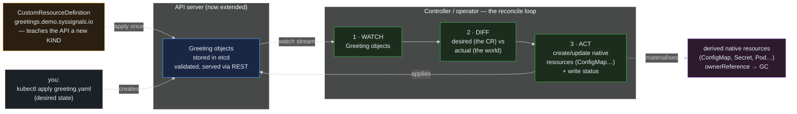

> **30 Days of DevOps** — Day 28 of 30. [← Day 27: Helm Hooks and Chart Testing](/articles/2026/06/14/day-27-helm-hooks-chart-testing/)

Count what you have installed across this series. Day 7: **cert-manager**, and
suddenly `kubectl get certificates` worked. Day 8: the **Prometheus Operator**, and
`kubectl get prometheus`, `servicemonitors`, `prometheusrules` all became real
kinds. Day 10: **Argo CD**, and `kubectl get applications` listed your GitOps apps.
Day 11: **Sealed Secrets** and `kubectl get sealedsecrets`. Day 26: the **VPA** and
`kubectl get verticalpodautoscalers`. None of `Certificate`, `Prometheus`,
`Application`, `SealedSecret`, or `VerticalPodAutoscaler` exists in core Kubernetes.
The API server never shipped them. Yet there they were, first-class — you could
`get`, `describe`, `apply`, `explain`, label, and RBAC them exactly like a Pod.

How? Every one of those add-ons is an **operator**, and an operator is always the
same two halves:

1. A **CustomResourceDefinition (CRD)** — a single YAML object you apply to the API
   server that *teaches it a new kind*. Apply a CRD named `certificates.cert-manager.io`
   and the API server now has a `Certificate` resource: a new REST endpoint, storage
   in etcd, schema validation, the works. **But a CRD adds a noun, not a verb** —
   the API server will happily store a `Certificate` object and do absolutely
   nothing with it.
2. A **controller** (the "operator") — a program that *watches* objects of that new
   kind and *reconciles* the real world toward what they declare. cert-manager's
   controller watches `Certificate` objects and produces the actual TLS `Secret`;
   Argo CD's watches `Application` objects and makes the cluster match Git; Sealed
   Secrets' watches `SealedSecret` objects and decrypts them into `Secret`s. The CRD
   gives the object meaning to *humans*; the controller gives it meaning to the
   *cluster*.

That is the whole pattern, and once you have built it yourself it demystifies every
operator you will ever install. Today you will inspect the CRDs already living in
your cluster, **define your own CRD** for a new kind, apply a **custom resource**
and watch the API server serve it (while nothing happens to it — because there is no
controller yet), then **write a controller in a few lines of shell** that
reconciles your custom resource into real cluster state, complete with status
updates and garbage collection. The reconcile loop — watch, diff, act — is the
beating heart of Kubernetes, and by the end you will have written one.

## What you will build

By the end of this article you will have:

- A tour of the **CRDs already installed** by Days 7–26 — `kubectl get crds`
  showing `certificates.cert-manager.io`, `applications.argoproj.io`,
  `sealedsecrets.bitnami.com`, `verticalpodautoscalers.autoscaling.k8s.io`, and more
  — and the anatomy of a CRD (group, version, kind, scope, schema, subresources)
- **Your own CRD**: a `Greeting` kind in the `demo.syssignals.io` group, with a
  validated schema, a `status` subresource, and custom print columns
- A **custom resource** applied against it, proving the API server now stores,
  validates, serves, and `kubectl explain`s your new kind — while doing *nothing*
  to it, because a CRD is a noun without a verb
- A **controller written in shell** — a real watch-diff-act reconcile loop — that
  materializes each `Greeting` into a derived `ConfigMap`, sets an `ownerReference`
  so the ConfigMap is **garbage-collected** when the Greeting is deleted, and writes
  back the Greeting's `status.synced` — the exact mechanics cert-manager, Argo CD,
  and every other operator run, minus the production polish
- A clear map from your toy operator to the **real ones** you have been using, and
  the maturity ladder from "CRD only" to "production operator" (status, finalizers,
  admission webhooks)

---

## The two halves of every operator

A CRD and a controller are independent, and seeing them apart is the whole insight.



**Reading this diagram:**

The amber box on the left is the **CRD**, and it does exactly one thing: applied
once to the cluster, it *teaches the API server a new kind*. From that moment the
API server (the blue box) can store, validate, and serve `Greeting` objects through
the same REST machinery it uses for Pods — they live in etcd, they have a URL, they
respect RBAC. **This half is pure API extension; no behaviour is added.** You could
stop here, and you would have a new way to store structured config that `kubectl`
understands — and nothing more.

The green box is the **controller**, and it supplies the missing behaviour as a
loop. **WATCH (①):** it subscribes to the API server's watch stream for `Greeting`
objects, so it is notified the instant one is created, changed, or deleted.
**DIFF (②):** for each Greeting it compares the *desired* state (what the custom
resource declares) against the *actual* state of the world (what native resources
currently exist). **ACT (③):** it makes them match — creating or updating the native
resources the Greeting implies (the purple box: a `ConfigMap` here, a TLS `Secret`
for cert-manager, a synced cluster for Argo CD), and writing the outcome back into
the Greeting's `status`. Then it loops, forever. This **watch → diff → act** cycle
is *reconciliation*, and it is the single most important idea in Kubernetes: every
built-in controller (Deployment, ReplicaSet, Job) and every operator you have
installed runs exactly this loop.

Two arrows complete the picture. The **ownerReference** on the materialised
resources (the dotted purple arrow) ties each derived ConfigMap to its parent
Greeting, so when you delete the Greeting, Kubernetes' garbage collector deletes the
ConfigMap automatically — no cleanup code in the controller. And the controller
**writing back to the API server** (the arrow from ACT to the store) is how `status`
gets populated, so `kubectl get greetings` can show whether each one is reconciled.

The key insight: **a CRD is a noun, a controller is the verb.** Install only the CRD
and you have inert configuration. Add the controller and the configuration comes
alive. Every operator is this pair — and you are about to build both.

---

## Prerequisites

This article continues from Day 27. Required state:

- The `devops-cluster` kind cluster, with the add-ons from earlier days still
  installed (cert-manager, Argo CD, Sealed Secrets, VPA) so their CRDs are present
  to inspect in Part 1
- kubectl 1.29+ (Part 3 uses `kubectl patch --subresource=status`, GA since 1.24)
- `bash` (the controller is a shell script)

Pre-flight check:

```bash
# the CRDs your past 27 days installed — proof the pattern is everywhere
kubectl get crds | grep -E 'cert-manager|argoproj|bitnami|autoscaling.k8s.io' | head
```

Expected output:

```text
certificates.cert-manager.io                     2026-05-18T...
clusterissuers.cert-manager.io                   2026-05-18T...
applications.argoproj.io                         2026-05-19T...
sealedsecrets.bitnami.com                        2026-05-19T...
verticalpodautoscalers.autoscaling.k8s.io        2026-06-14T...
```

| Tool | Minimum version | Check |
|---|---|---|
| kubectl | 1.29 | `kubectl version --client` |

---

## Part 1 — The CRDs already in your cluster

Before defining one, look at what nine add-ons have already taught your API server.
Every "new kind" you have used is backed by a CRD object:

```bash
# how many extension kinds have been added to this cluster?
kubectl get crds --no-headers | wc -l

# the anatomy of one — cert-manager's Certificate (Day 7)
kubectl get crd certificates.cert-manager.io \
  -o jsonpath='group={.spec.group}{"\n"}scope={.spec.scope}{"\n"}kind={.spec.names.kind}{"\n"}versions={range .spec.versions[*]}{.name}{" "}{end}{"\n"}'
```

Expected output:

```text
47

group=cert-manager.io
scope=Namespaced
kind=Certificate
versions=v1
```

Forty-seven extension kinds — and that is a *small* cluster. A CRD's identity is
four things: its **group** (`cert-manager.io` — a DNS-style namespace that keeps
`Certificate` from colliding with anyone else's), its **version(s)** (`v1`), its
**kind** (`Certificate`), and its **scope** (`Namespaced` — Certificates live in a
namespace; `ClusterIssuer`, by contrast, is `Cluster`-scoped). Those four define the
REST endpoint the API server exposes: `/apis/cert-manager.io/v1/namespaces/<ns>/certificates`.

The CRD also carries the **schema** the API server validates objects against, which
is why `kubectl explain` works on a kind the core API never heard of:

```bash
kubectl explain certificate.spec --recursive | head -8
```

Expected output (abbreviated):

```text
GROUP:      cert-manager.io
KIND:       Certificate
VERSION:    v1

FIELD: spec <Object>
...
   dnsNames     <[]string>
   secretName   <string>
```

`kubectl explain` is reading the OpenAPI schema embedded in the CRD. That schema is
what makes a custom resource a *typed*, validated object rather than a freeform blob.
Now build one of your own.

---

## Part 2 — Define your own CRD (a noun with no verb)

A CRD is just a YAML object of kind `CustomResourceDefinition`. Define a `Greeting`
kind — a toy, but structurally identical to `Certificate` — with a validated schema,
a `status` subresource, and custom columns so `kubectl get` shows useful output:

```bash
mkdir -p ~/30-days-devops/day-28 && cd ~/30-days-devops/day-28

cat > greeting-crd.yaml << 'EOF'
apiVersion: apiextensions.k8s.io/v1
kind: CustomResourceDefinition
metadata:
  # name MUST be <plural>.<group>
  name: greetings.demo.syssignals.io
spec:
  group: demo.syssignals.io
  scope: Namespaced
  names:
    plural: greetings
    singular: greeting
    kind: Greeting
    shortNames: [greet]
  versions:
    - name: v1
      served: true        # this version is reachable via the API
      storage: true        # this version is the one persisted to etcd
      schema:
        openAPIV3Schema:
          type: object
          properties:
            spec:
              type: object
              properties:
                message:
                  type: string
                target:
                  type: string
                  default: world
              required: [message]
            status:
              type: object
              properties:
                synced:
                  type: boolean
          required: [spec]
      # enable a /status subresource so the controller can write status
      # independently of (and without clobbering) the spec
      subresources:
        status: {}
      # what `kubectl get greetings` shows beyond NAME/AGE
      additionalPrinterColumns:
        - name: Message
          type: string
          jsonPath: .spec.message
        - name: Synced
          type: boolean
          jsonPath: .status.synced
EOF

kubectl apply -f greeting-crd.yaml
```

Expected output:

```text
customresourcedefinition.apiextensions.k8s.io/greetings.demo.syssignals.io created
```

Wait for the CRD to be **Established** — the API server takes a moment to register
the new endpoint, and acting before it does fails with `couldn't find resource`
(Common Errors #1):

```bash
kubectl wait --for=condition=established crd/greetings.demo.syssignals.io --timeout=30s
```

Expected output:

```text
customresourcedefinition.apiextensions.k8s.io/greetings.demo.syssignals.io condition met
```

The API server now serves a `Greeting` kind. Prove it — `kubectl explain` works on a
kind that did not exist five seconds ago:

```bash
kubectl explain greeting.spec
```

Expected output:

```text
GROUP:      demo.syssignals.io
KIND:       Greeting
VERSION:    v1

FIELD: spec <Object>

DESCRIPTION:
    <empty>
FIELDS:
  message       <string> -required-
  target        <string>
```

Now create a **custom resource** of your new kind:

```bash
kubectl create namespace greet-lab

cat > hello.yaml << 'EOF'
apiVersion: demo.syssignals.io/v1
kind: Greeting
metadata:
  name: hello-world
  namespace: greet-lab
spec:
  message: "Hello from a custom resource"
  # target omitted — the schema default fills it in as "world"
EOF

kubectl apply -f hello.yaml
kubectl get greetings -n greet-lab
```

Expected output:

```text
greeting.demo.syssignals.io/hello-world created

NAME          MESSAGE                        SYNCED
hello-world   Hello from a custom resource   <none>
```

A first-class object: stored, validated (omit `message` and the API server rejects
it), served, with your custom columns. The schema default even filled in
`target: world`:

```bash
kubectl get greeting hello-world -n greet-lab -o jsonpath='{.spec.target}{"\n"}'
```

Expected output:

```text
world
```

But look at the `SYNCED` column: **`<none>`**. Nothing has happened to this object.
No ConfigMap was created, no status was written, because **there is no controller** —
you have added a noun to the cluster's vocabulary but no verb. The API server is a
faithful database for your new kind and nothing more. The custom resource sits there,
declaring a desired state that nothing is acting on. That gap is exactly what an
operator fills.

---

## Part 3 — Write the controller (the verb)

Now supply the missing behaviour. A controller is a program that runs the
watch-diff-act loop; yours will, for every `Greeting`, ensure a `ConfigMap` named
`greeting-<name>` exists holding the message, own it so it is garbage-collected with
the Greeting, and mark the Greeting `synced`. In a few lines of shell:

```bash
cat > reconcile.sh << 'SCRIPT'
#!/usr/bin/env bash
# A toy operator. One reconcile pass: for every Greeting in greet-lab, make the
# world match it. This is the ENTIRE operator pattern — watch (the loop wrapper),
# diff (apply is declarative: it no-ops if already correct), act (create the
# ConfigMap + write status).
set -eu
NS=greet-lab

for name in $(kubectl get greetings -n "$NS" -o jsonpath='{.items[*].metadata.name}'); do
  msg=$(kubectl get greeting "$name" -n "$NS" -o jsonpath='{.spec.message}')
  uid=$(kubectl get greeting "$name" -n "$NS" -o jsonpath='{.metadata.uid}')

  # ACT: materialise the derived ConfigMap, OWNED by the Greeting so the
  # garbage collector deletes it when the Greeting is deleted (no cleanup code).
  kubectl apply -n "$NS" -f - <<EOF
apiVersion: v1
kind: ConfigMap
metadata:
  name: greeting-$name
  ownerReferences:
    - apiVersion: demo.syssignals.io/v1
      kind: Greeting
      name: $name
      uid: $uid
      controller: true
      blockOwnerDeletion: true
data:
  message: "$msg"
EOF

  # ACT: write the result back to the Greeting's /status subresource.
  kubectl patch greeting "$name" -n "$NS" --subresource=status --type=merge \
    -p '{"status":{"synced":true}}'

  echo "reconciled greeting/$name -> configmap/greeting-$name"
done
SCRIPT

# run ONE reconcile pass
bash reconcile.sh
```

Expected output:

```text
configmap/greeting-hello-world created
greeting.demo.syssignals.io/hello-world patched
reconciled greeting/hello-world -> configmap/greeting-hello-world
```

You just ran an operator's reconcile, once. See what it did — the derived ConfigMap
exists, and the Greeting's status is now `synced`:

```bash
kubectl get configmap greeting-hello-world -n greet-lab -o jsonpath='{.data.message}{"\n"}'
kubectl get greetings -n greet-lab
```

Expected output:

```text
Hello from a custom resource

NAME          MESSAGE                        SYNCED
hello-world   Hello from a custom resource   true
```

`SYNCED` flipped to **`true`**, and a real ConfigMap now carries the message your
custom resource declared. The custom resource came alive — that is the entire
difference between Part 2 and Part 3, and it is the entire difference between a CRD
and an operator.

**A single pass is not yet a controller — a controller never stops.** Wrap the
reconcile in a loop and it becomes one: it continuously drives the world toward the
Greetings, picking up new ones automatically. Run it in the background, then create
a *second* Greeting and watch it get reconciled with no manual step:

```bash
# the loop: this IS the controller now
while true; do bash reconcile.sh >/dev/null 2>&1; sleep 5; done &
LOOP_PID=$!

# create a new Greeting — the running controller will materialise it
cat > goodbye.yaml << 'EOF'
apiVersion: demo.syssignals.io/v1
kind: Greeting
metadata:
  name: goodbye-moon
  namespace: greet-lab
spec:
  message: "Goodbye, moon"
EOF
kubectl apply -f goodbye.yaml

sleep 8   # let the loop run a couple of passes
kubectl get greetings,configmaps -n greet-lab
```

Expected output:

```text
greeting.demo.syssignals.io/goodbye-moon created

NAME                                          MESSAGE                        SYNCED
greeting.demo.syssignals.io/goodbye-moon      Goodbye, moon                  true
greeting.demo.syssignals.io/hello-world       Hello from a custom resource   true

NAME                              DATA   AGE
configmap/greeting-goodbye-moon   1      6s
configmap/greeting-hello-world    1      3m
```

You never touched the ConfigMap for `goodbye-moon` — the controller did, because it
is *always watching*. That is reconciliation: declare intent as a custom resource,
and a controller makes reality match, continuously.

Now the garbage-collection half. Delete a Greeting and its derived ConfigMap
**vanishes on its own** — because of the `ownerReference`, not because the controller
cleaned up:

```bash
kubectl delete greeting goodbye-moon -n greet-lab
sleep 3
kubectl get configmap greeting-goodbye-moon -n greet-lab 2>&1
```

Expected output:

```text
greeting.demo.syssignals.io "goodbye-moon" deleted
Error from server (NotFound): configmaps "greeting-goodbye-moon" not found
```

The ConfigMap is gone, and the reconcile loop never ran a delete — Kubernetes'
garbage collector saw the owner (`goodbye-moon`) disappear and removed its owned
dependent automatically. This is how cert-manager's `Secret` disappears with its
`Certificate`, how a ReplicaSet's Pods disappear with the ReplicaSet: **ownership,
not cleanup code.**

Stop the controller loop and tear down the lab:

```bash
kill "$LOOP_PID"
kubectl delete namespace greet-lab
kubectl delete -f greeting-crd.yaml
```

Expected output:

```text
namespace "greet-lab" deleted
customresourcedefinition.apiextensions.k8s.io "greetings.demo.syssignals.io" deleted
```

(Deleting the CRD deletes every `Greeting` with it — and, by ownership, every derived
ConfigMap. Removing a kind removes all its instances.)

---

## Part 4 — From your toy to the real operators

Your shell controller is structurally identical to the production operators you have
relied on all series — they differ only in polish, not in pattern:

| Operator (day) | The CRD (noun) | What the controller (verb) does |
|---|---|---|
| **cert-manager** (Day 7) | `Certificate` | watches Certificates → obtains/renews a TLS cert → writes a `Secret` |
| **Prometheus Operator** (Day 8) | `Prometheus`, `ServiceMonitor` | watches them → generates Prometheus config → manages the Prometheus StatefulSet |
| **Argo CD** (Day 10) | `Application` | watches Applications → diffs Git vs cluster → applies the delta |
| **Sealed Secrets** (Day 11) | `SealedSecret` | watches SealedSecrets → decrypts → writes a `Secret` |
| **VPA** (Day 26) | `VerticalPodAutoscaler` | watches VPAs → computes recommendations → (Recreate) evicts to resize |
| **your toy** (today) | `Greeting` | watches Greetings → writes a `ConfigMap` + sets status |

Every row is *watch a custom kind, reconcile the world toward it, write status*. The
production operators add the polish a real controller needs, and it is worth knowing
the ladder you climbed only the first rung of:

- **Status subresource** (you did this) — report observed state back into the object,
  so `kubectl get` and humans can see whether reconciliation succeeded. Real
  operators write rich status: conditions, observed generation, timestamps.
- **`ownerReferences` for GC** (you did this) — derived resources clean themselves
  up. The alternative, **finalizers**, handle cleanup that GC *cannot* — deleting an
  external thing (a cloud load balancer, a DNS record) before the object disappears.
  A finalizer is a string on `metadata.finalizers` that blocks deletion until the
  controller removes it, having done its external cleanup.
- **Admission webhooks** — validating and mutating webhooks (the same machinery
  PodSecurity used on Day 14) let an operator reject invalid custom resources or
  default fields beyond what the CRD schema can express.
- **Leader election** — production controllers run multiple replicas for
  availability but elect *one* active reconciler, so two copies don't fight (the
  same problem the HPA×VPA conflict was on Day 26, internalised).
- **Real frameworks** — nobody writes operators in shell. **Kubebuilder** and the
  **Operator SDK** (controller-runtime, in Go) generate the CRD, the typed client,
  and the reconcile scaffold; you fill in the `Reconcile()` function — which is
  exactly the body of your `reconcile.sh`, just typed and efficient.

But the pattern under all of it is the loop you just wrote. When you next install an
operator, you now know precisely what it is: a CRD teaching the API server a kind,
and a controller running watch-diff-act against it. There is no magic — only
reconciliation.

---

## Common Errors

**1. `kubectl apply` of a custom resource fails: `no matches for kind "Greeting"`**

```text
error: resource mapping not found for ... "Greeting" in version "demo.syssignals.io/v1":
ensure CRDs are installed first
```

The CRD is not applied yet (or not `Established`). A custom resource can only be
created *after* its CRD exists and the API server has registered the new endpoint —
which takes a moment.

Fix: apply the CRD first and wait for it to be ready before creating instances:

```bash
kubectl apply -f greeting-crd.yaml
kubectl wait --for=condition=established crd/greetings.demo.syssignals.io --timeout=30s
```

**2. The custom resource is rejected by schema validation**

```text
Error: Greeting in version "v1" cannot be handled: ... spec.message: Required value
```

The object does not match the CRD's `openAPIV3Schema` — a required field is missing,
or a field has the wrong type. This is the schema doing its job (the same validation
that makes `Certificate` reject a malformed cert request).

Fix: read the error — it names the field. Match the schema, or, if the schema is too
strict, loosen it in the CRD (e.g. remove a `required`, add a property). Remember
`x-kubernetes-preserve-unknown-fields: true` exists for genuinely freeform sections,
but prefer a real schema.

**3. The controller writes status but `kubectl get` shows `<none>`**

The status update silently no-ops because the CRD has **no `status` subresource**.
Without `subresources: { status: {} }`, the `/status` endpoint does not exist and
`kubectl patch --subresource=status` fails or is ignored.

Fix: add the `subresources: status: {}` block to the CRD version (Part 2 has it),
re-apply the CRD, and ensure your `additionalPrinterColumns` `jsonPath` points at a
field your controller actually writes (`.status.synced`).

**4. Deleting the custom resource leaves the derived resource behind**

You delete the `Greeting` but the `ConfigMap` stays. The `ownerReference` is wrong —
usually a mismatched `uid` (it must be the *current* object's uid, not a stale one),
or the owner and dependent are in different namespaces (a namespaced dependent's
owner must be in the **same namespace**).

Fix: verify the ownerReference resolves:

```bash
kubectl get configmap greeting-<name> -n greet-lab \
  -o jsonpath='{.metadata.ownerReferences[0].uid}{"\n"}'
kubectl get greeting <name> -n greet-lab -o jsonpath='{.metadata.uid}{"\n"}'
# the two uids must match for GC to fire
```

**5. The controller fights itself / reconciles in a hot loop**

Your loop applies a change, which the watch reports as a change, which triggers
another apply, forever — burning CPU. Usually the controller writes a field that it
then reads as "drift" on the next pass (e.g. patching status on every pass even when
unchanged).

Fix: make reconciliation **idempotent and convergent** — only act when the world
actually differs from desired. `kubectl apply` is already idempotent (it no-ops when
the object matches), and patch status only when it would change. Real operators
compare `observedGeneration` to `metadata.generation` to skip no-op reconciles.

**6. CRD deleted by accident — every custom resource vanished**

Deleting a CRD deletes **all objects of that kind**, cluster-wide, instantly — and
(by ownership) their derived resources. People do this with `kubectl delete -f`
against a manifest bundle and lose every `Certificate` or `Application` in the
cluster.

Fix: treat CRDs as you would a database table — deleting one is a destructive,
cluster-wide operation. Production operators and Helm charts often annotate CRDs with
`"helm.sh/resource-policy": keep` (Day 27) so an uninstall does *not* remove the CRD
and orphan everyone's data. Be very deliberate with `kubectl delete crd`.

---

## Recap

In this article you:

- Saw that **every add-on across this series is an operator** — cert-manager, the
  Prometheus Operator, Argo CD, Sealed Secrets, the VPA — each one a **CRD** (a new
  kind taught to the API server) plus a **controller** (a reconcile loop that gives
  the kind behaviour), and that 47 such extension kinds already live in your cluster
- Internalised the load-bearing distinction: **a CRD is a noun, a controller is the
  verb** — install only the CRD and you have inert, validated, served configuration
  that *nothing acts on*
- **Defined your own CRD** — a `Greeting` kind with a validated `openAPIV3Schema`, a
  schema `default`, a `status` subresource, and custom print columns — and watched
  the API server immediately store, validate, serve, and `kubectl explain` a kind
  that did not exist seconds earlier
- **Wrote a real controller in shell** — the watch-diff-act loop — that materialises
  each `Greeting` into a derived `ConfigMap`, owns it via `ownerReferences` so the
  garbage collector cleans it up on deletion (no cleanup code), and writes back
  `status.synced` through the status subresource; then ran it as a loop and watched a
  brand-new Greeting reconcile itself with no manual step
- Mapped your toy onto the **real operators** row by row (Certificate→Secret,
  Application→cluster, SealedSecret→Secret, VPA→requests) and climbed the maturity
  ladder beyond it: rich status, finalizers for external cleanup, admission webhooks,
  leader election, and the Kubebuilder / Operator SDK frameworks that replace the
  shell with typed Go
- Catalogued six failure modes — the CRD-not-established race, schema rejection, the
  missing status subresource, broken ownerReference GC, the self-fighting hot loop,
  and the cluster-wide devastation of an accidental `kubectl delete crd`

The Kubernetes ecosystem is operators all the way down, and the pattern is no longer
a black box: it is the reconcile loop you just wrote, repeated with more polish. You
can now read, reason about, debug, and — if you need to — build the controllers that
run your platform.

---

## What's next

[Day 29: Backup and Disaster Recovery — Velero, Volumes, and the pg_dump You Already Have →](/articles/2026/06/15/day-29-backup-disaster-recovery/)

You have built a real platform — a stateful database (Day 17), GitOps-managed apps
(Day 10), secrets, certs, and a fleet of operators — and asked the uncomfortable
question of *none* of it: what happens when a node, a namespace, or the whole cluster
is gone? On Day 29 you will close that gap. You will install **Velero**, point it at
object storage, and take a **scheduled backup** of cluster resources *and* the
Postgres PersistentVolume — then **delete a namespace and restore it from the
backup**, watching your StatefulSet and its data come back. You will see how Velero's
own CRDs (`Backup`, `Restore`, `Schedule` — operators, now that you know the pattern)
drive the whole thing, how it complements the Day 19 `pg_dump` CronJob (application
backup vs infrastructure backup — you want both), and the disaster-recovery questions
that matter more than the tool: what is your RPO, your RTO, and have you ever actually
tested a restore?
