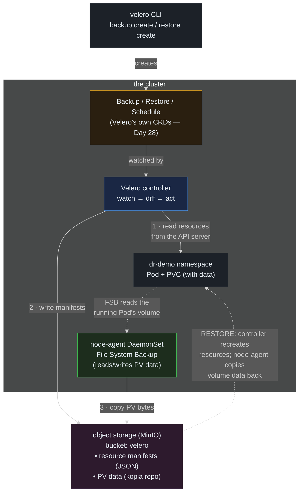

> **30 Days of DevOps** — Day 29 of 30. [← Day 28: CRDs and the Operator Pattern](/articles/2026/06/14/day-28-crds-operators/)

Twenty-eight days in, you have a platform worth losing sleep over. A Postgres
StatefulSet with real data on a PersistentVolume (Day 17). GitOps applications whose
desired state lives in Git (Day 10) — but whose *runtime* state, the actual running
objects, lives only in the cluster. Sealed Secrets, certs, ConfigMaps, a fleet of
operators. And exactly one safety net for any of it: the nightly `pg_dump` CronJob
from Day 19, which protects the *database's logical data* and nothing else.

Ask the question every platform must answer and most cannot: **what happens when a
namespace is fat-fingered into oblivion, or the whole cluster is gone?** Git brings
back your *manifests*. It does not bring back the PersistentVolume's bytes, the
objects that drifted from Git, the resources no chart owns, or the order to
reconstruct them in. A cluster is not just its YAML — it is YAML *plus state*, and
disaster recovery means capturing both.

**Velero** is the standard tool for this. It backs up two things that Git and
`pg_dump` miss together: the **Kubernetes resources** themselves (every object in a
namespace — Deployments, Services, PVCs, ConfigMaps, the lot — pulled straight from
the API server and written to object storage) and the **PersistentVolume data**
(the actual filesystem contents behind your PVCs). Then it restores them — recreating
the objects *and* copying the volume bytes back — so a deleted namespace, or a
rebuilt cluster, comes back whole.

Today you will install Velero against in-cluster object storage (MinIO, since kind
has no cloud bucket), back up a small stateful app's namespace **including its
volume data**, then commit the disaster — delete the namespace entirely — and
**restore it from the backup**, watching the Pod, the PVC, and the original data
return. You will schedule recurring backups, see that Velero is itself driven by
**CRDs and controllers** (the Day 28 pattern, now load-bearing), and finish on the
discipline that outlives any tool: **infrastructure backup versus application backup
— you need both**, what `RPO` and `RTO` actually commit you to, and the single most
important DR fact, which is that *a backup you have never restored is not a backup.*

## What you will build

By the end of this article you will have:

- **MinIO** running in-cluster as S3-compatible object storage, and **Velero**
  installed against it — server, the AWS plugin, and the **node-agent** DaemonSet
  that does **File System Backup** (the only way to capture volume data on kind,
  which has no CSI snapshot support)
- A self-contained `dr-demo` namespace with a Pod that writes a **known marker** to a
  PersistentVolume — your proof that *data*, not just *resources*, survives
- A **backup** of that namespace (`velero backup create`), with the resources and the
  PV contents both landed in MinIO, inspected via `velero backup describe --details`
- The **disaster and the recovery**: `kubectl delete namespace dr-demo`, confirm it
  is gone, then `velero restore create --from-backup` — and watch the namespace, the
  PVC, the Pod, and the **original marker file** all come back
- A **scheduled** daily backup (`velero schedule create`), the realisation that
  `Backup`, `Restore`, and `Schedule` are **Velero's own CRDs** reconciled by its
  controller (Day 28), and a clear-eyed DR framework: Velero (infra) **and** the Day
  19 `pg_dump` (app) together, `RPO`/`RTO`, and *test your restores*

---

## How Velero backs up and restores

Velero is, by now, unsurprising: a controller watching CRDs, plus a per-node agent
for the part the API can't reach.



**Reading this diagram:**

The flow begins with the **velero CLI** (grey, top), but the CLI does almost nothing
itself — it creates a **`Backup` (or `Restore`, or `Schedule`) custom resource**
(amber). That is the Day 28 pattern, and it is not a coincidence: Velero is an
operator. Those CRs are watched by the **Velero controller** (blue), which runs the
familiar watch-diff-act loop against them.

On a **backup**, the controller does two things, marked ① and ②. First (①) it reads
the targeted namespace's resources straight from the **API server** — every object in
`dr-demo`, serialized as JSON. Second (②) it writes those manifests to **object
storage** (purple — MinIO here, an S3 bucket in the cloud). That covers the *objects*.
But the controller cannot read the *contents* of a PersistentVolume through the API —
the API has no "give me the bytes on this disk" call. That is the **node-agent**'s
job (green, ③): a DaemonSet with a Pod on every node that can read the filesystem
behind a PVC directly (the dotted arrow: it reads the *running* Pod's volume from the
node), and copies those bytes into the same object store as a deduplicated **kopia**
repository. Resources via the API, data via the node-agent — two halves, because a
cluster is two things.

The dotted purple arrow back to the namespace is the whole point: **restore**. From
the object store, the controller recreates the resources (the Pod, the PVC, the
ConfigMaps) and the node-agent copies the volume data back into the new PVC before
the Pod starts — so what comes back is not an empty shell of the right shape, but the
namespace *with its data*. On kind specifically, that volume half **requires** the
node-agent and File System Backup, because kind's `local-path` storage has no
snapshot capability — there is no disk-level snapshot to take, so Velero reads the
files instead.

The insight worth carrying: Git versions your *intent*, Velero captures your
*running reality*. They are different backups of different things, and a serious
platform keeps both.

---

## Prerequisites

This article continues from Day 28. Required state:

- The `devops-cluster` kind cluster; kubectl 1.29+; Helm not required
- **Outbound internet** to pull the Velero CLI, the Velero/MinIO images, and the AWS
  plugin
- Everything today is **self-contained** — MinIO and Velero install into a `velero`
  namespace, the demo into a fresh `dr-demo` namespace. **Your existing workloads
  (the Day 17 Postgres, the webapp) are never touched.**

Pre-flight check:

```bash
# kind's storage class — note local-path has NO snapshot support, which is
# exactly why today uses File System Backup (node-agent), not CSI snapshots.
kubectl get storageclass
```

Expected output:

```text
NAME                 PROVISIONER             RECLAIMPOLICY   VOLUMEBINDINGMODE      ALLOWVOLUMEEXPANSION   AGE
standard (default)   rancher.io/local-path   Delete          WaitForFirstConsumer   false                  4w
```

| Tool | Minimum version | Check |
|---|---|---|
| kubectl | 1.29 | `kubectl version --client` |
| Velero CLI | 1.14 | `velero version --client-only` (installed in Part 1) |

---

## Part 1 — Object storage and Velero

Velero stores backups in an S3-compatible bucket. On a cloud cluster that is a real
S3/GCS/Azure bucket; on kind we run **MinIO** in-cluster to play the role.

### 1.1 — MinIO (the bucket)

```bash
mkdir -p ~/30-days-devops/day-29 && cd ~/30-days-devops/day-29

kubectl create namespace velero

# MinIO: S3-compatible object storage. emptyDir backing is fine for a demo
# (the backup store is itself ephemeral here — in production this is a real
# cloud bucket, never a Pod). Keep this Pod running through the whole
# backup→restore cycle below; if it restarts, the emptyDir (and your backups)
# are gone. Root creds are minio / minio12345.
#
# Image tags are :latest here for simplicity; in production pin every image
# and chart to a known version (as the rest of this series does).
cat > minio.yaml << 'EOF'
apiVersion: apps/v1
kind: Deployment
metadata:
  name: minio
  namespace: velero
spec:
  selector:
    matchLabels: { app: minio }
  template:
    metadata:
      labels: { app: minio }
    spec:
      containers:
        - name: minio
          image: quay.io/minio/minio:latest
          args: ["server", "/data", "--console-address", ":9001"]
          env:
            - { name: MINIO_ROOT_USER, value: minio }
            - { name: MINIO_ROOT_PASSWORD, value: minio12345 }
          ports:
            - { containerPort: 9000 }
            - { containerPort: 9001 }
          volumeMounts:
            - { name: data, mountPath: /data }
      volumes:
        - name: data
          emptyDir: {}
---
apiVersion: v1
kind: Service
metadata:
  name: minio
  namespace: velero
spec:
  selector: { app: minio }
  ports:
    - { name: api, port: 9000, targetPort: 9000 }
EOF

kubectl apply -f minio.yaml
kubectl wait --for=condition=available deployment/minio -n velero --timeout=120s

# create the 'velero' bucket with the mc client, as a one-shot Job
kubectl run mc-setup -n velero --rm -i --restart=Never --image=minio/mc:latest -- \
  sh -c "mc alias set m http://minio.velero.svc:9000 minio minio12345 && mc mb -p m/velero && echo bucket-ready"
```

Expected output:

```text
namespace/velero created
deployment.apps/minio created
service/minio created
deployment.apps/minio condition met
...
Bucket created successfully `m/velero`.
bucket-ready
pod "mc-setup" deleted
```

### 1.2 — Install the Velero CLI

```bash
# macOS:  brew install velero
# Linux:  download the matching release tarball and put `velero` on your PATH:
VELERO_VERSION=v1.14.1
curl -sL "https://github.com/vmware-tanzu/velero/releases/download/${VELERO_VERSION}/velero-${VELERO_VERSION}-linux-amd64.tar.gz" \
  | tar xz
sudo install velero-${VELERO_VERSION}-linux-amd64/velero /usr/local/bin/velero

velero version --client-only
```

Expected output:

```text
Client:
	Version: v1.14.1
```

### 1.3 — Install Velero into the cluster

Velero needs the MinIO credentials and an install command that points at the
in-cluster bucket, enables the **node-agent** for File System Backup, and turns
**off** volume snapshots (kind's `local-path` cannot snapshot):

```bash
# the credentials Velero uses to reach MinIO
cat > minio-creds << 'EOF'
[default]
aws_access_key_id=minio
aws_secret_access_key=minio12345
EOF

velero install \
  --provider aws \
  --plugins velero/velero-plugin-for-aws:v1.10.1 \
  --bucket velero \
  --secret-file ./minio-creds \
  --use-volume-snapshots=false \
  --use-node-agent \
  --default-volumes-to-fs-backup \
  --backup-location-config region=minio,s3ForcePathStyle="true",s3Url=http://minio.velero.svc:9000
```

Expected output (abbreviated — many resources created):

```text
...
Velero is installed! ⛵ Use 'kubectl logs deployment/velero -n velero' to view the status.
```

Wait for Velero and its node-agent to be ready, and confirm the backup location is
reachable:

```bash
kubectl wait --for=condition=available deployment/velero -n velero --timeout=120s
kubectl rollout status daemonset/node-agent -n velero --timeout=120s
velero backup-location get
```

Expected output:

```text
deployment.apps/velero condition met
daemon set "node-agent" successfully rolled out

NAME      PROVIDER   BUCKET/PREFIX   PHASE       LAST VALIDATED   ACCESS MODE   DEFAULT
default   aws        velero          Available   ...              ReadWrite     true
```

`PHASE: Available` means Velero successfully talked to MinIO — the backup store is
live. (`--default-volumes-to-fs-backup` makes every PVC get File System Backup
automatically, so you do not have to annotate Pods.)

---

## Part 2 — A stateful app, and a backup that includes its data

The whole test is whether *data* survives, so the demo app writes something only the
PersistentVolume could preserve: a marker file stamped once, at first start.

```bash
cat > dr-demo.yaml << 'EOF'
apiVersion: v1
kind: Namespace
metadata:
  name: dr-demo
---
apiVersion: v1
kind: PersistentVolumeClaim
metadata:
  name: keeper-data
  namespace: dr-demo
spec:
  accessModes: [ReadWriteOnce]
  resources:
    requests:
      storage: 128Mi
---
apiVersion: apps/v1
kind: Deployment
metadata:
  name: keeper
  namespace: dr-demo
spec:
  replicas: 1
  selector:
    matchLabels: { app: keeper }
  template:
    metadata:
      labels: { app: keeper }
    spec:
      containers:
        - name: keeper
          image: busybox:1.36
          # write a marker ONCE (first boot); then idle. The marker is the
          # proof — if it survives delete+restore, the VOLUME DATA came back,
          # not just an empty PVC of the right shape.
          command:
            - sh
            - -c
            - |
              [ -f /data/created-at ] || date -u +%FT%TZ > /data/created-at
              echo "marker: $(cat /data/created-at)"
              sleep 86400
          volumeMounts:
            - { name: data, mountPath: /data }
      volumes:
        - name: data
          persistentVolumeClaim:
            claimName: keeper-data
EOF

kubectl apply -f dr-demo.yaml
kubectl rollout status deployment/keeper -n dr-demo --timeout=120s

# capture the ORIGINAL marker — this exact value must survive the disaster
ORIGINAL=$(kubectl exec -n dr-demo deploy/keeper -- cat /data/created-at)
echo "original marker: $ORIGINAL"
```

Expected output:

```text
namespace/dr-demo created
persistentvolumeclaim/keeper-data created
deployment.apps/keeper created
deployment "keeper" successfully rolled out
original marker: 2026-06-14T15:20:31Z
```

Back up the whole namespace — resources *and* volume data — and wait for it:

```bash
velero backup create dr-demo-backup --include-namespaces dr-demo --wait
```

Expected output:

```text
Backup request "dr-demo-backup" submitted successfully.
Waiting for backup to complete...
.....
Backup completed with status: Completed. ... errors: 0
```

Inspect what landed — note the **File System Backups** line proving the PVC's data
was captured, not just its definition:

```bash
velero backup describe dr-demo-backup --details | grep -A4 -iE 'Phase|Namespaces|Resource List|File System Backups'
```

Expected output (abbreviated):

```text
Phase:  Completed
Namespaces:
  Included:  dr-demo
...
File System Backups:
  Completed:
    dr-demo/keeper-...: data
```

`File System Backups → Completed → dr-demo/keeper-...: data` is the line that matters:
the node-agent copied the `data` volume's bytes into MinIO. A backup without this
line would restore an empty PVC — the resource without the reality.

---

## Part 3 — The disaster, and the restore

Now cause the incident every runbook dreads — delete the entire namespace, app, PVC,
data and all:

```bash
kubectl delete namespace dr-demo
kubectl get namespace dr-demo 2>&1
```

Expected output:

```text
namespace "dr-demo" deleted
Error from server (NotFound): namespaces "dr-demo" not found
```

Gone. The Deployment, the PVC, the PersistentVolume, and the marker file are all
destroyed. Recover it from the backup:

```bash
velero restore create --from-backup dr-demo-backup --wait
```

Expected output:

```text
Restore request "dr-demo-backup-20260614152500" submitted successfully.
Waiting for restore to complete...
.....
Restore completed with status: Completed. ... errors: 0
```

Watch the namespace rebuild itself — and then the moment of truth, the marker:

```bash
kubectl rollout status deployment/keeper -n dr-demo --timeout=120s
RESTORED=$(kubectl exec -n dr-demo deploy/keeper -- cat /data/created-at)
echo "original marker: $ORIGINAL"
echo "restored marker: $RESTORED"
[ "$ORIGINAL" = "$RESTORED" ] && echo "✅ DATA SURVIVED" || echo "❌ only the resource came back"
```

Expected output:

```text
deployment "keeper" successfully rolled out
original marker: 2026-06-14T15:20:31Z
restored marker: 2026-06-14T15:20:31Z
✅ DATA SURVIVED
```

**Identical markers.** The restored Pod is reading the *same* `created-at` value the
original wrote — which is only possible if the PersistentVolume's bytes were restored,
not just a fresh empty PVC created. (Had File System Backup been off, the marker
would be a *new* timestamp, because the container's `[ -f /data/created-at ]` check
would have found an empty volume and re-stamped it — the tell-tale sign of "resources
restored, data lost.") This is the difference between a backup tool and a *disaster
recovery* tool: not "the right objects exist again" but "the system is as it was."

---

## Part 4 — Schedules, and the DR discipline

A one-off backup is a demo; real DR is *automatic and recurring*. Velero schedules
are a CRD-driven cron:

```bash
# a daily backup of dr-demo at 02:00, keeping each for 7 days (TTL 168h)
velero schedule create dr-demo-daily \
  --schedule="0 2 * * *" \
  --include-namespaces dr-demo \
  --ttl 168h0m0s

velero schedule get
```

Expected output:

```text
Schedule "dr-demo-daily" created successfully.

NAME            STATUS    CREATED   SCHEDULE    BACKUP TTL   LAST BACKUP   SELECTOR   PAUSED
dr-demo-daily   Enabled   ...       0 2 * * *   168h0m0s    n/a           <none>     false
```

And here is the Day 28 payoff: **everything Velero does is CRDs and controllers.**
Your backup, your restore, your schedule are all custom resources in the `velero`
namespace, reconciled by Velero's controller exactly like the `Greeting` you built
yesterday:

```bash
kubectl get backups,restores,schedules -n velero
kubectl api-resources --api-group=velero.io
```

Expected output (abbreviated):

```text
NAME                              STATUS      ...
backup.velero.io/dr-demo-backup   Completed
...
NAME            SHORTNAMES   APIVERSION         NAMESPACED   KIND
backups                      velero.io/v1       true         Backup
restores                     velero.io/v1       true         Restore
schedules                    velero.io/v1       true         Schedule
backupstoragelocations       velero.io/v1       true         BackupStorageLocation
...
```

Velero is an operator (Day 28); a `Backup` object is a noun, the Velero controller is
the verb. You can read, `kubectl get`, and RBAC them like anything else.

But the tool is the easy part. The discipline is what saves you, and four facts
matter more than any `velero` flag:

- **Infrastructure backup ≠ application backup; you want both.** Velero captures the
  cluster's *objects and volumes* — excellent for "the namespace is gone" or "rebuild
  the cluster." The Day 19 `pg_dump` captures the database's *logical contents* —
  excellent for "someone ran `DROP TABLE`" or "restore one table" or "move to a new
  Postgres version." A volume-level restore of a database mid-write can even be
  *inconsistent*; a logical dump is always consistent. Real platforms run **both**:
  Velero for infra-level DR, `pg_dump`/`pg_basebackup` for the database.
- **RPO — Recovery Point Objective — is how much data you can afford to lose.** A
  daily backup means up to 24 hours of data can vanish in a disaster. If that is
  unacceptable, back up hourly, or stream WAL. RPO is a *business* decision that sets
  your backup *frequency*.
- **RTO — Recovery Time Objective — is how long recovery may take.** A backup in cold
  object storage that takes two hours to restore fails a 15-minute RTO. RTO sets your
  *restore strategy* (warm standby vs cold backup).
- **A backup you have never restored is not a backup.** The single most common DR
  failure is discovering, *during* the disaster, that the backups were corrupt,
  incomplete (no `--default-volumes-to-fs-backup`, so no data), or unrestorable.
  Part 3 was not a demo — it was the *only* test that proves the backup works.
  Schedule restore drills like you schedule the backups.

Tear down the lab (this removes the demo and Velero/MinIO; your real workloads are
untouched):

```bash
velero schedule delete dr-demo-daily --confirm
kubectl delete namespace dr-demo
velero uninstall --force
kubectl delete namespace velero
```

---

## Common Errors

**1. Backup completes but `File System Backups` is empty — data is not backed up**

`velero backup describe --details` shows `Phase: Completed` but no `File System
Backups` section. The volumes were skipped, so a restore brings back empty PVCs.

Cause: the node-agent is not enabled, or volumes are not opted into FSB. Fix:

```bash
kubectl get daemonset node-agent -n velero      # must exist and be Ready
```

Reinstall with `--use-node-agent --default-volumes-to-fs-backup`, or annotate the
Pod explicitly: `backup.velero.io/backup-volumes: data`. Without the node-agent,
Velero on kind backs up *objects only*.

**2. `backup-location get` shows `PHASE: Unavailable`**

Velero cannot reach the object store. On kind+MinIO the usual causes are a wrong
`s3Url` (must be the in-cluster Service DNS, `http://minio.velero.svc:9000`), a
missing `s3ForcePathStyle=true` (MinIO needs path-style, not virtual-host-style URLs),
or wrong credentials in the secret file.

Fix:

```bash
kubectl logs deployment/velero -n velero | grep -i 'backupstoragelocation\|error' | tail
```

Re-check the `--backup-location-config` and that the `velero` bucket actually exists
in MinIO (`mc ls m/`).

**3. Restore says `Completed` but the Pod is stuck `Pending` / PVC unbound**

The resources restored but the new PVC will not bind. On kind this is usually the
`WaitForFirstConsumer` binding mode (Day 17) — the PV is not provisioned until the
Pod schedules — which is normal and resolves on its own. If it persists, the original
PVC referenced a `storageClassName` that does not exist on the restore-target cluster.

Fix: confirm the storage class exists; for cross-cluster restores use Velero's
`--namespace-mappings` / storage-class remapping, or restore into a cluster with the
same default class.

**4. `velero backup create` hangs in `InProgress` forever**

Often the node-agent cannot read a volume (FSB requires the source Pod to be
**Running** — a Pod in `CrashLoopBackOff` or `Completed` may not be FSB-backable), or
the object store is unreachable mid-backup.

Fix: ensure the workload is Running during the backup window; check
`kubectl logs daemonset/node-agent -n velero` for kopia errors; for very large
volumes, raise the node-agent resource limits.

**5. Restored resources conflict with what is already there**

Restoring into a cluster where the namespace still exists can collide — by default
Velero skips resources that already exist (it does not overwrite). People expect a
restore to *replace* and are surprised it *merges*.

Fix: for a clean recovery, restore into an **empty** namespace (delete first, as Part
3 did) or use `--existing-resource-policy=update` deliberately. Never assume restore
== overwrite.

**6. The backup includes Secrets in plaintext object storage**

Velero backs up `Secret` objects as-is into the bucket. If that bucket is not
encrypted and access-controlled, your Day 11 credentials are now sitting in object
storage in base64 (which is *not* encryption).

Fix: enable bucket encryption (SSE) and tight IAM on the real backup bucket; consider
excluding Secrets you can reconstruct (`--exclude-resources=secrets`) when they are
already in Git as SealedSecrets (Day 11) — the SealedSecret restores, the controller
re-derives the Secret, and the plaintext never enters the backup.

---

## Recap

In this article you:

- Closed the gap Git and `pg_dump` leave open: a cluster is **objects plus state**,
  and disaster recovery means capturing both — the **Kubernetes resources** (via the
  API) and the **PersistentVolume data** (the actual bytes)
- Installed **MinIO** as in-cluster S3 storage and **Velero** against it, with the
  **node-agent** DaemonSet for **File System Backup** — the only way to capture volume
  data on kind, whose `local-path` storage has no CSI snapshot support
- Backed up a `dr-demo` namespace **including its volume**, and confirmed from
  `velero backup describe --details` that the `File System Backups` actually ran — the
  line separating "the objects were saved" from "the data was saved"
- Ran the only test that matters: **deleted the namespace entirely and restored it**,
  proving with an identical marker file that the *data* came back, not just an empty
  PVC of the right shape
- Scheduled a recurring backup and confirmed the Day 28 pattern is everywhere —
  Velero's `Backup`, `Restore`, and `Schedule` are **CRDs reconciled by a controller**;
  Velero is just another operator
- Internalised the DR discipline that outlives the tool: **infra backup (Velero) and
  app backup (`pg_dump`) are different and you need both**, `RPO` sets backup
  *frequency*, `RTO` sets restore *strategy*, and a backup you have never restored is
  not a backup
- Catalogued six failure modes, from the silent empty-`File System Backups` (object
  backed up, data lost) to Secrets sitting in plaintext object storage

Your platform now has a real safety net under it — not just versioned intent in Git,
but recoverable running state. Tomorrow, the series ends where every production
journey should: putting it all together into a production-readiness review.

---

## What's next

[Day 30: Production Readiness — The Capstone Checklist →](/articles/2026/06/14/day-30-production-readiness-capstone/)

Thirty days ago this was an empty laptop; now it is a cluster running a hardened,
autoscaling, GitOps-managed, observable, backed-up platform — and every piece was
built one day at a time. On the final day you will step back and tie it together into
the thing every team actually needs: a **production-readiness checklist**. You will
walk the whole stack — images and supply chain (Days 2–4), the cluster and Helm
(Days 5–7), observability (Days 8–9), GitOps and secrets (Days 10–11), autoscaling
and security policy (Days 12–16), state and scheduling (Days 17–22), debugging and
configuration (Days 23–26), delivery, extensibility, and disaster recovery (Days
27–29) — and turn each into a concrete *go/no-go* question you can ask of any service
before it ships. The capstone is not new tools; it is the judgment to know your
platform is *ready* — and the map of where to go next.
