> **30 Days of DevOps** — Day 30 of 30. [← Day 29: Backup and Disaster Recovery](/articles/2026/06/14/day-29-backup-disaster-recovery/)

Thirty days ago, Day 1 opened on an empty laptop and a Git branching strategy. Since
then you have built, one project a day, a platform that would not embarrass a small
production team: multi-stage hardened images gated by a CI pipeline that tests,
scans, and pushes them (Days 2–4); a Kubernetes cluster running your app as a Helm
chart behind TLS ingress (Days 5–7); Prometheus, Grafana, and Loki watching it
(Days 8–9); Argo CD driving the whole thing from Git with secrets safely committed
as SealedSecrets (Days 10–11); autoscaling, least-privilege RBAC, Pod Security
Standards, quotas, and disruption budgets (Days 12–16); a stateful database, ordered
init and sidecars, batch jobs, node agents, and careful scheduling (Days 17–22);
debugging the hardened, externalized configuration, right-sized resources (Days
23–26); sequenced releases, your own operator, and tested backups (Days 27–29).

Every one of those days worked *on your cluster*. But "it works on my cluster" is not
"this is production-ready," and the gap between them is where outages live. Production
readiness is not a tool you install — it is a **set of questions you can answer**
about a service, layer by layer, before it ships. Most of those questions have an
answer in one of the previous 29 days; a few expose gaps this series deliberately
left for you to close.

The final day introduces nothing new. It does something more useful: it turns the
whole journey into a **checklist** — a sequence of concrete *go/no-go* questions you
can ask of any service on any cluster — and gives you a **self-audit script** that
inspects your own cluster and flags where it falls short. Then it draws the honest
map of what is *beyond* these thirty days, so you know where you are and where to go.

## What this day is

Not a lab with a single deliverable, but three things:

- A **production-readiness checklist** organized into eight domains — supply chain,
  packaging, traffic, observability, delivery, security, resources, and resilience —
  each item a yes/no question tied to the day that taught it, so a "no" comes with a
  page number
- A **self-audit script** you run against your cluster that surfaces the most common
  gaps automatically: workloads without resource requests, BestEffort Pods,
  multi-replica Deployments with no PodDisruptionBudget, containers without probes,
  namespaces without quotas, Pods still using the default ServiceAccount token
- An honest **"where to go from here"** — the things a real production platform needs
  that thirty days could not cover (SLOs and alerting, progressive delivery, policy
  as code, multi-cluster, supply-chain signing, FinOps), and which to reach for first

---

## The readiness map

Everything you built stacks into layers, and production readiness is a checkpoint at
each one. A request flows down the left; an incident climbs back up the right.

```mermaid
%%{init: {'theme': 'dark'}}%%
flowchart TB
    subgraph L1 ["① Supply chain — Days 1–4"]
        A["reproducible builds · multi-stage images · scanned + minimal · CI gates the artifact"]:::sc
    end
    subgraph L2 ["② Packaging & traffic — Days 5–7"]
        B["Helm chart · per-env values · Ingress + TLS · no NodePort hacks"]:::pkg
    end
    subgraph L3 ["③ Observability — Days 8–9"]
        C["metrics scraped · logs centralised · (gap: SLOs + alerting)"]:::obs
    end
    subgraph L4 ["④ Delivery — Days 10–11, 27"]
        D["GitOps + self-heal · secrets encrypted in Git · sequenced releases · smoke tests"]:::del
    end
    subgraph L5 ["⑤ Security — Days 13–14, 23"]
        E["least-privilege RBAC · no auto-mounted tokens · PSS restricted · debuggable when locked down"]:::sec
    end
    subgraph L6 ["⑥ Resources & scaling — Days 12, 15, 25–26"]
        F["requests==reality · QoS understood · HPA out · VPA up · quotas + limits"]:::res
    end
    subgraph L7 ["⑦ Scheduling & state — Days 16–22"]
        G["topology spread · PDBs · priority classes · stable storage · ≥2 replicas for the critical path"]:::sch
    end
    subgraph L8 ["⑧ Resilience — Days 28–29"]
        H["operators understood · backups taken · restores TESTED · RPO/RTO agreed"]:::rsl
    end

    L1 --> L2 --> L3 --> L4 --> L5 --> L6 --> L7 --> L8
    L8 -.->|"go / no-go before shipping"| GO["Production"]:::go

    classDef sc fill:#1c2128,stroke:#30363d,color:#e6edf3
    classDef pkg fill:#1a2744,stroke:#58a6ff,color:#e6edf3
    classDef obs fill:#2a1f10,stroke:#d29922,color:#e6edf3
    classDef del fill:#1d2d1d,stroke:#3fb950,color:#e6edf3
    classDef sec fill:#2d1a1a,stroke:#f85149,color:#e6edf3
    classDef res fill:#2d1a2d,stroke:#bc8cff,color:#e6edf3
    classDef sch fill:#1a2744,stroke:#58a6ff,color:#e6edf3
    classDef rsl fill:#1d2d1d,stroke:#3fb950,color:#e6edf3
    classDef go fill:#1d2d1d,stroke:#3fb950,color:#e6edf3
```



**Reading this diagram:**

Read top to bottom — these are the eight layers every workload passes through on its
way to production, and the day-ranges that built each one. They are ordered the way a
service is actually constructed: you cannot meaningfully secure (⑤) a workload you
have not packaged (②), and you cannot right-size resources (⑥) without the metrics
from observability (③). Each layer is a **checkpoint**, not a suggestion — a "no" at
any layer is a known way the service breaks in production.

Two layers carry a deliberate **gap** in amber and elsewhere, because thirty days of
*building* leaves some *operating* concerns only sketched. Observability (③) got you
metrics and logs but stopped short of **SLOs and alerting** — you can see the system,
but nothing pages you when it breaks. That, and a handful of others, are the
"where to go from here" at the end. The honesty matters: a readiness checklist that
pretends you are done is worse than useless.

The dotted arrow at the bottom is the whole point of the exercise: **go / no-go**. By
the time a service reaches the bottom of this stack, every checkpoint above it should
be a deliberate *yes* — or a deliberate, documented *accepted risk*. The checklist
below turns each layer into the specific questions to ask.

---

## The checklist

Each item is a question. If the answer is *no* and you cannot name why that risk is
acceptable for this service, it is a gap. The day reference is where to go fix it.

### ① Supply chain (Days 1–4)
- [ ] The image builds **reproducibly** from source in CI — not from a developer
  laptop (Day 4).
- [ ] It is a **multi-stage** build: the runtime image carries the app and nothing
  else — no compilers, no build tools (Day 2).
- [ ] The base image is **pinned** (a digest or specific tag, never `:latest`) and
  **minimal** (alpine/distroless), and the image is **scanned** for CVEs in CI (Days
  2, 4).
- [ ] CI **gates** the artifact: tests, scan, and push are a pipeline that fails
  closed; a red build cannot ship (Day 4).
- [ ] **No secrets are baked into the image** (Day 4) — they arrive at runtime.

### ② Packaging & traffic (Days 5–7)
- [ ] The app is a **Helm chart**, not hand-applied YAML, with **per-environment
  values** (Day 6).
- [ ] Every container declares **readiness and liveness probes** (Day 5) — and they
  are *different* (readiness gates traffic, liveness restarts).
- [ ] Traffic enters through an **Ingress with TLS**, not a `NodePort` or
  `port-forward` (Day 7); certificates are **automatically issued and renewed**
  (cert-manager, Day 7).

### ③ Observability (Days 8–9)
- [ ] Every service **exposes metrics** that Prometheus scrapes (Day 8).
- [ ] Logs are **centralised** and queryable, not trapped in `kubectl logs` (Day 9).
- [ ] **(Gap — close this):** you have **SLOs** (latency, error rate, availability)
  and **alerts** that page a human when they are breached. This series gave you the
  data plane; the alerting layer is the first thing to add next.

### ④ Delivery (Days 10–11, 27)
- [ ] The cluster is **driven from Git** by Argo CD with **self-heal** — manual
  `kubectl` changes are drift that gets reverted (Day 10).
- [ ] **No plaintext secrets** live in Git; secrets are committed as **SealedSecrets**
  (Day 11) or pulled from a secrets manager.
- [ ] Releases that need **ordering** (migrations before new code) use **hooks** or
  sync waves, and a **smoke test** (`helm test`/CI) proves the deploy works before it
  is declared green (Day 27).

### ⑤ Security (Days 13–14, 23)
- [ ] Workloads run under a **dedicated ServiceAccount** with a **least-privilege
  Role**, not the `default` SA, and `automountServiceAccountToken: false` unless the
  Pod actually calls the API (Day 13).
- [ ] The namespace enforces **Pod Security Standards `restricted`**: non-root,
  no privilege escalation, dropped capabilities, read-only root filesystem, seccomp
  (Day 14).
- [ ] You can still **debug** the hardened workload — `kubectl debug` with a
  `--profile`, ephemeral containers — without weakening it (Day 23).

### ⑥ Resources & scaling (Days 12, 15, 25–26)
- [ ] Every container sets **`resources.requests`** that reflect *real* usage — verified
  against metrics or VPA, not guessed (Days 25–26).
- [ ] You know each workload's **QoS class** and it is deliberate: critical, stateful
  workloads are **Guaranteed** or high-request **Burstable**; nothing important is
  **BestEffort** (Day 25).
- [ ] Workloads that should scale have an **HPA** on a meaningful metric, and the HPA
  and any **VPA** never both act on CPU (Days 12, 26).
- [ ] Each namespace has a **ResourceQuota** and a **LimitRange** so one workload
  cannot starve the rest (Day 15).

### ⑦ Scheduling & state (Days 16–22)
- [ ] Every workload on the critical path runs **≥2 replicas**, **spread across
  nodes** (`topologySpreadConstraints`), so one node failure is not an outage (Day
  21).
- [ ] Every multi-replica workload has a **PodDisruptionBudget** so a drain or
  autoscaler cannot take it to zero (Day 16).
- [ ] Stateful workloads use **StatefulSets** with stable storage, never a Deployment
  with a shared volume (Day 17).
- [ ] **PriorityClasses** are assigned so the cluster sheds the right things first
  under pressure (Day 22).

### ⑧ Resilience (Days 28–29)
- [ ] There are **backups** of both **resources and volume data** (Velero), and the
  **logical app data** (`pg_dump`) — both, not either (Days 19, 29).
- [ ] You have **actually run a restore** and it worked. An untested backup is not a
  backup (Day 29).
- [ ] **RPO and RTO are agreed with the business** and your backup frequency and
  restore strategy match them (Day 29).

---

## The self-audit: find your gaps automatically

A checklist is only as good as your honesty about it — so let the cluster tell you.
This script surfaces the six most common readiness gaps across whatever namespaces
you point it at. Run it against `default` (the webapp's namespace):

```bash
NS=default

echo "=== ① Deployments/StatefulSets with a container missing resources.requests ==="
kubectl get deploy,statefulset -n "$NS" -o json \
  | jq -r '.items[] | select(any(.spec.template.spec.containers[]; .resources.requests == null))
           | "  ⚠ \(.kind)/\(.metadata.name): a container has no requests"' 2>/dev/null \
  | grep . || echo "  ✅ all set requests"

echo "=== ② BestEffort Pods (no requests/limits anywhere) ==="
kubectl get pods -n "$NS" -o json \
  | jq -r '.items[] | select(.status.qosClass=="BestEffort") | "  ⚠ \(.metadata.name) is BestEffort"' 2>/dev/null \
  | grep . || echo "  ✅ none BestEffort"

echo "=== ③ Multi-replica Deployments but NO PodDisruptionBudget in the namespace ==="
multi=$(kubectl get deploy -n "$NS" -o json \
  | jq -r '[.items[] | select((.spec.replicas // 1) > 1) | .metadata.name] | join(", ")')
pdbcount=$(kubectl get pdb -n "$NS" --no-headers 2>/dev/null | grep -c . || true)
if [ -n "$multi" ] && [ "${pdbcount:-0}" -eq 0 ]; then
  echo "  ⚠ multi-replica deploys ($multi) but NO PDB in $NS"
else
  echo "  ✅ a PDB exists, or no multi-replica deploys"
fi

echo "=== ④ Containers without a readiness probe ==="
kubectl get pods -n "$NS" -o json \
  | jq -r '.items[] | .metadata.name as $n | .spec.containers[]
           | select(.readinessProbe == null) | "  ⚠ \($n)/\(.name): no readinessProbe"' 2>/dev/null \
  | grep . || echo "  ✅ all containers have readiness probes"

echo "=== ⑤ Namespace missing a ResourceQuota ==="
kubectl get resourcequota -n "$NS" --no-headers 2>/dev/null | grep -q . \
  && echo "  ✅ ResourceQuota present" || echo "  ⚠ no ResourceQuota in $NS"

echo "=== ⑥ Pods still mounting the default ServiceAccount token ==="
kubectl get pods -n "$NS" -o json \
  | jq -r '.items[] | select((.spec.serviceAccountName // "default")=="default" and (.spec.automountServiceAccountToken // true))
           | "  ⚠ \(.metadata.name): default SA with an auto-mounted token"' 2>/dev/null \
  | grep . || echo "  ✅ no default-SA token mounts"
```

Expected output (your webapp namespace, after thirty days of hardening — mostly
green, with the honest gaps showing):

```text
=== ① Deployments/StatefulSets with a container missing resources.requests ===
  ✅ all set requests
=== ② BestEffort Pods (no requests/limits anywhere) ===
  ✅ none BestEffort
=== ③ Multi-replica Deployments but NO PodDisruptionBudget in the namespace ===
  ✅ a PDB exists, or no multi-replica deploys
=== ④ Containers without a readiness probe ===
  ✅ all containers have readiness probes
=== ⑤ Namespace missing a ResourceQuota ===
  ✅ ResourceQuota present
=== ⑥ Pods still mounting the default ServiceAccount token ===
  ✅ no default-SA token mounts
```

(This needs `jq` — `brew install jq` / `apt install jq`. It is a starting point, not
a substitute for a real policy engine; the "where to go" section names those.) Point
it at other namespaces — `monitoring`, `database`, `kube-system` — and you will find
*amber*, because not everything needs every guardrail. That is the skill the whole
series was teaching: not "turn everything on," but **knowing which guardrail each
workload needs, and why.**

---

## Where to go from here

Thirty days is enough to build a real platform and dangerous enough to think it is
finished. It is not. The honest map of what is *beyond* this series, roughly in the
order most teams need it:

- **SLOs and alerting.** You have metrics (Day 8); you do not have a pager. Define
  Service Level Objectives (latency, error rate, availability), wire **Alertmanager**
  and on-call, and adopt **error budgets**. This is the single biggest gap, and the
  first thing to close.
- **Progressive delivery.** Day 27 deploys all-or-nothing. **Argo Rollouts** or
  **Flagger** add canary and blue-green deploys — ship to 5% of traffic, watch the
  metrics, automatically roll back on a bad signal.
- **Policy as code.** The Day 30 audit script is a toy; **Kyverno** or **OPA
  Gatekeeper** enforce the checklist at admission, cluster-wide — *reject* a Pod with
  no requests instead of *reporting* it afterward.
- **Supply-chain security.** Day 4 scans images; production also **signs** them
  (**cosign**/Sigstore), generates an **SBOM**, and enforces "only signed images run
  here" with admission policy.
- **Network policy & mesh.** This series deliberately skipped NetworkPolicy (kind's
  CNI does not enforce it). A real cluster locks east-west traffic with **Cilium**
  policies, and larger ones add a **service mesh** (Linkerd, Istio) for mTLS,
  retries, and traffic-level observability.
- **Multi-cluster & multi-tenancy.** One kind cluster is the start. Production means
  multiple clusters (regions, environments, blast-radius isolation), an **app-of-apps**
  Argo CD topology, and real tenant isolation beyond namespaces.
- **FinOps.** You can right-size (Day 26); a platform also needs **cost visibility**
  (Kubecost/OpenCost) so right-sizing has a number attached.

You do not need all of these on day one. You need to know they exist, why each
matters, and which your situation demands next — which is exactly the judgment thirty
days of building was meant to give you.

---

## Recap — the whole journey

Across thirty days you went from an empty laptop to a production-grade platform, one
working project at a time:

- **Foundations (1–4):** Git branching, multi-stage Docker images, a full Compose
  stack, and a CI/CD pipeline that gates every image.
- **Kubernetes core (5–7):** a local cluster, your app as a Helm chart, HTTPS traffic
  through a real Ingress with auto-renewed TLS.
- **Observability (8–9):** Prometheus, Grafana, and Loki — metrics and centralised
  logs.
- **GitOps & secrets (10–11):** Argo CD driving the cluster from Git; Sealed Secrets
  making secrets safe to commit.
- **Scaling & guardrails (12–16):** HPA autoscaling, least-privilege RBAC, Pod
  Security Standards, quotas and limits, PodDisruptionBudgets.
- **State & scheduling (17–22):** a Postgres StatefulSet with persistent storage,
  init containers and native sidecars, Jobs and CronJobs, DaemonSets, affinity and
  topology spread, priority and preemption.
- **Debugging, config & resources (23–26):** ephemeral-container debugging,
  ConfigMaps and the env-vs-file trap, QoS classes, and Vertical Pod Autoscaler
  right-sizing.
- **Platform, delivery & resilience (27–29):** Helm hooks and `helm test`, your own
  CRD and operator, and Velero backup/restore with a *tested* recovery.
- **Production readiness (30):** the checklist, the self-audit, and the map of what
  comes next.

Every day shipped a working project with verified commands and expected output. The
result is not just a cluster that runs — it is the **judgment** to look at any
workload, on any cluster, and know what it needs to be ready: which probes, which
requests, which guardrails, which backups, and which risks are worth accepting. That
judgment is the real deliverable. The cluster you can rebuild in an afternoon; the
way of thinking is what stays.

---

## What's next

There is no Day 31 — but there is a next thing to build. **30 Days of MLOps** picks
up where this leaves off: the same project-based, one-build-a-day format, applied to
model training pipelines, experiment tracking, model serving, and drift — the
operational discipline of machine learning on top of the Kubernetes foundation you
just built. And **AI Engineering Projects** takes it further into production LLM
systems: RAG, agents, evals, and the deployment patterns that survive real traffic.

But before the next series: go back to one workload — your webapp, or something of
your own — and run the Day 30 checklist against it for real. Find one gap. Close it.
That habit, repeated, is what production readiness actually is. Thank you for building
along for thirty days. Now go ship something — and keep it running.
